# 苍穹外卖-day01

## 课程内容

- 软件开发整体介绍
- 苍穹外卖项目介绍
- 开发环境搭建
- 导入接口文档
- Swagger


**项目整体效果展示：**

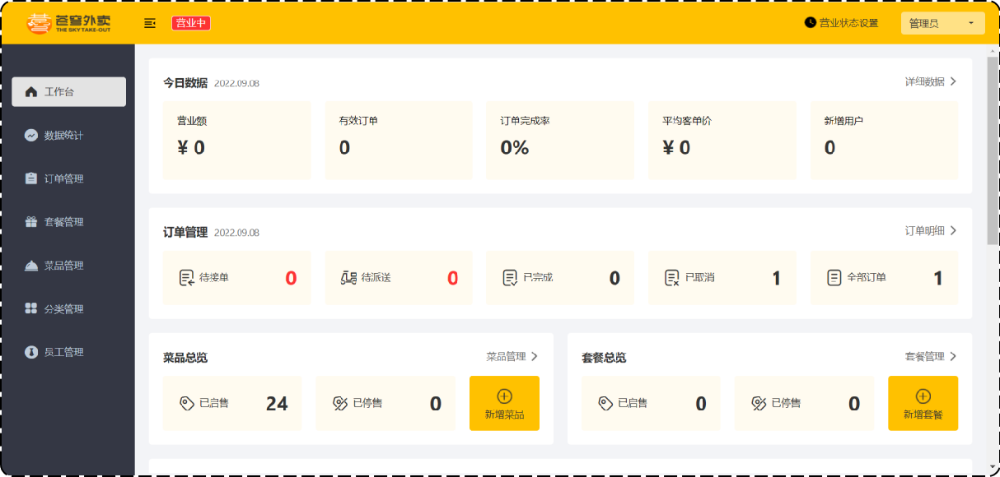

​																		        管理端-外卖商家使用


​																			    用户端-点餐用户使用

当我们完成该项目的学习，可以培养以下能力：


## 1. 软件开发整体介绍

作为一名软件开发工程师,我们需要了解在软件开发过程中的开发流程， 以及软件开发过程中涉及到的岗位角色，角色的分工、职责， 并了解软件开发中涉及到的三种软件环境。那么这一小节，我们将从 软件开发流程、角色分工、软件环境 三个方面整体介绍一下软件开发。


### 1.1 软件开发流程


**1). 第1阶段: 需求分析**

完成需求规格说明书、产品原型编写。  

需求规格说明书， 一般来说就是使用 Word 文档来描述当前项目的各个组成部分，如：系统定义、应用环境、功能规格、性能需求等，都会在文档中描述。**例如：**

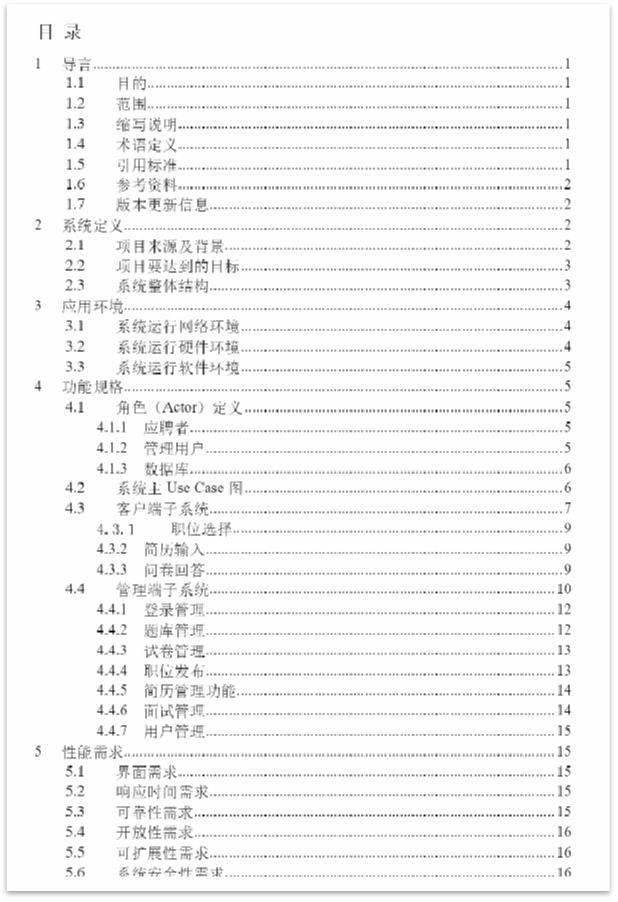

产品原型，一般是通过网页(html)的形式展示当前的页面展示什么样的数据, 页面的布局是什么样子的，点击某个菜单，打开什么页面，点击某个按钮，出现什么效果，都可以通过产品原型看到。 **例如：**


**2). 第2阶段: 设计**

设计的内容包含 UI设计、数据库设计、接口设计。

UI设计：用户界面的设计，主要设计项目的页面效果，小到一个按钮，大到一个页面布局，还有人机交互逻辑的体现。**例如：**


数据库设计：需要设计当前项目中涉及到哪些数据库，每一个数据库里面包含哪些表，这些表结构之间的关系是什么样的，表结构中包含哪些字段。**例如：**

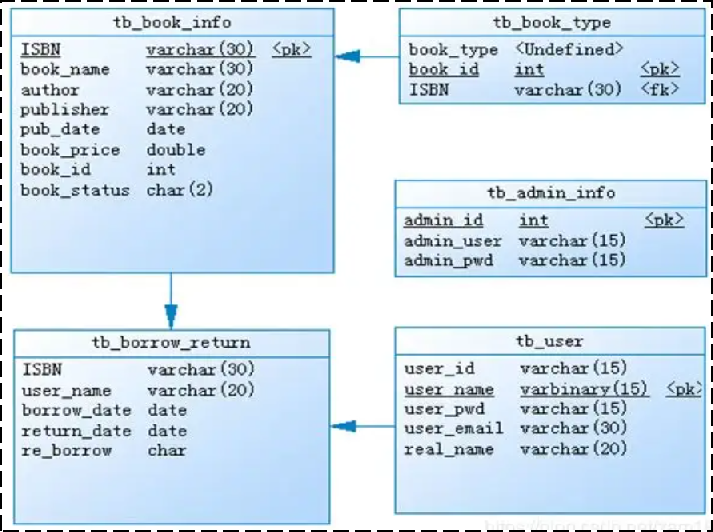

接口设计：通过分析原型图，首先，粗粒度地分析每个页面有多少接口，然后，再细粒度地分析每个接口的传入参数，返回值参数，同时明确接口路径及请求方式。**例如：**

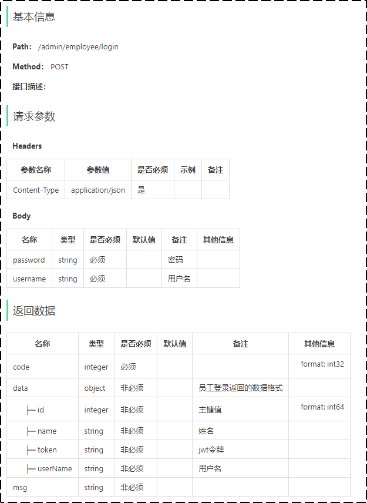


**3). 第3阶段: 编码**

编写项目代码、并完成单元测试。

项目代码编写：作为软件开发工程师，我们需要对项目的模块功能分析后，进行编码实现。

单元测试：编码实现完毕后，进行单元测试，单元测试通过后再进入到下一阶段。**例如：**

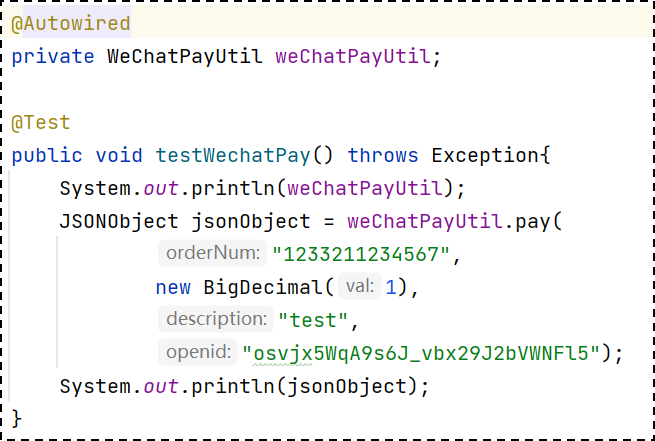


**4). 第4阶段: 测试**

在该阶段中主要由测试人员, 对部署在测试环境的项目进行功能测试, 并出具测试报告。


**5). 第5阶段: 上线运维**

在项目上线之前， 会由运维人员准备服务器上的软件环境安装、配置， 配置完毕后， 再将我们开发好的项目，部署在服务器上运行。


### 1.2 角色分工

在对整个软件开发流程熟悉后， 我们还有必要了解一下在整个软件开发流程中涉及到的岗位角色，以及各个角色的职责分工。


| 岗位/角色                           | 对应阶段                      | 职责/分工                                  |
| :---------------------------------- | ----------------------------- | :----------------------------------------- |
| 项目经理                            | 全阶段                        | 对整个项目负责，任务分配、把控进度         |
| 产品经理                            | 需求分析                      | 进行需求调研，输出需求调研文档、产品原型等 |
| UI设计师                            | 设计                          | 根据产品原型输出界面效果图                 |
| 架构师                              | 设计                          | 项目整体架构设计、技术选型等               |
| <font color='red'>开发工程师</font> | <font color='red'>编码</font> | <font color='red'>功能代码实现</font>      |
| 测试工程师                          | 测试                          | 编写测试用例，输出测试报告                 |
| 运维工程师                          | 上线运维                      | 软件环境搭建、项目上线                     |


上述我们讲解的角色分工, 是在一个项目组中比较标准的角色分工, 但是在实际的项目中, 有一些项目组由于人员配置紧张, 可能并没有专门的架构师或测试人员, 这个时候可能需要有项目经理或者程序员兼任。


### 1.3 软件环境

作为软件开发工程师，在编码的过程中就不可避免地会接触多种软件环境，我们主要来分析在工作中经常遇到的三套环境， 分别是: 开发环境、测试环境、生产环境。 接下来，我们分别介绍一下这三套环境的作用和特点。


**1). 开发环境(development)**

我们作为软件开发人员，在开发阶段使用的环境，就是开发环境，一般外部用户无法访问。

比如，我们在开发中使用的MySQL数据库和其他的一些常用软件，我们可以安装在本地， 也可以安装在一台专门的服务器中， 这些应用软件仅仅在软件开发过程中使用， 项目测试、上线时，我们不会使用这套环境了，这个环境就是开发环境。


**2). 测试环境(testing)**

当软件开发工程师，将项目的功能模块开发完毕，并且单元测试通过后，就需要将项目部署到测试服务器上，让测试人员对项目进行测试。那这台测试服务器就是专门给测试人员使用的环境， 也就是测试环境，用于项目测试，一般外部用户无法访问。


**3). 生产环境(production)**

当项目开发完毕，并且由测试人员测试通过之后，就可以上线项目，将项目部署到线上环境，并正式对外提供服务，这个线上环境也称之为生产环境。


​			        **开发环境**                                                         **测试环境**                                                **生产环境**


首先，会在开发环境中进行项目开发，往往开发环境大多数都是本地的电脑环境和局域网内的环境，当开发完毕后，然后会把项目部署到测试环境，测试环境一般是一台独立测试服务器的环境，项目测试通过后，最终把项目部署到生产环境，生产环境可以是机房或者云服务器等线上环境。


## 2. 苍穹外卖项目介绍

在开发苍穹外卖这个项目之前，我们需要全方位的来介绍一下当前我们学习的这个项目。接下来，我们将从项目简介、产品原型、技术选型三个方面来介绍苍穹外卖这个项目。


### 2.1 项目介绍

本项目（苍穹外卖）是专门为餐饮企业（餐厅、饭店）定制的一款软件产品，包括 系统管理后台 和 小程序端应用 两部分。其中系统管理后台主要提供给餐饮企业内部员工使用，可以对餐厅的分类、菜品、套餐、订单、员工等进行管理维护，对餐厅的各类数据进行统计，同时也可进行来单语音播报功能。小程序端主要提供给消费者使用，可以在线浏览菜品、添加购物车、下单、支付、催单等。


接下来，通过功能架构图来展示**管理端**和**用户端**的具体业务功能模块。


**1). 管理端功能**

员工登录/退出 , 员工信息管理 , 分类管理 , 菜品管理 , 套餐管理 , 菜品口味管理 , 订单管理 ，数据统计，来单提醒。

**2). 用户端功能**

 微信登录 , 收件人地址管理 , 用户历史订单查询 , 菜品规格查询 , 购物车功能 , 下单 , 支付、分类及菜品浏览。


### 2.2 产品原型

**产品原型**，用于展示项目的业务功能，一般由产品经理进行设计。

> **<font color='red'>注意事项：</font>** 产品原型主要用于展示项目的功能，并不是最终的页面效果。


在课程资料的产品原型文件夹下,提供了两份产品原型。

 

**管理端原型图：**


**用户端原型图：**


**1). 管理端**

餐饮企业内部员工使用。 主要功能有: 

| 模块      | 描述                                                         |
| --------- | ------------------------------------------------------------ |
| 登录/退出 | 内部员工必须登录后,才可以访问系统管理后台                    |
| 员工管理  | 管理员可以在系统后台对员工信息进行管理，包含查询、新增、编辑、禁用等功能 |
| 分类管理  | 主要对当前餐厅经营的 菜品分类 或 套餐分类 进行管理维护， 包含查询、新增、修改、删除等功能 |
| 菜品管理  | 主要维护各个分类下的菜品信息，包含查询、新增、修改、删除、启售、停售等功能 |
| 套餐管理  | 主要维护当前餐厅中的套餐信息，包含查询、新增、修改、删除、启售、停售等功能 |
| 订单管理  | 主要维护用户在移动端下的订单信息，包含查询、取消、派送、完成，以及订单报表下载等功能 |
| 数据统计  | 主要完成对餐厅的各类数据统计，如营业额、用户数量、订单等     |


**2). 用户端**

移动端应用主要提供给消费者使用。主要功能有:

| 模块        | 描述                                                         |
| ----------- | ------------------------------------------------------------ |
| 登录/退出   | 用户需要通过微信授权后登录使用小程序进行点餐                 |
| 点餐-菜单   | 在点餐界面需要展示出菜品分类/套餐分类, 并根据当前选择的分类加载其中的菜品信息, 供用户查询选择 |
| 点餐-购物车 | 用户选中的菜品就会加入用户的购物车, 主要包含 查询购物车、加入购物车、删除购物车、清空购物车等功能 |
| 订单支付    | 用户选完菜品/套餐后, 可以对购物车菜品进行结算支付, 这时就需要进行订单的支付 |
| 个人信息    | 在个人中心页面中会展示当前用户的基本信息, 用户可以管理收货地址, 也可以查询历史订单数据 |


### 2.3 技术选型

关于本项目的技术选型, 我们将会从 用户层、网关层、应用层、数据层 这几个方面进行介绍，主要用于展示项目中使用到的技术框架和中间件等。

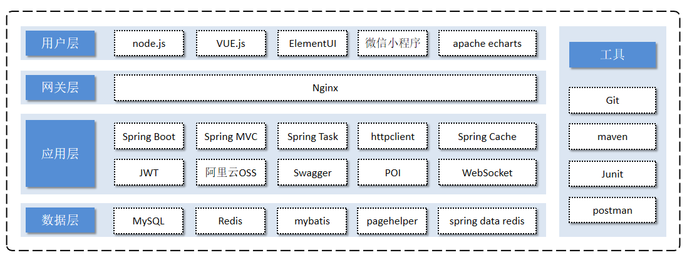


**1). 用户层**

本项目中在构建系统管理后台的前端页面，我们会用到H5、Vue.js、ElementUI、apache echarts(展示图表)等技术。而在构建移动端应用时，我们会使用到微信小程序。


**2). 网关层**

Nginx是一个服务器，主要用来作为Http服务器，部署静态资源，访问性能高。在Nginx中还有两个比较重要的作用： 反向代理和负载均衡， 在进行项目部署时，要实现Tomcat的负载均衡，就可以通过Nginx来实现。


**3). 应用层**

SpringBoot： 快速构建Spring项目, 采用 "约定优于配置" 的思想, 简化Spring项目的配置开发。

SpringMVC：SpringMVC是spring框架的一个模块，springmvc和spring无需通过中间整合层进行整合，可以无缝集成。

Spring Task:  由Spring提供的定时任务框架。

httpclient:  主要实现了对http请求的发送。

Spring Cache:  由Spring提供的数据缓存框架

JWT:  用于对应用程序上的用户进行身份验证的标记。

阿里云OSS:  对象存储服务，在项目中主要存储文件，如图片等。

Swagger： 可以自动的帮助开发人员生成接口文档，并对接口进行测试。

POI:  封装了对Excel表格的常用操作。

WebSocket: 一种通信网络协议，使客户端和服务器之间的数据交换更加简单，用于项目的来单、催单功能实现。


**4). 数据层**

MySQL： 关系型数据库, 本项目的核心业务数据都会采用MySQL进行存储。

Redis： 基于key-value格式存储的内存数据库, 访问速度快, 经常使用它做缓存。

Mybatis： 本项目持久层将会使用Mybatis开发。

pagehelper:  分页插件。

spring data redis:  简化java代码操作Redis的API。


**5). 工具**

git: 版本控制工具, 在团队协作中, 使用该工具对项目中的代码进行管理。

maven: 项目构建工具。

junit：单元测试工具，开发人员功能实现完毕后，需要通过junit对功能进行单元测试。

postman:  接口测工具，模拟用户发起的各类HTTP请求，获取对应的响应结果。


## 3. 开发环境搭建


开发环境搭建主要包含**前端环境**和**后端环境**两部分。作为服务端开发工程师， 我们课程学习的重心应该放在后端的业务代码上， 前端的页面我们只需要导入资料中的nginx， 前端页面的代码我们只需要能看懂即可。


### 3.1 前端环境搭建

**1). 前端工程基于 nginx** 

从资料中找到前端运行环境的nginx，移动到**非中文目录**下。


**sky**目录中存放了管理端的前端资源，具体如下：


**2). 启动nginx，访问测试** 

双击 nginx.exe 即可启动 nginx 服务，访问端口号为 80

http://localhost:80

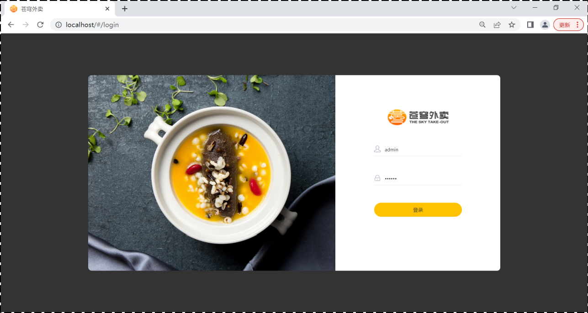

### 3.2 后端环境搭建

#### 3.2.1 熟悉项目结构

后端工程基于 maven 进行项目构建，并且进行分模块开发。

**1). 从当天资料中找到后端初始工程：**


**2). 用 IDEA 打开初始工程，了解项目的整体结构：**

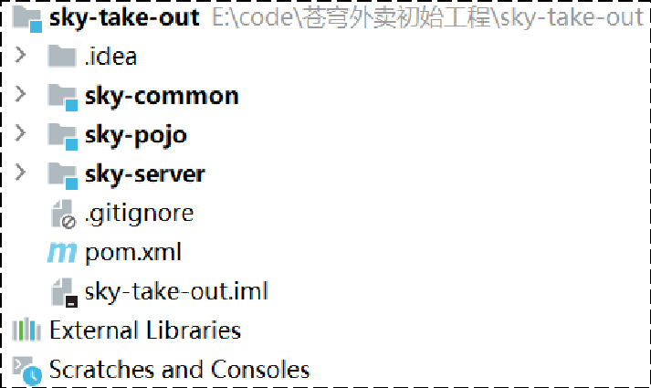

对工程的每个模块作用说明：

| **序号** | **名称**     | **说明**                                                     |
| -------- | ------------ | ------------------------------------------------------------ |
| 1        | sky-take-out | maven父工程，统一管理依赖版本，聚合其他子模块                |
| 2        | sky-common   | 子模块，存放公共类，例如：工具类、常量类、异常类等           |
| 3        | sky-pojo     | 子模块，存放实体类、VO、DTO等                                |
| 4        | sky-server   | 子模块，后端服务，存放配置文件、Controller、Service、Mapper等 |

对项目整体结构了解后，接下来我们详细分析上述的每个子模块：


- **sky-common:** 模块中存放的是一些公共类，可以供其他模块使用

  

  

  分析sky-common模块的每个包的作用：

  | 名称        | 说明                           |
  | ----------- | ------------------------------ |
  | constant    | 存放相关常量类                 |
  | context     | 存放上下文类                   |
  | enumeration | 项目的枚举类存储               |
  | exception   | 存放自定义异常类               |
  | json        | 处理json转换的类               |
  | properties  | 存放SpringBoot相关的配置属性类 |
  | result      | 返回结果类的封装               |
  | utils       | 常用工具类                     |

  

- **sky-pojo:** 模块中存放的是一些 entity、DTO、VO

  

  分析sky-pojo模块的每个包的作用：

  | **名称** | **说明**                                     |
  | -------- | -------------------------------------------- |
  | Entity   | 实体，通常和数据库中的表对应                 |
  | DTO      | 数据传输对象，通常用于程序中各层之间传递数据 |
  | VO       | 视图对象，为前端展示数据提供的对象           |
  | POJO     | 普通Java对象，只有属性和对应的getter和setter |

  

- **sky-server:** 模块中存放的是 配置文件、配置类、拦截器、controller、service、mapper、启动类等

  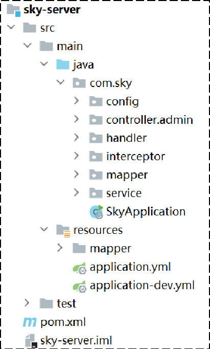

  分析sky-server模块的每个包的作用：

  | 名称           | 说明             |
  | -------------- | ---------------- |
  | config         | 存放配置类       |
  | controller     | 存放controller类 |
  | interceptor    | 存放拦截器类     |
  | mapper         | 存放mapper接口   |
  | service        | 存放service类    |
  | SkyApplication | 启动类           |


#### 3.2.2 Git版本控制

使用Git进行项目代码的版本控制，具体操作：

**1). 创建Git本地仓库**


当Idea中出现：


说明本地仓库创建成功。


**2). 创建Git远程仓库**

访问https://gitee.com/，新建仓库


点击 创建 


**3). 将本地文件推送到Git远程仓库**


1. **提交文件至本地仓库**

   忽略以下类型文件

   

   开始提交

   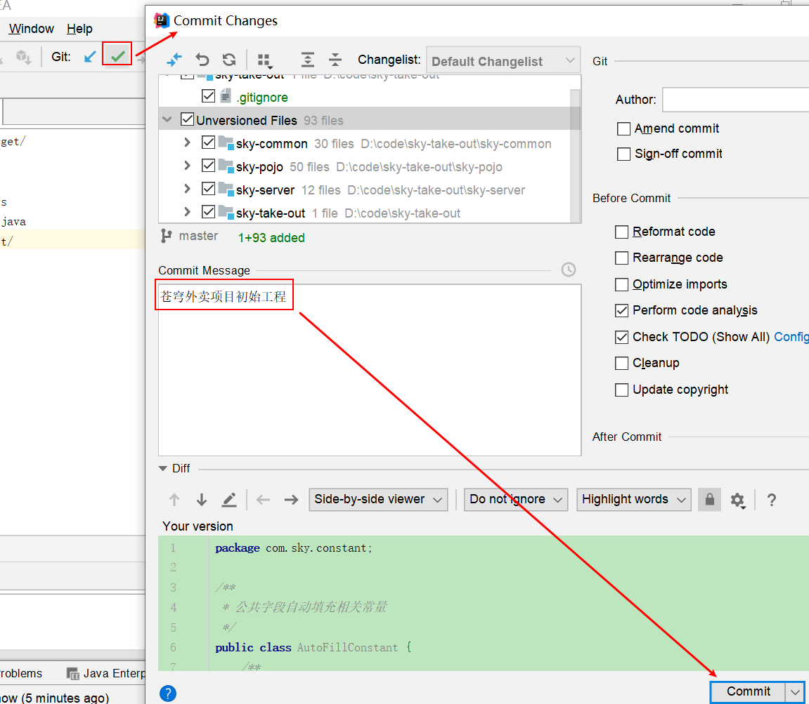

   中间出现：点击commit

   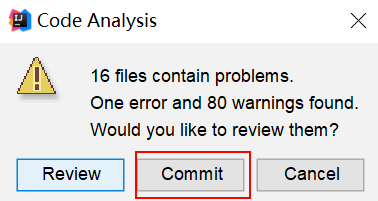

2. **添加Git远程仓库地址**

   复制远程地址：

   

   添加地址：

   

   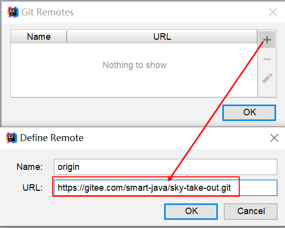

3. **推送**


成功推送至远程仓库


#### 3.2.3 数据库环境搭建

1. **从资料中找到sky.sql**

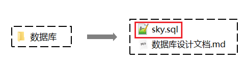

直接打开sky.sql文件


通过该sql文件直接可创建数据库，所以不需要提前创建数据库，直接导入该文件执行即可。

2. **执行sky.sql文件**

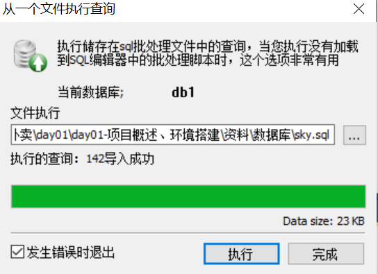

执行完成后，共创建出11张表

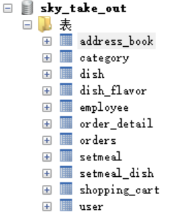

每张表的说明：

| **序号** | **表名**      | **中文名**     |
| -------- | ------------- | -------------- |
| 1        | employee      | 员工表         |
| 2        | category      | 分类表         |
| 3        | dish          | 菜品表         |
| 4        | dish_flavor   | 菜品口味表     |
| 5        | setmeal       | 套餐表         |
| 6        | setmeal_dish  | 套餐菜品关系表 |
| 7        | user          | 用户表         |
| 8        | address_book  | 地址表         |
| 9        | shopping_cart | 购物车表       |
| 10       | orders        | 订单表         |
| 11       | order_detail  | 订单明细表     |

我们目前先简单了解大概有哪些表, 每张表存储什么数据, 有一个印象。对于具体的表结构, 以及表结构中的字段, 可以参考资料中的**《数据库设计文档》**，同时在讲解具体的功能开发时, 我们也会再详细介绍。


#### 3.2.4 前后端联调

后端的初始工程中已经实现了**登录**功能，直接进行前后端联调测试即可

实现思路：

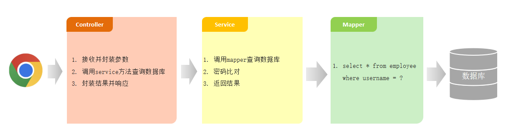

**1.Controller层**

在sky-server模块中，com.sky.controller.admin.EmployeeController

```java
/**
     * 登录
     *
     * @param employeeLoginDTO
     * @return
     */
    @PostMapping("/login")
    public Result<EmployeeLoginVO> login(@RequestBody EmployeeLoginDTO employeeLoginDTO) {
        log.info("员工登录：{}", employeeLoginDTO);
		//调用service方法查询数据库
        Employee employee = employeeService.login(employeeLoginDTO);

        //登录成功后，生成jwt令牌
        Map<String, Object> claims = new HashMap<>();
        claims.put(JwtClaimsConstant.EMP_ID, employee.getId());
        String token = JwtUtil.createJWT(
                jwtProperties.getAdminSecretKey(),
                jwtProperties.getAdminTtl(),
                claims);

        EmployeeLoginVO employeeLoginVO = EmployeeLoginVO.builder()
                .id(employee.getId())
                .userName(employee.getUsername())
                .name(employee.getName())
                .token(token)
                .build();

        return Result.success(employeeLoginVO);
    }
```

**2.Service层**

在sky-server模块中，com.sky.service.impl.EmployeeServiceImpl

```java
/**
     * 员工登录
     *
     * @param employeeLoginDTO
     * @return
     */
    public Employee login(EmployeeLoginDTO employeeLoginDTO) {
        String username = employeeLoginDTO.getUsername();
        String password = employeeLoginDTO.getPassword();

        //1、根据用户名查询数据库中的数据
        Employee employee = employeeMapper.getByUsername(username);

        //2、处理各种异常情况（用户名不存在、密码不对、账号被锁定）
        if (employee == null) {
            //账号不存在
            throw new AccountNotFoundException(MessageConstant.ACCOUNT_NOT_FOUND);
        }

        //密码比对
        if (!password.equals(employee.getPassword())) {
            //密码错误
            throw new PasswordErrorException(MessageConstant.PASSWORD_ERROR);
        }

        if (employee.getStatus() == StatusConstant.DISABLE) {
            //账号被锁定
            throw new AccountLockedException(MessageConstant.ACCOUNT_LOCKED);
        }

        //3、返回实体对象
        return employee;
    }
```

**3.Mapper层**

在sky-server模块中，com.sky.mapper.EmployeeMapper

```java
package com.sky.mapper;

import com.sky.entity.Employee;
import org.apache.ibatis.annotations.Mapper;
import org.apache.ibatis.annotations.Select;

@Mapper
public interface EmployeeMapper {

    /**
     * 根据用户名查询员工
     * @param username
     * @return
     */
    @Select("select * from employee where username = #{username}")
    Employee getByUsername(String username);

}

```

注：可以通过断点调试跟踪后端程序的执行过程


#### 3.2.5 nginx反向代理和负载均衡

对登录功能测试完毕后，接下来，我们思考一个问题：**前端发送的请求，是如何请求到后端服务的？**

前端请求地址：http://localhost/api/employee/login

后端接口地址：http://localhost:8080/admin/employee/login


​              **前端请求地址**                                                                                       **后端接口地址**

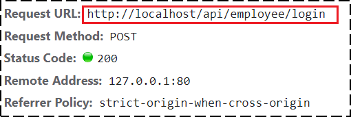                                  

很明显，两个地址不一致，那是如何请求到后端服务的呢？


**1). nginx反向代理**

**nginx 反向代理**，就是将前端发送的动态请求由 nginx 转发到后端服务器

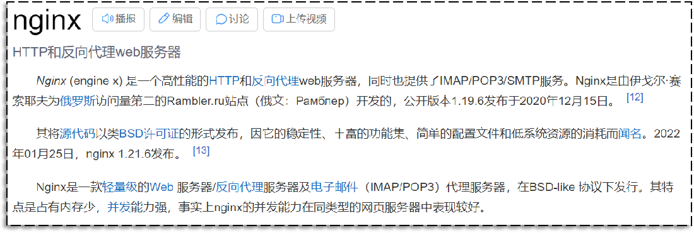

那为什么不直接通过浏览器直接请求后台服务端，需要通过nginx反向代理呢？


**nginx 反向代理的好处：**

- 提高访问速度

  因为nginx本身可以进行缓存，如果访问的同一接口，并且做了数据缓存，nginx就直接可把数据返回，不需要真正地访问服务端，从而提高访问速度。

- 进行负载均衡

  所谓负载均衡,就是把大量的请求按照我们指定的方式均衡的分配给集群中的每台服务器。

- 保证后端服务安全

  因为一般后台服务地址不会暴露，所以使用浏览器不能直接访问，可以把nginx作为请求访问的入口，请求到达nginx后转发到具体的服务中，从而保证后端服务的安全。

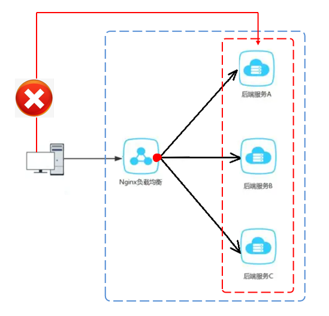

**nginx 反向代理的配置方式：**

```nginx
server{
    listen 80;
    server_name localhost;
    
    location /api/{
        proxy_pass http://localhost:8080/admin/; #反向代理
    }
}
```

**proxy_pass：**该指令是用来设置代理服务器的地址，可以是主机名称，IP地址加端口号等形式。

如上代码的含义是：监听80端口号， 然后当我们访问 http://localhost:80/api/../..这样的接口的时候，它会通过 location /api/ {} 这样的反向代理到 http://localhost:8080/admin/上来。


接下来，进到nginx-1.20.2\conf，打开nginx配置

```nginx
# 反向代理,处理管理端发送的请求
location /api/ {
	proxy_pass   http://localhost:8080/admin/;
    #proxy_pass   http://webservers/admin/;
}
```

当在访问http://localhost/api/employee/login，nginx接收到请求后转到http://localhost:8080/admin/，故最终的请求地址为http://localhost:8080/admin/employee/login，和后台服务的访问地址一致。


**2). nginx 负载均衡**

当如果服务以集群的方式进行部署时，那nginx在转发请求到服务器时就需要做相应的负载均衡。其实，负载均衡从本质上来说也是基于反向代理来实现的，最终都是转发请求。


**nginx 负载均衡的配置方式：**

```nginx
upstream webservers{
    server 192.168.100.128:8080;
    server 192.168.100.129:8080;
}
server{
    listen 80;
    server_name localhost;
    
    location /api/{
        proxy_pass http://webservers/admin;#负载均衡
    }
}
```

**upstream：**如果代理服务器是一组服务器的话，我们可以使用upstream指令配置后端服务器组。

如上代码的含义是：监听80端口号， 然后当我们访问 http://localhost:80/api/../..这样的接口的时候，它会通过 location /api/ {} 这样的反向代理到 http://webservers/admin，根据webservers名称找到一组服务器，根据设置的负载均衡策略(默认是轮询)转发到具体的服务器。

**注：**upstream后面的名称可自定义，但要上下保持一致。


**nginx 负载均衡策略：**

| **名称**   | **说明**                                               |
| ---------- | ------------------------------------------------------ |
| 轮询       | 默认方式                                               |
| weight     | 权重方式，默认为1，权重越高，被分配的客户端请求就越多  |
| ip_hash    | 依据ip分配方式，这样每个访客可以固定访问一个后端服务   |
| least_conn | 依据最少连接方式，把请求优先分配给连接数少的后端服务   |
| url_hash   | 依据url分配方式，这样相同的url会被分配到同一个后端服务 |
| fair       | 依据响应时间方式，响应时间短的服务将会被优先分配       |

具体配置方式：

**轮询：**

```nginx
upstream webservers{
    server 192.168.100.128:8080;
    server 192.168.100.129:8080;
}
```

**weight:**

```nginx
upstream webservers{
    server 192.168.100.128:8080 weight=90;
    server 192.168.100.129:8080 weight=10;
}
```

**ip_hash:**

```nginx
upstream webservers{
    ip_hash;
    server 192.168.100.128:8080;
    server 192.168.100.129:8080;
}
```

**least_conn:**

```nginx
upstream webservers{
    least_conn;
    server 192.168.100.128:8080;
    server 192.168.100.129:8080;
}
```

**url_hash:**

```nginx
upstream webservers{
    hash &request_uri;
    server 192.168.100.128:8080;
    server 192.168.100.129:8080;
}
```

**fair:**

```nginx
upstream webservers{
    server 192.168.100.128:8080;
    server 192.168.100.129:8080;
    fair;
}
```


### 3.3 完善登录功能

**问题：**员工表中的密码是明文存储，安全性太低。


**解决思路：**

1. 将密码加密后存储，提高安全性

   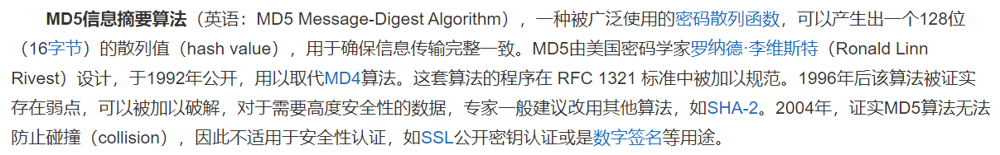

2. 使用MD5加密方式对明文密码加密

   

**实现步骤：**

1. 修改数据库中明文密码，改为MD5加密后的密文

   打开employee表，修改密码

   

2. 修改Java代码，前端提交的密码进行MD5加密后再跟数据库中密码比对

   打开EmployeeServiceImpl.java，修改比对密码

   ```java
   /**
        * 员工登录
        *
        * @param employeeLoginDTO
        * @return
        */
       public Employee login(EmployeeLoginDTO employeeLoginDTO) {
   
           //1、根据用户名查询数据库中的数据
          
           //2、处理各种异常情况（用户名不存在、密码不对、账号被锁定）
           //.......
           //密码比对
           // TODO 后期需要进行md5加密，然后再进行比对
           password = DigestUtils.md5DigestAsHex(password.getBytes());
           if (!password.equals(employee.getPassword())) {
               //密码错误
               throw new PasswordErrorException(MessageConstant.PASSWORD_ERROR);
           }
   
           //........
   
           //3、返回实体对象
           return employee;
       }
   ```

   

## 4. 导入接口文档

接下来，就要进入到项目的业务开发了，而我们的开发方式就是基本当前企业主流的前后端分离开发方式，那么这种方式就要求我们之前需要先将接口定义好，这样前后端人员才能并行开发，所以，这个章节就需要将接口文档导入到管理平台，为我们后面业务开发做好准备。其实，在真实的企业开发中，接口设计过程其实是一个非常漫长的过程，可能需要多次开会讨论调整，甚至在开发的过程中才会发现某些接口定义还需要再调整，这种情况其实是非常常见的，但是由于项目时间原因，所以选择一次性导入所有的接口，在开发业务功能过程当中，也会带着大家一起来分析一下对应的接口是怎么确定下来的，为什么要这样定义，从而培养同学们的接口设计能力。


### 4.1 前后端分离开发流程

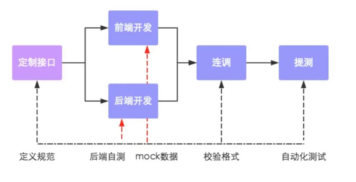

第一步：定义接口，确定接口的路径、请求方式、传入参数、返回参数。

第二步：前端开发人员和后端开发人员并行开发，同时，也可自测。

第三步：前后端人员进行连调测试。

第四步：提交给测试人员进行最终测试。


### 4.2 操作步骤

将课程资料中提供的项目接口导入YApi。访问地址：http://yapi.smart-xwork.cn/

**1). 从资料中找到项目接口文件**


**2). 导入到YApi平台**

在YApi平台创建出两个项目


选择苍穹外卖-管理端接口.json导入

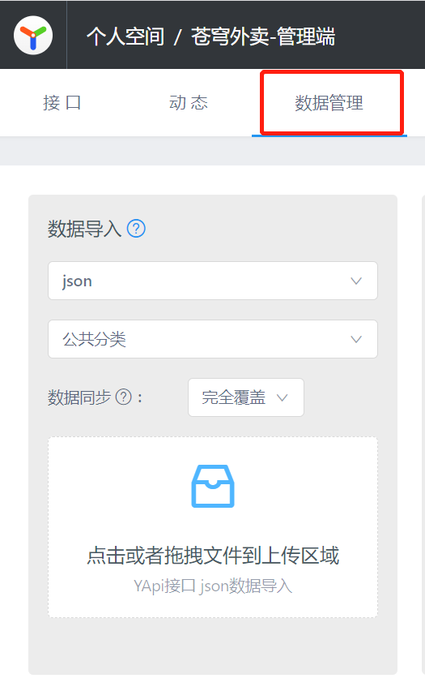

导入成功


另一个用户端json文件也执行相同操作。


## 5. Swagger

### 5.1 介绍

Swagger 是一个规范和完整的框架，用于生成、描述、调用和可视化 RESTful 风格的 Web 服务(<https://swagger.io/>)。 它的主要作用是：

1. 使得前后端分离开发更加方便，有利于团队协作

2. 接口的文档在线自动生成，降低后端开发人员编写接口文档的负担

3. 功能测试 

   Spring已经将Swagger纳入自身的标准，建立了Spring-swagger项目，现在叫Springfox。通过在项目中引入Springfox ，即可非常简单快捷的使用Swagger。

knife4j是为Java MVC框架集成Swagger生成Api文档的增强解决方案,前身是swagger-bootstrap-ui,取名kni4j是希望它能像一把匕首一样小巧,轻量,并且功能强悍!

目前，一般都使用knife4j框架。


### 5.2 使用步骤

1. 导入 knife4j 的maven坐标

   在pom.xml中添加依赖

   ```xml
   <dependency>
      <groupId>com.github.xiaoymin</groupId>
      <artifactId>knife4j-spring-boot-starter</artifactId>
   </dependency>
   ```

2. 在配置类中加入 knife4j 相关配置

   WebMvcConfiguration.java

   ```java
   /**
        * 通过knife4j生成接口文档
        * @return
   */
       @Bean
       public Docket docket() {
           ApiInfo apiInfo = new ApiInfoBuilder()
                   .title("苍穹外卖项目接口文档")
                   .version("2.0")
                   .description("苍穹外卖项目接口文档")
                   .build();
           Docket docket = new Docket(DocumentationType.SWAGGER_2)
                   .apiInfo(apiInfo)
                   .select()
                   .apis(RequestHandlerSelectors.basePackage("com.sky.controller"))
                   .paths(PathSelectors.any())
                   .build();
           return docket;
       }
   ```

   

3. 设置静态资源映射，否则接口文档页面无法访问

   WebMvcConfiguration.java

   ```java
   /**
        * 设置静态资源映射
        * @param registry
   */
   protected void addResourceHandlers(ResourceHandlerRegistry registry) {
           registry.addResourceHandler("/doc.html").addResourceLocations("classpath:/META-INF/resources/");
           registry.addResourceHandler("/webjars/**").addResourceLocations("classpath:/META-INF/resources/webjars/");
   }
   ```

4. 访问测试

   接口文档访问路径为 http://ip:port/doc.html ---> http://localhost:8080/doc.html

   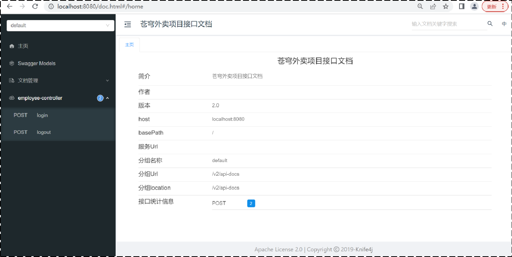

   接口测试:测试登录功能

   

**思考：**通过 Swagger 就可以生成接口文档，那么我们就不需要 Yapi 了？

1、Yapi 是设计阶段使用的工具，管理和维护接口

2、Swagger 在开发阶段使用的框架，帮助后端开发人员做后端的接口测试


### 5.3 常用注解

通过注解可以控制生成的接口文档，使接口文档拥有更好的可读性，常用注解如下：

| **注解**          | **说明**                                               |
| ----------------- | ------------------------------------------------------ |
| @Api              | 用在类上，例如Controller，表示对类的说明               |
| @ApiModel         | 用在类上，例如entity、DTO、VO                          |
| @ApiModelProperty | 用在属性上，描述属性信息                               |
| @ApiOperation     | 用在方法上，例如Controller的方法，说明方法的用途、作用 |

接下来，使用上述注解，生成可读性更好的接口文档

在sky-pojo模块中

EmployeeLoginDTO.java

```java
package com.sky.dto;

import io.swagger.annotations.ApiModel;
import io.swagger.annotations.ApiModelProperty;
import lombok.Data;

import java.io.Serializable;

@Data
@ApiModel(description = "员工登录时传递的数据模型")
public class EmployeeLoginDTO implements Serializable {

    @ApiModelProperty("用户名")
    private String username;

    @ApiModelProperty("密码")
    private String password;

}

```

EmployeeLoginVo.java

```java
package com.sky.vo;

import io.swagger.annotations.ApiModel;
import io.swagger.annotations.ApiModelProperty;
import lombok.AllArgsConstructor;
import lombok.Builder;
import lombok.Data;
import lombok.NoArgsConstructor;

import java.io.Serializable;

@Data
@Builder
@NoArgsConstructor
@AllArgsConstructor
@ApiModel(description = "员工登录返回的数据格式")
public class EmployeeLoginVO implements Serializable {

    @ApiModelProperty("主键值")
    private Long id;

    @ApiModelProperty("用户名")
    private String userName;

    @ApiModelProperty("姓名")
    private String name;

    @ApiModelProperty("jwt令牌")
    private String token;

}
```

在sky-server模块中

EmployeeController.java

```java
package com.sky.controller.admin;

import com.sky.constant.JwtClaimsConstant;
import com.sky.dto.EmployeeLoginDTO;
import com.sky.entity.Employee;
import com.sky.properties.JwtProperties;
import com.sky.result.Result;
import com.sky.service.EmployeeService;
import com.sky.utils.JwtUtil;
import com.sky.vo.EmployeeLoginVO;
import io.swagger.annotations.Api;
import io.swagger.annotations.ApiOperation;
import lombok.extern.slf4j.Slf4j;
import org.springframework.beans.factory.annotation.Autowired;
import org.springframework.web.bind.annotation.PostMapping;
import org.springframework.web.bind.annotation.RequestBody;
import org.springframework.web.bind.annotation.RequestMapping;
import org.springframework.web.bind.annotation.RestController;

import java.util.HashMap;
import java.util.Map;

/**
 * 员工管理
 */
@RestController
@RequestMapping("/admin/employee")
@Slf4j
@Api(tags = "员工相关接口")
public class EmployeeController {

    @Autowired
    private EmployeeService employeeService;
    @Autowired
    private JwtProperties jwtProperties;

    /**
     * 登录
     *
     * @param employeeLoginDTO
     * @return
     */
    @PostMapping("/login")
    @ApiOperation(value = "员工登录")
    public Result<EmployeeLoginVO> login(@RequestBody EmployeeLoginDTO employeeLoginDTO) 	{
        //..............

        
    }

    /**
     * 退出
     *
     * @return
     */
    @PostMapping("/logout")
    @ApiOperation("员工退出")
    public Result<String> logout() {
        return Result.success();
    }

}

```

启动服务：访问http://localhost:8080/doc.html


