# 苍穹外卖-day03

## 课程内容

- 公共字段自动填充
- 新增菜品
- 菜品分页查询
- 删除菜品
- 修改菜品


**功能实现：**菜品管理

**菜品管理效果图：**

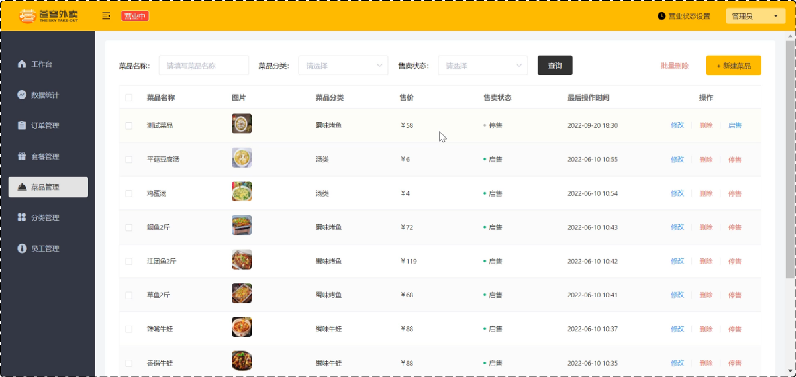 


## 1. 公共字段自动填充

### 1.1 问题分析

在上一章节我们已经完成了后台系统的**员工管理功能**和**菜品分类功能**的开发，在**新增员工**或者**新增菜品分类**时需要设置创建时间、创建人、修改时间、修改人等字段，在**编辑员工**或者**编辑菜品分类**时需要设置修改时间、修改人等字段。这些字段属于公共字段，也就是也就是在我们的系统中很多表中都会有这些字段，如下：

| **序号** | **字段名**  | **含义** | **数据类型** |
| -------- | ----------- | -------- | ------------ |
| 1        | create_time | 创建时间 | datetime     |
| 2        | create_user | 创建人id | bigint       |
| 3        | update_time | 修改时间 | datetime     |
| 4        | update_user | 修改人id | bigint       |

而针对于这些字段，我们的赋值方式为： 

1). 在新增数据时, 将createTime、updateTime 设置为当前时间, createUser、updateUser设置为当前登录用户ID。

2). 在更新数据时, 将updateTime 设置为当前时间, updateUser设置为当前登录用户ID。


目前,在我们的项目中处理这些字段都是在每一个业务方法中进行赋值操作,如下:

**新增员工方法：**

```java
	/**
     * 新增员工
     *
     * @param employeeDTO
     */
    public void save(EmployeeDTO employeeDTO) {
        //.......................
		//////////////////////////////////////////
        //设置当前记录的创建时间和修改时间
        employee.setCreateTime(LocalDateTime.now());
        employee.setUpdateTime(LocalDateTime.now());

        //设置当前记录创建人id和修改人id
        employee.setCreateUser(BaseContext.getCurrentId());//目前写个假数据，后期修改
        employee.setUpdateUser(BaseContext.getCurrentId());
		///////////////////////////////////////////////
        employeeMapper.insert(employee);
    }
```

**编辑员工方法：**

```java
	/**
     * 编辑员工信息
     *
     * @param employeeDTO
     */
    public void update(EmployeeDTO employeeDTO) {
       //........................................
	   ///////////////////////////////////////////////
        employee.setUpdateTime(LocalDateTime.now());
        employee.setUpdateUser(BaseContext.getCurrentId());
       ///////////////////////////////////////////////////

        employeeMapper.update(employee);
    }
```

**新增菜品分类方法：**

```java
	/**
     * 新增分类
     * @param categoryDTO
     */
    public void save(CategoryDTO categoryDTO) {
       //....................................
       //////////////////////////////////////////
        //设置创建时间、修改时间、创建人、修改人
        category.setCreateTime(LocalDateTime.now());
        category.setUpdateTime(LocalDateTime.now());
        category.setCreateUser(BaseContext.getCurrentId());
        category.setUpdateUser(BaseContext.getCurrentId());
        ///////////////////////////////////////////////////

        categoryMapper.insert(category);
    }
```

**修改菜品分类方法：**

```java
	/**
     * 修改分类
     * @param categoryDTO
     */
    public void update(CategoryDTO categoryDTO) {
        //....................................
        
		//////////////////////////////////////////////
        //设置修改时间、修改人
        category.setUpdateTime(LocalDateTime.now());
        category.setUpdateUser(BaseContext.getCurrentId());
        //////////////////////////////////////////////////

        categoryMapper.update(category);
    }
```


如果都按照上述的操作方式来处理这些公共字段, 需要在每一个业务方法中进行操作, 编码相对冗余、繁琐，那能不能对于这些公共字段在某个地方统一处理，来简化开发呢？

**答案是可以的，我们使用AOP切面编程，实现功能增强，来完成公共字段自动填充功能。**


### 1.2 实现思路

在实现公共字段自动填充，也就是在插入或者更新的时候为指定字段赋予指定的值，使用它的好处就是可以统一对这些字段进行处理，避免了重复代码。在上述的问题分析中，我们提到有四个公共字段，需要在新增/更新中进行赋值操作, 具体情况如下: 

| **序号** | **字段名**  | **含义** | **数据类型** | **操作类型**   |
| -------- | ----------- | -------- | ------------ | -------------- |
| 1        | create_time | 创建时间 | datetime     | insert         |
| 2        | create_user | 创建人id | bigint       | insert         |
| 3        | update_time | 修改时间 | datetime     | insert、update |
| 4        | update_user | 修改人id | bigint       | insert、update |


**实现步骤：**

1). 自定义注解 AutoFill，用于标识需要进行公共字段自动填充的方法

2). 自定义切面类 AutoFillAspect，统一拦截加入了 AutoFill 注解的方法，通过反射为公共字段赋值

3). 在 Mapper 的方法上加入 AutoFill 注解


若要实现上述步骤，需掌握以下知识(之前课程内容都学过)

**技术点：**枚举、注解、AOP、反射


### 1.3 代码开发

按照上一小节分析的实现步骤依次实现，共三步。

#### 1.3.1 步骤一

**自定义注解 AutoFill**              

进入到sky-server模块，创建com.sky.annotation包。

```java
package com.sky.annotation;

import com.sky.enumeration.OperationType;
import java.lang.annotation.ElementType;
import java.lang.annotation.Retention;
import java.lang.annotation.RetentionPolicy;
import java.lang.annotation.Target;

/**
 * 自定义注解，用于标识某个方法需要进行功能字段自动填充处理
 */
@Target(ElementType.METHOD)
@Retention(RetentionPolicy.RUNTIME)
public @interface AutoFill {
    //数据库操作类型：UPDATE INSERT
    OperationType value();
}
```

其中OperationType已在sky-common模块中定义

```java
package com.sky.enumeration;

/**
 * 数据库操作类型
 */
public enum OperationType {

    /**
     * 更新操作
     */
    UPDATE,

    /**
     * 插入操作
     */
    INSERT
}
```


#### 1.3.2 步骤二

**自定义切面 AutoFillAspect**

在sky-server模块，创建com.sky.aspect包。

```java
package com.sky.aspect;

/**
 * 自定义切面，实现公共字段自动填充处理逻辑
 */
@Aspect
@Component
@Slf4j
public class AutoFillAspect {

    /**
     * 切入点
     */
    @Pointcut("execution(* com.sky.mapper.*.*(..)) && @annotation(com.sky.annotation.AutoFill)")
    public void autoFillPointCut(){}

    /**
     * 前置通知，在通知中进行公共字段的赋值
     */
    @Before("autoFillPointCut()")
    public void autoFill(JoinPoint joinPoint){
        /////////////////////重要////////////////////////////////////
        //可先进行调试，是否能进入该方法 提前在mapper方法添加AutoFill注解
        log.info("开始进行公共字段自动填充...");

    }
}
```

**完善自定义切面 AutoFillAspect 的 autoFill 方法**

```java
package com.sky.aspect;

import com.sky.annotation.AutoFill;
import com.sky.constant.AutoFillConstant;
import com.sky.context.BaseContext;
import com.sky.enumeration.OperationType;
import lombok.extern.slf4j.Slf4j;
import org.aspectj.lang.JoinPoint;
import org.aspectj.lang.annotation.Aspect;
import org.aspectj.lang.annotation.Before;
import org.aspectj.lang.annotation.Pointcut;
import org.aspectj.lang.reflect.MethodSignature;
import org.springframework.stereotype.Component;
import java.lang.reflect.Method;
import java.time.LocalDateTime;

/**
 * 自定义切面，实现公共字段自动填充处理逻辑
 */
@Aspect
@Component
@Slf4j
public class AutoFillAspect {

    /**
     * 切入点
     */
    @Pointcut("execution(* com.sky.mapper.*.*(..)) && @annotation(com.sky.annotation.AutoFill)")
    public void autoFillPointCut(){}

    /**
     * 前置通知，在通知中进行公共字段的赋值
     */
    @Before("autoFillPointCut()")
    public void autoFill(JoinPoint joinPoint){
        log.info("开始进行公共字段自动填充...");

        //获取到当前被拦截的方法上的数据库操作类型
        MethodSignature signature = (MethodSignature) joinPoint.getSignature();//方法签名对象
        AutoFill autoFill = signature.getMethod().getAnnotation(AutoFill.class);//获得方法上的注解对象
        OperationType operationType = autoFill.value();//获得数据库操作类型

        //获取到当前被拦截的方法的参数--实体对象
        Object[] args = joinPoint.getArgs();
        if(args == null || args.length == 0){
            return;
        }

        Object entity = args[0];

        //准备赋值的数据
        LocalDateTime now = LocalDateTime.now();
        Long currentId = BaseContext.getCurrentId();

        //根据当前不同的操作类型，为对应的属性通过反射来赋值
        if(operationType == OperationType.INSERT){
            //为4个公共字段赋值
            try {
                Method setCreateTime = entity.getClass().getDeclaredMethod(AutoFillConstant.SET_CREATE_TIME, LocalDateTime.class);
                Method setCreateUser = entity.getClass().getDeclaredMethod(AutoFillConstant.SET_CREATE_USER, Long.class);
                Method setUpdateTime = entity.getClass().getDeclaredMethod(AutoFillConstant.SET_UPDATE_TIME, LocalDateTime.class);
                Method setUpdateUser = entity.getClass().getDeclaredMethod(AutoFillConstant.SET_UPDATE_USER, Long.class);

                //通过反射为对象属性赋值
                setCreateTime.invoke(entity,now);
                setCreateUser.invoke(entity,currentId);
                setUpdateTime.invoke(entity,now);
                setUpdateUser.invoke(entity,currentId);
            } catch (Exception e) {
                e.printStackTrace();
            }
        }else if(operationType == OperationType.UPDATE){
            //为2个公共字段赋值
            try {
                Method setUpdateTime = entity.getClass().getDeclaredMethod(AutoFillConstant.SET_UPDATE_TIME, LocalDateTime.class);
                Method setUpdateUser = entity.getClass().getDeclaredMethod(AutoFillConstant.SET_UPDATE_USER, Long.class);

                //通过反射为对象属性赋值
                setUpdateTime.invoke(entity,now);
                setUpdateUser.invoke(entity,currentId);
            } catch (Exception e) {
                e.printStackTrace();
            }
        }
    }
}
```


#### 1.3.3 步骤三

**在Mapper接口的方法上加入 AutoFill 注解**

以**CategoryMapper**为例，分别在新增和修改方法添加@AutoFill()注解，也需要**EmployeeMapper**做相同操作

```java
package com.sky.mapper;

@Mapper
public interface CategoryMapper {
    /**
     * 插入数据
     * @param category
     */
    @Insert("insert into category(type, name, sort, status, create_time, update_time, create_user, update_user)" +
            " VALUES" +
            " (#{type}, #{name}, #{sort}, #{status}, #{createTime}, #{updateTime}, #{createUser}, #{updateUser})")
    @AutoFill(value = OperationType.INSERT)
    void insert(Category category);
    /**
     * 根据id修改分类
     * @param category
     */
    @AutoFill(value = OperationType.UPDATE)
    void update(Category category);

}
```

**同时**，将业务层为公共字段赋值的代码注释掉。

1). 将员工管理的新增和编辑方法中的公共字段赋值的代码注释。

2). 将菜品分类管理的新增和修改方法中的公共字段赋值的代码注释。


### 1.4 功能测试

以**新增菜品分类**为例，进行测试

**启动项目和Nginx**

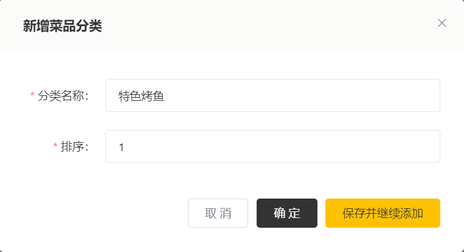 

**查看控制台**

通过观察控制台输出的SQL来确定公共字段填充是否完成

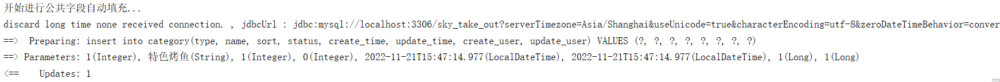

**查看表**

category表中数据

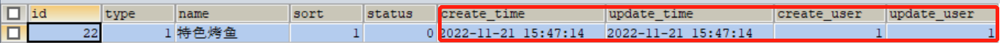

其中create_time,update_time,create_user,update_user字段都已完成自动填充。

由于使用admin(id=1)用户登录进行菜品添加操作,故create_user,update_user都为1.


### 1.5 代码提交

**点击提交：**

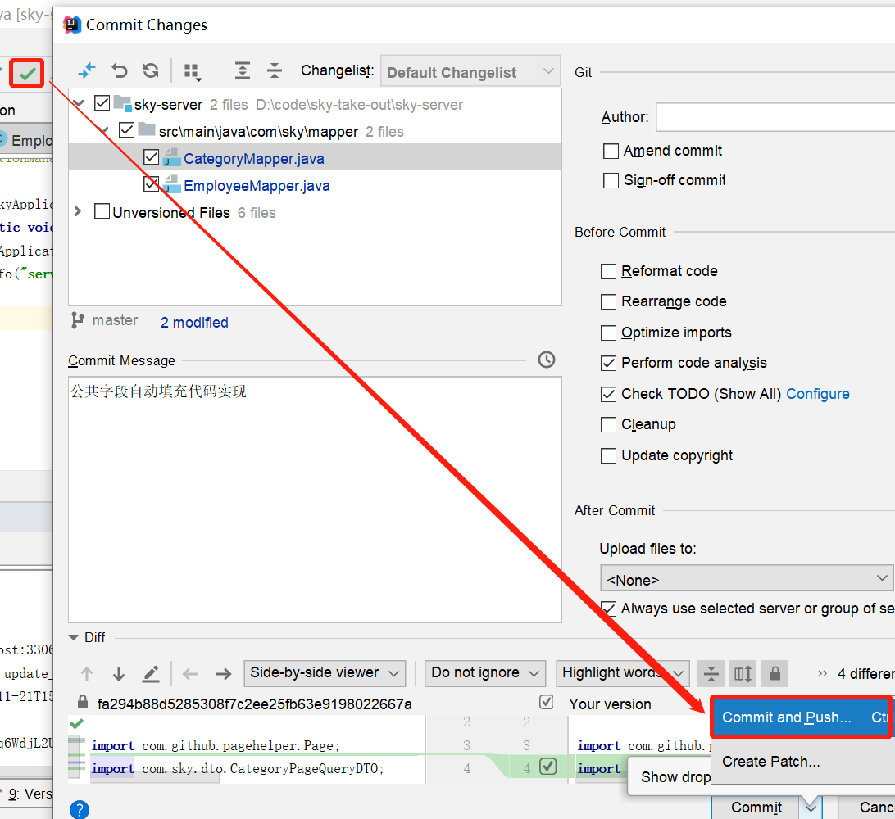 


**提交过程中**，出现提示：

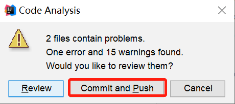 


**继续push:**

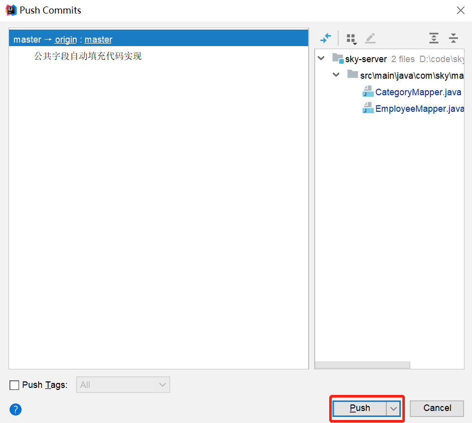 

**推送成功：**

 


## 2. 新增菜品

### 2.1 需求分析与设计

#### 2.1.1 产品原型

后台系统中可以管理菜品信息，通过 **新增功能**来添加一个新的菜品，在添加菜品时需要选择当前菜品所属的菜品分类，并且需要上传菜品图片。

**新增菜品原型：**

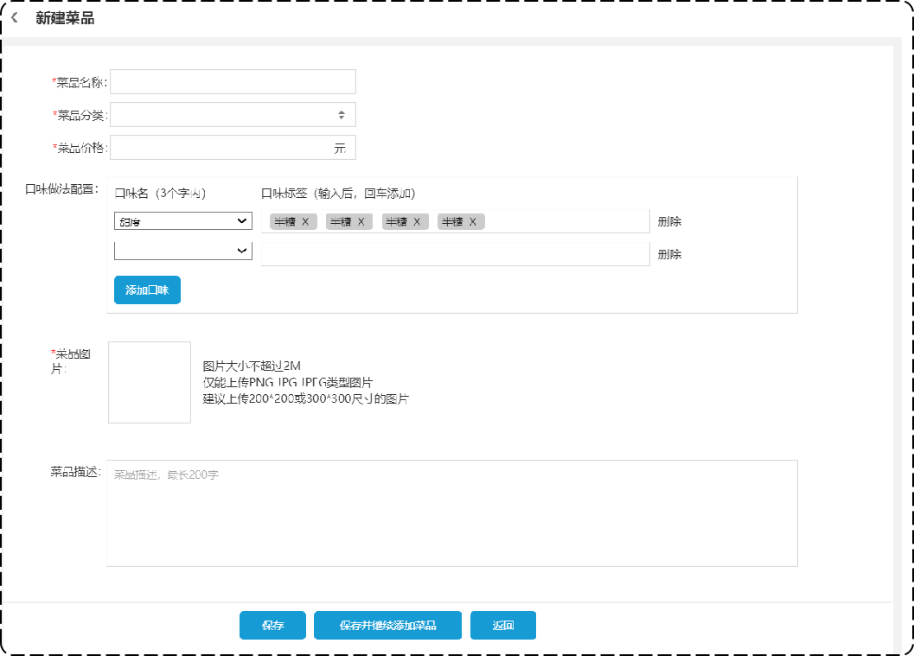 

当填写完表单信息, 点击"保存"按钮后, 会提交该表单的数据到服务端, 在服务端中需要接受数据, 然后将数据保存至数据库中。


**业务规则：**

- 菜品名称必须是唯一的
- 菜品必须属于某个分类下，不能单独存在
- 新增菜品时可以根据情况选择菜品的口味
- 每个菜品必须对应一张图片


#### 2.1.2 接口设计

根据上述原型图先**粗粒度**设计接口，共包含3个接口。

**接口设计：**

- 根据类型查询分类（已完成）
- 文件上传
- 新增菜品


接下来**细粒度**分析每个接口，明确每个接口的请求方式、请求路径、传入参数和返回值。

**1. 根据类型查询分类**

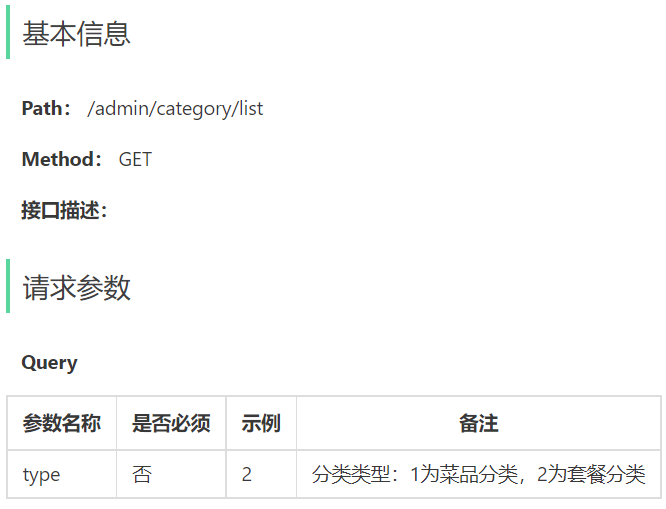 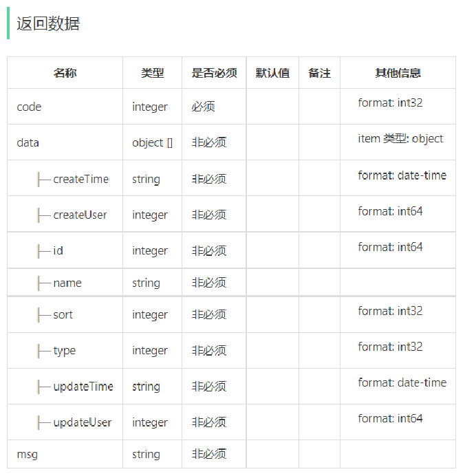

**2. 文件上传**

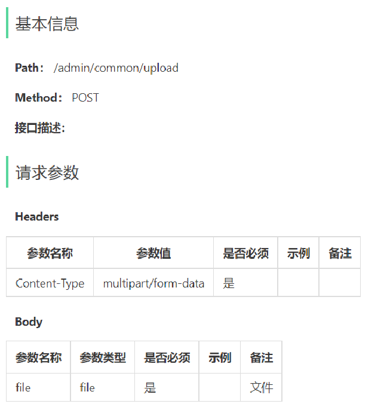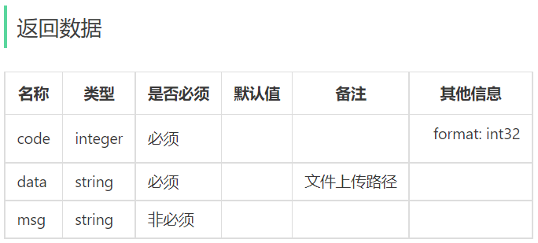


**3. 新增菜品**

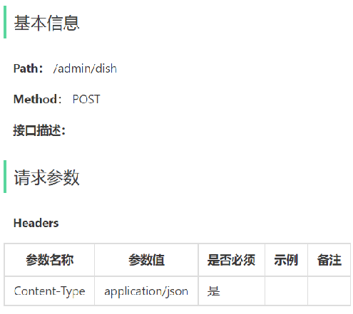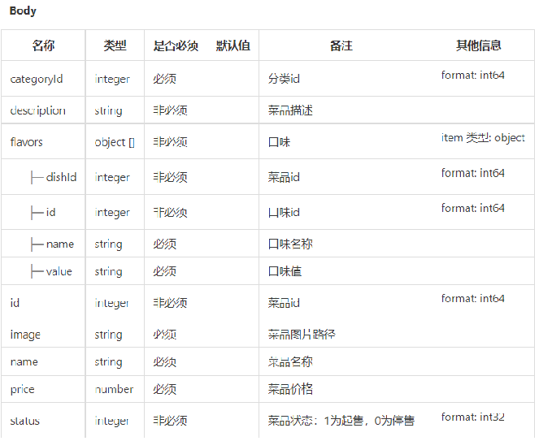


#### 2.1.3 表设计

通过原型图进行分析：

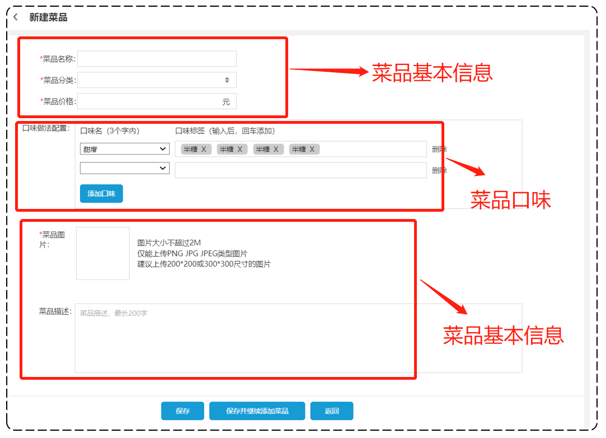 

新增菜品，其实就是将新增页面录入的菜品信息插入到dish表，如果添加了口味做法，还需要向dish_flavor表插入数据。所以在新增菜品时，涉及到两个表：

| 表名        | 说明       |
| ----------- | ---------- |
| dish        | 菜品表     |
| dish_flavor | 菜品口味表 |


**1). 菜品表:dish**

| **字段名**  | **数据类型**  | **说明**     | **备注**    |
| ----------- | ------------- | ------------ | ----------- |
| id          | bigint        | 主键         | 自增        |
| name        | varchar(32)   | 菜品名称     | 唯一        |
| category_id | bigint        | 分类id       | 逻辑外键    |
| price       | decimal(10,2) | 菜品价格     |             |
| image       | varchar(255)  | 图片路径     |             |
| description | varchar(255)  | 菜品描述     |             |
| status      | int           | 售卖状态     | 1起售 0停售 |
| create_time | datetime      | 创建时间     |             |
| update_time | datetime      | 最后修改时间 |             |
| create_user | bigint        | 创建人id     |             |
| update_user | bigint        | 最后修改人id |             |

**2). 菜品口味表:dish_flavor**

| **字段名** | **数据类型** | **说明** | **备注** |
| ---------- | ------------ | -------- | -------- |
| id         | bigint       | 主键     | 自增     |
| dish_id    | bigint       | 菜品id   | 逻辑外键 |
| name       | varchar(32)  | 口味名称 |          |
| value      | varchar(255) | 口味值   |          |


### 2.2 代码开发

#### 2.2.1 文件上传实现

因为在新增菜品时，需要上传菜品对应的图片(文件)，包括后绪其它功能也会使用到文件上传，故要实现通用的文件上传接口。

文件上传，是指将本地图片、视频、音频等文件上传到服务器上，可以供其他用户浏览或下载的过程。文件上传在项目中应用非常广泛，我们经常发抖音、发朋友圈都用到了文件上传功能。

实现文件上传服务，需要有存储的支持，那么我们的解决方案将以下几种：

1. 直接将图片保存到服务的硬盘（springmvc中的文件上传）
   1. 优点：开发便捷，成本低
   2. 缺点：扩容困难
2. 使用分布式文件系统进行存储
   1. 优点：容易实现扩容
   2. 缺点：开发复杂度稍大（有成熟的产品可以使用，比如：FastDFS,MinIO）
3. 使用第三方的存储服务（例如OSS）
   1. 优点：开发简单，拥有强大功能，免维护
   2. 缺点：付费

在本项目选用阿里云的OSS服务进行文件存储。（前面课程已学习过阿里云OSS,不再赘述）

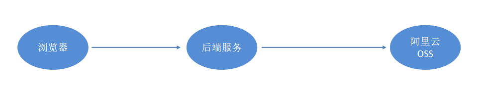 

**实现步骤：**

**1). 定义OSS相关配置**

在sky-server模块

application-dev.yml

```yaml
sky:
  alioss:
    endpoint: oss-cn-hangzhou.aliyuncs.com
    access-key-id: LTAI5tPeFLzsPPT8gG3LPW64
    access-key-secret: U6k1brOZ8gaOIXv3nXbulGTUzy6Pd7
    bucket-name: sky-take-out
```

application.yml

```yaml
spring:
  profiles:
    active: dev    #设置环境
sky:
  alioss:
    endpoint: ${sky.alioss.endpoint}
    access-key-id: ${sky.alioss.access-key-id}
    access-key-secret: ${sky.alioss.access-key-secret}
    bucket-name: ${sky.alioss.bucket-name}

```


**2). 读取OSS配置**

在sky-common模块中，已定义

```java
package com.sky.properties;

import lombok.Data;
import org.springframework.boot.context.properties.ConfigurationProperties;
import org.springframework.stereotype.Component;

@Component
@ConfigurationProperties(prefix = "sky.alioss")
@Data
public class AliOssProperties {

    private String endpoint;
    private String accessKeyId;
    private String accessKeySecret;
    private String bucketName;

}
```


**3). 生成OSS工具类对象**

在sky-server模块

```java
package com.sky.config;

import com.sky.properties.AliOssProperties;
import com.sky.utils.AliOssUtil;
import lombok.extern.slf4j.Slf4j;
import org.springframework.boot.autoconfigure.condition.ConditionalOnMissingBean;
import org.springframework.context.annotation.Bean;
import org.springframework.context.annotation.Configuration;

/**
 * 配置类，用于创建AliOssUtil对象
 */
@Configuration
@Slf4j
public class OssConfiguration {

    @Bean
    @ConditionalOnMissingBean
    public AliOssUtil aliOssUtil(AliOssProperties aliOssProperties){
        log.info("开始创建阿里云文件上传工具类对象：{}",aliOssProperties);
        return new AliOssUtil(aliOssProperties.getEndpoint(),
                aliOssProperties.getAccessKeyId(),
                aliOssProperties.getAccessKeySecret(),
                aliOssProperties.getBucketName());
    }
}
```

其中，AliOssUtil.java已在sky-common模块中定义

```java
package com.sky.utils;

import com.aliyun.oss.ClientException;
import com.aliyun.oss.OSS;
import com.aliyun.oss.OSSClientBuilder;
import com.aliyun.oss.OSSException;
import lombok.AllArgsConstructor;
import lombok.Data;
import lombok.extern.slf4j.Slf4j;
import java.io.ByteArrayInputStream;

@Data
@AllArgsConstructor
@Slf4j
public class AliOssUtil {

    private String endpoint;
    private String accessKeyId;
    private String accessKeySecret;
    private String bucketName;

    /**
     * 文件上传
     *
     * @param bytes
     * @param objectName
     * @return
     */
    public String upload(byte[] bytes, String objectName) {

        // 创建OSSClient实例。
        OSS ossClient = new OSSClientBuilder().build(endpoint, accessKeyId, accessKeySecret);

        try {
            // 创建PutObject请求。
            ossClient.putObject(bucketName, objectName, new ByteArrayInputStream(bytes));
        } catch (OSSException oe) {
            System.out.println("Caught an OSSException, which means your request made it to OSS, "
                    + "but was rejected with an error response for some reason.");
            System.out.println("Error Message:" + oe.getErrorMessage());
            System.out.println("Error Code:" + oe.getErrorCode());
            System.out.println("Request ID:" + oe.getRequestId());
            System.out.println("Host ID:" + oe.getHostId());
        } catch (ClientException ce) {
            System.out.println("Caught an ClientException, which means the client encountered "
                    + "a serious internal problem while trying to communicate with OSS, "
                    + "such as not being able to access the network.");
            System.out.println("Error Message:" + ce.getMessage());
        } finally {
            if (ossClient != null) {
                ossClient.shutdown();
            }
        }

        //文件访问路径规则 https://BucketName.Endpoint/ObjectName
        StringBuilder stringBuilder = new StringBuilder("https://");
        stringBuilder
                .append(bucketName)
                .append(".")
                .append(endpoint)
                .append("/")
                .append(objectName);

        log.info("文件上传到:{}", stringBuilder.toString());

        return stringBuilder.toString();
    }
}
```


**4). 定义文件上传接口**

在sky-server模块中定义接口

```java
package com.sky.controller.admin;

import com.sky.constant.MessageConstant;
import com.sky.result.Result;
import com.sky.utils.AliOssUtil;
import io.swagger.annotations.Api;
import io.swagger.annotations.ApiOperation;
import lombok.extern.slf4j.Slf4j;
import org.springframework.beans.factory.annotation.Autowired;
import org.springframework.web.bind.annotation.PostMapping;
import org.springframework.web.bind.annotation.RequestMapping;
import org.springframework.web.bind.annotation.RestController;
import org.springframework.web.multipart.MultipartFile;
import java.io.IOException;
import java.util.UUID;

/**
 * 通用接口
 */
@RestController
@RequestMapping("/admin/common")
@Api(tags = "通用接口")
@Slf4j
public class CommonController {

    @Autowired
    private AliOssUtil aliOssUtil;

    /**
     * 文件上传
     * @param file
     * @return
     */
    @PostMapping("/upload")
    @ApiOperation("文件上传")
    public Result<String> upload(MultipartFile file){
        log.info("文件上传：{}",file);

        try {
            //原始文件名
            String originalFilename = file.getOriginalFilename();
            //截取原始文件名的后缀   dfdfdf.png
            String extension = originalFilename.substring(originalFilename.lastIndexOf("."));
            //构造新文件名称
            String objectName = UUID.randomUUID().toString() + extension;

            //文件的请求路径
            String filePath = aliOssUtil.upload(file.getBytes(), objectName);
            return Result.success(filePath);
        } catch (IOException e) {
            log.error("文件上传失败：{}", e);
        }

        return Result.error(MessageConstant.UPLOAD_FAILED);
    }
}
```


#### 2.2.2 新增菜品实现

**1). 设计DTO类**

在sky-pojo模块中

```java
package com.sky.dto;

import com.sky.entity.DishFlavor;
import lombok.Data;
import java.io.Serializable;
import java.math.BigDecimal;
import java.util.ArrayList;
import java.util.List;

@Data
public class DishDTO implements Serializable {

    private Long id;
    //菜品名称
    private String name;
    //菜品分类id
    private Long categoryId;
    //菜品价格
    private BigDecimal price;
    //图片
    private String image;
    //描述信息
    private String description;
    //0 停售 1 起售
    private Integer status;
    //口味
    private List<DishFlavor> flavors = new ArrayList<>();
}
```


**2). Controller层**

进入到sky-server模块

```java
package com.sky.controller.admin;

import com.sky.dto.DishDTO;
import com.sky.dto.DishPageQueryDTO;
import com.sky.entity.Dish;
import com.sky.result.PageResult;
import com.sky.result.Result;
import com.sky.service.DishService;
import com.sky.vo.DishVO;
import io.swagger.annotations.Api;
import io.swagger.annotations.ApiOperation;
import lombok.extern.slf4j.Slf4j;
import org.springframework.beans.factory.annotation.Autowired;
import org.springframework.web.bind.annotation.*;
import java.util.List;
import java.util.Set;

/**
 * 菜品管理
 */
@RestController
@RequestMapping("/admin/dish")
@Api(tags = "菜品相关接口")
@Slf4j
public class DishController {

    @Autowired
    private DishService dishService;

    /**
     * 新增菜品
     *
     * @param dishDTO
     * @return
     */
    @PostMapping
    @ApiOperation("新增菜品")
    public Result save(@RequestBody DishDTO dishDTO) {
        log.info("新增菜品：{}", dishDTO);
        dishService.saveWithFlavor(dishDTO);//后绪步骤开发
        return Result.success();
    }
}
```


**3). Service层接口**

```java
package com.sky.service;

import com.sky.dto.DishDTO;
import com.sky.entity.Dish;

public interface DishService {

    /**
     * 新增菜品和对应的口味
     *
     * @param dishDTO
     */
    public void saveWithFlavor(DishDTO dishDTO);

}
```


**4). Service层实现类**

```java
package com.sky.service.impl;


@Service
@Slf4j
public class DishServiceImpl implements DishService {

    @Autowired
    private DishMapper dishMapper;
    @Autowired
    private DishFlavorMapper dishFlavorMapper;

    /**
     * 新增菜品和对应的口味
     *
     * @param dishDTO
     */
    @Transactional
    public void saveWithFlavor(DishDTO dishDTO) {

        Dish dish = new Dish();
        BeanUtils.copyProperties(dishDTO, dish);

        //向菜品表插入1条数据
        dishMapper.insert(dish);//后绪步骤实现

        //获取insert语句生成的主键值
        Long dishId = dish.getId();

        List<DishFlavor> flavors = dishDTO.getFlavors();
        if (flavors != null && flavors.size() > 0) {
            flavors.forEach(dishFlavor -> {
                dishFlavor.setDishId(dishId);
            });
            //向口味表插入n条数据
            dishFlavorMapper.insertBatch(flavors);//后绪步骤实现
        }
    }

}
```


**5). Mapper层**

DishMapper.java中添加

```java
	/**
     * 插入菜品数据
     *
     * @param dish
     */
    @AutoFill(value = OperationType.INSERT)
    void insert(Dish dish);
```

在/resources/mapper中创建DishMapper.xml

```xml
<?xml version="1.0" encoding="UTF-8" ?>
<!DOCTYPE mapper PUBLIC "-//mybatis.org//DTD Mapper 3.0//EN"
        "http://mybatis.org/dtd/mybatis-3-mapper.dtd" >
<mapper namespace="com.sky.mapper.DishMapper">

    <insert id="insert" useGeneratedKeys="true" keyProperty="id">
        insert into dish (name, category_id, price, image, description, create_time, update_time, create_user,update_user, status)
        values (#{name}, #{categoryId}, #{price}, #{image}, #{description}, #{createTime}, #{updateTime}, #{createUser}, #{updateUser}, #{status})
    </insert>
</mapper>

```

DishFlavorMapper.java

```java
package com.sky.mapper;

import com.sky.entity.DishFlavor;
import java.util.List;

@Mapper
public interface DishFlavorMapper {
    /**
     * 批量插入口味数据
     * @param flavors
     */
    void insertBatch(List<DishFlavor> flavors);

}
```

在/resources/mapper中创建DishFlavorMapper.xml

```xml
<?xml version="1.0" encoding="UTF-8" ?>
<!DOCTYPE mapper PUBLIC "-//mybatis.org//DTD Mapper 3.0//EN"
        "http://mybatis.org/dtd/mybatis-3-mapper.dtd" >
<mapper namespace="com.sky.mapper.DishFlavorMapper">
    <insert id="insertBatch">
        insert into dish_flavor (dish_id, name, value) VALUES
        <foreach collection="flavors" item="df" separator=",">
            (#{df.dishId},#{df.name},#{df.value})
        </foreach>
    </insert>
</mapper>
```


### 2.3 功能测试

进入到菜品管理--->新建菜品

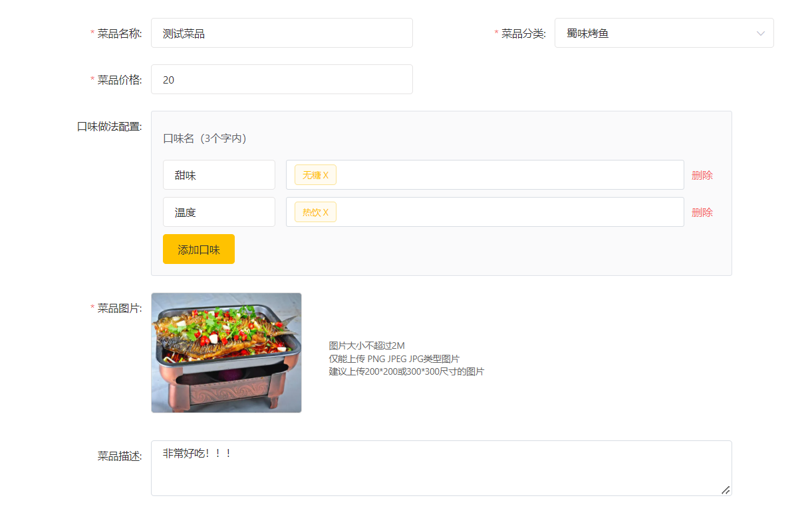 

由于没有实现菜品查询功能，所以保存后，暂且在表中查看添加的数据。

dish表：

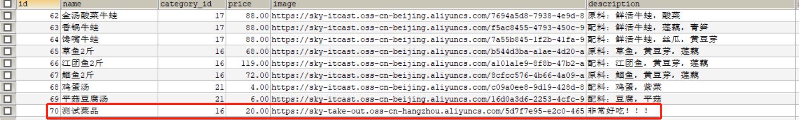 

dish_flavor表：

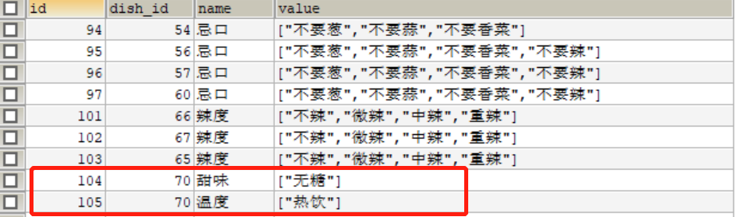 

测试成功。


### 2.4代码提交

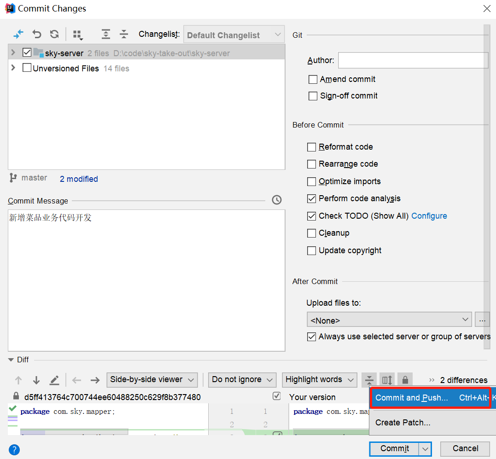  

后续步骤和上述功能代码提交一致，不再赘述。


## 3. 菜品分页查询

### 3.1 需求分析和设计

#### 3.1.1 产品原型

系统中的菜品数据很多的时候，如果在一个页面中全部展示出来会显得比较乱，不便于查看，所以一般的系统中都会以分页的方式来展示列表数据。

**菜品分页原型：**

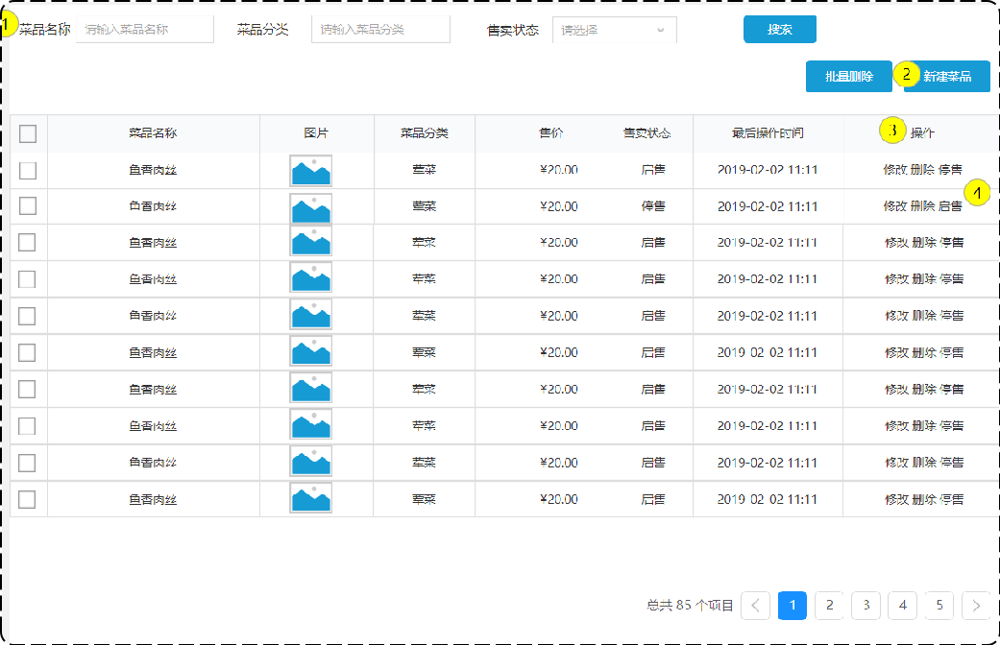 

在菜品列表展示时，除了菜品的基本信息(名称、售价、售卖状态、最后操作时间)外，还有两个字段略微特殊，第一个是图片字段 ，我们从数据库查询出来的仅仅是图片的名字，图片要想在表格中回显展示出来，就需要下载这个图片。第二个是菜品分类，这里展示的是分类名称，而不是分类ID，此时我们就需要根据菜品的分类ID，去分类表中查询分类信息，然后在页面展示。

**业务规则：**

- 根据页码展示菜品信息
- 每页展示10条数据
- 分页查询时可以根据需要输入菜品名称、菜品分类、菜品状态进行查询


#### 3.1.2 接口设计

根据上述原型图，设计出相应的接口。

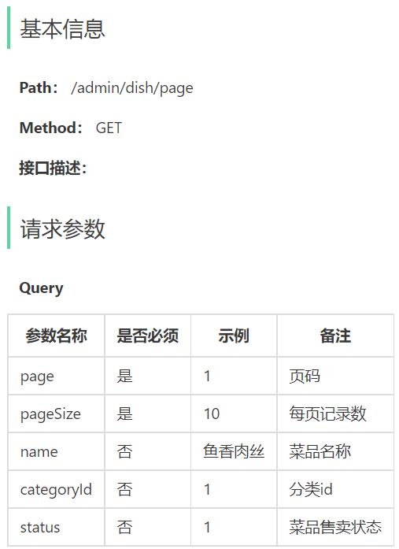 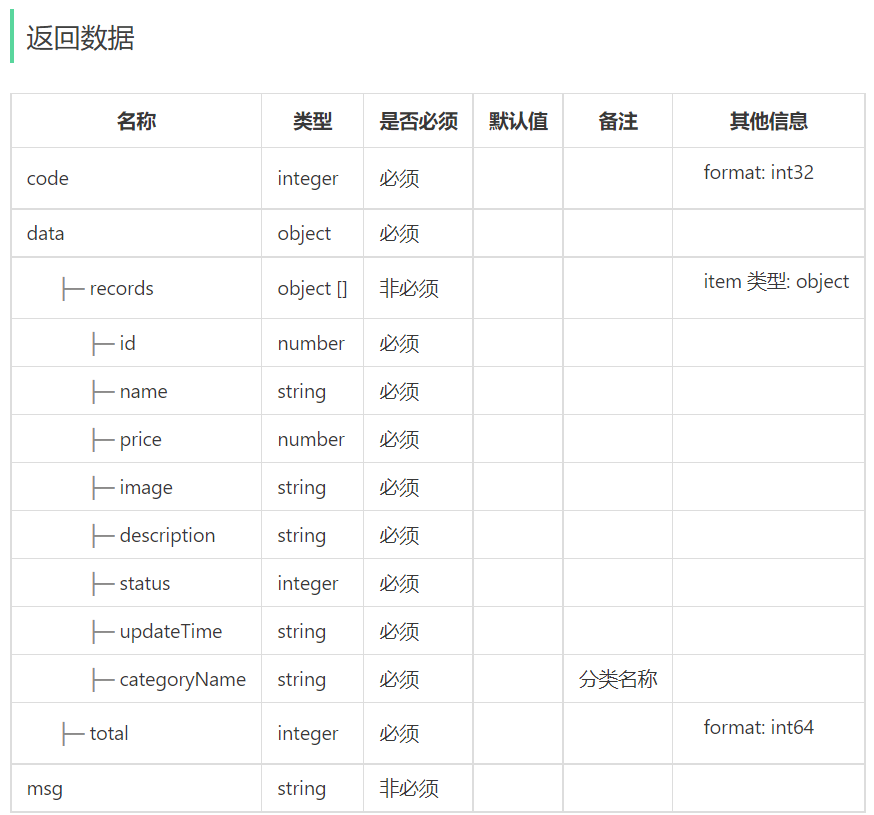


### 3.2 代码开发

#### 3.2.1 设计DTO类

**根据菜品分页查询接口定义设计对应的DTO：**

在sky-pojo模块中，已定义

```java
package com.sky.dto;

import lombok.Data;
import java.io.Serializable;

@Data
public class DishPageQueryDTO implements Serializable {

    private int page;
    private int pageSize;
    private String name;
    private Integer categoryId; //分类id
    private Integer status; //状态 0表示禁用 1表示启用

}
```


#### 3.2.2 设计VO类

**根据菜品分页查询接口定义设计对应的VO：**

在sky-pojo模块中，已定义

```java
package com.sky.vo;

import com.sky.entity.DishFlavor;
import lombok.AllArgsConstructor;
import lombok.Builder;
import lombok.Data;
import lombok.NoArgsConstructor;
import java.io.Serializable;
import java.math.BigDecimal;
import java.time.LocalDateTime;
import java.util.ArrayList;
import java.util.List;

@Data
@Builder
@NoArgsConstructor
@AllArgsConstructor
public class DishVO implements Serializable {

    private Long id;
    //菜品名称
    private String name;
    //菜品分类id
    private Long categoryId;
    //菜品价格
    private BigDecimal price;
    //图片
    private String image;
    //描述信息
    private String description;
    //0 停售 1 起售
    private Integer status;
    //更新时间
    private LocalDateTime updateTime;
    //分类名称
    private String categoryName;
    //菜品关联的口味
    private List<DishFlavor> flavors = new ArrayList<>();
}
```


#### 3.2.3 Controller层

**根据接口定义创建DishController的page分页查询方法：**

```java
	/**
     * 菜品分页查询
     *
     * @param dishPageQueryDTO
     * @return
     */
    @GetMapping("/page")
    @ApiOperation("菜品分页查询")
    public Result<PageResult> page(DishPageQueryDTO dishPageQueryDTO) {
        log.info("菜品分页查询:{}", dishPageQueryDTO);
        PageResult pageResult = dishService.pageQuery(dishPageQueryDTO);//后绪步骤定义
        return Result.success(pageResult);
    }
```


#### 3.2.4 Service层接口

**在 DishService 中扩展分页查询方法：**

```java
	/**
     * 菜品分页查询
     *
     * @param dishPageQueryDTO
     * @return
     */
    PageResult pageQuery(DishPageQueryDTO dishPageQueryDTO);
```


#### 3.2.5 Service层实现类

**在 DishServiceImpl 中实现分页查询方法：**

```java
	/**
     * 菜品分页查询
     *
     * @param dishPageQueryDTO
     * @return
     */
    public PageResult pageQuery(DishPageQueryDTO dishPageQueryDTO) {
        PageHelper.startPage(dishPageQueryDTO.getPage(), dishPageQueryDTO.getPageSize());
        Page<DishVO> page = dishMapper.pageQuery(dishPageQueryDTO);//后绪步骤实现
        return new PageResult(page.getTotal(), page.getResult());
    }
```


#### 3.2.6 Mapper层

**在 DishMapper 接口中声明 pageQuery 方法：**

```java
	/**
     * 菜品分页查询
     *
     * @param dishPageQueryDTO
     * @return
     */
    Page<DishVO> pageQuery(DishPageQueryDTO dishPageQueryDTO);
```

**在 DishMapper.xml 中编写SQL：**

```xml
<select id="pageQuery" resultType="com.sky.vo.DishVO">
        select d.* , c.name as categoryName from dish d left outer join category c on d.category_id = c.id
        <where>
            <if test="name != null">
                and d.name like concat('%',#{name},'%')
            </if>
            <if test="categoryId != null">
                and d.category_id = #{categoryId}
            </if>
            <if test="status != null">
                and d.status = #{status}
            </if>
        </where>
        order by d.create_time desc
</select>
```


### 3.3 功能测试

#### 3.3.1 接口文档测试

**启动服务：**访问http://localhost:8080/doc.html，进入菜品分页查询接口

**注意：**使用admin用户登录重新获取token，防止token失效。

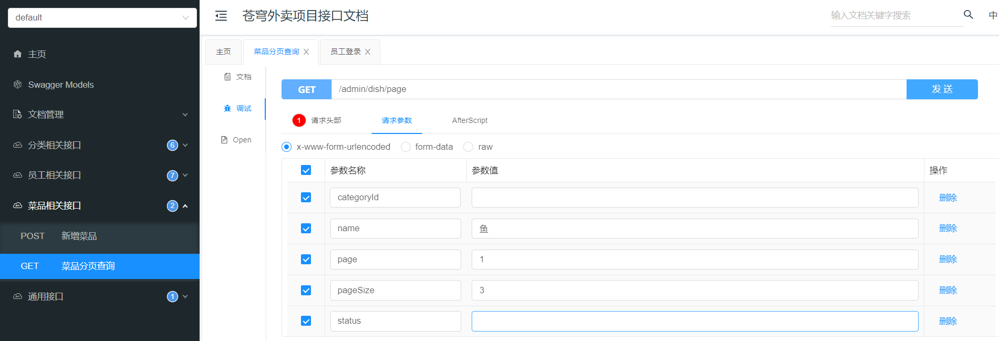  

**点击发送：**

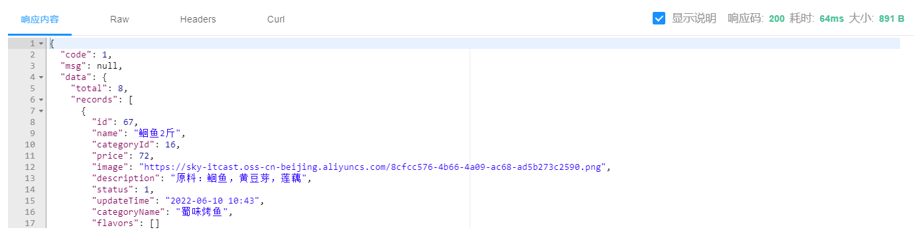 


#### 3.3.2 前后端联调测试

启动nginx,访问 http://localhost

**点击菜品管理**

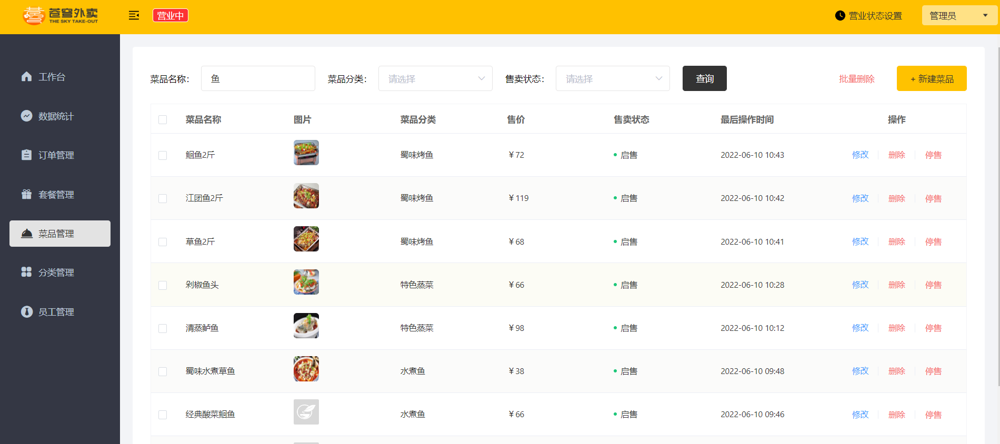 

数据成功查出。


## 4. 删除菜品

### 4.1 需求分析和设计

#### 4.1.1 产品原型

在菜品列表页面，每个菜品后面对应的操作分别为**修改**、**删除**、**停售**，可通过删除功能完成对菜品及相关的数据进行删除。

**删除菜品原型：**

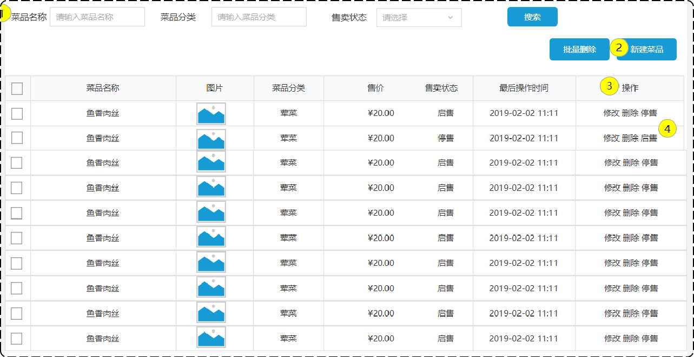 


**业务规则：**

- 可以一次删除一个菜品，也可以批量删除菜品
- 起售中的菜品不能删除
- 被套餐关联的菜品不能删除
- 删除菜品后，关联的口味数据也需要删除掉


#### 4.1.2 接口设计

根据上述原型图，设计出相应的接口。

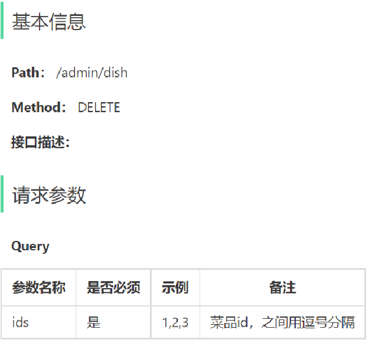 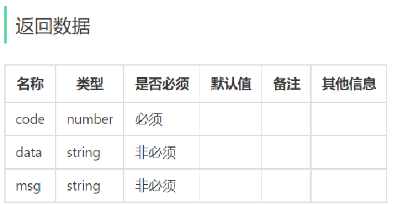

**注意：**删除一个菜品和批量删除菜品共用一个接口，故ids可包含多个菜品id,之间用逗号分隔。


#### 4.1.3 表设计

在进行删除菜品操作时，会涉及到以下三张表。

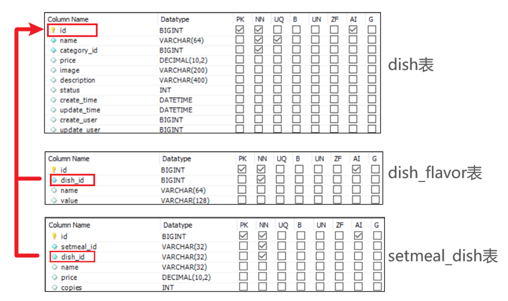 

**注意事项：**

- 在dish表中删除菜品基本数据时，同时，也要把关联在dish_flavor表中的数据一块删除。
- setmeal_dish表为菜品和套餐关联的中间表。
- 若删除的菜品数据关联着某个套餐，此时，删除失败。
- 若要删除套餐关联的菜品数据，先解除两者关联，再对菜品进行删除。


### 4.2 代码开发

#### 4.1.2 Controller层

**根据删除菜品的接口定义在DishController中创建方法：**

```java
	/**
     * 菜品批量删除
     *
     * @param ids
     * @return
     */
    @DeleteMapping
    @ApiOperation("菜品批量删除")
    public Result delete(@RequestParam List<Long> ids) {
        log.info("菜品批量删除：{}", ids);
        dishService.deleteBatch(ids);//后绪步骤实现
        return Result.success();
    }
```


#### 4.2.2 Service层接口

**在DishService接口中声明deleteBatch方法：**

```java
	/**
     * 菜品批量删除
     *
     * @param ids
     */
    void deleteBatch(List<Long> ids);
```


#### 4.2.3 Service层实现类

**在DishServiceImpl中实现deleteBatch方法：**

```java
    @Autowired
    private SetmealDishMapper setmealDishMapper;
	/**
     * 菜品批量删除
     *
     * @param ids
     */
    @Transactional//事务
    public void deleteBatch(List<Long> ids) {
        //判断当前菜品是否能够删除---是否存在起售中的菜品？？
        for (Long id : ids) {
            Dish dish = dishMapper.getById(id);//后绪步骤实现
            if (dish.getStatus() == StatusConstant.ENABLE) {
                //当前菜品处于起售中，不能删除
                throw new DeletionNotAllowedException(MessageConstant.DISH_ON_SALE);
            }
        }

        //判断当前菜品是否能够删除---是否被套餐关联了？？
        List<Long> setmealIds = setmealDishMapper.getSetmealIdsByDishIds(ids);
        if (setmealIds != null && setmealIds.size() > 0) {
            //当前菜品被套餐关联了，不能删除
            throw new DeletionNotAllowedException(MessageConstant.DISH_BE_RELATED_BY_SETMEAL);
        }

        //删除菜品表中的菜品数据
        for (Long id : ids) {
            dishMapper.deleteById(id);//后绪步骤实现
            //删除菜品关联的口味数据
            dishFlavorMapper.deleteByDishId(id);//后绪步骤实现
        }
    }
```


#### 4.2.4 Mapper层

**在DishMapper中声明getById方法，并配置SQL：**

```java
	/**
     * 根据主键查询菜品
     *
     * @param id
     * @return
     */
    @Select("select * from dish where id = #{id}")
    Dish getById(Long id);
```

**创建SetmealDishMapper，声明getSetmealIdsByDishIds方法，并在xml文件中编写SQL：**

```java
package com.sky.mapper;

import com.sky.entity.SetmealDish;
import org.apache.ibatis.annotations.Delete;
import org.apache.ibatis.annotations.Mapper;
import java.util.List;

@Mapper
public interface SetmealDishMapper {
    /**
     * 根据菜品id查询对应的套餐id
     *
     * @param dishIds
     * @return
     */
    //select setmeal_id from setmeal_dish where dish_id in (1,2,3,4)
    List<Long> getSetmealIdsByDishIds(List<Long> dishIds);
}

```

SetmealDishMapper.xml

```xml
<?xml version="1.0" encoding="UTF-8" ?>
<!DOCTYPE mapper PUBLIC "-//mybatis.org//DTD Mapper 3.0//EN"
        "http://mybatis.org/dtd/mybatis-3-mapper.dtd" >
<mapper namespace="com.sky.mapper.SetmealDishMapper">
    <select id="getSetmealIdsByDishIds" resultType="java.lang.Long">
        select setmeal_id from setmeal_dish where dish_id in
        <foreach collection="dishIds" item="dishId" separator="," open="(" close=")">
            #{dishId}
        </foreach>
    </select>
</mapper>
```

**在DishMapper.java中声明deleteById方法并配置SQL：**

```java
	/**
     * 根据主键删除菜品数据
     *
     * @param id
     */
    @Delete("delete from dish where id = #{id}")
    void deleteById(Long id);
```

**在DishFlavorMapper中声明deleteByDishId方法并配置SQL：**

```java
    /**
     * 根据菜品id删除对应的口味数据
     * @param dishId
     */
    @Delete("delete from dish_flavor where dish_id = #{dishId}")
    void deleteByDishId(Long dishId);
```


### 4.3 功能测试

既可以通过Swagger接口文档进行测试，也可以通过前后端联调测试，接下来，我们直接使用**前后端联调测试**。

进入到菜品列表查询页面

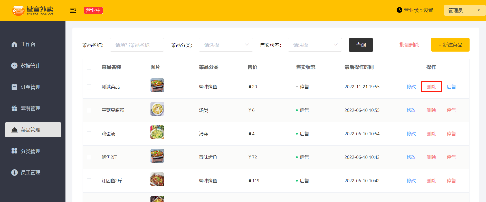 

对测试菜品进行删除操作

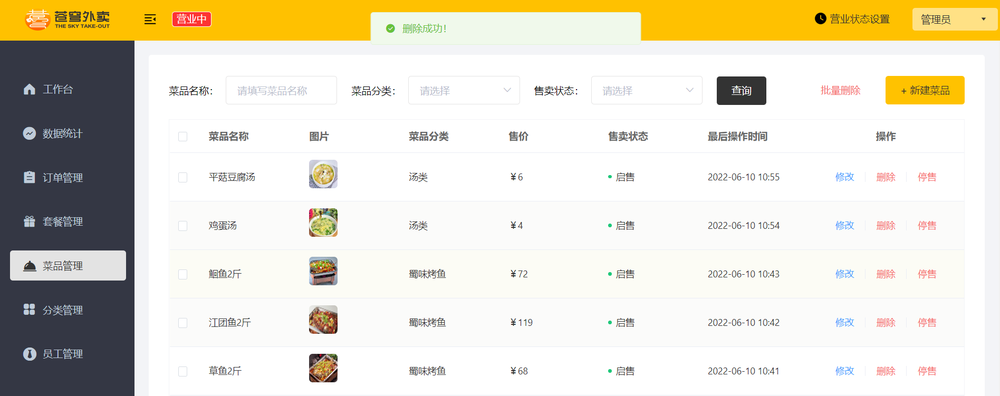 

同时，进到dish表和dish_flavor两个表查看**测试菜品**的相关数据都已被成功删除。


再次，删除状态为启售的菜品

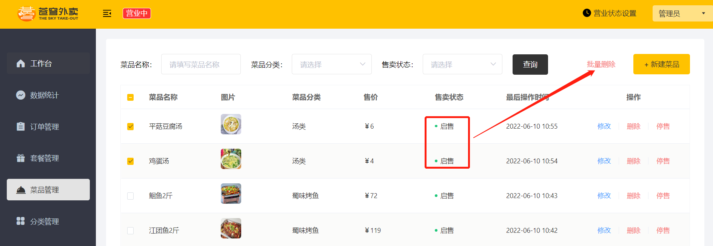 

点击批量删除

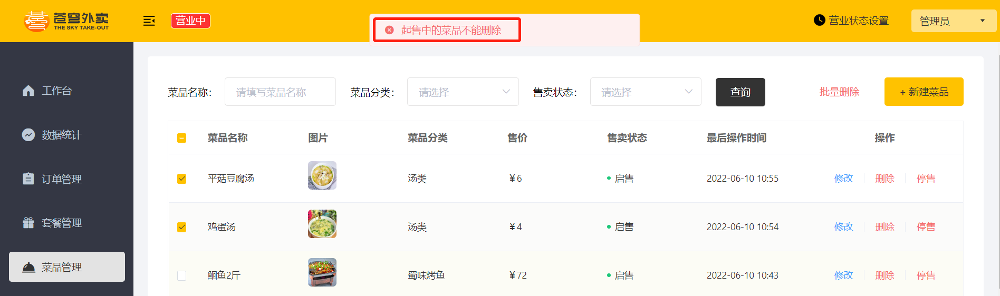 

删除失败，因为起售中的菜品不能删除。

### 4.4 代码提交

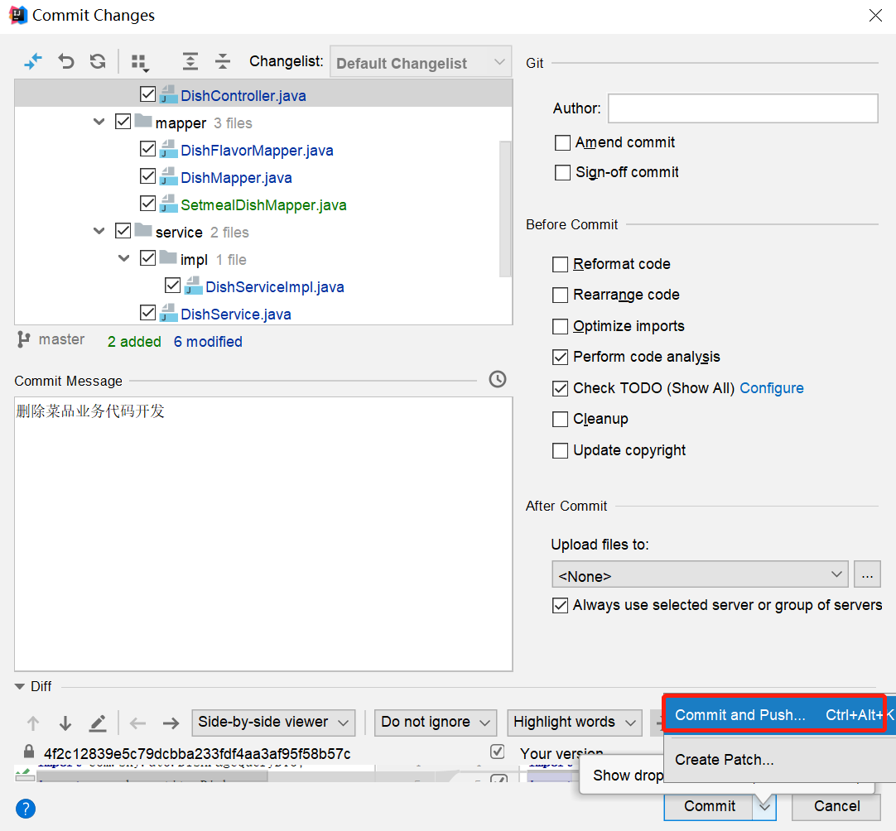 

后续步骤和上述功能代码提交一致，不再赘述。


## 5. 修改菜品

### 5.1 需求分析和设计

#### 5.1.1 产品原型

在菜品管理列表页面点击修改按钮，跳转到修改菜品页面，在修改页面回显菜品相关信息并进行修改，最后点击保存按钮完成修改操作。

**修改菜品原型：**

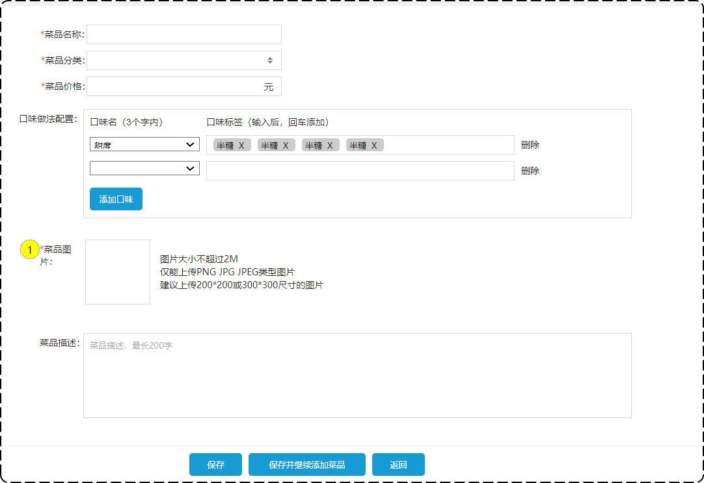 


#### 5.1.2 接口设计

通过对上述原型图进行分析，该页面共涉及4个接口。

**接口：**

- 根据id查询菜品
- 根据类型查询分类(已实现)
- 文件上传(已实现)
- 修改菜品

我们只需要实现**根据id查询菜品**和**修改菜品**两个接口，接下来，我们来重点分析这两个接口。

**1). 根据id查询菜品**

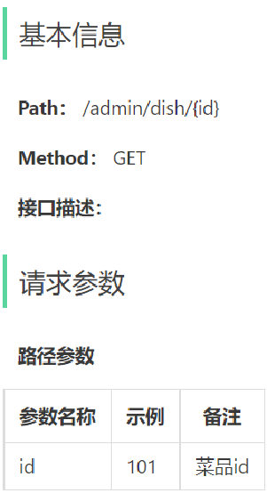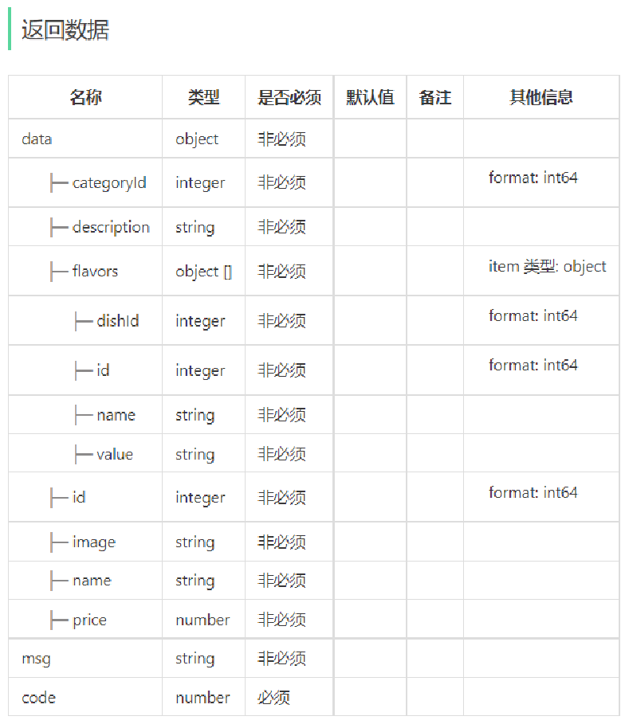

**2). 修改菜品**

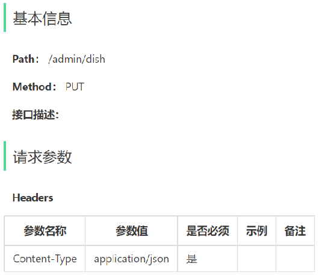 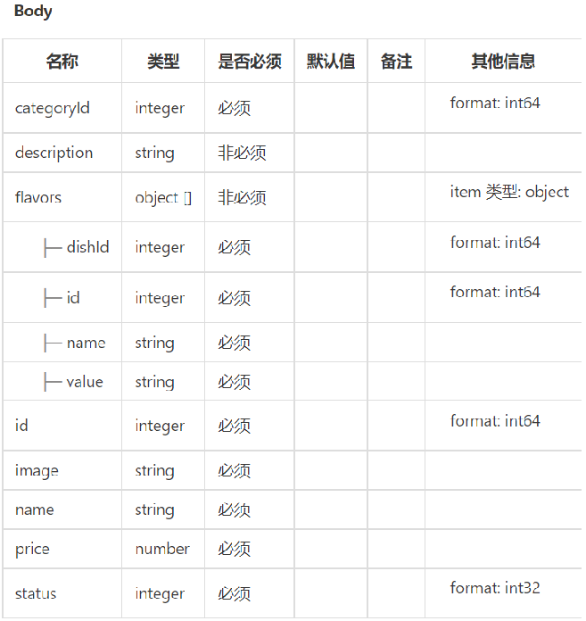


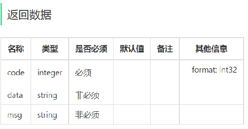 

**注:因为是修改功能，请求方式可设置为PUT。**


### 5.2 代码开发

#### 5.2.1 根据id查询菜品实现

**1). Controller层**

**根据id查询菜品的接口定义在DishController中创建方法：**

```java
    /**
     * 根据id查询菜品
     *
     * @param id
     * @return
     */
    @GetMapping("/{id}")
    @ApiOperation("根据id查询菜品")
    public Result<DishVO> getById(@PathVariable Long id) {
        log.info("根据id查询菜品：{}", id);
        DishVO dishVO = dishService.getByIdWithFlavor(id);//后绪步骤实现
        return Result.success(dishVO);
    }
```


**2). Service层接口**

**在DishService接口中声明getByIdWithFlavor方法：**

```java
	/**
     * 根据id查询菜品和对应的口味数据
     *
     * @param id
     * @return
     */
    DishVO getByIdWithFlavor(Long id);
```


**3). Service层实现类**

**在DishServiceImpl中实现getByIdWithFlavor方法：**

```java
	/**
     * 根据id查询菜品和对应的口味数据
     *
     * @param id
     * @return
     */
    public DishVO getByIdWithFlavor(Long id) {
        //根据id查询菜品数据
        Dish dish = dishMapper.getById(id);

        //根据菜品id查询口味数据
        List<DishFlavor> dishFlavors = dishFlavorMapper.getByDishId(id);//后绪步骤实现

        //将查询到的数据封装到VO
        DishVO dishVO = new DishVO();
        BeanUtils.copyProperties(dish, dishVO);
        dishVO.setFlavors(dishFlavors);

        return dishVO;
    }
```


**4). Mapper层**

**在DishFlavorMapper中声明getByDishId方法，并配置SQL：**

```java
    /**
     * 根据菜品id查询对应的口味数据
     * @param dishId
     * @return
     */
    @Select("select * from dish_flavor where dish_id = #{dishId}")
    List<DishFlavor> getByDishId(Long dishId);
```


#### 5.2.1 修改菜品实现

**1). Controller层**

**根据修改菜品的接口定义在DishController中创建方法：**

```java
	/**
     * 修改菜品
     *
     * @param dishDTO
     * @return
     */
    @PutMapping
    @ApiOperation("修改菜品")
    public Result update(@RequestBody DishDTO dishDTO) {
        log.info("修改菜品：{}", dishDTO);
        dishService.updateWithFlavor(dishDTO);
        return Result.success();
    }
```


**2). Service层接口**

**在DishService接口中声明updateWithFlavor方法：**

```java
	/**
     * 根据id修改菜品基本信息和对应的口味信息
     *
     * @param dishDTO
     */
    void updateWithFlavor(DishDTO dishDTO);
```


**3). Service层实现类**

**在DishServiceImpl中实现updateWithFlavor方法：**

```java
	/**
     * 根据id修改菜品基本信息和对应的口味信息
     *
     * @param dishDTO
     */
    public void updateWithFlavor(DishDTO dishDTO) {
        Dish dish = new Dish();
        BeanUtils.copyProperties(dishDTO, dish);

        //修改菜品表基本信息
        dishMapper.update(dish);

        //删除原有的口味数据
        dishFlavorMapper.deleteByDishId(dishDTO.getId());

        //重新插入口味数据
        List<DishFlavor> flavors = dishDTO.getFlavors();
        if (flavors != null && flavors.size() > 0) {
            flavors.forEach(dishFlavor -> {
                dishFlavor.setDishId(dishDTO.getId());
            });
            //向口味表插入n条数据
            dishFlavorMapper.insertBatch(flavors);
        }
    }
```


**4). Mapper层**

**在DishMapper中，声明update方法：**

```java
	/**
     * 根据id动态修改菜品数据
     *
     * @param dish
     */
    @AutoFill(value = OperationType.UPDATE)
    void update(Dish dish);
```

**并在DishMapper.xml文件中编写SQL:**

```xml
<update id="update">
        update dish
        <set>
            <if test="name != null">name = #{name},</if>
            <if test="categoryId != null">category_id = #{categoryId},</if>
            <if test="price != null">price = #{price},</if>
            <if test="image != null">image = #{image},</if>
            <if test="description != null">description = #{description},</if>
            <if test="status != null">status = #{status},</if>
            <if test="updateTime != null">update_time = #{updateTime},</if>
            <if test="updateUser != null">update_user = #{updateUser},</if>
        </set>
        where id = #{id}
</update>
```


### 5.3 功能测试

本次测试直接通过**前后端联调测试** ，可使用Debug方式启动项目，观察运行中步骤。

进入菜品列表查询页面，对第一个菜品的价格进行修改

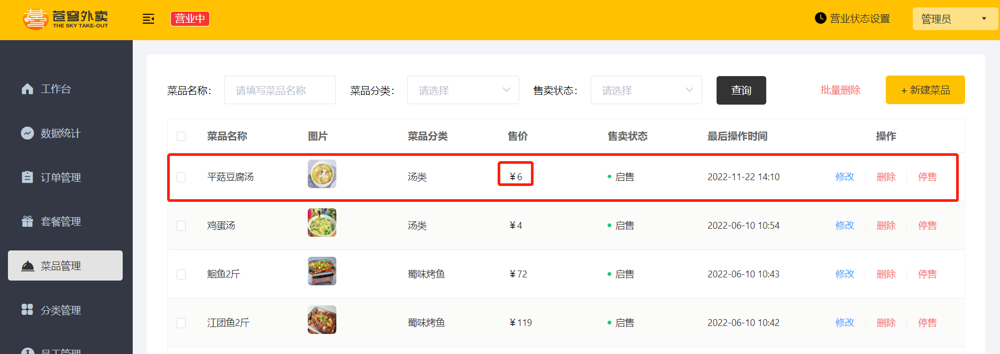 

点击修改，回显成功

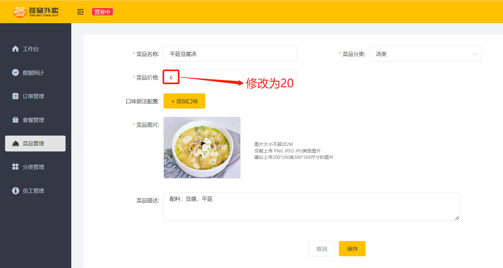 

菜品价格修改后，点击保存

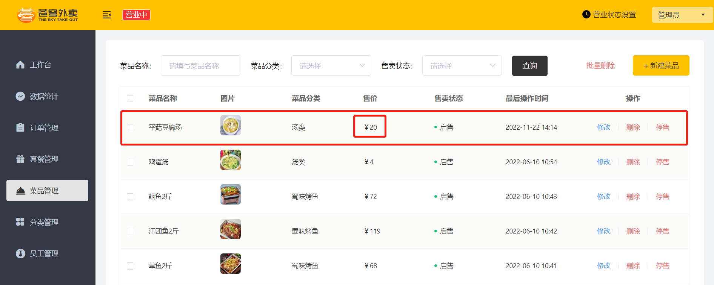 

修改成功


### 5.4 代码提交

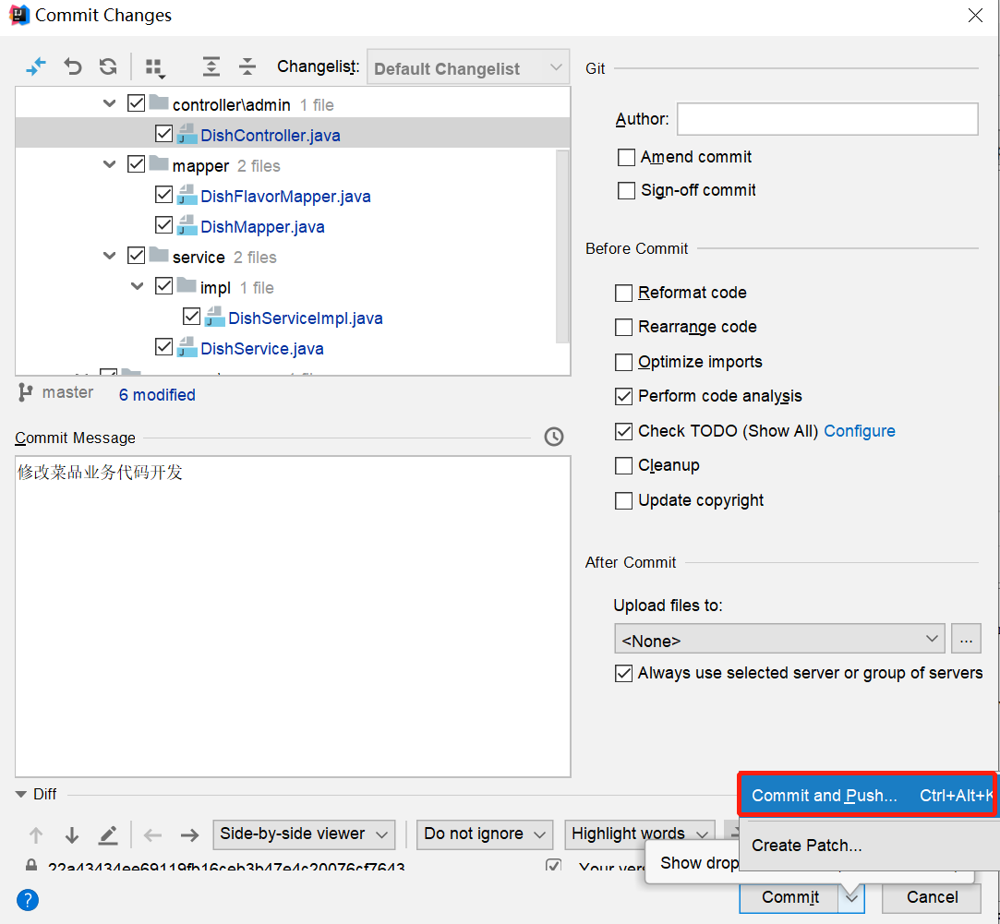 

后续步骤和上述功能代码提交一致，不再赘述。

