# 苍穹外卖-day05

## 课程内容

- Redis入门
- Redis数据类型
- Redis常用命令
- 在Java中操作Redis
- 店铺营业状态设置


功能实现：**营业状态设置**

**效果图：**

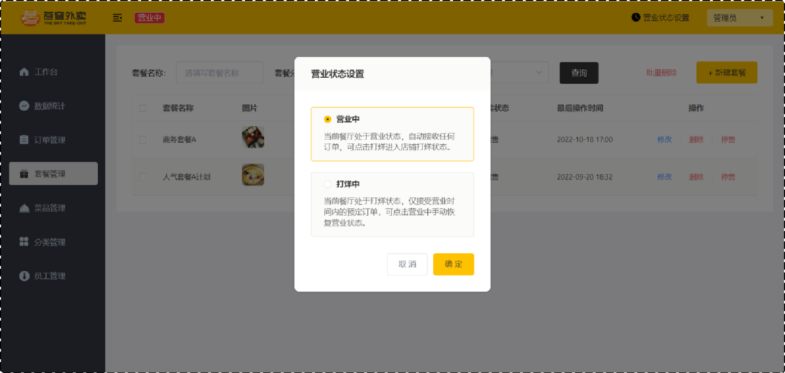 

选择**营业中**，客户可在小程序端下单：

 

选择**打烊中**，客户无法在小程序端下单：

 


## 1. Redis入门

### 1.1 Redis简介

Redis是一个基于**内存**的key-value结构数据库。Redis 是互联网技术领域使用最为广泛的**存储中间件**。

**官网：**https://redis.io
**中文网：**https://www.redis.net.cn/

**key-value结构存储：**

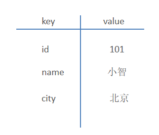 

**主要特点：**

- 基于内存存储，读写性能高  
- 适合存储热点数据（热点商品、资讯、新闻）
- 企业应用广泛

Redis是用C语言开发的一个开源的高性能键值对(key-value)数据库，官方提供的数据是可以达到100000+的QPS（每秒内查询次数）。它存储的value类型比较丰富，也被称为结构化的NoSql数据库。

NoSql（Not Only SQL），不仅仅是SQL，泛指**非关系型数据库**。NoSql数据库并不是要取代关系型数据库，而是关系型数据库的补充。

**关系型数据库(RDBMS)：**

- Mysql
- Oracle
- DB2
- SQLServer

**非关系型数据库(NoSql)：**

- Redis
- Mongo db
- MemCached


### 1.2 Redis下载与安装

#### 1.2.1 Redis下载

Redis安装包分为windows版和Linux版：

- Windows版下载地址：https://github.com/microsoftarchive/redis/releases
- Linux版下载地址： https://download.redis.io/releases/ 

资料中已提供好的安装包：

 


#### 1.2.2 Redis安装

**1）在Windows中安装Redis(项目中使用)**

Redis的Windows版属于绿色软件，直接解压即可使用，解压后目录结构如下：

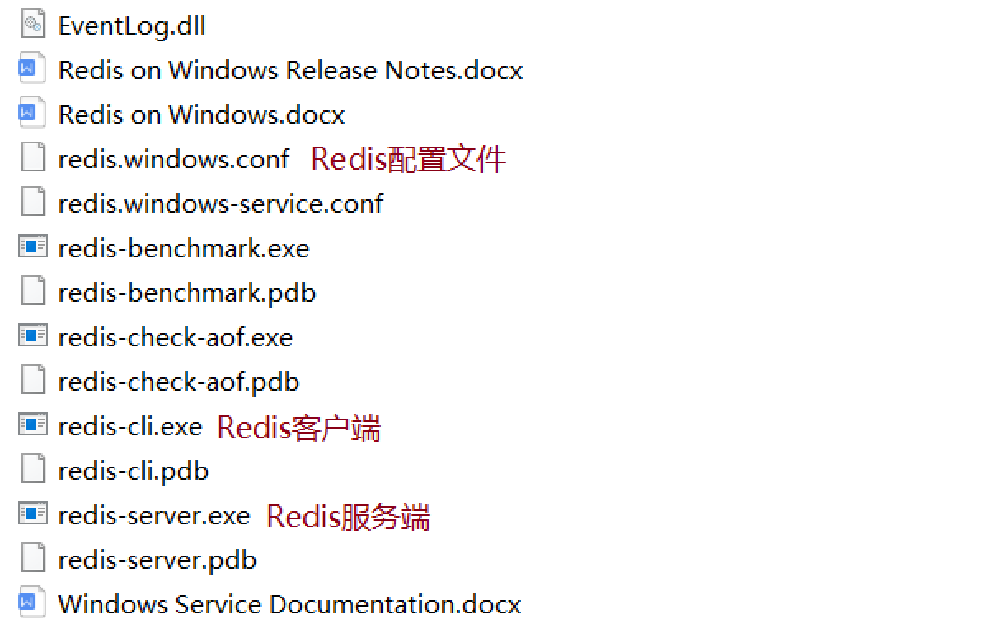 


**2）在Linux中安装Redis(简单了解)**

在Linux系统安装Redis步骤：

1. 将Redis安装包上传到Linux
2. 解压安装包，命令：tar -zxvf redis-4.0.0.tar.gz -C /usr/local
3. 安装Redis的依赖环境gcc，命令：yum install gcc-c++
4. 进入/usr/local/redis-4.0.0，进行编译，命令：make
5. 进入redis的src目录进行安装，命令：make install

安装后重点文件说明：

- /usr/local/redis-4.0.0/src/redis-server：Redis服务启动脚本
- /usr/local/redis-4.0.0/src/redis-cli：Redis客户端脚本
- /usr/local/redis-4.0.0/redis.conf：Redis配置文件


### 1.3 Redis服务启动与停止

以window版Redis进行演示：

#### 1.3.1 服务启动命令

**redis-server.exe redis.windows.conf**

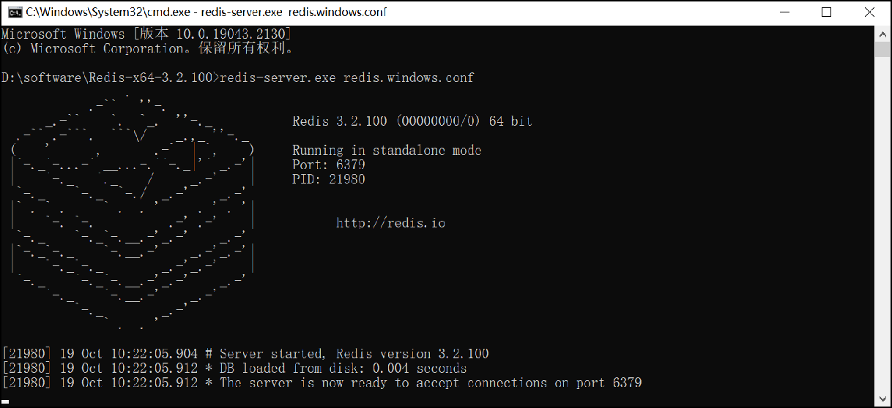 

Redis服务默认端口号为 **6379** ，通过快捷键**Ctrl + C** 即可停止Redis服务

当Redis服务启动成功后，可通过客户端进行连接。


#### 1.3.2 客户端连接命令

**redis-cli.exe**

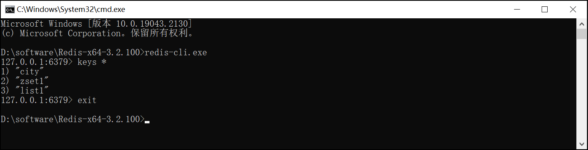 

通过redis-cli.exe命令默认连接的是本地的redis服务，并且使用默认6379端口。也可以通过指定如下参数连接：

- -h ip地址
- -p 端口号
- -a 密码（如果需要）


#### 1.3.3 修改Redis配置文件

设置Redis服务密码，修改redis.windows.conf

```
requirepass 123456
```

**注意：**

- 修改密码后需要重启Redis服务才能生效
- Redis配置文件中 # 表示注释

重启Redis后，再次连接Redis时，需加上密码，否则连接失败。

```
redis-cli.exe -h localhost -p 6379 -a 123456
```

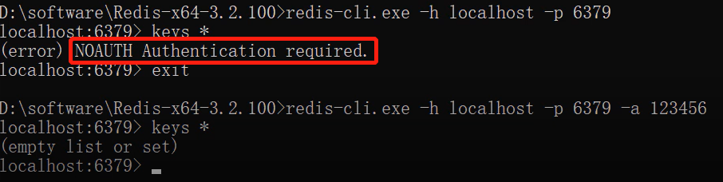 

此时，-h 和 -p 参数可省略不写。


#### 1.3.4 Redis客户端图形工具

默认提供的客户端连接工具界面不太友好，同时操作也较为麻烦，接下来，引入一个Redis客户端图形工具。

在当天资料中已提供安装包，直接安装即可。

 

安装完毕后，直接双击启动

**新建连接**

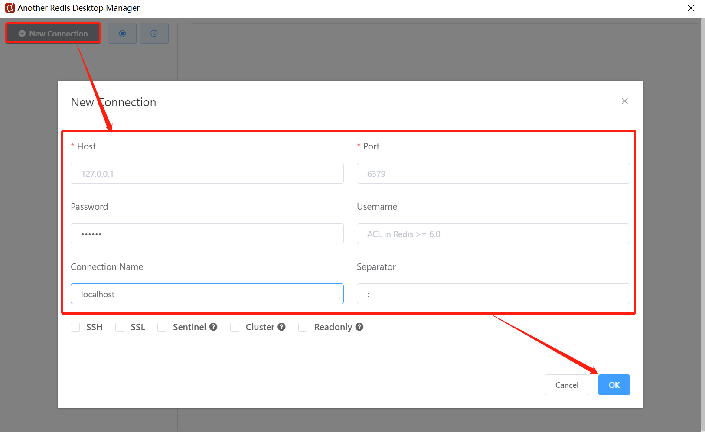  

**连接成功** 

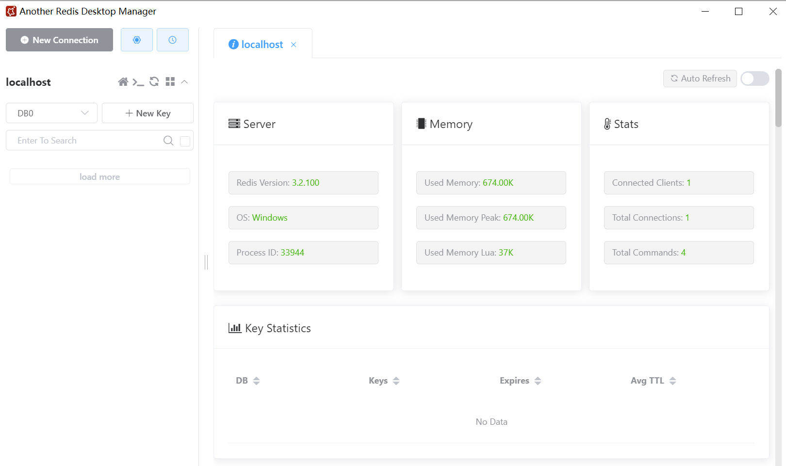  


## 2. Redis数据类型

### 2.1 五种常用数据类型介绍

Redis存储的是key-value结构的数据，其中key是字符串类型，value有5种常用的数据类型：

- 字符串 string
- 哈希 hash
- 列表 list
- 集合 set
- 有序集合 sorted set / zset


### 2.2 各种数据类型特点

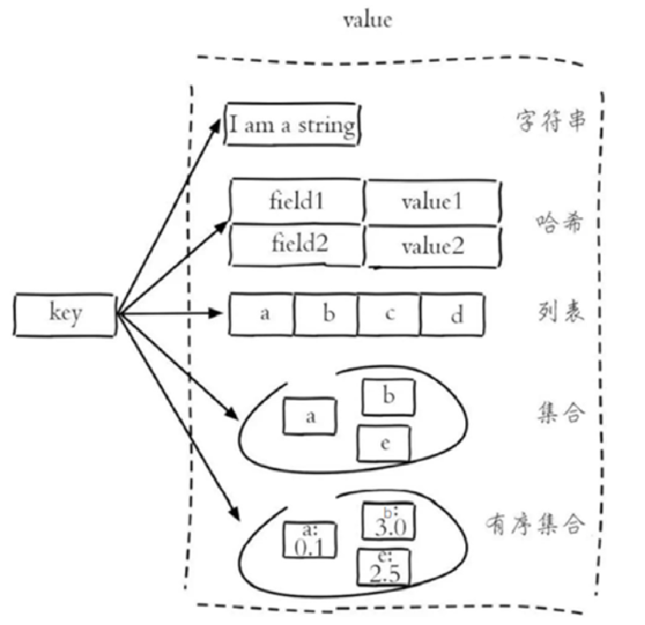 

**解释说明：**

- 字符串(string)：普通字符串，Redis中最简单的数据类型
- 哈希(hash)：也叫散列，类似于Java中的HashMap结构
- 列表(list)：按照插入顺序排序，可以有重复元素，类似于Java中的LinkedList
- 集合(set)：无序集合，没有重复元素，类似于Java中的HashSet
- 有序集合(sorted set/zset)：集合中每个元素关联一个分数(score)，根据分数升序排序，没有重复元素


## 3. Redis常用命令

### 3.1 字符串操作命令

Redis 中字符串类型常用命令：

- **SET** key value 					         设置指定key的值
- **GET** key                                        获取指定key的值
- **SETEX** key seconds value         设置指定key的值，并将 key 的过期时间设为 seconds 秒
- **SETNX** key value                        只有在 key    不存在时设置 key 的值

更多命令可以参考Redis中文网：https://www.redis.net.cn


### 3.2 哈希操作命令

Redis hash 是一个string类型的 field 和 value 的映射表，hash特别适合用于存储对象，常用命令：

- **HSET** key field value             将哈希表 key 中的字段 field 的值设为 value
- **HGET** key field                       获取存储在哈希表中指定字段的值
- **HDEL** key field                       删除存储在哈希表中的指定字段
- **HKEYS** key                              获取哈希表中所有字段
- **HVALS** key                              获取哈希表中所有值

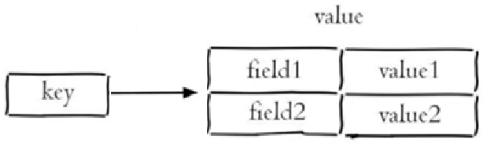 


### 3.3 列表操作命令

Redis 列表是简单的字符串列表，按照插入顺序排序，常用命令：

- **LPUSH** key value1 [value2]         将一个或多个值插入到列表头部
- **LRANGE** key start stop                获取列表指定范围内的元素
- **RPOP** key                                       移除并获取列表最后一个元素
- **LLEN** key                                        获取列表长度
- **BRPOP** key1 [key2 ] timeout       移出并获取列表的最后一个元素， 如果列表没有元素会阻塞列表直到等待超    时或发现可弹出元素为止

 


### 3.4 集合操作命令

Redis set 是string类型的无序集合。集合成员是唯一的，这就意味着集合中不能出现重复的数据，常用命令：

- **SADD** key member1 [member2]            向集合添加一个或多个成员
- **SMEMBERS** key                                         返回集合中的所有成员
- **SCARD** key                                                  获取集合的成员数
- **SINTER** key1 [key2]                                   返回给定所有集合的交集
- **SUNION** key1 [key2]                                 返回所有给定集合的并集
- **SREM** key member1 [member2]            移除集合中一个或多个成员

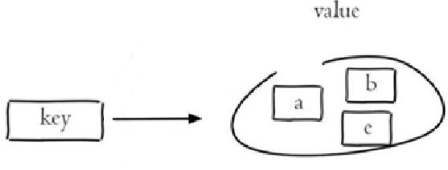 


### 3.5 有序集合操作命令

Redis有序集合是string类型元素的集合，且不允许有重复成员。每个元素都会关联一个double类型的分数。常用命令：

常用命令：

- **ZADD** key score1 member1 [score2 member2]     向有序集合添加一个或多个成员
- **ZRANGE** key start stop [WITHSCORES]                     通过索引区间返回有序集合中指定区间内的成员
- **ZINCRBY** key increment member                              有序集合中对指定成员的分数加上增量 increment
- **ZREM** key member [member ...]                                移除有序集合中的一个或多个成员

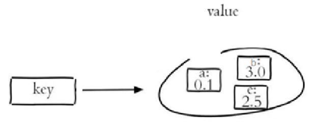 


### 3.6 通用命令

Redis的通用命令是不分数据类型的，都可以使用的命令：

- KEYS pattern 		查找所有符合给定模式( pattern)的 key 
- EXISTS key 		检查给定 key 是否存在
- TYPE key 		返回 key 所储存的值的类型
- DEL key 		该命令用于在 key 存在是删除 key


## 4.在Java中操作Redis

### 4.1 Redis的Java客户端

前面我们讲解了Redis的常用命令，这些命令是我们操作Redis的基础，那么我们在java程序中应该如何操作Redis呢？这就需要使用Redis的Java客户端，就如同我们使用JDBC操作MySQL数据库一样。

Redis 的 Java 客户端很多，常用的几种：

- Jedis
- Lettuce
- Spring Data Redis

Spring 对 Redis 客户端进行了整合，提供了 Spring Data Redis，在Spring Boot项目中还提供了对应的Starter，即 spring-boot-starter-data-redis。

我们重点学习**Spring Data Redis**。


### 4.2 Spring Data Redis使用方式

#### 4.2.1 介绍

Spring Data Redis 是 Spring 的一部分，提供了在 Spring 应用中通过简单的配置就可以访问 Redis 服务，对 Redis 底层开发包进行了高度封装。在 Spring 项目中，可以使用Spring Data Redis来简化 Redis 操作。

网址：https://spring.io/projects/spring-data-redis

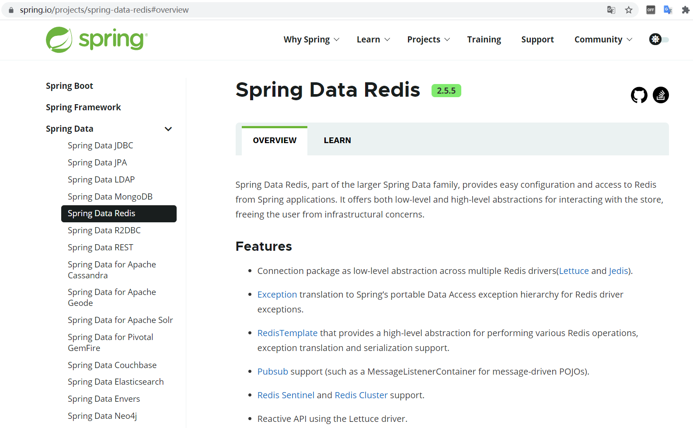 

Spring Boot提供了对应的Starter，maven坐标：

```xml
<dependency>
	<groupId>org.springframework.boot</groupId>
	<artifactId>spring-boot-starter-data-redis</artifactId>
</dependency>
```

Spring Data Redis中提供了一个高度封装的类：**RedisTemplate**，对相关api进行了归类封装,将同一类型操作封装为operation接口，具体分类如下：

- ValueOperations：string数据操作
- SetOperations：set类型数据操作
- ZSetOperations：zset类型数据操作
- HashOperations：hash类型的数据操作
- ListOperations：list类型的数据操作


#### 4.2.2 环境搭建

进入到sky-server模块

**1). 导入Spring Data Redis的maven坐标(已完成)**

```xml
<dependency>
     <groupId>org.springframework.boot</groupId>
     <artifactId>spring-boot-starter-data-redis</artifactId>
</dependency>
```


**2). 配置Redis数据源**

在application-dev.yml中添加

```yaml
sky:
  redis:
    host: localhost
    port: 6379
    password: 123456
    database: 10
```

**解释说明：**

database:指定使用Redis的哪个数据库，Redis服务启动后默认有16个数据库，编号分别是从0到15。

可以通过修改Redis配置文件来指定数据库的数量。

在application.yml中添加读取application-dev.yml中的相关Redis配置

```yaml
spring:
  profiles:
    active: dev
  redis:
    host: ${sky.redis.host}
    port: ${sky.redis.port}
    password: ${sky.redis.password}
    database: ${sky.redis.database}
```


**3). 编写配置类，创建RedisTemplate对象**

```java
package com.sky.config;

import lombok.extern.slf4j.Slf4j;
import org.springframework.context.annotation.Bean;
import org.springframework.context.annotation.Configuration;
import org.springframework.data.redis.connection.RedisConnectionFactory;
import org.springframework.data.redis.core.RedisTemplate;
import org.springframework.data.redis.serializer.StringRedisSerializer;

@Configuration
@Slf4j
public class RedisConfiguration {

    @Bean
    public RedisTemplate redisTemplate(RedisConnectionFactory redisConnectionFactory){
        log.info("开始创建redis模板对象...");
        RedisTemplate redisTemplate = new RedisTemplate();
        //设置redis的连接工厂对象
        redisTemplate.setConnectionFactory(redisConnectionFactory);
        //设置redis key的序列化器
        redisTemplate.setKeySerializer(new StringRedisSerializer());
        return redisTemplate;
    }
}
```

**解释说明：**

当前配置类不是必须的，因为 Spring Boot 框架会自动装配 RedisTemplate 对象，但是默认的key序列化器为

JdkSerializationRedisSerializer，导致我们存到Redis中后的数据和原始数据有差别，故设置为

StringRedisSerializer序列化器。


**4). 通过RedisTemplate对象操作Redis**

在test下新建测试类

```java
package com.sky.test;

import org.junit.jupiter.api.Test;
import org.springframework.beans.factory.annotation.Autowired;
import org.springframework.boot.test.context.SpringBootTest;
import org.springframework.data.redis.core.*;

@SpringBootTest
public class SpringDataRedisTest {
    @Autowired
    private RedisTemplate redisTemplate;

    @Test
    public void testRedisTemplate(){
        System.out.println(redisTemplate);
        //string数据操作
        ValueOperations valueOperations = redisTemplate.opsForValue();
        //hash类型的数据操作
        HashOperations hashOperations = redisTemplate.opsForHash();
        //list类型的数据操作
        ListOperations listOperations = redisTemplate.opsForList();
        //set类型数据操作
        SetOperations setOperations = redisTemplate.opsForSet();
        //zset类型数据操作
        ZSetOperations zSetOperations = redisTemplate.opsForZSet();
    }
}
```

测试：

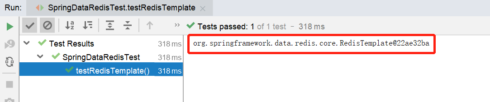 

说明RedisTemplate对象注入成功，并且通过该RedisTemplate对象获取操作5种数据类型相关对象。

上述环境搭建完毕后，接下来，我们就来具体对常见5种数据类型进行操作。


#### 4.2.3 操作常见类型数据

**1). 操作字符串类型数据**

```java
	/**
     * 操作字符串类型的数据
     */
    @Test
    public void testString(){
        // set get setex setnx
        redisTemplate.opsForValue().set("name","小明");
        String city = (String) redisTemplate.opsForValue().get("name");
        System.out.println(city);
        redisTemplate.opsForValue().set("code","1234",3, TimeUnit.MINUTES);
        redisTemplate.opsForValue().setIfAbsent("lock","1");
        redisTemplate.opsForValue().setIfAbsent("lock","2");
    }
```


**2). 操作哈希类型数据**

```java
	/**
     * 操作哈希类型的数据
     */
    @Test
    public void testHash(){
        //hset hget hdel hkeys hvals
        HashOperations hashOperations = redisTemplate.opsForHash();

        hashOperations.put("100","name","tom");
        hashOperations.put("100","age","20");

        String name = (String) hashOperations.get("100", "name");
        System.out.println(name);

        Set keys = hashOperations.keys("100");
        System.out.println(keys);

        List values = hashOperations.values("100");
        System.out.println(values);

        hashOperations.delete("100","age");
    }
```


**3). 操作列表类型数据**

```java
	/**
     * 操作列表类型的数据
     */
    @Test
    public void testList(){
        //lpush lrange rpop llen
        ListOperations listOperations = redisTemplate.opsForList();

        listOperations.leftPushAll("mylist","a","b","c");
        listOperations.leftPush("mylist","d");

        List mylist = listOperations.range("mylist", 0, -1);
        System.out.println(mylist);

        listOperations.rightPop("mylist");

        Long size = listOperations.size("mylist");
        System.out.println(size);
    }
```


**4). 操作集合类型数据**

```java
	/**
     * 操作集合类型的数据
     */
    @Test
    public void testSet(){
        //sadd smembers scard sinter sunion srem
        SetOperations setOperations = redisTemplate.opsForSet();

        setOperations.add("set1","a","b","c","d");
        setOperations.add("set2","a","b","x","y");

        Set members = setOperations.members("set1");
        System.out.println(members);

        Long size = setOperations.size("set1");
        System.out.println(size);

        Set intersect = setOperations.intersect("set1", "set2");
        System.out.println(intersect);

        Set union = setOperations.union("set1", "set2");
        System.out.println(union);

        setOperations.remove("set1","a","b");
    }
```


**5). 操作有序集合类型数据**

```java
	/**
     * 操作有序集合类型的数据
     */
    @Test
    public void testZset(){
        //zadd zrange zincrby zrem
        ZSetOperations zSetOperations = redisTemplate.opsForZSet();

        zSetOperations.add("zset1","a",10);
        zSetOperations.add("zset1","b",12);
        zSetOperations.add("zset1","c",9);

        Set zset1 = zSetOperations.range("zset1", 0, -1);
        System.out.println(zset1);

        zSetOperations.incrementScore("zset1","c",10);

        zSetOperations.remove("zset1","a","b");
    }
```


**6). 通用命令操作**

```java
	/**
     * 通用命令操作
     */
    @Test
    public void testCommon(){
        //keys exists type del
        Set keys = redisTemplate.keys("*");
        System.out.println(keys);

        Boolean name = redisTemplate.hasKey("name");
        Boolean set1 = redisTemplate.hasKey("set1");

        for (Object key : keys) {
            DataType type = redisTemplate.type(key);
            System.out.println(type.name());
        }

        redisTemplate.delete("mylist");
    }
```


## 5. 店铺营业状态设置

### 5.1 需求分析和设计

#### 5.1.1 产品原型

进到苍穹外卖后台，显示餐厅的营业状态，营业状态分为**营业中**和**打烊中**，若当前餐厅处于营业状态，自动接收任何订单，客户可在小程序进行下单操作；若当前餐厅处于打烊状态，不接受任何订单，客户便无法在小程序进行下单操作。

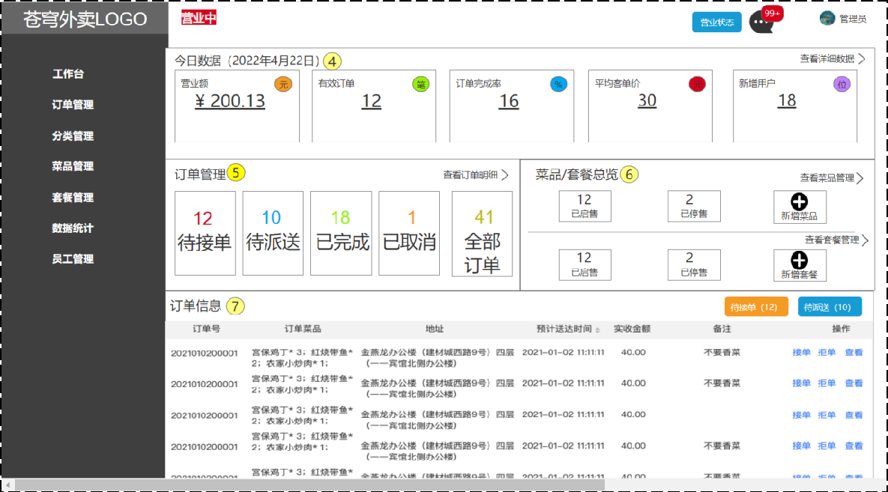 

点击**营业状态**按钮时，弹出更改营业状态

 

选择营业，设置餐厅为**营业中**状态

选择打烊，设置餐厅为**打烊中**状态

**状态说明：**

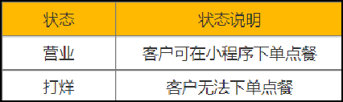 


#### 5.1.2 接口设计

根据上述原型图设计接口，共包含3个接口。

**接口设计：**

- 设置营业状态
- 管理端查询营业状态
- 用户端查询营业状态

**注：**从技术层面分析，其实管理端和用户端查询营业状态时，可通过一个接口去实现即可。因为营业状态是一致的。但是，本项目约定：

- **管理端**发出的请求，统一使用/admin作为前缀。
- **用户端**发出的请求，统一使用/user作为前缀。

因为访问路径不一致，故分为两个接口实现。

**1). 设置营业状态**

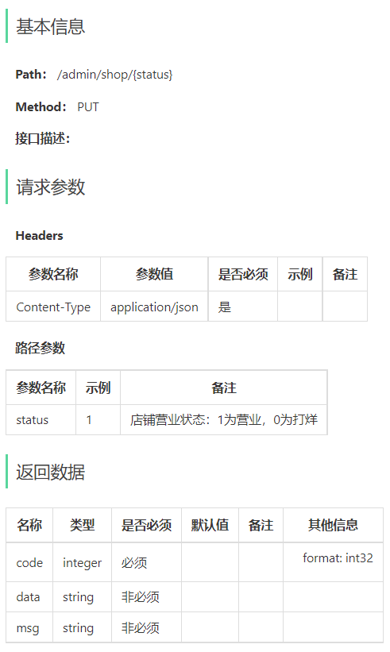 


**2). 管理端营业状态**

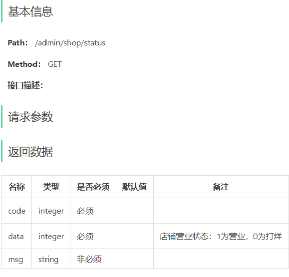 


**3). 用户端营业状态**

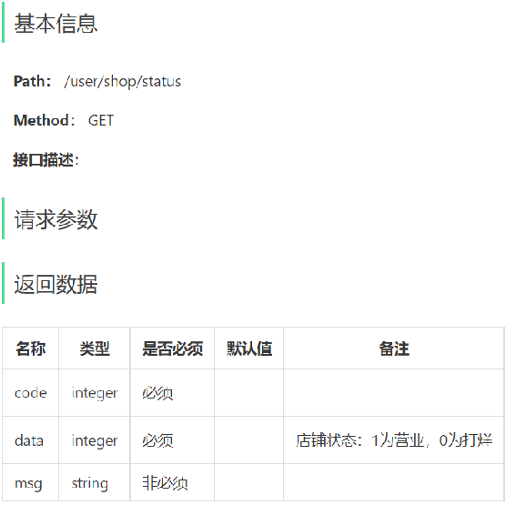 


#### 5.1.3 营业状态存储方式

虽然，可以通过一张表来存储营业状态数据，但整个表中只有一个字段，所以意义不大。

营业状态数据存储方式：基于Redis的字符串来进行存储

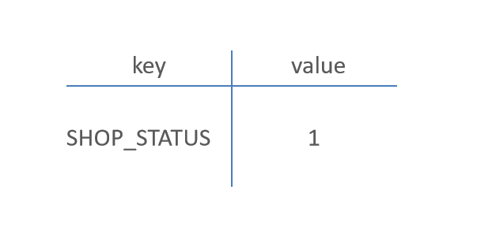 

**约定：**1表示营业 0表示打烊


### 5.2 代码开发

#### 5.2.1 设置营业状态

在sky-server模块中，创建ShopController.java

**根据接口定义创建ShopController的setStatus设置营业状态方法：**

```java
package com.sky.controller.admin;

import com.sky.result.Result;
import io.swagger.annotations.Api;
import io.swagger.annotations.ApiOperation;
import lombok.extern.slf4j.Slf4j;
import org.springframework.beans.factory.annotation.Autowired;
import org.springframework.data.redis.core.RedisTemplate;
import org.springframework.web.bind.annotation.PathVariable;
import org.springframework.web.bind.annotation.PutMapping;
import org.springframework.web.bind.annotation.RequestMapping;
import org.springframework.web.bind.annotation.RestController;

@RestController("adminShopController")
@RequestMapping("/admin/shop")
@Api(tags = "店铺相关接口")
@Slf4j
public class ShopController {

    public static final String KEY = "SHOP_STATUS";

    @Autowired
    private RedisTemplate redisTemplate;

    /**
     * 设置店铺的营业状态
     * @param status
     * @return
     */
    @PutMapping("/{status}")
    @ApiOperation("设置店铺的营业状态")
    public Result setStatus(@PathVariable Integer status){
        log.info("设置店铺的营业状态为：{}",status == 1 ? "营业中" : "打烊中");
        redisTemplate.opsForValue().set(KEY,status);
        return Result.success();
    }
}
```


#### 5.2.2 管理端查询营业状态

**根据接口定义创建ShopController的getStatus查询营业状态方法：**

```java
	/**
     * 获取店铺的营业状态
     * @return
     */
    @GetMapping("/status")
    @ApiOperation("获取店铺的营业状态")
    public Result<Integer> getStatus(){
        Integer status = (Integer) redisTemplate.opsForValue().get(KEY);
        log.info("获取到店铺的营业状态为：{}",status == 1 ? "营业中" : "打烊中");
        return Result.success(status);
    }
```


#### 5.2.3 用户端查询营业状态

创建com.sky.controller.user包，在该包下创建ShopController.java

**根据接口定义创建ShopController的getStatus查询营业状态方法：**

```java
package com.sky.controller.user;

import com.sky.result.Result;
import io.swagger.annotations.Api;
import io.swagger.annotations.ApiOperation;
import lombok.extern.slf4j.Slf4j;
import org.springframework.beans.factory.annotation.Autowired;
import org.springframework.data.redis.core.RedisTemplate;
import org.springframework.web.bind.annotation.*;

@RestController("userShopController")
@RequestMapping("/user/shop")
@Api(tags = "店铺相关接口")
@Slf4j
public class ShopController {

    public static final String KEY = "SHOP_STATUS";

    @Autowired
    private RedisTemplate redisTemplate;

    /**
     * 获取店铺的营业状态
     * @return
     */
    @GetMapping("/status")
    @ApiOperation("获取店铺的营业状态")
    public Result<Integer> getStatus(){
        Integer status = (Integer) redisTemplate.opsForValue().get(KEY);
        log.info("获取到店铺的营业状态为：{}",status == 1 ? "营业中" : "打烊中");
        return Result.success(status);
    }
}
```


### 5.3 功能测试

#### 5.3.1 接口文档测试

**启动服务：**访问http://localhost:8080/doc.html，打开店铺相关接口

**注意：**使用admin用户登录重新获取token，防止token失效。

**设置营业状态：**

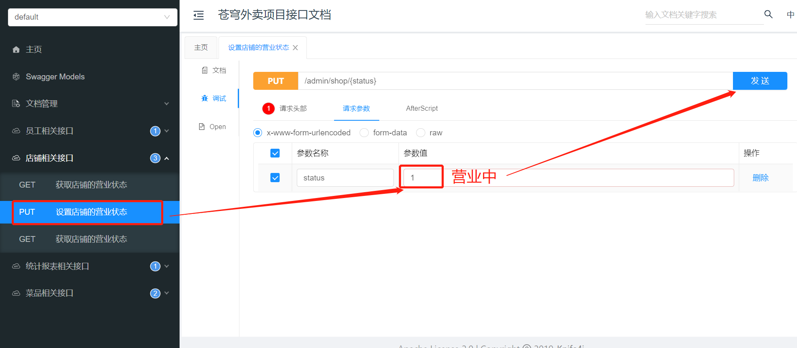 

点击发送

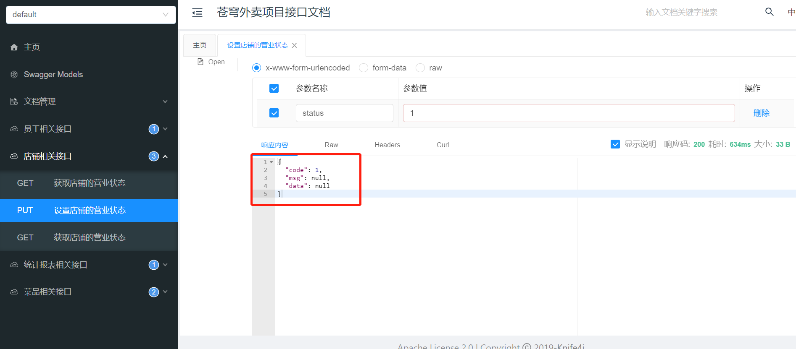 

查看Idea控制台日志

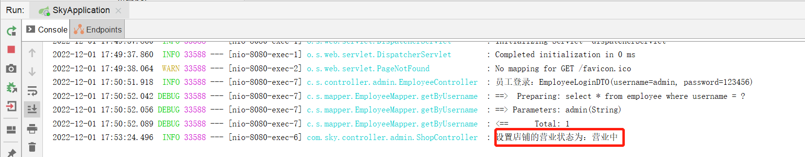 

查看Redis中数据

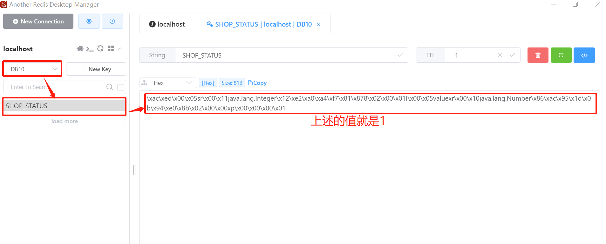 


**管理端查询营业状态：**

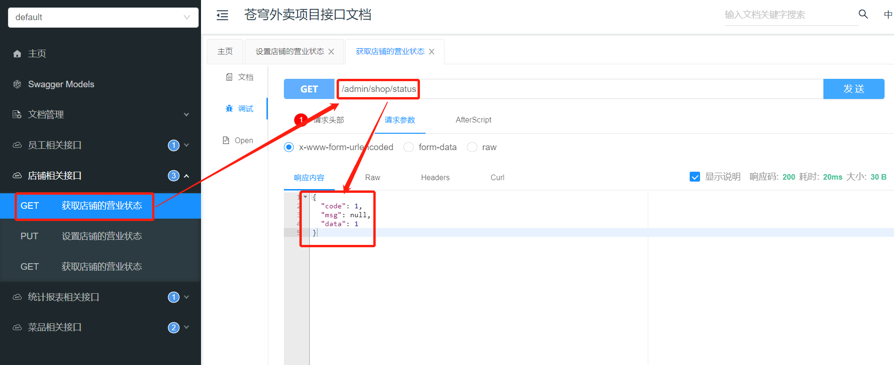 


**用户端查询营业状态：**

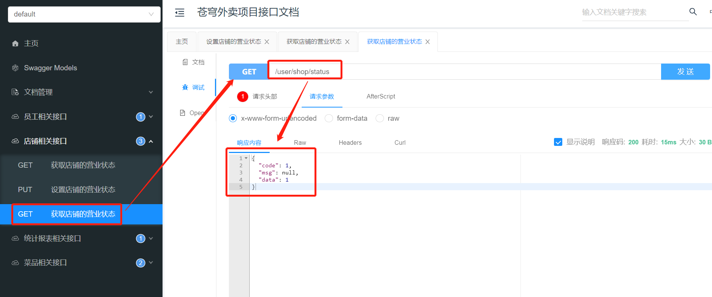 


#### 5.3.2 接口分组展示

在上述接口文档测试中，管理端和用户端的接口放在一起，不方便区分。

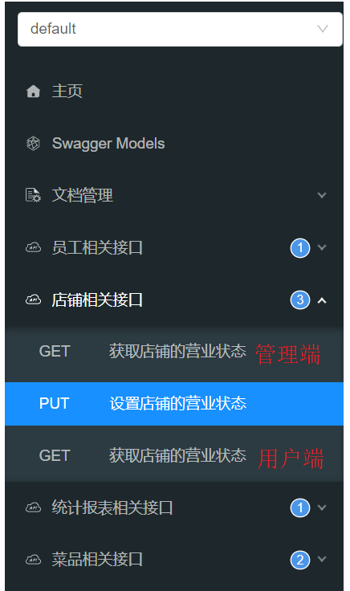 

接下来，我们要实现管理端和用户端接口进行区分。

在WebMvcConfiguration.java中，分别扫描"com.sky.controller.admin"和"com.sky.controller.user"这两个包。

```java
	@Bean
    public Docket docket1(){
        log.info("准备生成接口文档...");
        ApiInfo apiInfo = new ApiInfoBuilder()
                .title("苍穹外卖项目接口文档")
                .version("2.0")
                .description("苍穹外卖项目接口文档")
                .build();

        Docket docket = new Docket(DocumentationType.SWAGGER_2)
                .groupName("管理端接口")
                .apiInfo(apiInfo)
                .select()
                //指定生成接口需要扫描的包
                .apis(RequestHandlerSelectors.basePackage("com.sky.controller.admin"))
                .paths(PathSelectors.any())
                .build();

        return docket;
    }

    @Bean
    public Docket docket2(){
        log.info("准备生成接口文档...");
        ApiInfo apiInfo = new ApiInfoBuilder()
                .title("苍穹外卖项目接口文档")
                .version("2.0")
                .description("苍穹外卖项目接口文档")
                .build();

        Docket docket = new Docket(DocumentationType.SWAGGER_2)
                .groupName("用户端接口")
                .apiInfo(apiInfo)
                .select()
                //指定生成接口需要扫描的包
                .apis(RequestHandlerSelectors.basePackage("com.sky.controller.user"))
                .paths(PathSelectors.any())
                .build();

        return docket;
    }
```

重启服务器，再次访问接口文档，可进行选择**用户端接口**或者**管理端接口**

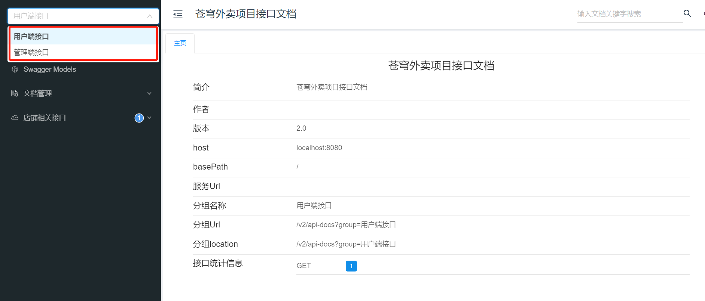 


#### 5.3.3 前后端联调测试

启动nginx,访问 http://localhost

进入后台，状态为**营业中**

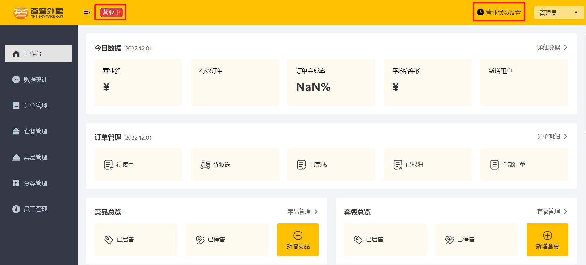 

点击**营业状态设置**，修改状态为**打烊中**

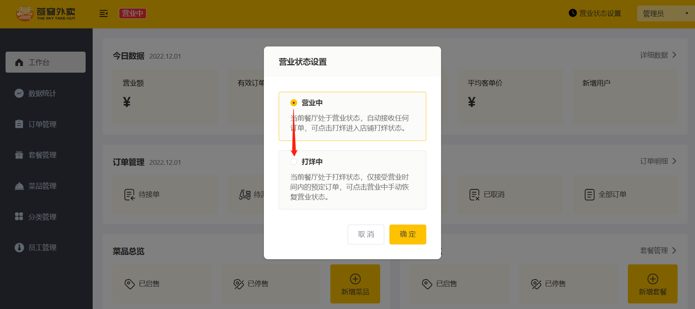 

再次查看状态，状态已为**打烊中**

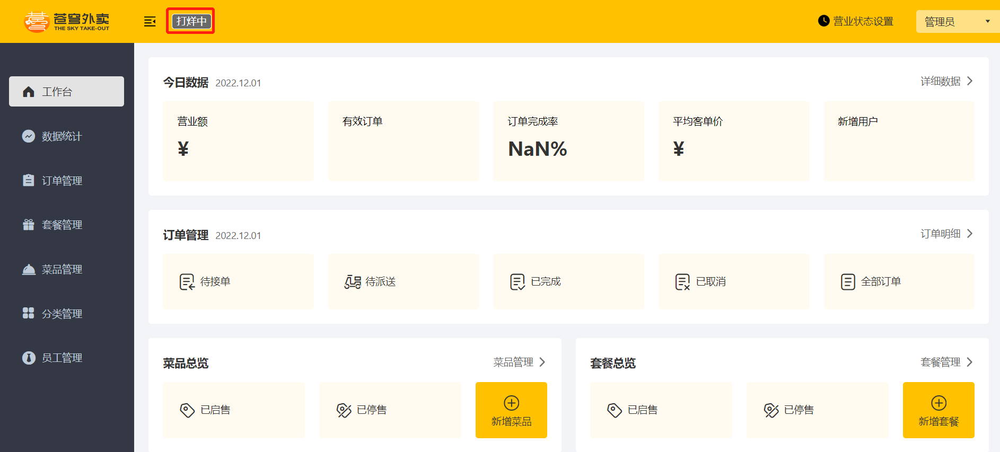 


### 5.4 代码提交

**点击提交：**

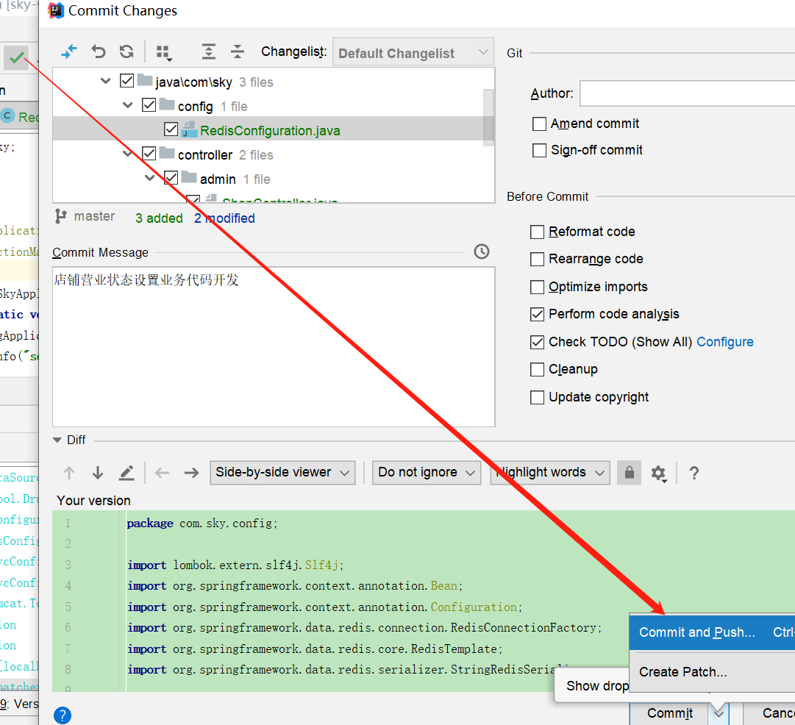 

**提交过程中**，出现提示：

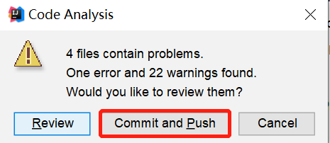  

**继续push:**

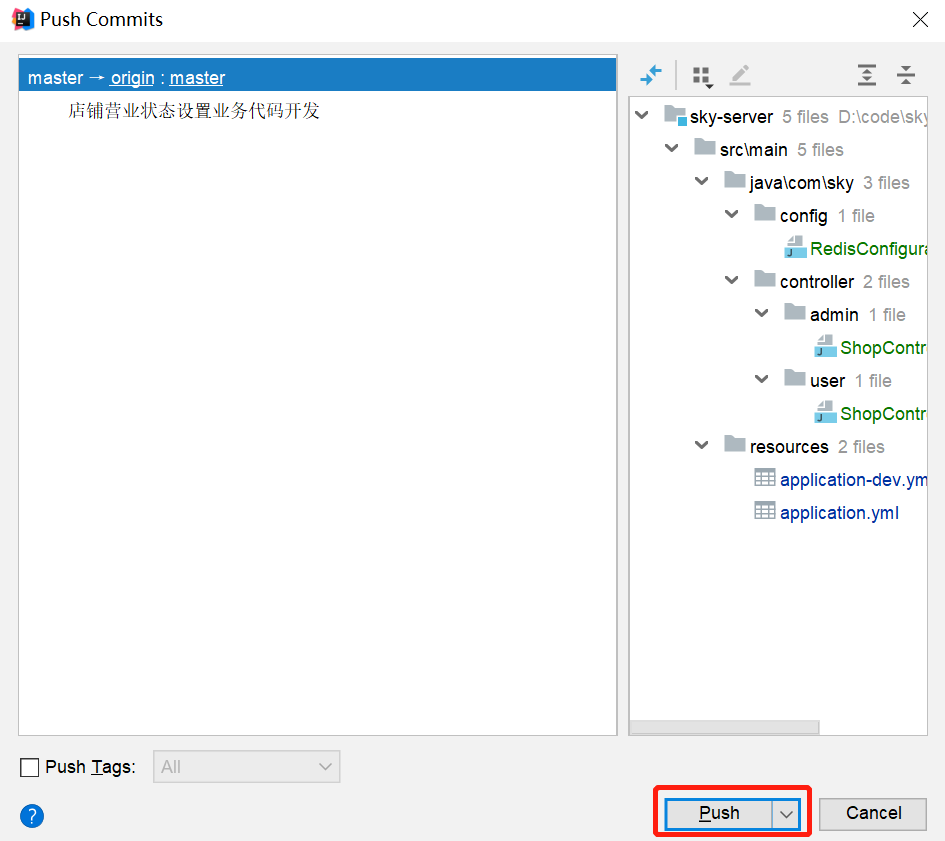 

**推送成功：**

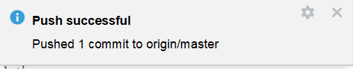 

