# 苍穹外卖-day06

## 课程内容

- HttpClient
- 微信小程序开发
- 微信登录
- 导入商品浏览功能代码


功能实现：**微信登录**、**商品浏览**

**微信登录效果图：**

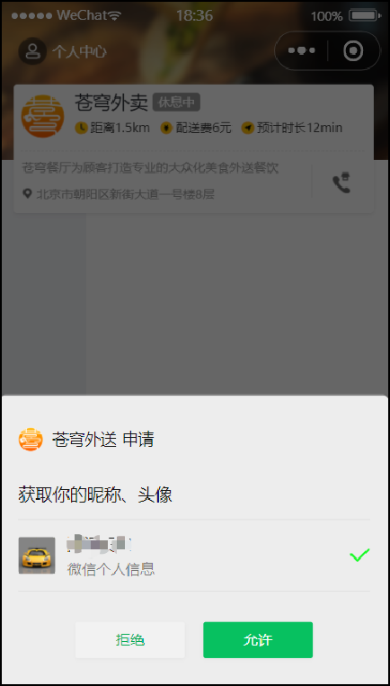 


**商品浏览效果图：**

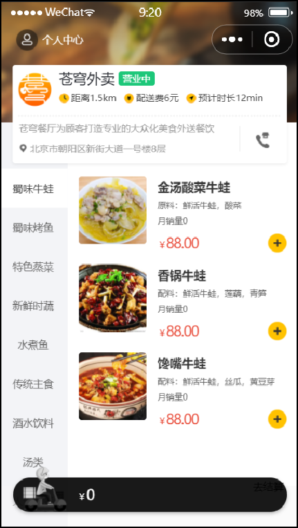 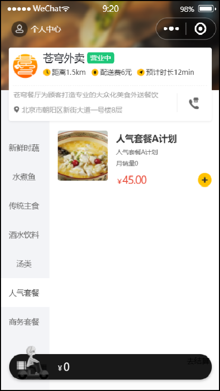 


## 1. HttpClient

### 1.1 介绍

HttpClient 是Apache Jakarta Common 下的子项目，可以用来提供高效的、最新的、功能丰富的支持 HTTP 协议的客户端编程工具包，并且它支持 HTTP 协议最新的版本和建议。

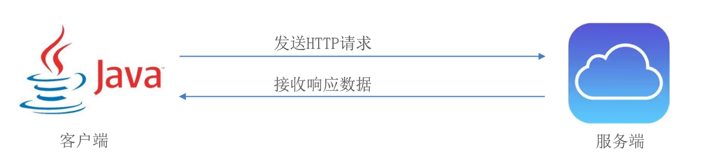 

**HttpClient作用：**

- 发送HTTP请求
- 接收响应数据

  为什么要在Java程序中发送Http请求？有哪些应用场景呢？

**HttpClient应用场景：**

当我们在使用扫描支付、查看地图、获取验证码、查看天气等功能时

        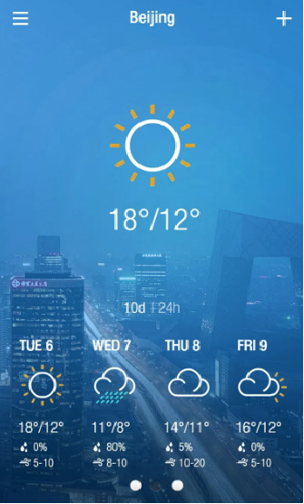 


其实，应用程序本身并未实现这些功能，都是在应用程序里访问提供这些功能的服务，访问这些服务需要发送HTTP请求，并且接收响应数据，可通过HttpClient来实现。

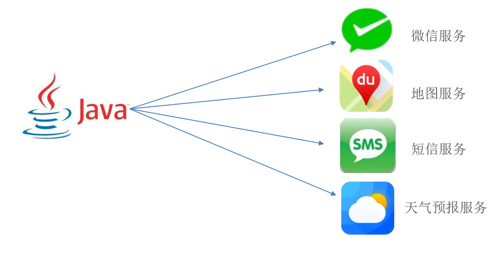 

**HttpClient的maven坐标：**

```xml
<dependency>
	<groupId>org.apache.httpcomponents</groupId>
	<artifactId>httpclient</artifactId>
	<version>4.5.13</version>
</dependency>
```

**HttpClient的核心API：**

- HttpClient：Http客户端对象类型，使用该类型对象可发起Http请求。
- HttpClients：可认为是构建器，可创建HttpClient对象。
- CloseableHttpClient：实现类，实现了HttpClient接口。
- HttpGet：Get方式请求类型。
- HttpPost：Post方式请求类型。

**HttpClient发送请求步骤：**

- 创建HttpClient对象
- 创建Http请求对象
- 调用HttpClient的execute方法发送请求


### 1.2 入门案例

对HttpClient编程工具包有了一定了解后，那么，我们使用HttpClient在Java程序当中来构造Http的请求，并且把请求发送出去，接下来，就通过入门案例分别发送**GET请求**和**POST请求**，具体来学习一下它的使用方法。

#### 1.2.1 GET方式请求

正常来说，首先，应该导入HttpClient相关的坐标，但在项目中，就算不导入，也可以使用相关的API。

因为在项目中已经引入了aliyun-sdk-oss坐标：

```xml
<dependency>
    <groupId>com.aliyun.oss</groupId>
    <artifactId>aliyun-sdk-oss</artifactId>
</dependency>
```

上述依赖的底层已经包含了HttpClient相关依赖。

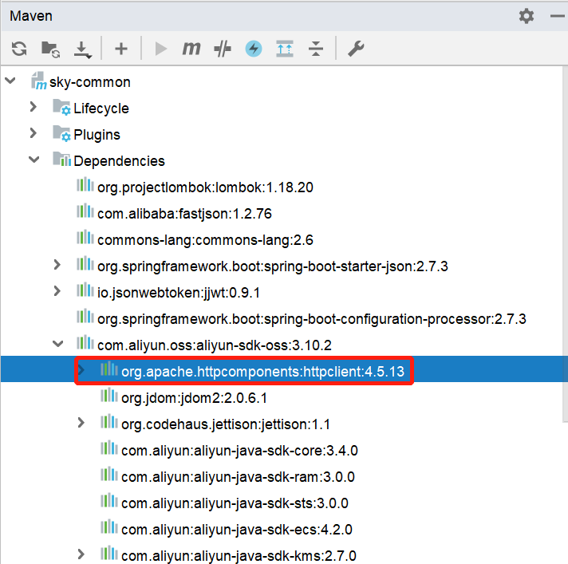 

故选择导入或者不导入均可。

进入到sky-server模块，编写测试代码，发送GET请求。

**实现步骤：**

1. 创建HttpClient对象
2. 创建请求对象
3. 发送请求，接受响应结果
4. 解析结果
5. 关闭资源

```java
package com.sky.test;

import org.apache.http.HttpEntity;
import org.apache.http.client.methods.CloseableHttpResponse;
import org.apache.http.client.methods.HttpGet;
import org.apache.http.impl.client.CloseableHttpClient;
import org.apache.http.impl.client.HttpClients;
import org.apache.http.util.EntityUtils;
import org.junit.jupiter.api.Test;
import org.springframework.boot.test.context.SpringBootTest;

@SpringBootTest
public class HttpClientTest {

    /**
     * 测试通过httpclient发送GET方式的请求
     */
    @Test
    public void testGET() throws Exception{
        //创建httpclient对象
        CloseableHttpClient httpClient = HttpClients.createDefault();

        //创建请求对象
        HttpGet httpGet = new HttpGet("http://localhost:8080/user/shop/status");

        //发送请求，接受响应结果
        CloseableHttpResponse response = httpClient.execute(httpGet);

        //获取服务端返回的状态码
        int statusCode = response.getStatusLine().getStatusCode();
        System.out.println("服务端返回的状态码为：" + statusCode);

        HttpEntity entity = response.getEntity();
        String body = EntityUtils.toString(entity);
        System.out.println("服务端返回的数据为：" + body);

        //关闭资源
        response.close();
        httpClient.close();
    }
}
```

在访问http://localhost:8080/user/shop/status请求时，需要提前启动项目。

**测试结果：**

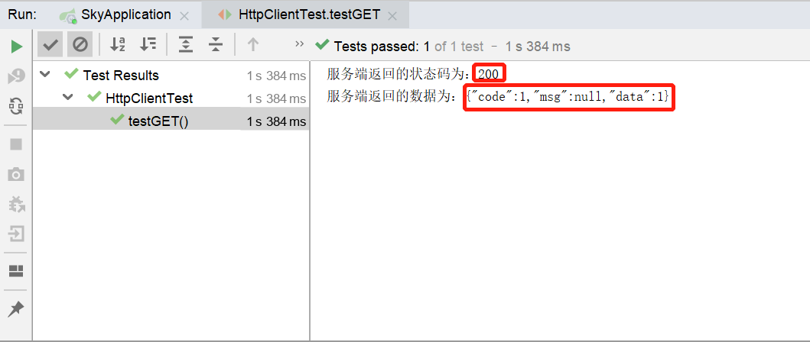 


#### 1.2.2 POST方式请求

在HttpClientTest中添加POST方式请求方法，相比GET请求来说，POST请求若携带参数需要封装请求体对象，并将该对象设置在请求对象中。

**实现步骤：**

1. 创建HttpClient对象
2. 创建请求对象
3. 发送请求，接收响应结果
4. 解析响应结果
5. 关闭资源

```java
	/**
     * 测试通过httpclient发送POST方式的请求
     */
    @Test
    public void testPOST() throws Exception{
        // 创建httpclient对象
        CloseableHttpClient httpClient = HttpClients.createDefault();

        //创建请求对象
        HttpPost httpPost = new HttpPost("http://localhost:8080/admin/employee/login");

        JSONObject jsonObject = new JSONObject();
        jsonObject.put("username","admin");
        jsonObject.put("password","123456");

        StringEntity entity = new StringEntity(jsonObject.toString());
        //指定请求编码方式
        entity.setContentEncoding("utf-8");
        //数据格式
        entity.setContentType("application/json");
        httpPost.setEntity(entity);

        //发送请求
        CloseableHttpResponse response = httpClient.execute(httpPost);

        //解析返回结果
        int statusCode = response.getStatusLine().getStatusCode();
        System.out.println("响应码为：" + statusCode);

        HttpEntity entity1 = response.getEntity();
        String body = EntityUtils.toString(entity1);
        System.out.println("响应数据为：" + body);

        //关闭资源
        response.close();
        httpClient.close();
    }
```

**测试结果：**

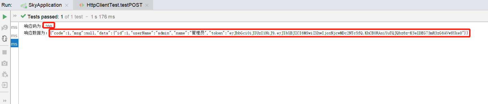 


## 2. 微信小程序开发

### 2.1 介绍

小程序是一种新的开放能力，开发者可以快速地开发一个小程序。可以在微信内被便捷地获取和传播，同时具有出色的使用体验。

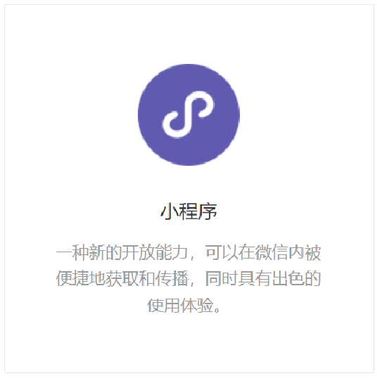 

**官方网址：**https://mp.weixin.qq.com/cgi-bin/wx?token=&lang=zh_CN

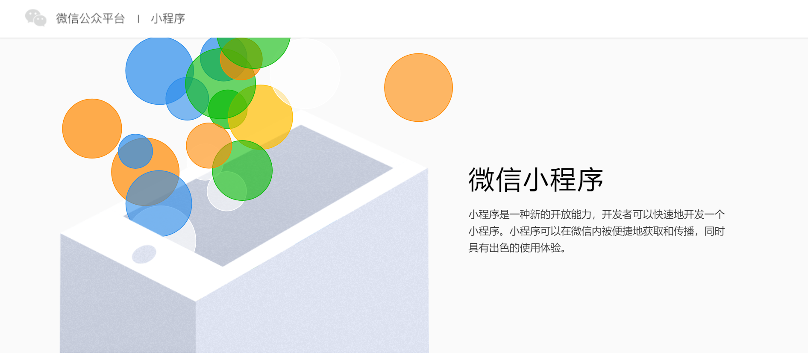 

小程序主要运行微信内部，可通过上述网站来整体了解微信小程序的开发。

**首先，**在进行小程序开发时，需要先去注册一个小程序，在注册的时候，它实际上又分成了不同的注册的主体。我们可以以个人的身份来注册一个小程序，当然，也可以以企业政府、媒体或者其他组织的方式来注册小程序。那么，不同的主体注册小程序，最终开放的权限也是不一样的。比如以个人身份来注册小程序，是无法开通支付权限的。若要提供支付功能，必须是企业、政府或者其它组织等。所以，不同的主体注册小程序后，可开发的功能是不一样的。

 


**然后，**微信小程序我们提供的一些开发的支持，实际上微信的官方是提供了一系列的工具来帮助开发者快速的接入
并且完成小程序的开发，提供了完善的开发文档，并且专门提供了一个开发者工具，还提供了相应的设计指南，同时也提供了一些小程序体验DEMO，可以快速的体验小程序实现的功能。

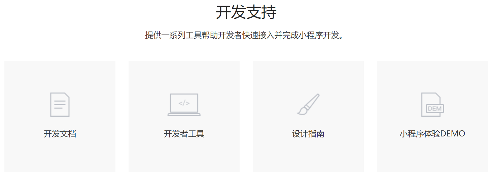 

**最后，**开发完一个小程序要上线，也给我们提供了详细地接入流程。

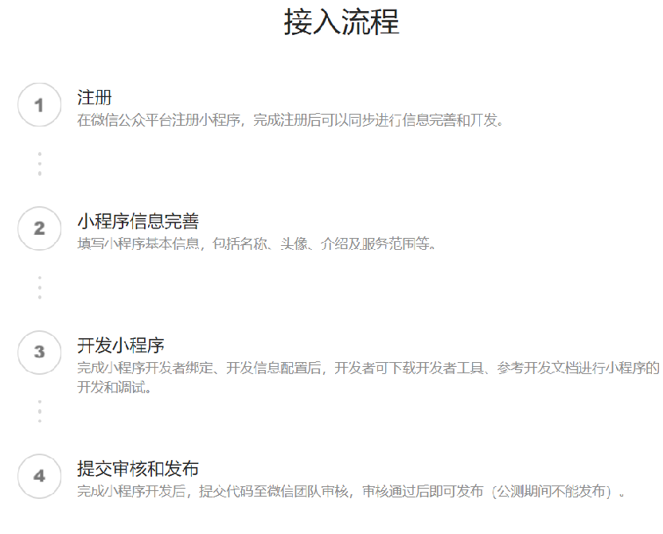 


### 2.2 准备工作

开发微信小程序之前需要做如下准备工作：

- 注册小程序
- 完善小程序信息
- 下载开发者工具

**1). 注册小程序**

注册地址：https://mp.weixin.qq.com/wxopen/waregister?action=step1

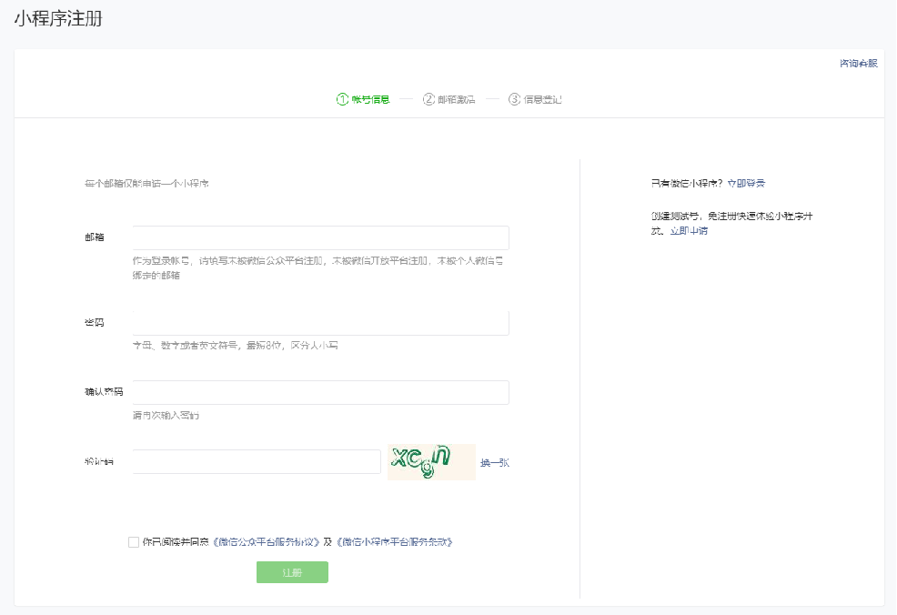 


**2). 完善小程序信息**

登录小程序后台：https://mp.weixin.qq.com/

两种登录方式选其一即可

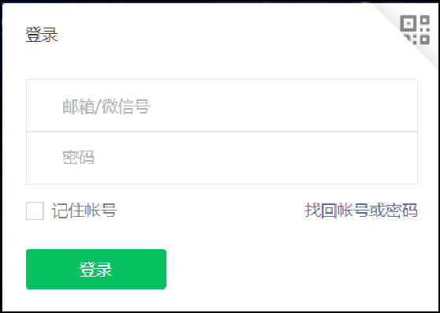 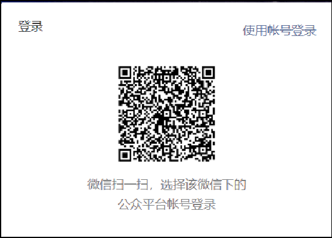 

完善小程序信息、小程序类目

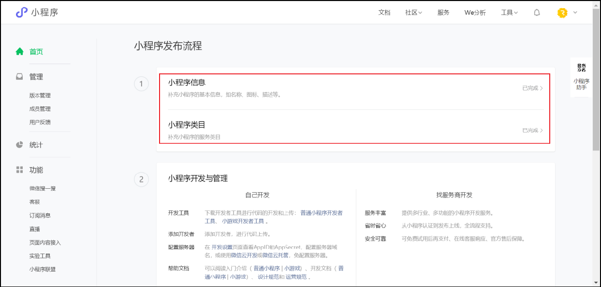 

查看小程序的 AppID

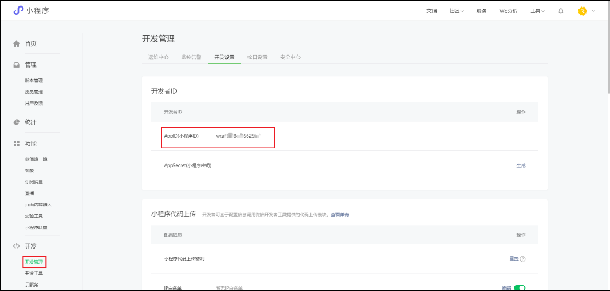 


**3). 下载开发者工具**

资料中已提供，无需下载，熟悉下载步骤即可。

下载地址： https://developers.weixin.qq.com/miniprogram/dev/devtools/stable.html

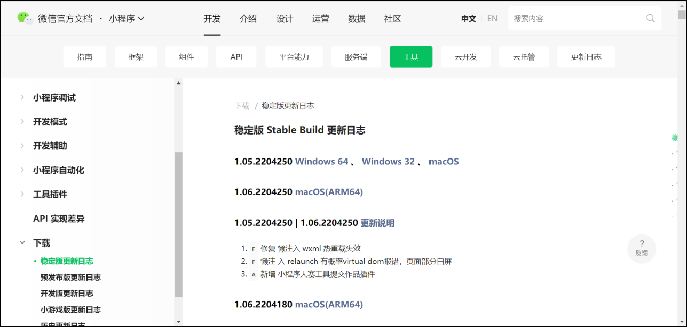 

扫描登录开发者工具

 

创建小程序项目

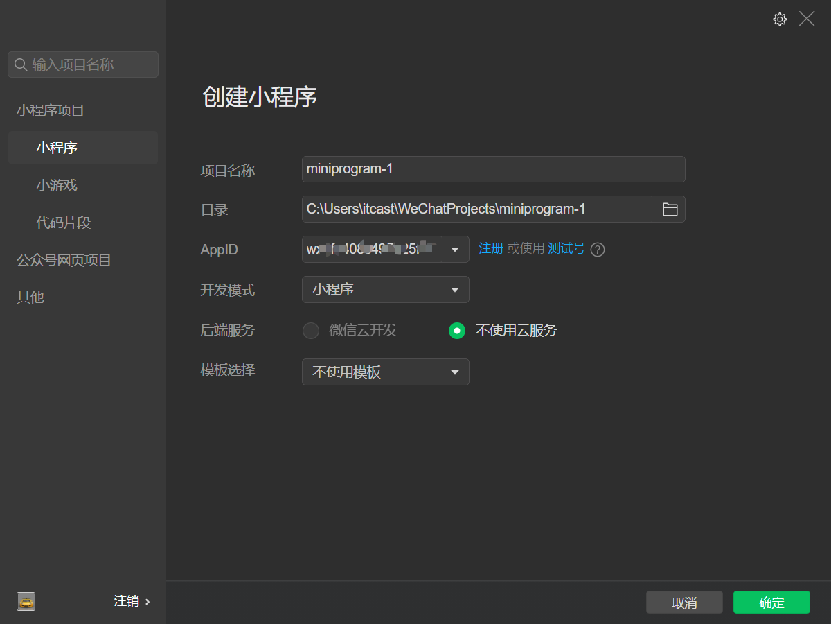 

熟悉开发者工具布局

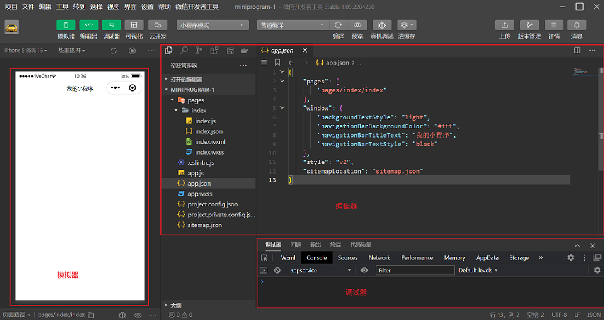 

设置不校验合法域名

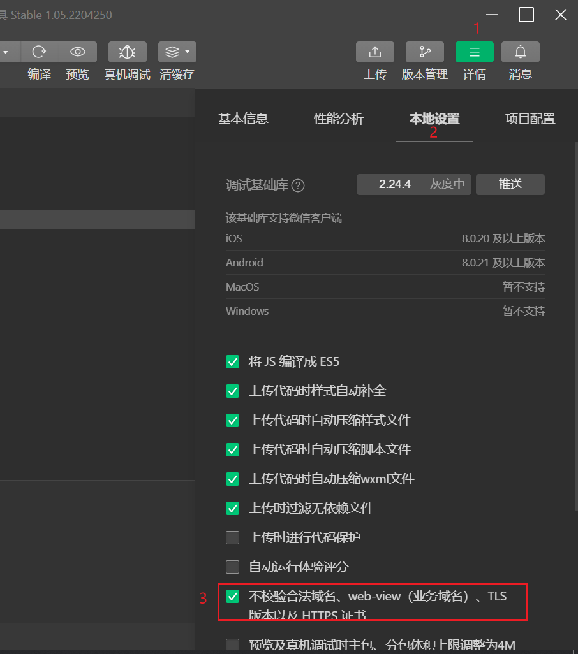 

**注：**开发阶段，小程序发出请求到后端的Tomcat服务器，若不勾选，请求发送失败。


### 2.3 入门案例

实际上，小程序的开发本质上属于前端开发，主要使用JavaScript开发，咱们现在的定位主要还是在后端，所以，对于小程序开发简单了解即可。

#### 2.3.1 小程序目录结构

小程序包含一个描述整体程序的 app 和多个描述各自页面的 page。一个小程序主体部分由三个文件组成，必须放在项目的根目录，如下：

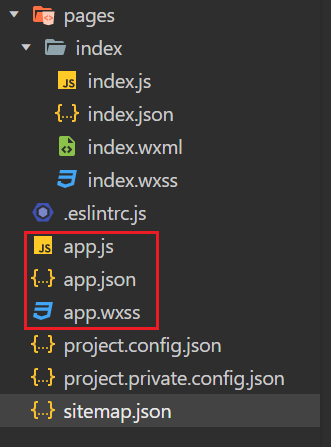 

**文件说明：**

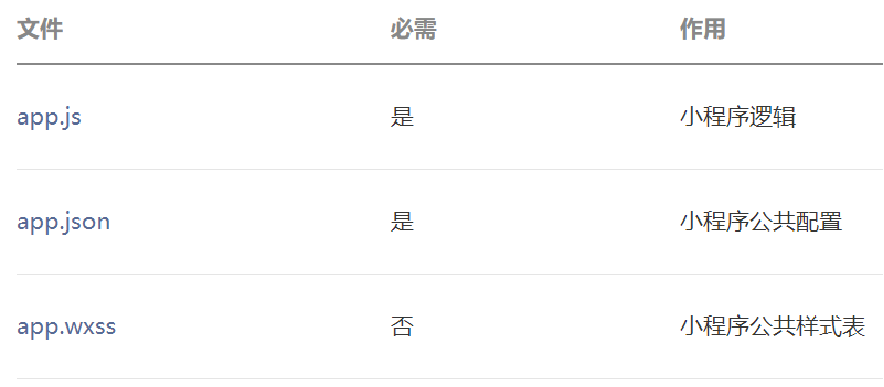 

**app.js：**必须存在，主要存放小程序的逻辑代码

**app.json：**必须存在，小程序配置文件，主要存放小程序的公共配置

**app.wxss:**  非必须存在，主要存放小程序公共样式表，类似于前端的CSS样式

对小程序主体三个文件了解后，其实一个小程序又有多个页面。比如说，有商品浏览页面、购物车的页面、订单支付的页面、商品的详情页面等等。那这些页面会放在哪呢？
会存放在pages目录。

每个小程序页面主要由四个文件组成：

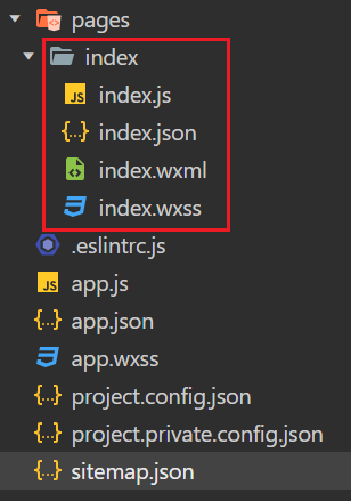 

**文件说明：**

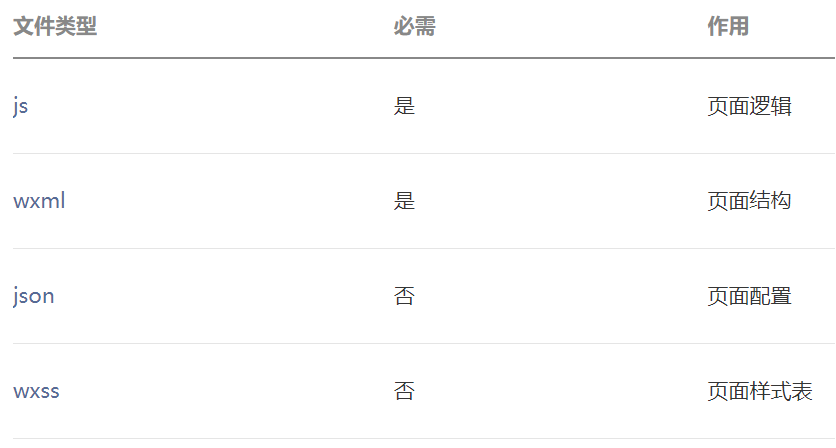 

**js文件：**必须存在，存放页面业务逻辑代码，编写的js代码。

**wxml文件：**必须存在，存放页面结构，主要是做页面布局，页面效果展示的，类似于HTML页面。

**json文件：**非必须，存放页面相关的配置。

**wxss文件：**非必须，存放页面样式表，相当于CSS文件。


#### 2.3.2 编写和编译小程序

**1). 编写**

进入到index.wxml，编写页面布局

```xml
<view class="container">
  <view>{{msg}}</view>
   <view>
    <button type="default" bindtap="getUserInfo">获取用户信息</button>
    <image style="width: 100px;height: 100px;" src="{{avatarUrl}}"></image>
    {{nickName}}
  </view>
   <view>
    <button type="primary" bindtap="wxlogin">微信登录</button>
    授权码：{{code}}
  </view>
   <view>
    <button type="warn" bindtap="sendRequest">发送请求</button>
    响应结果：{{result}}
  </view>
</view>
```

进入到index.js，编写业务逻辑代码

```javascript
Page({
  data:{
    msg:'hello world',
    avatarUrl:'',
    nickName:'',
    code:'',
    result:''
  },
  getUserInfo:function(){
    wx.getUserProfile({
      desc: '获取用户信息',
      success:(res) => {
        console.log(res)
        this.setData({
          avatarUrl:res.userInfo.avatarUrl,
          nickName:res.userInfo.nickName
        })
      }
    })
  },
  wxlogin:function(){
    wx.login({
      success: (res) => {
        console.log("授权码："+res.code)
        this.setData({
          code:res.code
        })
      }
    })
  },
  sendRequest:function(){
    wx.request({
      url: 'http://localhost:8080/user/shop/status',
      method:'GET',
      success:(res) => {
        console.log("响应结果：" + res.data.data)
        this.setData({
          result:res.data.data
        })
      }
    })
  }})
```


**2). 编译**

点击编译按钮

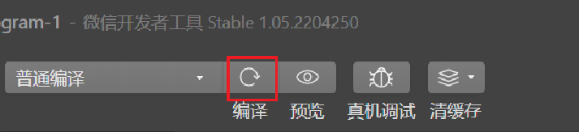 


**3). 运行效果**

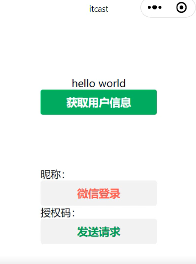 


点击**获取用户信息**

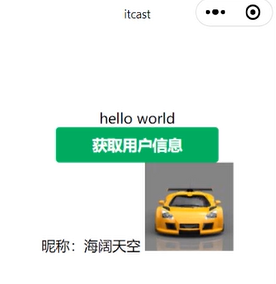 


点击**微信登录**

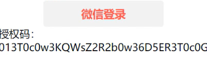 


点击**发送请求**

因为请求http://localhost:8080/user/shop/status，先要启动后台项目。

 

**注：**设置不校验合法域名，若不勾选，请求发送失败。


#### 2.3.3 发布小程序

小程序的代码都已经开发完毕，要将小程序发布上线，让所有的用户都能使用到这个小程序。

点击上传按钮：

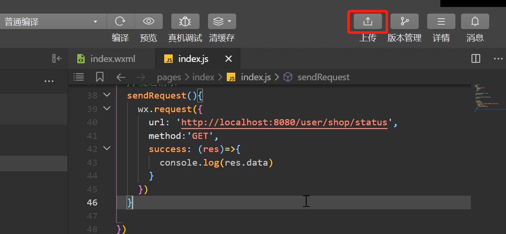 

指定版本号：

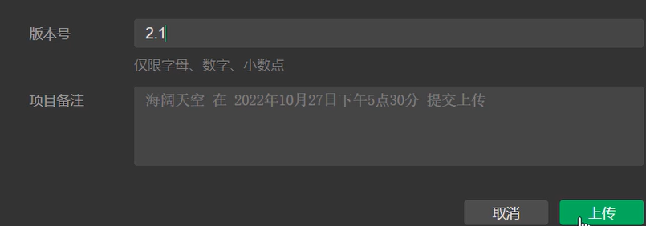 

上传成功：

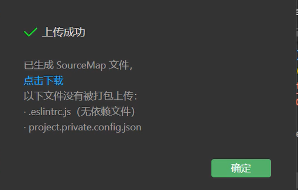 

把代码上传到微信服务器就表示小程序已经发布了吗？
**其实并不是。**当前小程序版本只是一个开发版本。

进到微信公众平台，打开版本管理页面。

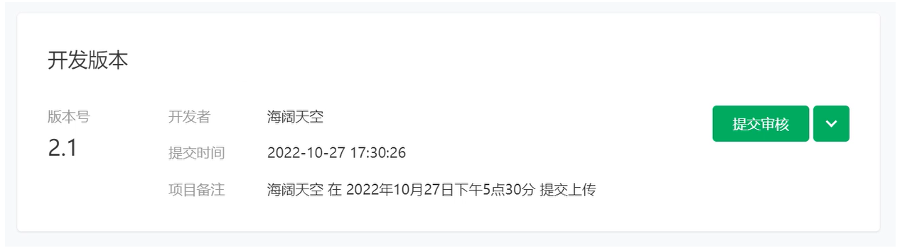 

需提交审核，变成审核版本，审核通过后，进行发布，变成线上版本。

一旦成为线上版本，这就说明小程序就已经发布上线了，微信用户就可以在微信里面去搜索和使用这个小程序了。


## 3. 微信登录

### 3.1 导入小程序代码

开发微信小程序，本质上是属于前端的开发，我们的重点其实还是后端代码开发。所以，小程序的代码已经提供好了，直接导入到微信开发者工具当中，直接来使用就可以了。

**1). 找到资料**

 


**2). 导入代码**

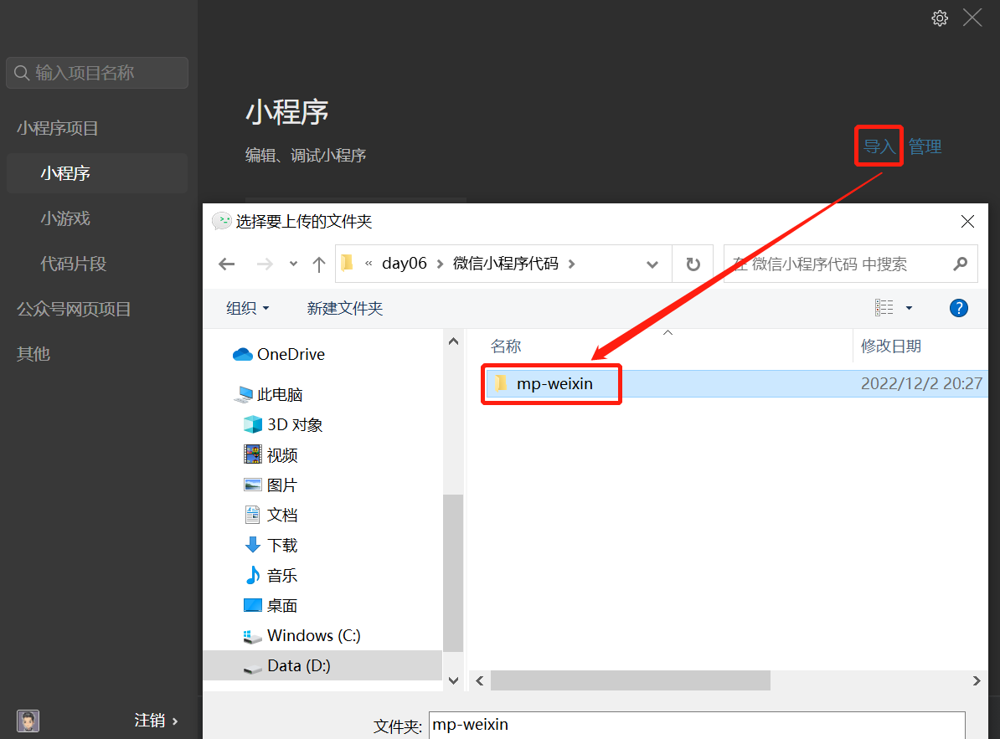 

AppID：使用自己的AppID

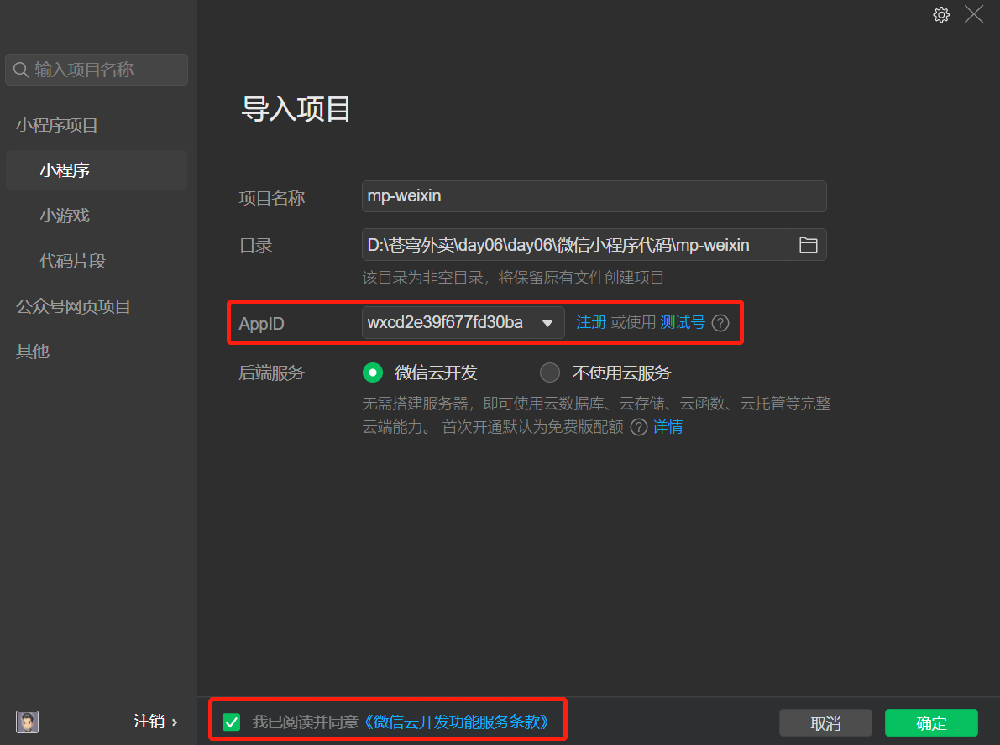 


**3). 查看项目结构**

主体的文件:app.js app.json app.wxss
项目的页面比较多，主要存放在pages目录。

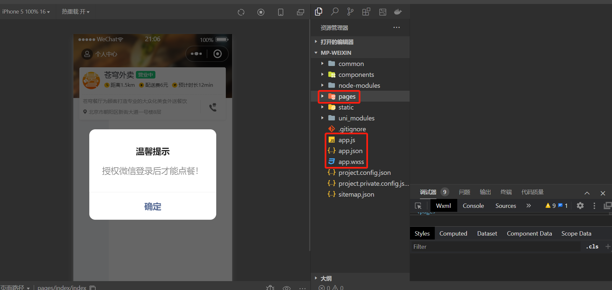 


**4). 修改配置**

因为小程序要请求后端服务，需要修改为自己后端服务的ip地址和端口号(默认不需要修改)

common-->vendor.js-->搜索(ctrl+f)-->baseUri

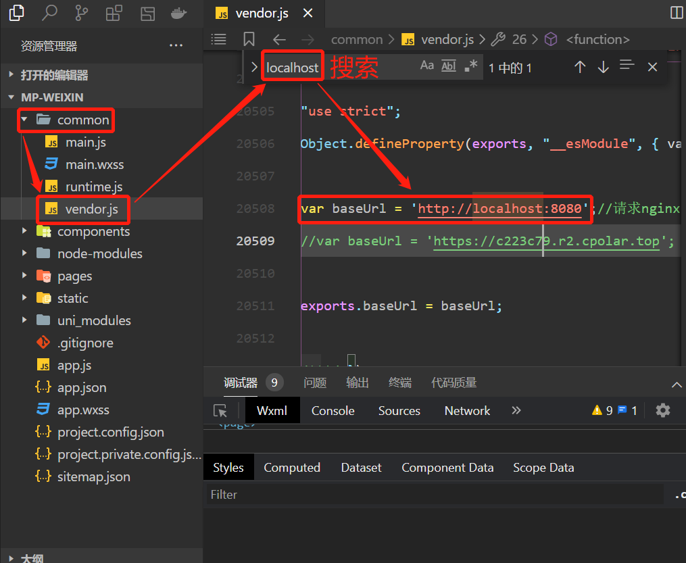 


### 3.2 微信登录流程

微信登录：https://developers.weixin.qq.com/miniprogram/dev/framework/open-ability/login.html

**流程图：**

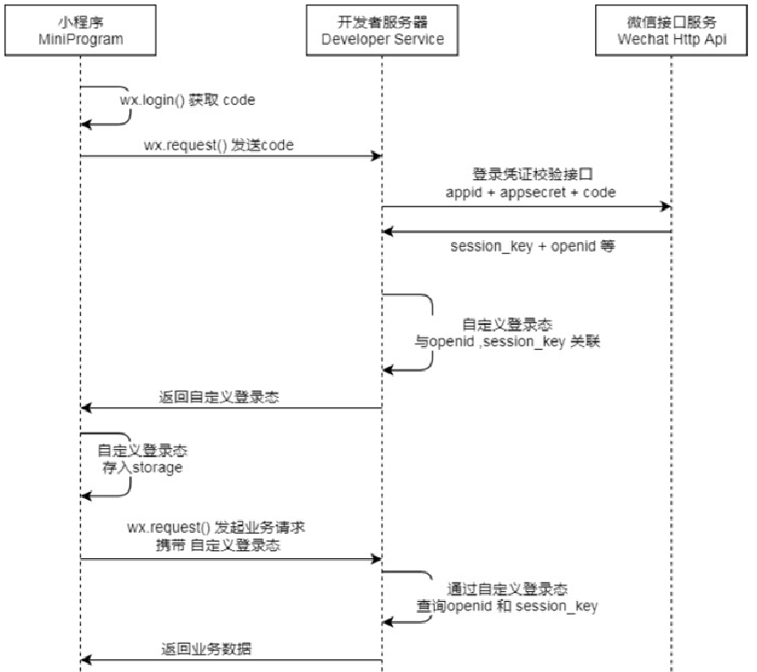 


**步骤分析：**

1. 小程序端，调用wx.login()获取code，就是授权码。
2. 小程序端，调用wx.request()发送请求并携带code，请求开发者服务器(自己编写的后端服务)。
3. 开发者服务端，通过HttpClient向微信接口服务发送请求，并携带appId+appsecret+code三个参数。
4. 开发者服务端，接收微信接口服务返回的数据，session_key+opendId等。opendId是微信用户的唯一标识。
5. 开发者服务端，自定义登录态，生成令牌(token)和openid等数据返回给小程序端，方便后绪请求身份校验。
6. 小程序端，收到自定义登录态，存储storage。
7. 小程序端，后绪通过wx.request()发起业务请求时，携带token。
8. 开发者服务端，收到请求后，通过携带的token，解析当前登录用户的id。
9. 开发者服务端，身份校验通过后，继续相关的业务逻辑处理，最终返回业务数据。


接下来，我们使用Postman进行测试。

**说明：**

1. 调用 [wx.login()](https://developers.weixin.qq.com/miniprogram/dev/api/open-api/login/wx.login.html) 获取 **临时登录凭证code** ，并回传到开发者服务器。
2. 调用 [auth.code2Session](https://developers.weixin.qq.com/miniprogram/dev/api-backend/open-api/login/auth.code2Session.html) 接口，换取 **用户唯一标识 OpenID** 、 用户在微信开放平台帐号下的**唯一标识UnionID**（若当前小程序已绑定到微信开放平台帐号） 和 **会话密钥 session_key**。

之后开发者服务器可以根据用户标识来生成自定义登录态，用于后续业务逻辑中前后端交互时识别用户身份。

**实现步骤：**

**1). 获取授权码**

点击确定按钮，获取授权码，每个授权码只能使用一次，每次测试，需重新获取。

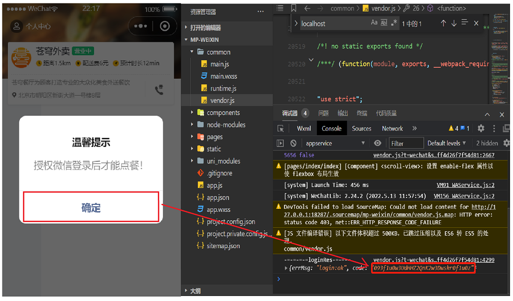 


**2). 明确请求接口**

请求方式、请求路径、请求参数

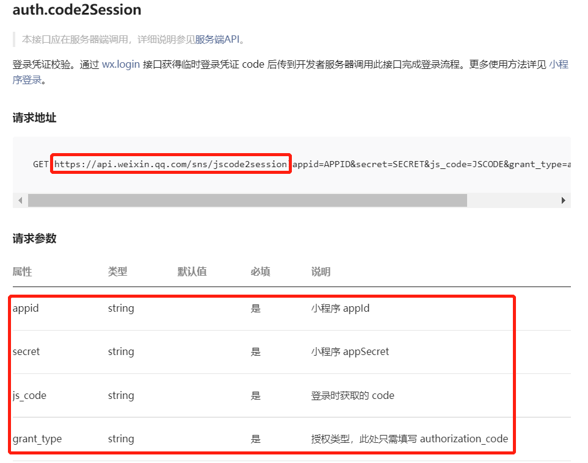 


**3). 发送请求**

获取session_key和openid

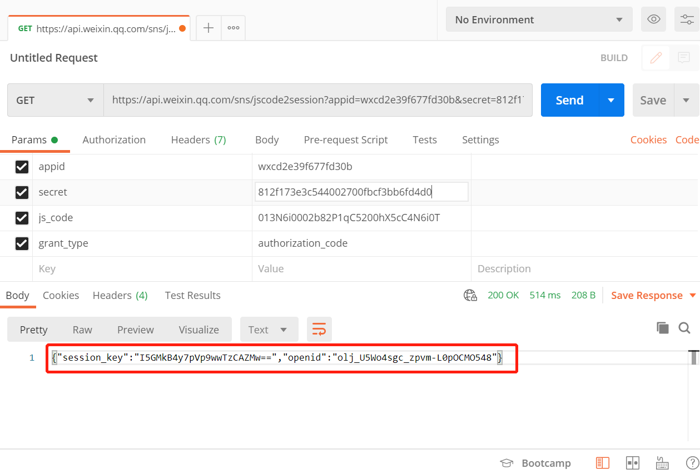 

若出现code been used错误提示，说明授权码已被使用过，请重新获取

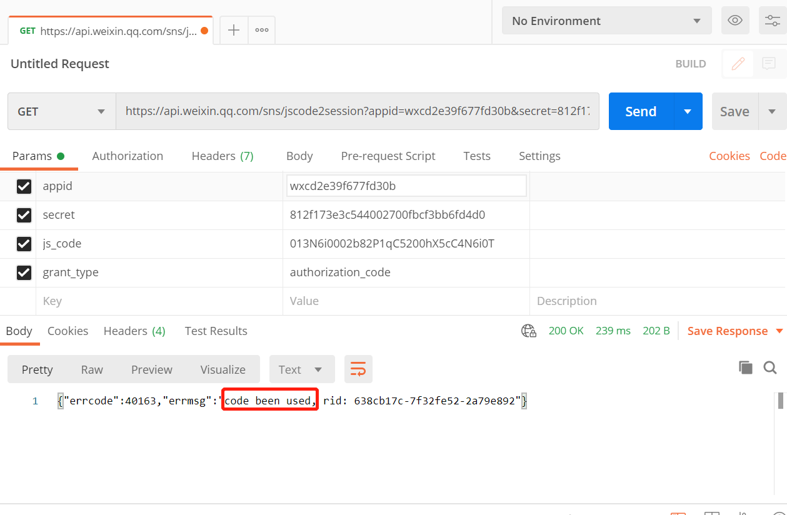 

 

### 3.3 需求分析和设计

#### 3.3.1 产品原型

用户进入到小程序的时候，微信授权登录之后才能点餐。需要获取当前微信用户的相关信息，比如昵称、头像等，这样才能够进入到小程序进行下单操作。是基于微信登录来实现小程序的登录功能，没有采用传统账户密码登录的方式。若第一次使用小程序来点餐，就是一个新用户，需要把这个新的用户保存到数据库当中完成自动注册。

**登录功能原型图：**

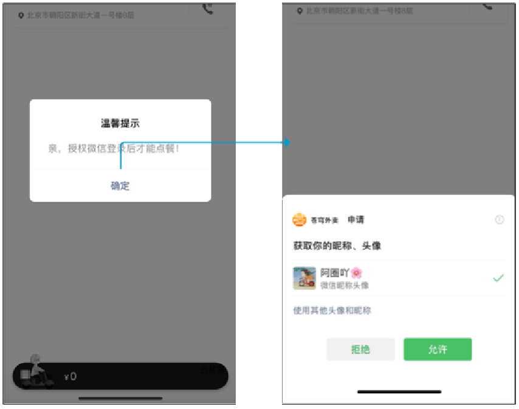 


**业务规则：**

- 基于微信登录实现小程序的登录功能
- 如果是新用户需要自动完成注册


#### 3.3.2 接口设计

通过微信登录的流程，如果要完成微信登录的话，最终就要获得微信用户的openid。在小程序端获取授权码后，向后端服务发送请求，并携带授权码，这样后端服务在收到授权码后，就可以去请求微信接口服务。最终，后端向小程序返回openid和token等数据。

基于上述的登录流程，就可以设计出该接口的**请求参数**和**返回数据**。

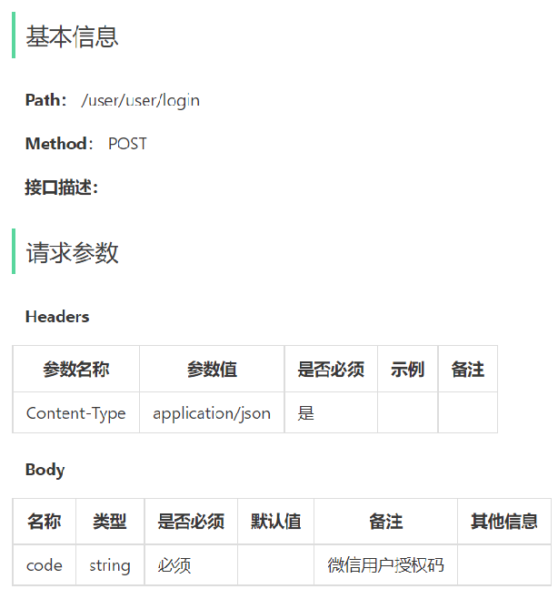 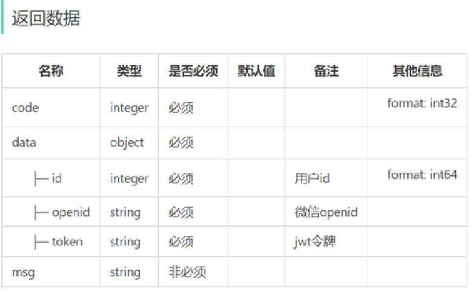

**说明：**请求路径/user/user/login,第一个user代表用户端，第二个user代表用户模块。


#### 3.3.3 表设计

当用户第一次使用小程序时，会完成自动注册，把用户信息存储到**user**表中。

| **字段名**  | **数据类型** | **说明**           | **备注** |
| ----------- | ------------ | ------------------ | -------- |
| id          | bigint       | 主键               | 自增     |
| openid      | varchar(45)  | 微信用户的唯一标识 |          |
| name        | varchar(32)  | 用户姓名           |          |
| phone       | varchar(11)  | 手机号             |          |
| sex         | varchar(2)   | 性别               |          |
| id_number   | varchar(18)  | 身份证号           |          |
| avatar      | varchar(500) | 微信用户头像路径   |          |
| create_time | datetime     | 注册时间           |          |

**说明：**手机号字段比较特殊，个人身份注册的小程序没有权限获取到微信用户的手机号。如果是以企业的资质
注册的小程序就能够拿到微信用户的手机号。


### 3.4 代码开发

#### 3.4.1 定义相关配置

**配置微信登录所需配置项：**

application-dev.yml

```yaml
sky:
  wechat:
    appid: wxffb3637a228223b8
    secret: 84311df9199ecacdf4f12d27b6b9522d
```

application.yml

```yaml
sky:
  wechat:
    appid: ${sky.wechat.appid}
    secret: ${sky.wechat.secret}
```

**配置为微信用户生成jwt令牌时使用的配置项：**

application.yml

```yaml
sky:
  jwt:
    # 设置jwt签名加密时使用的秘钥
    admin-secret-key: itcast
    # 设置jwt过期时间
    admin-ttl: 7200000
    # 设置前端传递过来的令牌名称
    admin-token-name: token
    user-secret-key: itheima
    user-ttl: 7200000
    user-token-name: authentication
```


#### 3.4.2 DTO设计

**根据传入参数设计DTO类：**

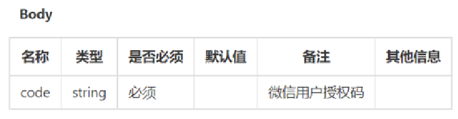 

在sky-pojo模块，UserLoginDTO.java已定义

```java
package com.sky.dto;

import lombok.Data;

import java.io.Serializable;

/**
 * C端用户登录
 */
@Data
public class UserLoginDTO implements Serializable {

    private String code;

}
```


#### 3.4.3 VO设计

**根据返回数据设计VO类：**

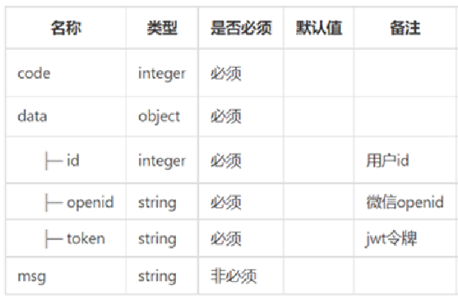 

在sky-pojo模块，UserLoginVO.java已定义

```java
package com.sky.vo;

import lombok.AllArgsConstructor;
import lombok.Builder;
import lombok.Data;
import lombok.NoArgsConstructor;

import java.io.Serializable;

@Data
@Builder
@NoArgsConstructor
@AllArgsConstructor
public class UserLoginVO implements Serializable {

    private Long id;
    private String openid;
    private String token;

}
```


#### 3.4.4 Controller层

**根据接口定义创建UserController的login方法：**

```java
package com.sky.controller.user;

import com.sky.constant.JwtClaimsConstant;
import com.sky.dto.UserLoginDTO;
import com.sky.entity.User;
import com.sky.properties.JwtProperties;
import com.sky.result.Result;
import com.sky.service.UserService;
import com.sky.utils.JwtUtil;
import com.sky.vo.UserLoginVO;
import io.swagger.annotations.Api;
import io.swagger.annotations.ApiOperation;
import lombok.extern.slf4j.Slf4j;
import org.springframework.beans.factory.annotation.Autowired;
import org.springframework.web.bind.annotation.PostMapping;
import org.springframework.web.bind.annotation.RequestBody;
import org.springframework.web.bind.annotation.RequestMapping;
import org.springframework.web.bind.annotation.RestController;
import java.util.HashMap;
import java.util.Map;

@RestController
@RequestMapping("/user/user")
@Api(tags = "C端用户相关接口")
@Slf4j
public class UserController {

    @Autowired
    private UserService userService;
    @Autowired
    private JwtProperties jwtProperties;

    /**
     * 微信登录
     * @param userLoginDTO
     * @return
     */
    @PostMapping("/login")
    @ApiOperation("微信登录")
    public Result<UserLoginVO> login(@RequestBody UserLoginDTO userLoginDTO){
        log.info("微信用户登录：{}",userLoginDTO.getCode());

        //微信登录
        User user = userService.wxLogin(userLoginDTO);//后绪步骤实现

        //为微信用户生成jwt令牌
        Map<String, Object> claims = new HashMap<>();
        claims.put(JwtClaimsConstant.USER_ID,user.getId());
        String token = JwtUtil.createJWT(jwtProperties.getUserSecretKey(), jwtProperties.getUserTtl(), claims);

        UserLoginVO userLoginVO = UserLoginVO.builder()
                .id(user.getId())
                .openid(user.getOpenid())
                .token(token)
                .build();
        return Result.success(userLoginVO);
    }
}
```

其中，JwtClaimsConstant.USER_ID常量已定义。


#### 3.4.5 Service层接口

**创建UserService接口：**

```java
package com.sky.service;

import com.sky.dto.UserLoginDTO;
import com.sky.entity.User;

public interface UserService {

    /**
     * 微信登录
     * @param userLoginDTO
     * @return
     */
    User wxLogin(UserLoginDTO userLoginDTO);
}
```


#### 3.4.6 Service层实现类

**创建UserServiceImpl实现类：**实现获取微信用户的openid和微信登录功能

```java
package com.sky.service.impl;

import com.alibaba.fastjson.JSON;
import com.alibaba.fastjson.JSONObject;
import com.sky.constant.MessageConstant;
import com.sky.dto.UserLoginDTO;
import com.sky.entity.User;
import com.sky.exception.LoginFailedException;
import com.sky.mapper.UserMapper;
import com.sky.properties.WeChatProperties;
import com.sky.service.UserService;
import com.sky.utils.HttpClientUtil;
import lombok.extern.slf4j.Slf4j;
import org.springframework.beans.factory.annotation.Autowired;
import org.springframework.stereotype.Service;

import java.time.LocalDateTime;
import java.util.HashMap;
import java.util.Map;

@Service
@Slf4j
public class UserServiceImpl implements UserService {

    //微信服务接口地址
    public static final String WX_LOGIN = "https://api.weixin.qq.com/sns/jscode2session";

    @Autowired
    private WeChatProperties weChatProperties;
    @Autowired
    private UserMapper userMapper;

    /**
     * 微信登录
     * @param userLoginDTO
     * @return
     */
    public User wxLogin(UserLoginDTO userLoginDTO) {
        String openid = getOpenid(userLoginDTO.getCode());

        //判断openid是否为空，如果为空表示登录失败，抛出业务异常
        if(openid == null){
            throw new LoginFailedException(MessageConstant.LOGIN_FAILED);
        }

        //判断当前用户是否为新用户
        User user = userMapper.getByOpenid(openid);

        //如果是新用户，自动完成注册
        if(user == null){
            user = User.builder()
                    .openid(openid)
                    .createTime(LocalDateTime.now())
                    .build();
            userMapper.insert(user);//后绪步骤实现
        }

        //返回这个用户对象
        return user;
    }

    /**
     * 调用微信接口服务，获取微信用户的openid
     * @param code
     * @return
     */
    private String getOpenid(String code){
        //调用微信接口服务，获得当前微信用户的openid
        Map<String, String> map = new HashMap<>();
        map.put("appid",weChatProperties.getAppid());
        map.put("secret",weChatProperties.getSecret());
        map.put("js_code",code);
        map.put("grant_type","authorization_code");
        String json = HttpClientUtil.doGet(WX_LOGIN, map);

        JSONObject jsonObject = JSON.parseObject(json);
        String openid = jsonObject.getString("openid");
        return openid;
    }
}
```


#### 3.4.7 Mapper层

**创建UserMapper接口：**

```java
package com.sky.mapper;

import com.sky.entity.User;
import org.apache.ibatis.annotations.Mapper;
import org.apache.ibatis.annotations.Select;

@Mapper
public interface UserMapper {

    /**
     * 根据openid查询用户
     * @param openid
     * @return
     */
    @Select("select * from user where openid = #{openid}")
    User getByOpenid(String openid);

    /**
     * 插入数据
     * @param user
     */
    void insert(User user);
}
```

**创建UserMapper.xml映射文件：**

```xml
<?xml version="1.0" encoding="UTF-8" ?>
<!DOCTYPE mapper PUBLIC "-//mybatis.org//DTD Mapper 3.0//EN"
        "http://mybatis.org/dtd/mybatis-3-mapper.dtd" >
<mapper namespace="com.sky.mapper.UserMapper">

    <insert id="insert" useGeneratedKeys="true" keyProperty="id">
        insert into user (openid, name, phone, sex, id_number, avatar, create_time)
        values (#{openid}, #{name}, #{phone}, #{sex}, #{idNumber}, #{avatar}, #{createTime})
    </insert>

</mapper>
```


#### 3.4.8 编写拦截器

**编写拦截器JwtTokenUserInterceptor：**统一拦截用户端发送的请求并进行jwt校验

```java
package com.sky.interceptor;

import com.sky.constant.JwtClaimsConstant;
import com.sky.context.BaseContext;
import com.sky.properties.JwtProperties;
import com.sky.utils.JwtUtil;
import io.jsonwebtoken.Claims;
import lombok.extern.slf4j.Slf4j;
import org.springframework.beans.factory.annotation.Autowired;
import org.springframework.stereotype.Component;
import org.springframework.web.method.HandlerMethod;
import org.springframework.web.servlet.HandlerInterceptor;

import javax.servlet.http.HttpServletRequest;
import javax.servlet.http.HttpServletResponse;

/**
 * jwt令牌校验的拦截器
 */
@Component
@Slf4j
public class JwtTokenUserInterceptor implements HandlerInterceptor {

    @Autowired
    private JwtProperties jwtProperties;

    /**
     * 校验jwt
     *
     * @param request
     * @param response
     * @param handler
     * @return
     * @throws Exception
     */
    public boolean preHandle(HttpServletRequest request, HttpServletResponse response, Object handler) throws Exception {
        //判断当前拦截到的是Controller的方法还是其他资源
        if (!(handler instanceof HandlerMethod)) {
            //当前拦截到的不是动态方法，直接放行
            return true;
        }

        //1、从请求头中获取令牌
        String token = request.getHeader(jwtProperties.getUserTokenName());

        //2、校验令牌
        try {
            log.info("jwt校验:{}", token);
            Claims claims = JwtUtil.parseJWT(jwtProperties.getUserSecretKey(), token);
            Long userId = Long.valueOf(claims.get(JwtClaimsConstant.USER_ID).toString());
            log.info("当前用户的id：", userId);
            BaseContext.setCurrentId(userId);
            //3、通过，放行
            return true;
        } catch (Exception ex) {
            //4、不通过，响应401状态码
            response.setStatus(401);
            return false;
        }
    }
}
```

**在WebMvcConfiguration配置类中注册拦截器：**

```java
	@Autowired
    private JwtTokenUserInterceptor jwtTokenUserInterceptor;
	/**
     * 注册自定义拦截器
     * @param registry
     */
    protected void addInterceptors(InterceptorRegistry registry) {
        log.info("开始注册自定义拦截器...");
        //.........

        registry.addInterceptor(jwtTokenUserInterceptor)
                .addPathPatterns("/user/**")
                .excludePathPatterns("/user/user/login")
                .excludePathPatterns("/user/shop/status");
    }
```


### 3.5 功能测试

重新编译小程序，进行登录，获取到openid和token数据

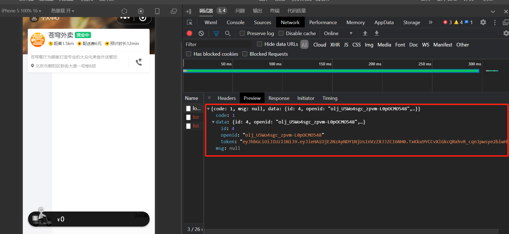 

查看后台日志

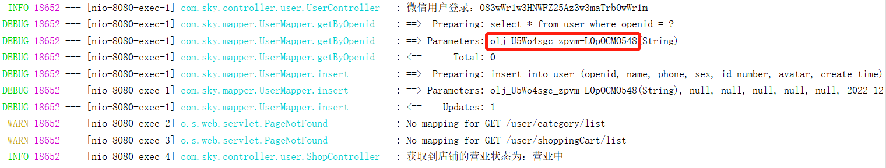  

查看数据库user表，第一次登录，会自动注册

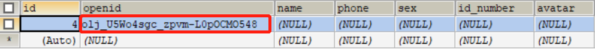  


## 4. 导入商品浏览功能代码

### 4.1 需求分析和设计

#### 4.1.1 产品原型

用户登录成功后跳转到系统首页，在首页需要根据分类来展示菜品和套餐。如果菜品设置了口味信息，需要展示按钮，否则显示按钮。

​         **菜品列表效果图**                                                   **菜品口味效果图**

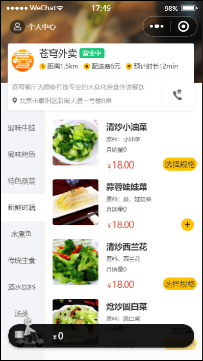                               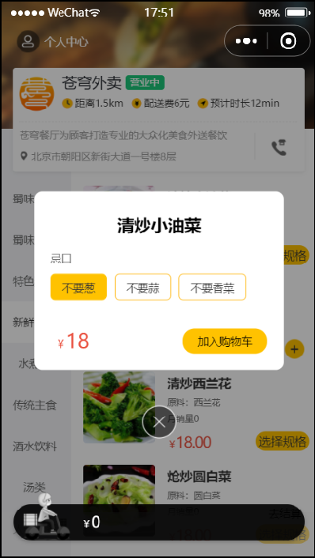 

​         **套餐列表效果图**                                                   **套餐详情效果图**

                               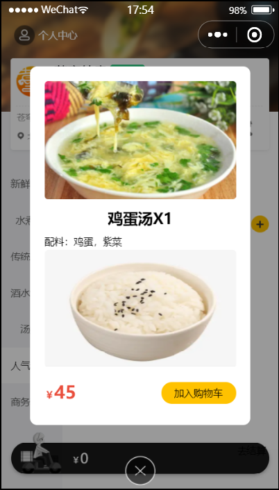 


#### 4.1.2 接口设计

根据上述原型图先**粗粒度**设计接口，共包含4个接口。

**接口设计：**

- 查询分类
- 根据分类id查询菜品
- 根据分类id查询套餐
- 根据套餐id查询包含的菜品


接下来**细粒度**分析每个接口，明确每个接口的请求方式、请求路径、传入参数和返回值。

**1). 查询分类**

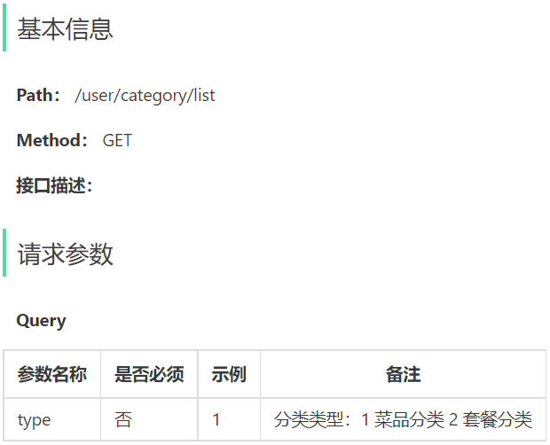 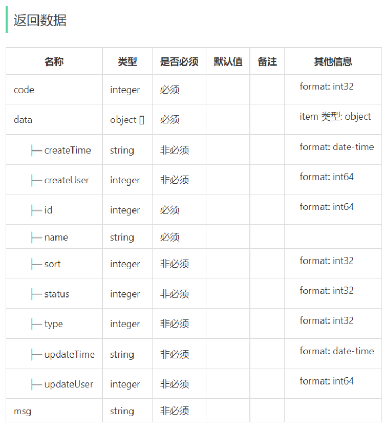


**2). 根据分类id查询菜品**

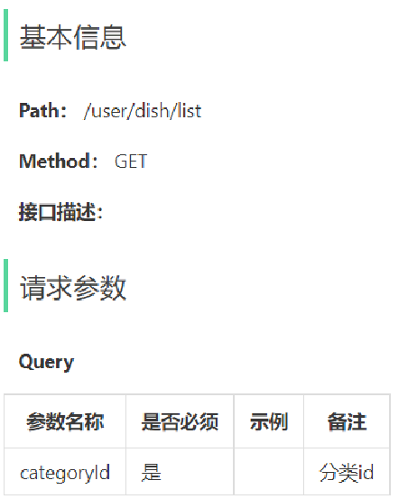 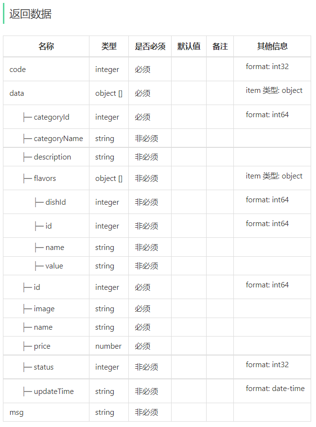


**3). 根据分类id查询套餐**

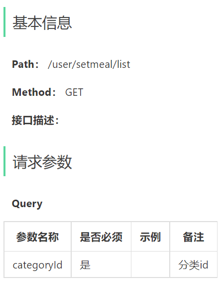 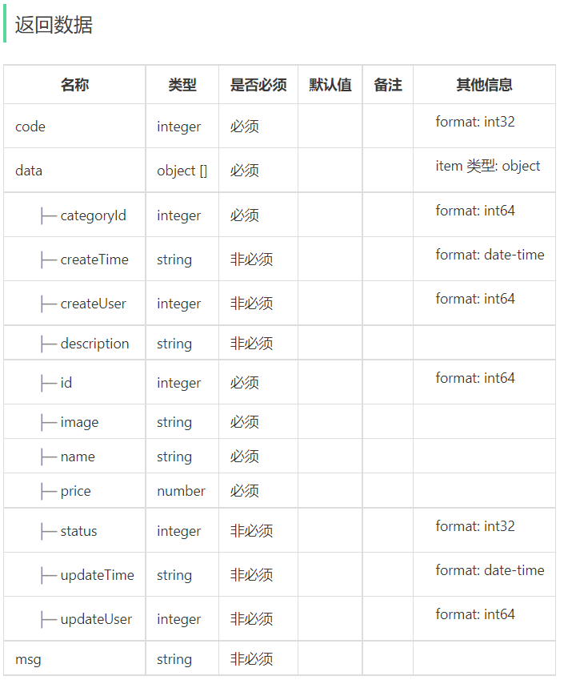


**4). 根据套餐id查询包含的菜品**

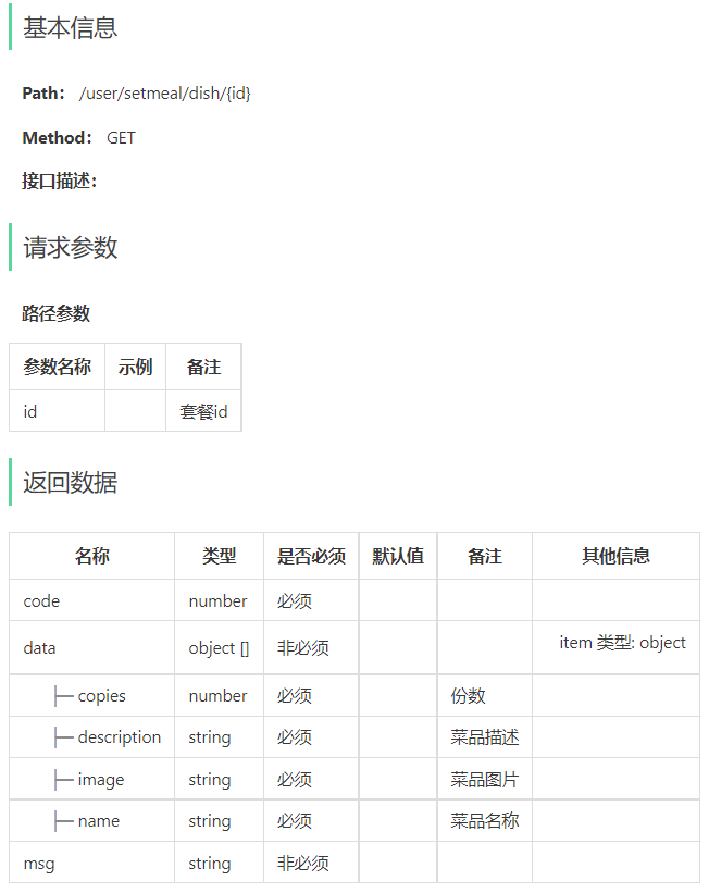 


### 4.2 代码导入

导入资料中的商品浏览功能代码即可

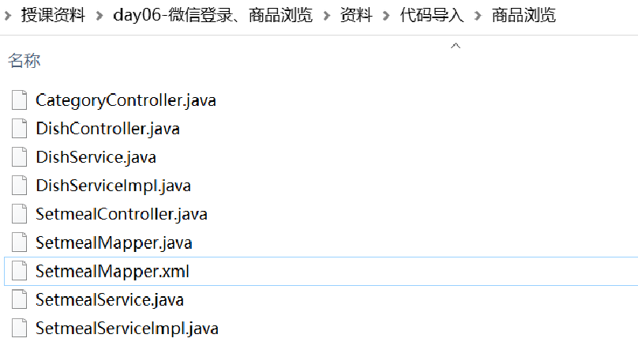 

可按照mapper-->service-->controller依次导入，这样代码不会显示相应的报错。

进入到sky-server模块中

#### 4.2.1 Mapper层

**在SetmealMapper.java中添加list和getDishItemBySetmealId两个方法**

```java
	/**
     * 动态条件查询套餐
     * @param setmeal
     * @return
     */
    List<Setmeal> list(Setmeal setmeal);

    /**
     * 根据套餐id查询菜品选项
     * @param setmealId
     * @return
     */
    @Select("select sd.name, sd.copies, d.image, d.description " +
            "from setmeal_dish sd left join dish d on sd.dish_id = d.id " +
            "where sd.setmeal_id = #{setmealId}")
    List<DishItemVO> getDishItemBySetmealId(Long setmealId);
```

**创建SetmealMapper.xml文件**

```xml
<?xml version="1.0" encoding="UTF-8" ?>
<!DOCTYPE mapper PUBLIC "-//mybatis.org//DTD Mapper 3.0//EN"
        "http://mybatis.org/dtd/mybatis-3-mapper.dtd" >
<mapper namespace="com.sky.mapper.SetmealMapper">

    <select id="list" parameterType="Setmeal" resultType="Setmeal">
        select * from setmeal
        <where>
            <if test="name != null">
                and name like concat('%',#{name},'%')
            </if>
            <if test="categoryId != null">
                and category_id = #{categoryId}
            </if>
            <if test="status != null">
                and status = #{status}
            </if>
        </where>
    </select>
</mapper>
```


#### 4.2.2 Service层

**创建SetmealService.java**

```java
package com.sky.service;

import com.sky.dto.SetmealDTO;
import com.sky.dto.SetmealPageQueryDTO;
import com.sky.entity.Setmeal;
import com.sky.result.PageResult;
import com.sky.vo.DishItemVO;
import com.sky.vo.SetmealVO;
import java.util.List;

public interface SetmealService {

    /**
     * 条件查询
     * @param setmeal
     * @return
     */
    List<Setmeal> list(Setmeal setmeal);

    /**
     * 根据id查询菜品选项
     * @param id
     * @return
     */
    List<DishItemVO> getDishItemById(Long id);

}
```

**创建SetmealServiceImpl.java**

```java
package com.sky.service.impl;

import com.sky.entity.Setmeal;
import com.sky.mapper.DishMapper;
import com.sky.mapper.SetmealDishMapper;
import com.sky.mapper.SetmealMapper;
import com.sky.service.SetmealService;
import com.sky.vo.DishItemVO;
import lombok.extern.slf4j.Slf4j;
import org.springframework.beans.factory.annotation.Autowired;
import org.springframework.stereotype.Service;

import java.util.List;

/**
 * 套餐业务实现
 */
@Service
@Slf4j
public class SetmealServiceImpl implements SetmealService {

    @Autowired
    private SetmealMapper setmealMapper;
    @Autowired
    private SetmealDishMapper setmealDishMapper;
    @Autowired
    private DishMapper dishMapper;

    /**
     * 条件查询
     * @param setmeal
     * @return
     */
    public List<Setmeal> list(Setmeal setmeal) {
        List<Setmeal> list = setmealMapper.list(setmeal);
        return list;
    }

    /**
     * 根据id查询菜品选项
     * @param id
     * @return
     */
    public List<DishItemVO> getDishItemById(Long id) {
        return setmealMapper.getDishItemBySetmealId(id);
    }
}
```

**在DishService.java中添加listWithFlavor方法定义**

```java
	/**
     * 条件查询菜品和口味
     * @param dish
     * @return
     */
    List<DishVO> listWithFlavor(Dish dish);
```

**在DishServiceImpl.java中实现listWithFlavor方法**

```java
	/**
     * 条件查询菜品和口味
     * @param dish
     * @return
     */
    public List<DishVO> listWithFlavor(Dish dish) {
        List<Dish> dishList = dishMapper.list(dish);

        List<DishVO> dishVOList = new ArrayList<>();

        for (Dish d : dishList) {
            DishVO dishVO = new DishVO();
            BeanUtils.copyProperties(d,dishVO);

            //根据菜品id查询对应的口味
            List<DishFlavor> flavors = dishFlavorMapper.getByDishId(d.getId());

            dishVO.setFlavors(flavors);
            dishVOList.add(dishVO);
        }

        return dishVOList;
    }
```


#### 4.2.3 Controller层

**创建DishController.java**

```java
package com.sky.controller.user;

import com.sky.constant.StatusConstant;
import com.sky.entity.Dish;
import com.sky.result.Result;
import com.sky.service.DishService;
import com.sky.vo.DishVO;
import io.swagger.annotations.Api;
import io.swagger.annotations.ApiOperation;
import lombok.extern.slf4j.Slf4j;
import org.springframework.beans.factory.annotation.Autowired;
import org.springframework.web.bind.annotation.GetMapping;
import org.springframework.web.bind.annotation.RequestMapping;
import org.springframework.web.bind.annotation.RestController;
import java.util.List;

@RestController("userDishController")
@RequestMapping("/user/dish")
@Slf4j
@Api(tags = "C端-菜品浏览接口")
public class DishController {
    @Autowired
    private DishService dishService;

    /**
     * 根据分类id查询菜品
     *
     * @param categoryId
     * @return
     */
    @GetMapping("/list")
    @ApiOperation("根据分类id查询菜品")
    public Result<List<DishVO>> list(Long categoryId) {
        Dish dish = new Dish();
        dish.setCategoryId(categoryId);
        dish.setStatus(StatusConstant.ENABLE);//查询起售中的菜品

        List<DishVO> list = dishService.listWithFlavor(dish);

        return Result.success(list);
    }

}
```

**创建CategoryController.java**

```java
package com.sky.controller.user;

import com.sky.entity.Category;
import com.sky.result.Result;
import com.sky.service.CategoryService;
import io.swagger.annotations.Api;
import io.swagger.annotations.ApiOperation;
import org.springframework.beans.factory.annotation.Autowired;
import org.springframework.web.bind.annotation.GetMapping;
import org.springframework.web.bind.annotation.RequestMapping;
import org.springframework.web.bind.annotation.RestController;
import java.util.List;

@RestController("userCategoryController")
@RequestMapping("/user/category")
@Api(tags = "C端-分类接口")
public class CategoryController {

    @Autowired
    private CategoryService categoryService;

    /**
     * 查询分类
     * @param type
     * @return
     */
    @GetMapping("/list")
    @ApiOperation("查询分类")
    public Result<List<Category>> list(Integer type) {
        List<Category> list = categoryService.list(type);
        return Result.success(list);
    }
}
```

**创建SetmealController.java**

```java
package com.sky.controller.user;

import com.sky.constant.StatusConstant;
import com.sky.entity.Setmeal;
import com.sky.result.Result;
import com.sky.service.SetmealService;
import com.sky.vo.DishItemVO;
import io.swagger.annotations.Api;
import io.swagger.annotations.ApiOperation;
import org.springframework.beans.factory.annotation.Autowired;
import org.springframework.web.bind.annotation.GetMapping;
import org.springframework.web.bind.annotation.PathVariable;
import org.springframework.web.bind.annotation.RequestMapping;
import org.springframework.web.bind.annotation.RestController;
import java.util.List;

@RestController("userSetmealController")
@RequestMapping("/user/setmeal")
@Api(tags = "C端-套餐浏览接口")
public class SetmealController {
    @Autowired
    private SetmealService setmealService;

    /**
     * 条件查询
     *
     * @param categoryId
     * @return
     */
    @GetMapping("/list")
    @ApiOperation("根据分类id查询套餐")
    public Result<List<Setmeal>> list(Long categoryId) {
        Setmeal setmeal = new Setmeal();
        setmeal.setCategoryId(categoryId);
        setmeal.setStatus(StatusConstant.ENABLE);

        List<Setmeal> list = setmealService.list(setmeal);
        return Result.success(list);
    }

    /**
     * 根据套餐id查询包含的菜品列表
     *
     * @param id
     * @return
     */
    @GetMapping("/dish/{id}")
    @ApiOperation("根据套餐id查询包含的菜品列表")
    public Result<List<DishItemVO>> dishList(@PathVariable("id") Long id) {
        List<DishItemVO> list = setmealService.getDishItemById(id);
        return Result.success(list);
    }
}
```


### 4.3 功能测试

重启服务器、重新编译小程序

微信登录进入首页

**菜品和套餐分类查询：**

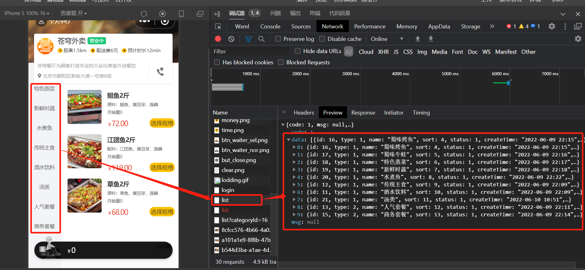 

**具体分类下的菜品查询：**

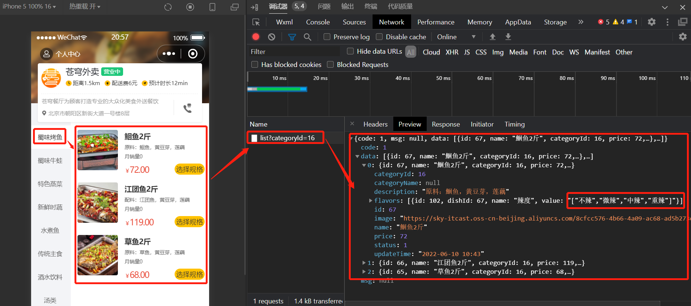 

**菜品口味查询：**

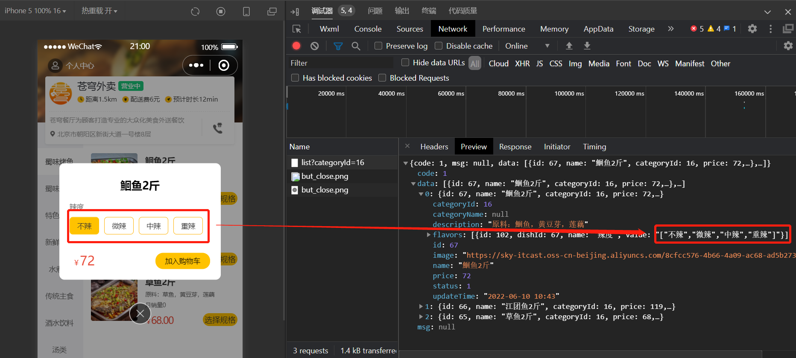 


### 4.4 代码提交

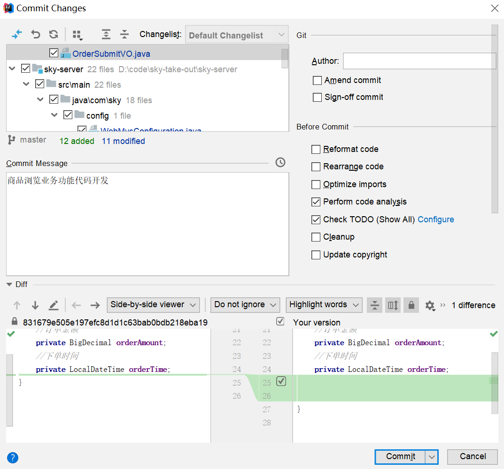 

后续步骤和其它功能代码提交一致，不再赘述。