# 苍穹外卖-day07

## 课程内容

- 缓存菜品
- 缓存套餐
- 添加购物车
- 查看购物车
- 清空购物车


功能实现：**缓存商品**、**购物车**

**效果图：**

 


## 1. 缓存菜品

### 1.1 问题说明

用户端小程序展示的菜品数据都是通过查询数据库获得，如果用户端访问量比较大，数据库访问压力随之增大。

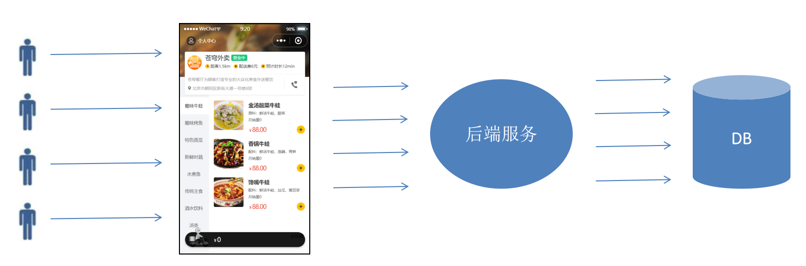 

**结果：**系统响应慢、用户体验差


### 1.2 实现思路

通过Redis来缓存菜品数据，减少数据库查询操作。

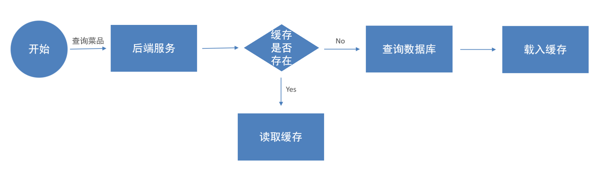 

**缓存逻辑分析：**

- 每个分类下的菜品保存一份缓存数据
- 数据库中菜品数据有变更时清理缓存数据

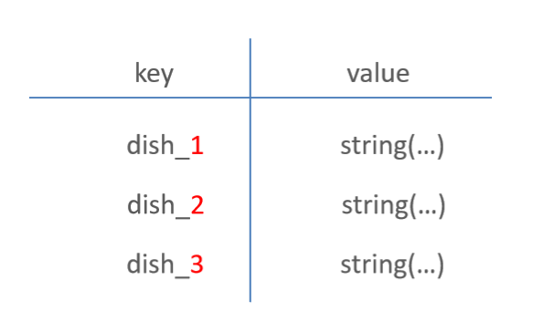 


### 1.3 代码开发

**修改用户端接口 DishController 的 list 方法，加入缓存处理逻辑：**

```java
	@Autowired
    private RedisTemplate redisTemplate;
	/**
     * 根据分类id查询菜品
     *
     * @param categoryId
     * @return
     */
    @GetMapping("/list")
    @ApiOperation("根据分类id查询菜品")
    public Result<List<DishVO>> list(Long categoryId) {

        //构造redis中的key，规则：dish_分类id
        String key = "dish_" + categoryId;

        //查询redis中是否存在菜品数据
        List<DishVO> list = (List<DishVO>) redisTemplate.opsForValue().get(key);
        if(list != null && list.size() > 0){
            //如果存在，直接返回，无须查询数据库
            return Result.success(list);
        }
		////////////////////////////////////////////////////////
        Dish dish = new Dish();
        dish.setCategoryId(categoryId);
        dish.setStatus(StatusConstant.ENABLE);//查询起售中的菜品

        //如果不存在，查询数据库，将查询到的数据放入redis中
        list = dishService.listWithFlavor(dish);
        ////////////////////////////////////////////////////////
        redisTemplate.opsForValue().set(key, list);

        return Result.success(list);
    }
```

为了保证**数据库**和**Redis**中的数据保持一致，修改**管理端接口 DishController** 的相关方法，加入清理缓存逻辑。

需要改造的方法：

- 新增菜品
- 修改菜品
- 批量删除菜品
- 起售、停售菜品

**抽取清理缓存的方法：**

在管理端DishController中添加

```java
	@Autowired
    private RedisTemplate redisTemplate;
	/**
     * 清理缓存数据
     * @param pattern
     */
    private void cleanCache(String pattern){
        Set keys = redisTemplate.keys(pattern);
        redisTemplate.delete(keys);
    }
```

**调用清理缓存的方法，保证数据一致性：**

**1). 新增菜品优化**

```java
	/**
     * 新增菜品
     *
     * @param dishDTO
     * @return
     */
    @PostMapping
    @ApiOperation("新增菜品")
    public Result save(@RequestBody DishDTO dishDTO) {
        log.info("新增菜品：{}", dishDTO);
        dishService.saveWithFlavor(dishDTO);

        //清理缓存数据
        String key = "dish_" + dishDTO.getCategoryId();
        cleanCache(key);
        return Result.success();
    }
```

**2). 菜品批量删除优化**

```java
	/**
     * 菜品批量删除
     *
     * @param ids
     * @return
     */
    @DeleteMapping
    @ApiOperation("菜品批量删除")
    public Result delete(@RequestParam List<Long> ids) {
        log.info("菜品批量删除：{}", ids);
        dishService.deleteBatch(ids);

        //将所有的菜品缓存数据清理掉，所有以dish_开头的key
        cleanCache("dish_*");

        return Result.success();
    }
```

**3). 修改菜品优化**

```java
	/**
     * 修改菜品
     *
     * @param dishDTO
     * @return
     */
    @PutMapping
    @ApiOperation("修改菜品")
    public Result update(@RequestBody DishDTO dishDTO) {
        log.info("修改菜品：{}", dishDTO);
        dishService.updateWithFlavor(dishDTO);

        //将所有的菜品缓存数据清理掉，所有以dish_开头的key
        cleanCache("dish_*");

        return Result.success();
    }
```

**4). 菜品起售停售优化**

```java
	/**
     * 菜品起售停售
     *
     * @param status
     * @param id
     * @return
     */
    @PostMapping("/status/{status}")
    @ApiOperation("菜品起售停售")
    public Result<String> startOrStop(@PathVariable Integer status, Long id) {
        dishService.startOrStop(status, id);

        //将所有的菜品缓存数据清理掉，所有以dish_开头的key
        cleanCache("dish_*");

        return Result.success();
    }
```


### 1.4 功能测试

可以通过如下方式进行测试：

- 查看控制台sql
- 前后端联调
- 查看Redis中的缓存数据

以**加入缓存**、**菜品修改**两个功能测试为例，通过前后端联调方式，查看控制台sql的打印和Redis中的缓存数据变化。


**1). 加入缓存**

当第一次查询某个分类的菜品时，会从数据为中进行查询，同时将查询的结果存储到Redis中，在后绪的访问，若查询相同分类的菜品时，直接从Redis缓存中查询，不再查询数据库。

**登录小程序：**选择蜀味牛蛙(id=17)

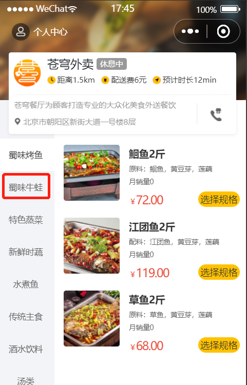 

**查看控制台sql：**有查询语句，说明是从数据库中进行查询

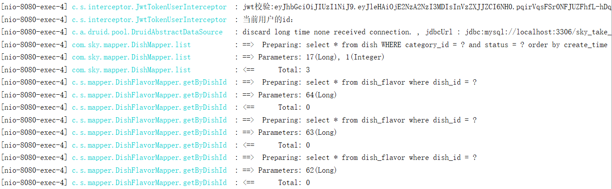 

**查看Redis中的缓存数据：**说明缓存成功

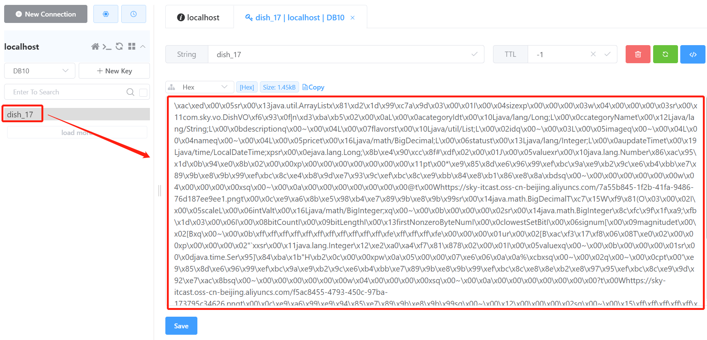 

**再次访问：**选择蜀味牛蛙(id=17)

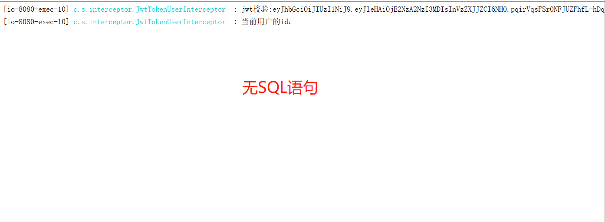 

说明是从Redis中查询的数据。


**2). 菜品修改**

当在后台修改菜品数据时，为了保证Redis缓存中的数据和数据库中的数据时刻保持一致，当修改后，需要清空对应的缓存数据。用户再次访问时，还是先从数据库中查询，同时再把查询的结果存储到Redis中，这样，就能保证缓存和数据库的数据保持一致。

**进入后台：**修改蜀味牛蛙分类下的任意一个菜品，当前分类的菜品数据已在Redis中缓存

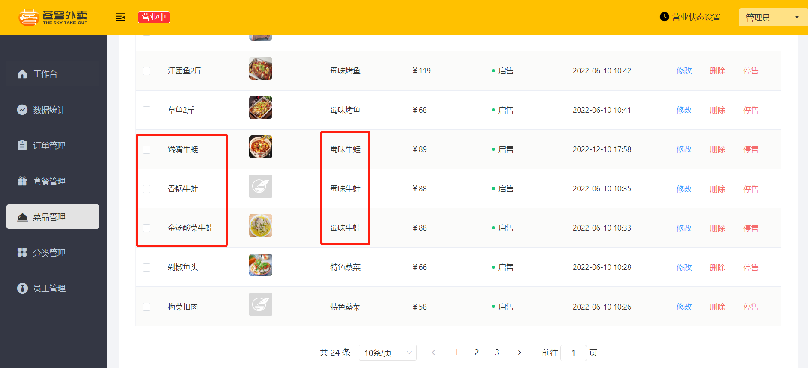 

**修改：**

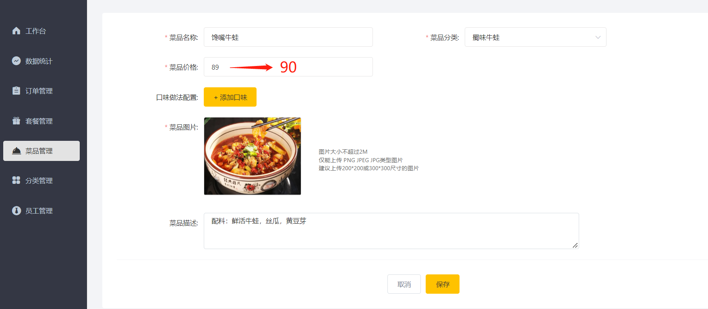 

**查看Redis中的缓存数据：**说明修改时，已清空缓存

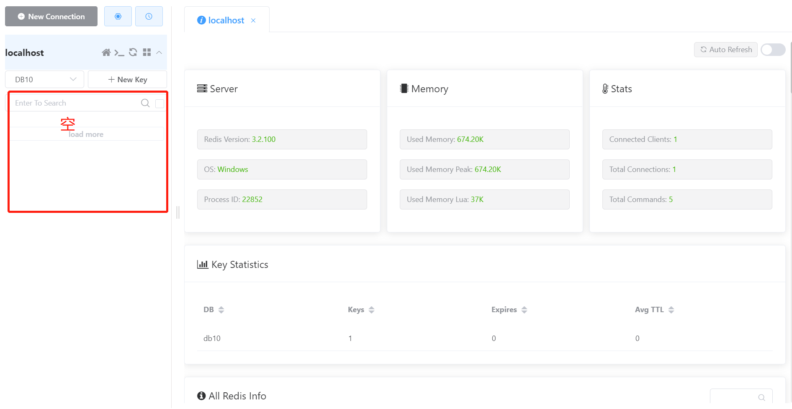 

用户再次访问同一个菜品分类时，需要先查询数据库，再把结果同步到Redis中，保证了两者数据一致性。

其它功能测试步骤基本一致，自已测试即可。


### 1.5 代码提交

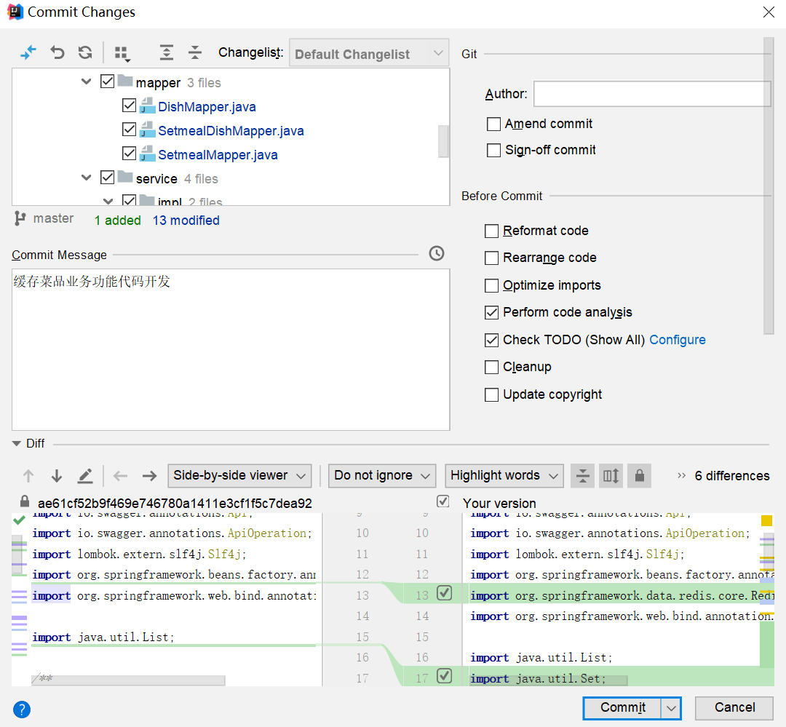 

后续步骤和其它功能代码提交一致，不再赘述。


## 2. 缓存套餐

### 2.1 Spring Cache

#### 2.1.1 介绍

Spring Cache 是一个框架，实现了基于注解的缓存功能，只需要简单地加一个注解，就能实现缓存功能。

Spring Cache 提供了一层抽象，底层可以切换不同的缓存实现，例如：

- EHCache
- Caffeine
- Redis(常用)

**起步依赖：**

```xml
<dependency>
	<groupId>org.springframework.boot</groupId>
	<artifactId>spring-boot-starter-cache</artifactId>  		            		       	 <version>2.7.3</version> 
</dependency>
```


#### 2.1.2 常用注解

在SpringCache中提供了很多缓存操作的注解，常见的是以下的几个：

| **注解**       | **说明**                                                     |
| -------------- | ------------------------------------------------------------ |
| @EnableCaching | 开启缓存注解功能，通常加在启动类上                           |
| @Cacheable     | 在方法执行前先查询缓存中是否有数据，如果有数据，则直接返回缓存数据；如果没有缓存数据，调用方法并将方法返回值放到缓存中 |
| @CachePut      | 将方法的返回值放到缓存中                                     |
| @CacheEvict    | 将一条或多条数据从缓存中删除                                 |

在spring boot项目中，使用缓存技术只需在项目中导入相关缓存技术的依赖包，并在启动类上使用@EnableCaching开启缓存支持即可。

例如，使用Redis作为缓存技术，只需要导入Spring data Redis的maven坐标即可。


#### 2.1.3 入门案例

**1). 环境准备**

**导入基础工程:**底层已使用Redis缓存实现

基础环境的代码，在我们今天的资料中已经准备好了， 大家只需要将这个工程导入进来就可以了。导入进来的工程结构如下： 

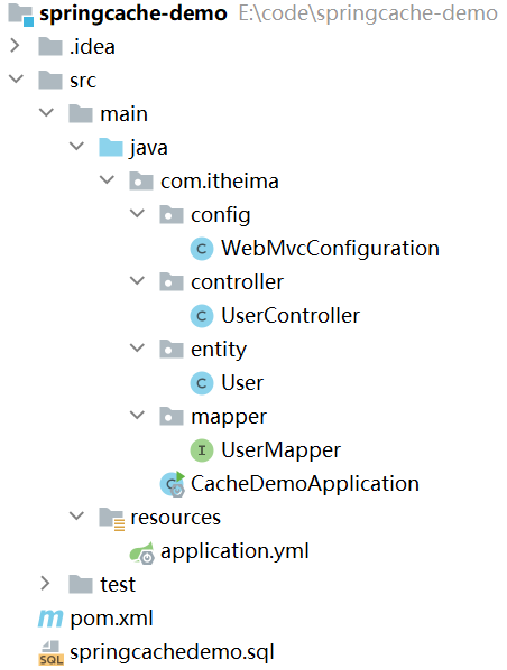 

**数据库准备:**

创建名为spring_cache_demo数据库，将springcachedemo.sql脚本直接导入数据库中。

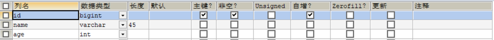 

**引导类上加@EnableCaching:**

```java
package com.itheima;

import lombok.extern.slf4j.Slf4j;
import org.springframework.boot.SpringApplication;
import org.springframework.boot.autoconfigure.SpringBootApplication;
import org.springframework.cache.annotation.EnableCaching;

@Slf4j
@SpringBootApplication
@EnableCaching//开启缓存注解功能
public class CacheDemoApplication {
    public static void main(String[] args) {
        SpringApplication.run(CacheDemoApplication.class,args);
        log.info("项目启动成功...");
    }
}
```


**2). @CachePut注解**

**@CachePut 说明：** 

​	作用: 将方法返回值，放入缓存

​	value: 缓存的名称, 每个缓存名称下面可以有很多key

​	key: 缓存的key  ----------> 支持Spring的表达式语言SPEL语法


**在save方法上加注解@CachePut**

当前UserController的save方法是用来保存用户信息的，我们希望在该用户信息保存到数据库的同时，也往缓存中缓存一份数据，我们可以在save方法上加上注解 @CachePut，用法如下：

```java
	/**
	* CachePut：将方法返回值放入缓存
	* value：缓存的名称，每个缓存名称下面可以有多个key
	* key：缓存的key
	*/
	@PostMapping
    @CachePut(value = "userCache", key = "#user.id")//key的生成：userCache::1
    public User save(@RequestBody User user){
        userMapper.insert(user);
        return user;
    }
```

**说明：**key的写法如下

#user.id : #user指的是方法形参的名称, id指的是user的id属性 , 也就是使用user的id属性作为key ;

#result.id : #result代表方法返回值，该表达式 代表以返回对象的id属性作为key ；

#p0.id：#p0指的是方法中的第一个参数，id指的是第一个参数的id属性,也就是使用第一个参数的id属性作为key ;

#a0.id：#a0指的是方法中的第一个参数，id指的是第一个参数的id属性,也就是使用第一个参数的id属性作为key ;

#root.args[0].id:#root.args[0]指的是方法中的第一个参数，id指的是第一个参数的id属性,也就是使用第一个参数

的id属性作为key ;

**启动服务,通过swagger接口文档测试，访问UserController的save()方法**

因为id是自增，所以不需要设置id属性

 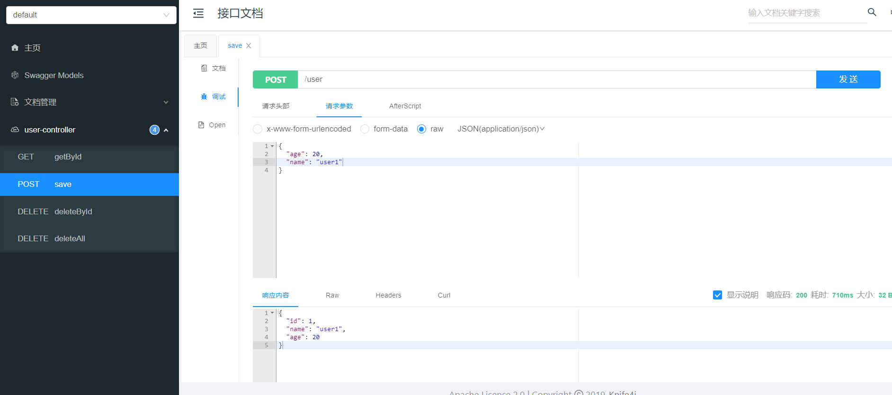 

**查看user表中的数据**

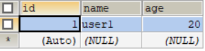 

**查看Redis中的数据**

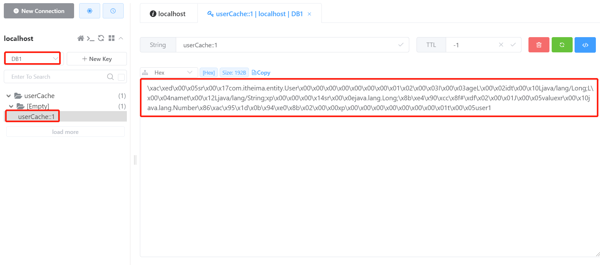 


**3). @Cacheable注解**

**@Cacheable 说明:**

​	作用: 在方法执行前，spring先查看缓存中是否有数据，如果有数据，则直接返回缓存数据；若没有数据，调用方法并将方法返回值放到缓存中

​	value: 缓存的名称，每个缓存名称下面可以有多个key

​	key: 缓存的key  ----------> 支持Spring的表达式语言SPEL语法


 **在getById上加注解@Cacheable**

```java
	/**
	* Cacheable：在方法执行前spring先查看缓存中是否有数据，如果有数据，则直接返回缓存数据；若没有数据，	  *调用方法并将方法返回值放到缓存中
	* value：缓存的名称，每个缓存名称下面可以有多个key
	* key：缓存的key
	*/
	@GetMapping
    @Cacheable(cacheNames = "userCache",key="#id")
    public User getById(Long id){
        User user = userMapper.getById(id);
        return user;
    }
```

**重启服务,通过swagger接口文档测试，访问UserController的getById()方法**

第一次访问，会请求我们controller的方法，查询数据库。后面再查询相同的id，就直接从Redis中查询数据，不用再查询数据库了，就说明缓存生效了。

提前在redis中手动删除掉id=1的用户数据

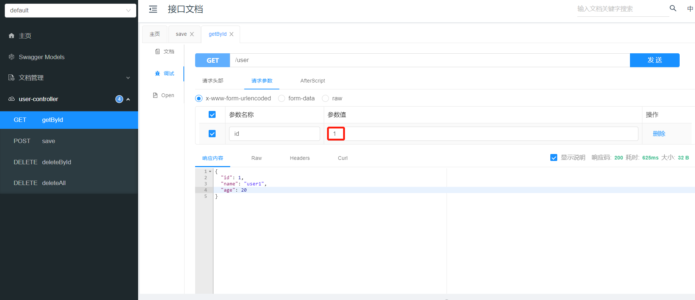 

**查看控制台sql语句：**说明从数据库查询的用户数据

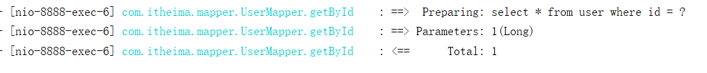 

**查看Redis中的缓存数据：**说明已成功缓存

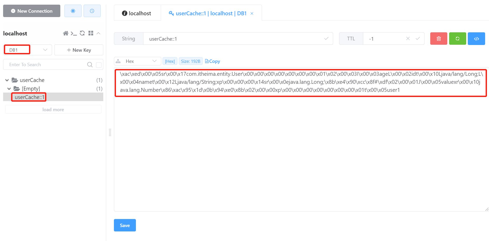 

再次查询相同id的数据时，直接从redis中直接获取，不再查询数据库。


**4). @CacheEvict注解**

**@CacheEvict 说明：** 

​	作用: 清理指定缓存

​	value: 缓存的名称，每个缓存名称下面可以有多个key

​	key: 缓存的key  ----------> 支持Spring的表达式语言SPEL语法


**在 delete 方法上加注解@CacheEvict**

```java
	@DeleteMapping
    @CacheEvict(cacheNames = "userCache",key = "#id")//删除某个key对应的缓存数据
    public void deleteById(Long id){
        userMapper.deleteById(id);
    }

	@DeleteMapping("/delAll")
    @CacheEvict(cacheNames = "userCache",allEntries = true)//删除userCache下所有的缓存数据
    public void deleteAll(){
        userMapper.deleteAll();
    }
```

**重启服务,通过swagger接口文档测试，访问UserController的deleteAll()方法**

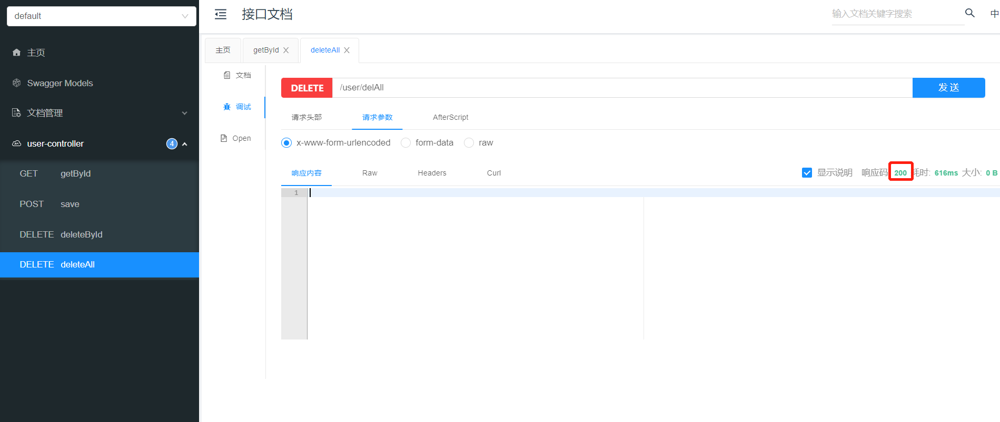 

**查看user表：**数据清空

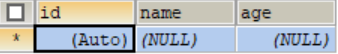 

**查询Redis缓存数据**

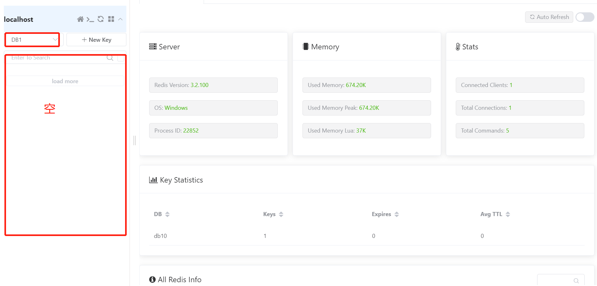 


### 2.2 实现思路

**实现步骤：**

1). 导入Spring Cache和Redis相关maven坐标

2). 在启动类上加入@EnableCaching注解，开启缓存注解功能

3). 在用户端接口SetmealController的 list 方法上加入@Cacheable注解

4). 在管理端接口SetmealController的 save、delete、update、startOrStop等方法上加入CacheEvict注解


### 2.3 代码开发

按照上述实现步骤：

**1). 导入Spring Cache和Redis相关maven坐标(已实现)**

```xml
<dependency>
      <groupId>org.springframework.boot</groupId>
      <artifactId>spring-boot-starter-data-redis</artifactId>
</dependency>

<dependency>
      <groupId>org.springframework.boot</groupId>
      <artifactId>spring-boot-starter-cache</artifactId>
</dependency>
```


**2). 在启动类上加入@EnableCaching注解，开启缓存注解功能**

```java
package com.sky;

import lombok.extern.slf4j.Slf4j;
import org.springframework.boot.SpringApplication;
import org.springframework.boot.autoconfigure.SpringBootApplication;
import org.springframework.cache.annotation.EnableCaching;
import org.springframework.transaction.annotation.EnableTransactionManagement;

@SpringBootApplication
@EnableTransactionManagement //开启注解方式的事务管理
@Slf4j
@EnableCaching
public class SkyApplication {
    public static void main(String[] args) {
        SpringApplication.run(SkyApplication.class, args);
        log.info("server started");
    }
}
```


**3). 在用户端接口SetmealController的 list 方法上加入@Cacheable注解**

```java
	/**
     * 条件查询
     *
     * @param categoryId
     * @return
     */
    @GetMapping("/list")
    @ApiOperation("根据分类id查询套餐")
    @Cacheable(cacheNames = "setmealCache",key = "#categoryId") //key: setmealCache::100
    public Result<List<Setmeal>> list(Long categoryId) {
        Setmeal setmeal = new Setmeal();
        setmeal.setCategoryId(categoryId);
        setmeal.setStatus(StatusConstant.ENABLE);

        List<Setmeal> list = setmealService.list(setmeal);
        return Result.success(list);
    }
```


**4). 在管理端接口SetmealController的 save、delete、update、startOrStop等方法上加入CacheEvict注解**

```java
	/**
     * 新增套餐
     *
     * @param setmealDTO
     * @return
     */
    @PostMapping
    @ApiOperation("新增套餐")
    @CacheEvict(cacheNames = "setmealCache",key = "#setmealDTO.categoryId")//key: setmealCache::100
    public Result save(@RequestBody SetmealDTO setmealDTO) {
        setmealService.saveWithDish(setmealDTO);
        return Result.success();
    }
	/**
     * 批量删除套餐
     *
     * @param ids
     * @return
     */
    @DeleteMapping
    @ApiOperation("批量删除套餐")
    @CacheEvict(cacheNames = "setmealCache",allEntries = true)
    public Result delete(@RequestParam List<Long> ids) {
        setmealService.deleteBatch(ids);
        return Result.success();
    }
	/**
     * 修改套餐
     *
     * @param setmealDTO
     * @return
     */
    @PutMapping
    @ApiOperation("修改套餐")
    @CacheEvict(cacheNames = "setmealCache",allEntries = true)
    public Result update(@RequestBody SetmealDTO setmealDTO) {
        setmealService.update(setmealDTO);
        return Result.success();
    }

    /**
     * 套餐起售停售
     *
     * @param status
     * @param id
     * @return
     */
    @PostMapping("/status/{status}")
    @ApiOperation("套餐起售停售")
    @CacheEvict(cacheNames = "setmealCache",allEntries = true)
    public Result startOrStop(@PathVariable Integer status, Long id) {
        setmealService.startOrStop(status, id);
        return Result.success();
    }
```


### 2.4 功能测试

通过前后端联调方式来进行测试，同时观察redis中缓存的套餐数据。和**缓存菜品**功能测试基本一致，不再赘述。


### 2.5 代码提交

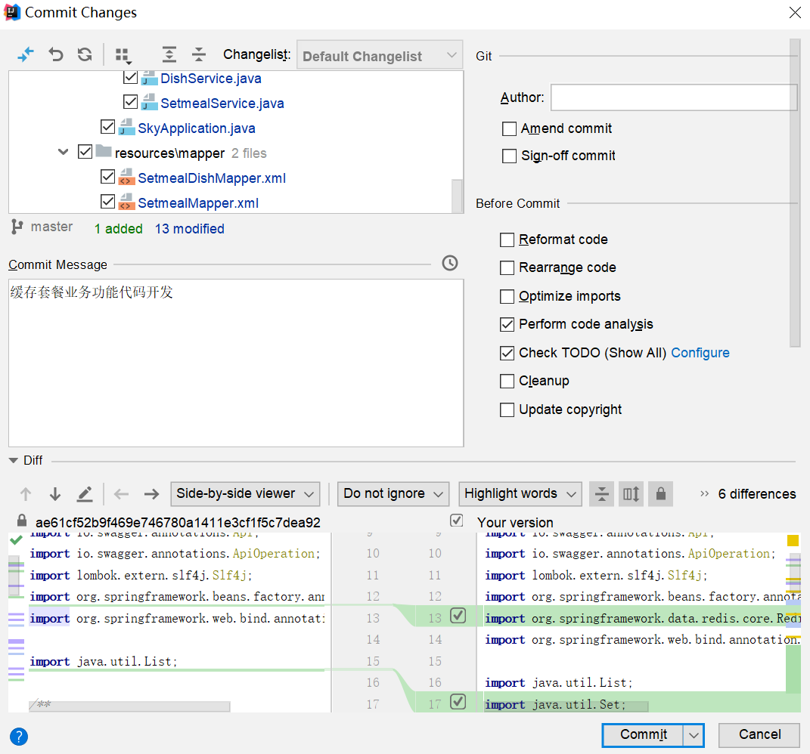 

后续步骤和其它功能代码提交一致，不再赘述。


## 3. 添加购物车

### 3.1 需求分析和设计

#### 3.1.1 产品原型

用户可以将菜品或者套餐添加到购物车。对于菜品来说，如果设置了口味信息，则需要选择规格后才能加入购物车;对于套餐来说，可以直接点击将当前套餐加入购物车。在购物车中可以修改菜品和套餐的数量，也可以清空购物车。

**效果图：**

 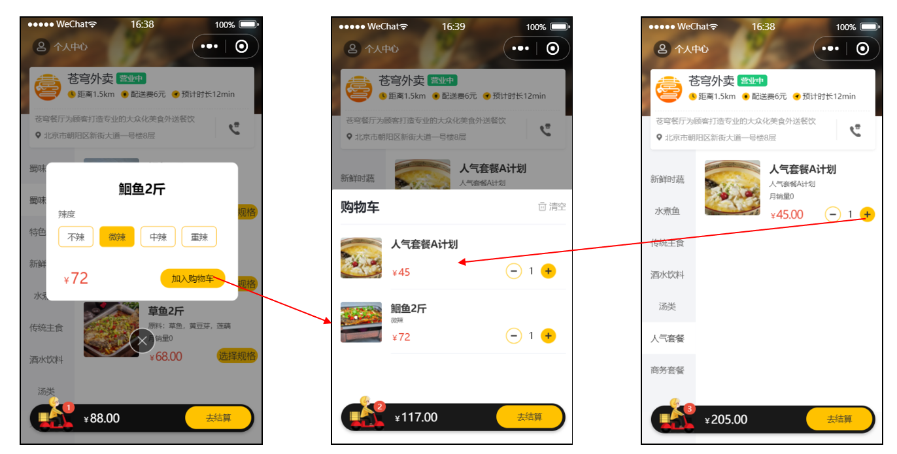 


#### 3.1.2 接口设计

通过上述原型图，设计出对应的添加购物车接口。

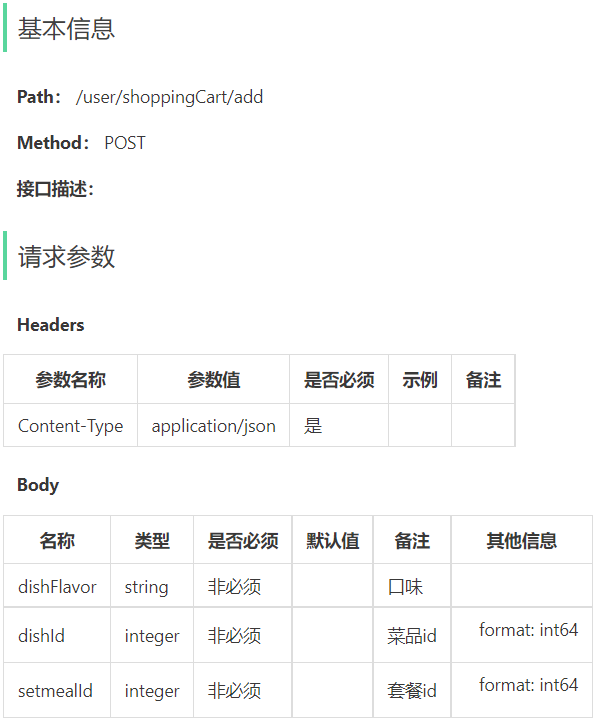 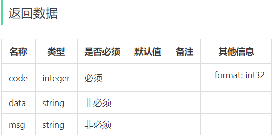

**说明：**添加购物车时，有可能添加菜品，也有可能添加套餐。故传入参数要么是菜品id，要么是套餐id。


#### 3.1.3 表设计

用户的购物车数据，也是需要保存在数据库中的，购物车对应的数据表为shopping_cart表，具体表结构如下：

| **字段名**  | **数据类型**  | **说明**     | **备注** |
| ----------- | ------------- | ------------ | -------- |
| id          | bigint        | 主键         | 自增     |
| name        | varchar(32)   | 商品名称     | 冗余字段 |
| image       | varchar(255)  | 商品图片路径 | 冗余字段 |
| user_id     | bigint        | 用户id       | 逻辑外键 |
| dish_id     | bigint        | 菜品id       | 逻辑外键 |
| setmeal_id  | bigint        | 套餐id       | 逻辑外键 |
| dish_flavor | varchar(50)   | 菜品口味     |          |
| number      | int           | 商品数量     |          |
| amount      | decimal(10,2) | 商品单价     | 冗余字段 |
| create_time | datetime      | 创建时间     |          |

**说明：** 

- 购物车数据是关联用户的，在表结构中，我们需要记录，每一个用户的购物车数据是哪些
- 菜品列表展示出来的既有套餐，又有菜品，如果用户选择的是套餐，就保存套餐ID(setmeal_id)，如果用户选择的是菜品，就保存菜品ID(dish_id)
- 对同一个菜品/套餐，如果选择多份不需要添加多条记录，增加数量number即可


### 3.2 代码开发

#### 3.2.1 DTO设计

**根据添加购物车接口的参数设计DTO：**

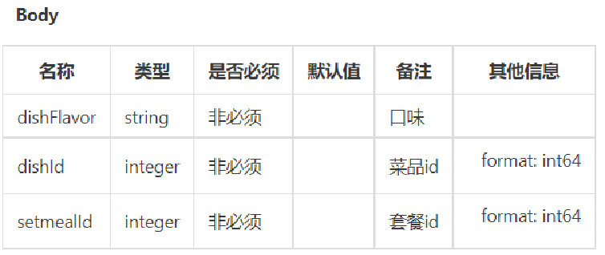 

在sky-pojo模块，ShoppingCartDTO.java已定义

```java
package com.sky.dto;

import lombok.Data;
import java.io.Serializable;

@Data
public class ShoppingCartDTO implements Serializable {

    private Long dishId;
    private Long setmealId;
    private String dishFlavor;

}
```


#### 3.2.2 Controller层

**根据添加购物车接口创建ShoppingCartController：**

```java
package com.sky.controller.user;


import com.sky.dto.ShoppingCartDTO;
import com.sky.result.Result;
import io.swagger.annotations.Api;
import io.swagger.annotations.ApiOperation;
import lombok.extern.slf4j.Slf4j;
import org.springframework.beans.factory.annotation.Autowired;
import org.springframework.web.bind.annotation.PostMapping;
import org.springframework.web.bind.annotation.RequestBody;
import org.springframework.web.bind.annotation.RequestMapping;
import org.springframework.web.bind.annotation.RestController;

/**
 * 购物车
 */
@RestController
@RequestMapping("/user/shoppingCart")
@Slf4j
@Api(tags = "C端-购物车接口")
public class ShoppingCartController {

    @Autowired
    private ShoppingCartService shoppingCartService;

    /**
     * 添加购物车
     * @param shoppingCartDTO
     * @return
     */
    @PostMapping("/add")
    @ApiOperation("添加购物车")
    public Result<String> add(@RequestBody ShoppingCartDTO shoppingCartDTO){
        log.info("添加购物车：{}", shoppingCartDTO);
        shoppingCartService.addShoppingCart(shoppingCartDTO);//后绪步骤实现
        return Result.success();
    }
}
```


#### 3.2.3 Service层接口

**创建ShoppingCartService接口：**

```java
package com.sky.service;

import com.sky.dto.ShoppingCartDTO;
import com.sky.entity.ShoppingCart;
import java.util.List;

public interface ShoppingCartService {

    /**
     * 添加购物车
     * @param shoppingCartDTO
     */
    void addShoppingCart(ShoppingCartDTO shoppingCartDTO);
}
```


#### 3.2.4 Service层实现类

**创建ShoppingCartServiceImpl实现类，并实现add方法：**

```java
package com.sky.service.impl;


import com.sky.context.BaseContext;
import com.sky.dto.ShoppingCartDTO;
import com.sky.entity.Dish;
import com.sky.entity.Setmeal;
import com.sky.entity.ShoppingCart;
import com.sky.mapper.DishMapper;
import com.sky.mapper.SetmealMapper;
import com.sky.service.ShoppingCartService;
import org.springframework.beans.BeanUtils;
import org.springframework.beans.factory.annotation.Autowired;
import org.springframework.stereotype.Service;
import java.time.LocalDateTime;
import java.util.List;

@Service
public class ShoppingCartServiceImpl implements ShoppingCartService {

    @Autowired
    private ShoppingCartMapper shoppingCartMapper;
    @Autowired
    private DishMapper dishMapper;
    @Autowired
    private SetmealMapper setmealMapper;
    
    /**
     * 添加购物车
     *
     * @param shoppingCartDTO
     */
    public void addShoppingCart(ShoppingCartDTO shoppingCartDTO) {
        ShoppingCart shoppingCart = new ShoppingCart();
        BeanUtils.copyProperties(shoppingCartDTO, shoppingCart);
        //只能查询自己的购物车数据
        shoppingCart.setUserId(BaseContext.getCurrentId());

        //判断当前商品是否在购物车中
        List<ShoppingCart> shoppingCartList = shoppingCartMapper.list(shoppingCart);

        if (shoppingCartList != null && shoppingCartList.size() == 1) {
            //如果已经存在，就更新数量，数量加1
            shoppingCart = shoppingCartList.get(0);
            shoppingCart.setNumber(shoppingCart.getNumber() + 1);
            shoppingCartMapper.updateNumberById(shoppingCart);
        } else {
            //如果不存在，插入数据，数量就是1

            //判断当前添加到购物车的是菜品还是套餐
            Long dishId = shoppingCartDTO.getDishId();
            if (dishId != null) {
                //添加到购物车的是菜品
                Dish dish = dishMapper.getById(dishId);
                shoppingCart.setName(dish.getName());
                shoppingCart.setImage(dish.getImage());
                shoppingCart.setAmount(dish.getPrice());
            } else {
                //添加到购物车的是套餐
                Setmeal setmeal = setmealMapper.getById(shoppingCartDTO.getSetmealId());
                shoppingCart.setName(setmeal.getName());
                shoppingCart.setImage(setmeal.getImage());
                shoppingCart.setAmount(setmeal.getPrice());
            }
            shoppingCart.setNumber(1);
            shoppingCart.setCreateTime(LocalDateTime.now());
            shoppingCartMapper.insert(shoppingCart);
        }
    }
}
```


#### 3.2.5 Mapper层

**创建ShoppingCartMapper接口:**

```java
package com.sky.mapper;

import com.sky.entity.ShoppingCart;
import org.apache.ibatis.annotations.Delete;
import org.apache.ibatis.annotations.Insert;
import org.apache.ibatis.annotations.Mapper;
import org.apache.ibatis.annotations.Update;
import java.util.List;

@Mapper
public interface ShoppingCartMapper {
    /**
     * 条件查询
     *
     * @param shoppingCart
     * @return
     */
    List<ShoppingCart> list(ShoppingCart shoppingCart);

    /**
     * 更新商品数量
     *
     * @param shoppingCart
     */
    @Update("update shopping_cart set number = #{number} where id = #{id}")
    void updateNumberById(ShoppingCart shoppingCart);

    /**
     * 插入购物车数据
     *
     * @param shoppingCart
     */
    @Insert("insert into shopping_cart (name, user_id, dish_id, setmeal_id, dish_flavor, number, amount, image, create_time) " +
            " values (#{name},#{userId},#{dishId},#{setmealId},#{dishFlavor},#{number},#{amount},#{image},#{createTime})")
    void insert(ShoppingCart shoppingCart);

}
```

**创建ShoppingCartMapper.xml：**

```xml
<?xml version="1.0" encoding="UTF-8" ?>
<!DOCTYPE mapper PUBLIC "-//mybatis.org//DTD Mapper 3.0//EN" "http://mybatis.org/dtd/mybatis-3-mapper.dtd" >
<mapper namespace="com.sky.mapper.ShoppingCartMapper">
    <select id="list" parameterType="ShoppingCart" resultType="ShoppingCart">
        select * from shopping_cart
        <where>
            <if test="userId != null">
                and user_id = #{userId}
            </if>
            <if test="dishId != null">
                and dish_id = #{dishId}
            </if>
            <if test="setmealId != null">
                and setmeal_id = #{setmealId}
            </if>
            <if test="dishFlavor != null">
                and dish_flavor = #{dishFlavor}
            </if>
        </where>
        order by create_time desc
    </select>
</mapper>
```


### 3.3 功能测试

进入小程序，添加菜品

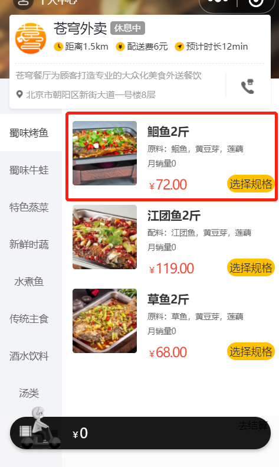 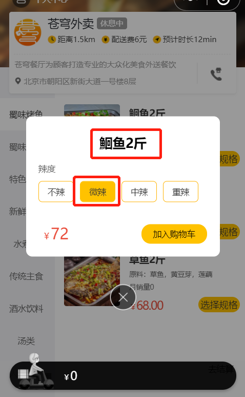

加入购物车，查询数据库

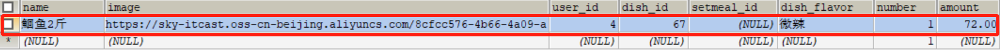 

因为现在没有实现查看购物车功能，所以只能在表中进行查看。

在前后联调时，后台可通断点方式启动，查看运行的每一步。


### 3.4 代码提交

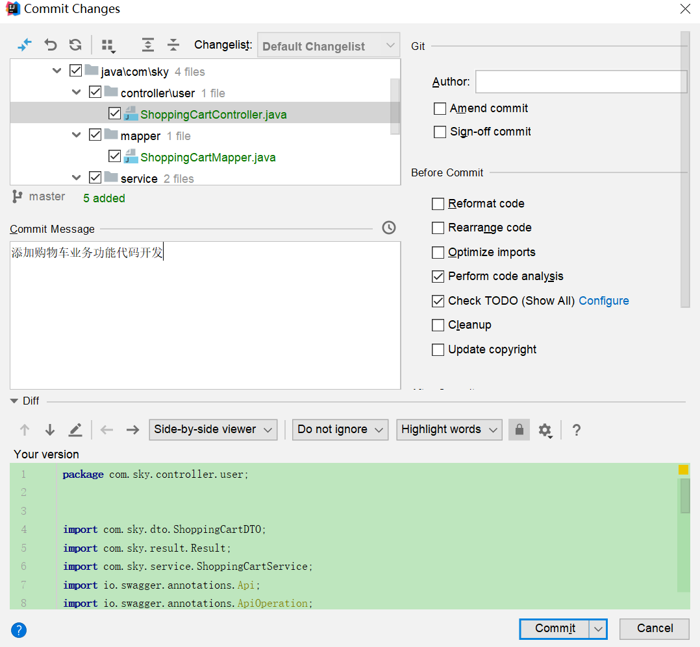 

后续步骤和其它功能代码提交一致，不再赘述。


## 4. 查看购物车

### 4.1 需求分析和设计

#### 4.1.1 产品原型

当用户添加完菜品和套餐后，可进入到购物车中，查看购物中的菜品和套餐。

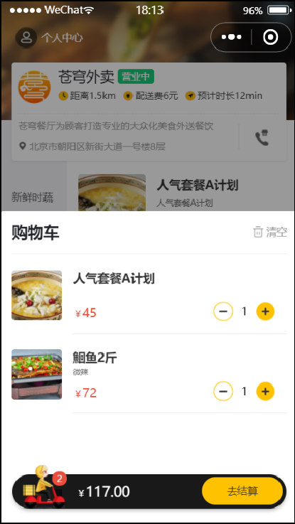 


#### 4.1.2 接口设计

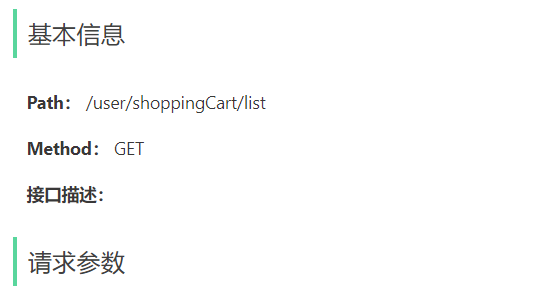 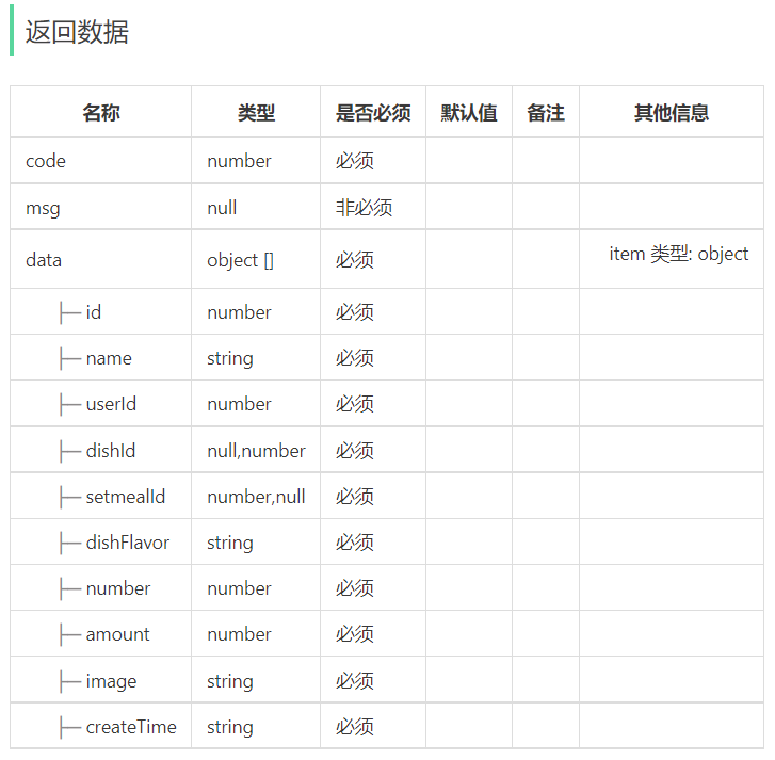


### 4.2 代码开发

#### 4.2.1 Controller层

**在ShoppingCartController中创建查看购物车的方法：**

```java
	/**
     * 查看购物车
     * @return
     */
    @GetMapping("/list")
    @ApiOperation("查看购物车")
    public Result<List<ShoppingCart>> list(){
        return Result.success(shoppingCartService.showShoppingCart());
    }
```


#### 4.2.2 Service层接口

**在ShoppingCartService接口中声明查看购物车的方法：**

```java
	/**
     * 查看购物车
     * @return
     */
    List<ShoppingCart> showShoppingCart();
```


#### 4.2.3 Service层实现类

**在ShoppingCartServiceImpl中实现查看购物车的方法：**

```java
	/**
     * 查看购物车
     * @return
     */
    public List<ShoppingCart> showShoppingCart() {
        return shoppingCartMapper.list(ShoppingCart.
                                       builder().
                                       userId(BaseContext.getCurrentId()).
                                       build());
    }
```


### 4.3 功能测试

当进入小程序时，就会发起查看购物车的请求

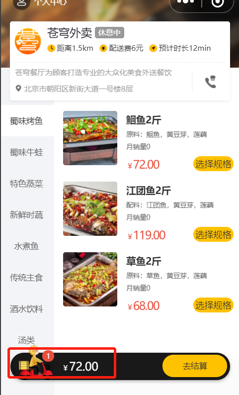 

点击购物车图标

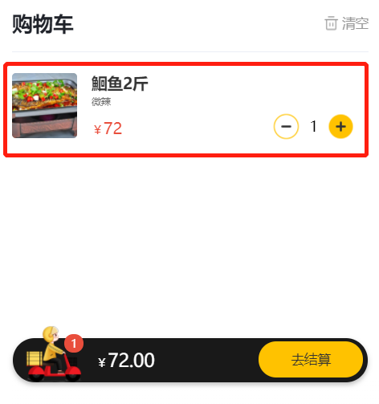 

测试成功。


### 4.4 代码提交

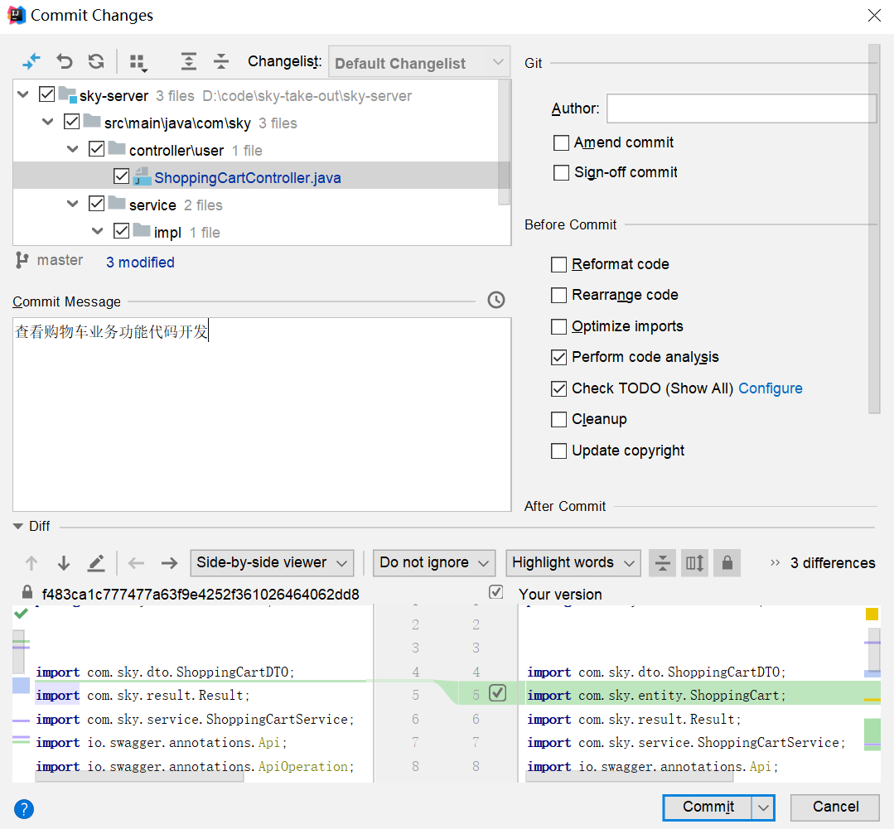 

后续步骤和其它功能代码提交一致，不再赘述。


## 5. 清空购物车

### 5.1 需求分析和设计

#### 5.1.1 产品原型

当点击清空按钮时，会把购物车中的数据全部清空。

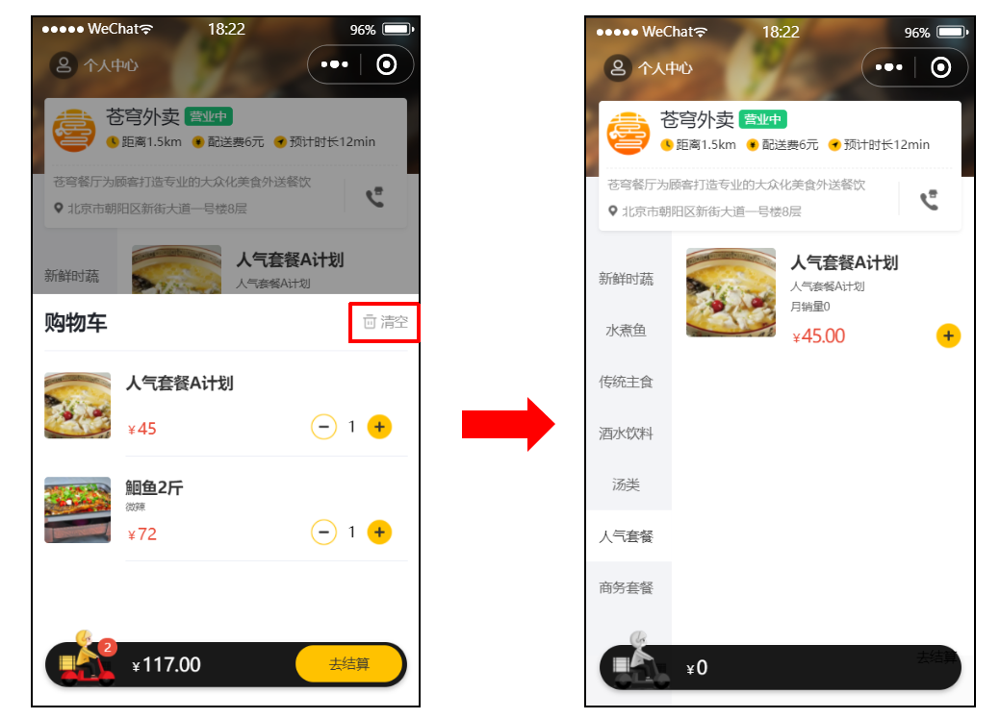 


#### 5.1.2 接口设计

 


### 5.2 代码开发

#### 5.2.1 Controller层

**在ShoppingCartController中创建清空购物车的方法：**

```java
	/**
     * 清空购物车商品
     * @return
     */
    @DeleteMapping("/clean")
    @ApiOperation("清空购物车商品")
    public Result<String> clean(){
        shoppingCartService.cleanShoppingCart();
        return Result.success();
    }
```


#### 5.2.2 Service层接口

**在ShoppingCartService接口中声明清空购物车的方法：**

```java
	/**
     * 清空购物车商品
     */
    void cleanShoppingCart();
```


#### 5.2.3 Service层实现类

**在ShoppingCartServiceImpl中实现清空购物车的方法：**

```java
	/**
     * 清空购物车商品
     */
    public void cleanShoppingCart() {
        shoppingCartMapper.deleteByUserId(BaseContext.getCurrentId());
    }
```


#### 5.2.4 Mapper层

**在ShoppingCartMapper接口中创建删除购物车数据的方法：**

```java
	/**
     * 根据用户id删除购物车数据
     *
     * @param userId
     */
    @Delete("delete from shopping_cart where user_id = #{userId}")
    void deleteByUserId(Long userId);
```


### 5.3 功能测试

进入到购物车页面

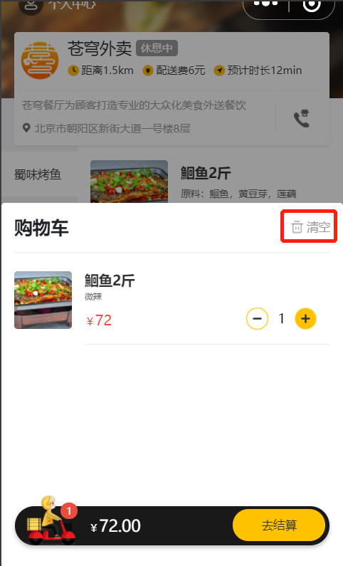 

点击清空

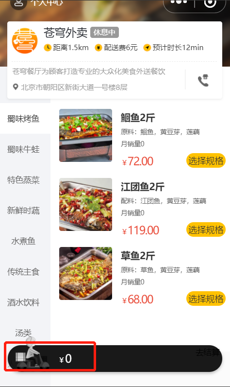 

查看数据库中的数据

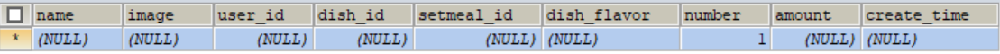 

说明当前用户的购物车数据已全部删除。


### 5.4 代码提交

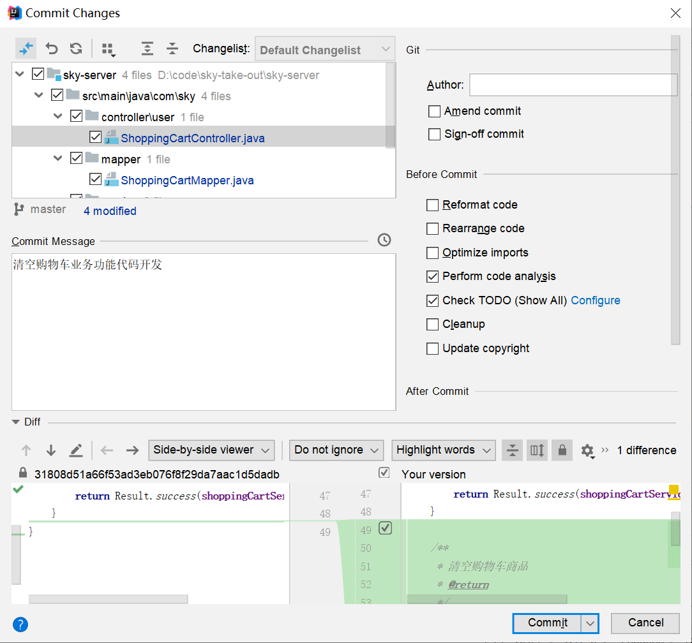 

后续步骤和其它功能代码提交一致，不再赘述。