#  苍穹外卖-day08

## 课程内容

- 导入地址簿功能代码
- 用户下单
- 订单支付


功能实现：**用户下单**、**订单支付**

**用户下单效果图：**

    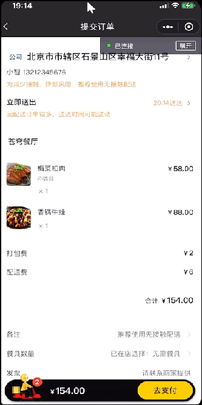     


**订单支付效果图：**

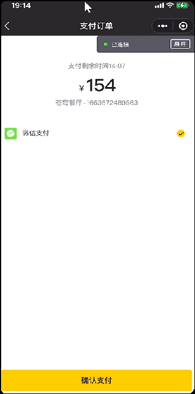    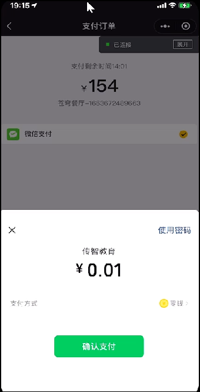    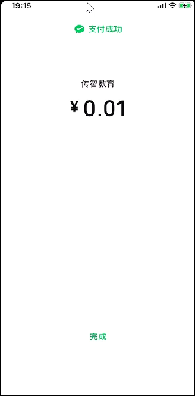


## 1. 导入地址簿功能代码

### 1.1 需求分析和设计

#### 1.1.1 产品原型

地址簿，指的是消费者用户的地址信息，用户登录成功后可以维护自己的地址信息。同一个用户可以有多个地址信息，但是只能有一个**默认地址**。

**效果图：**

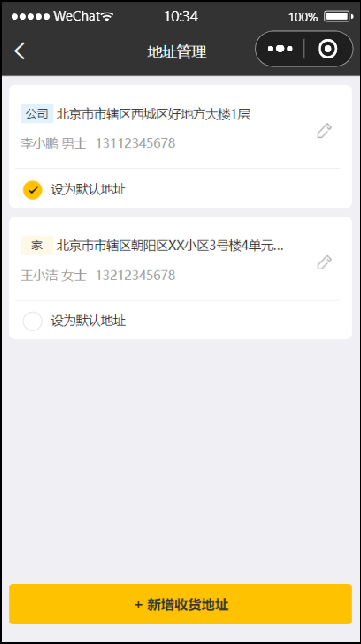      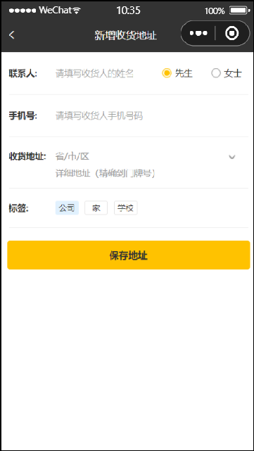        

对于地址簿管理，我们需要实现以下几个功能： 

- 查询地址列表
- 新增地址
- 修改地址
- 删除地址
- 设置默认地址
- 查询默认地址


#### 1.1.2 接口设计

根据上述原型图先**粗粒度**设计接口，共包含7个接口。

**接口设计：**

- 新增地址
- 查询登录用户所有地址
- 查询默认地址
- 根据id修改地址
- 根据id删除地址
- 根据id查询地址
- 设置默认地址

接下来**细粒度**分析每个接口，明确每个接口的请求方式、请求路径、传入参数和返回值。


**1). 新增地址**

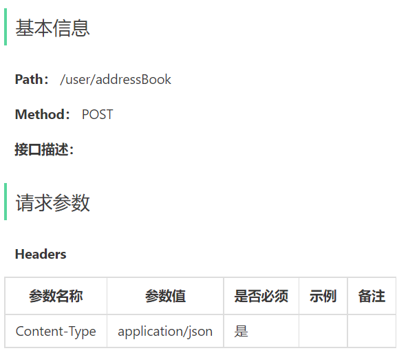 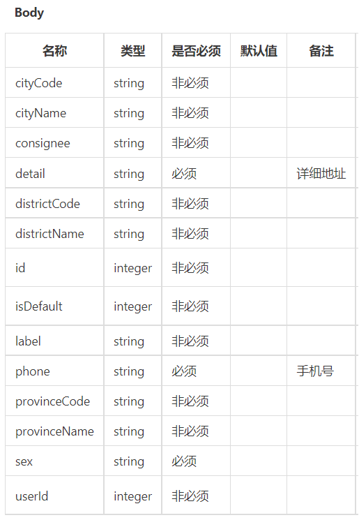 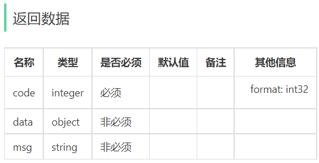 


**2). 查询登录用户所有地址**

 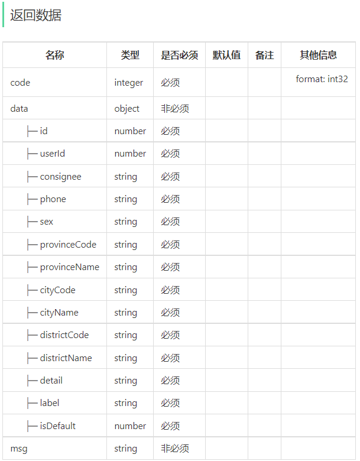 


**3). 查询默认地址**

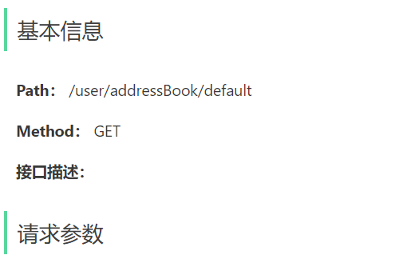 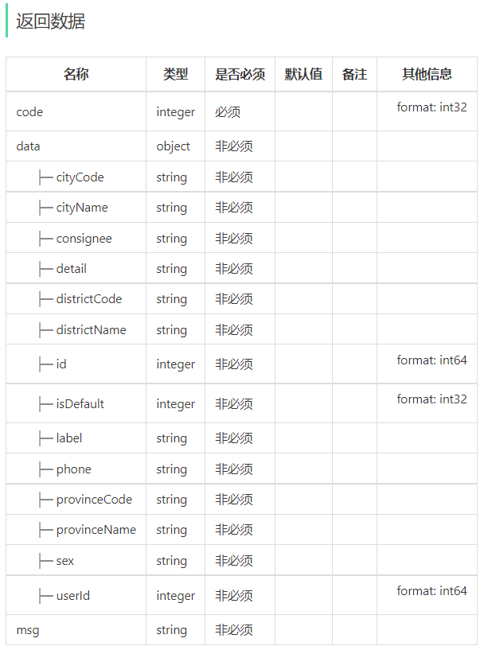 


**4). 修改地址**

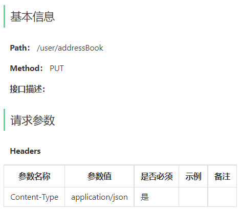 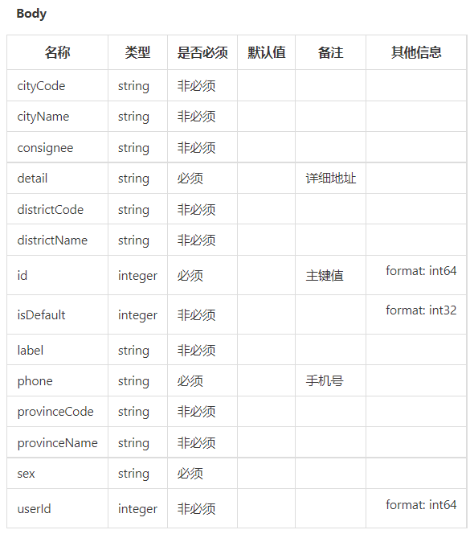 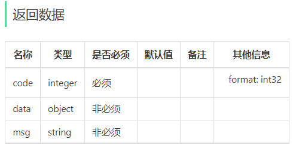 


**5). 根据id删除地址**

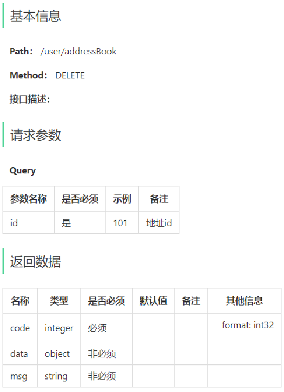 


**6). 根据id查询地址**

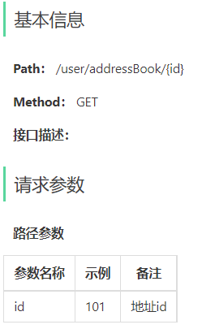 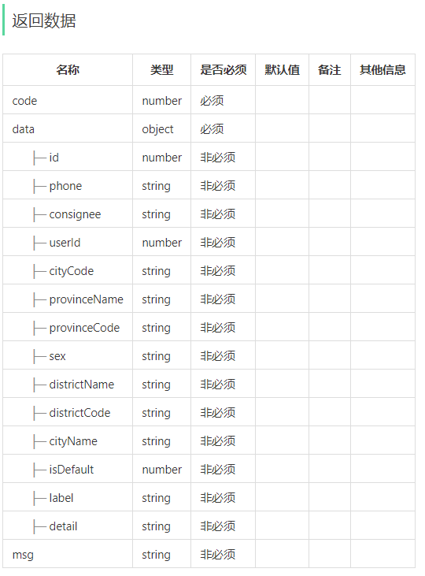 


**7). 设置默认地址**

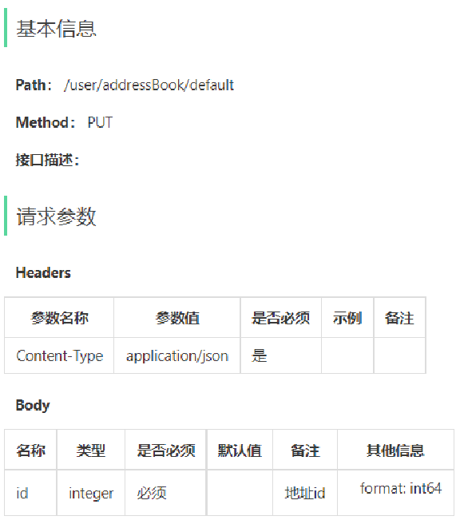 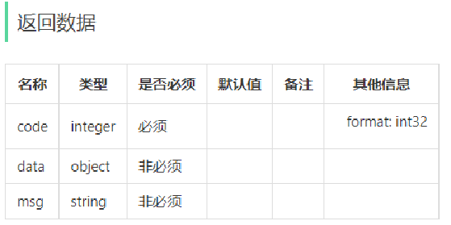 


#### 1.1.3 表设计

用户的地址信息会存储在address_book表，即地址簿表中。具体表结构如下：

| **字段名**    | **数据类型** | **说明**     | **备注**       |
| ------------- | ------------ | ------------ | -------------- |
| id            | bigint       | 主键         | 自增           |
| user_id       | bigint       | 用户id       | 逻辑外键       |
| consignee     | varchar(50)  | 收货人       |                |
| sex           | varchar(2)   | 性别         |                |
| phone         | varchar(11)  | 手机号       |                |
| province_code | varchar(12)  | 省份编码     |                |
| province_name | varchar(32)  | 省份名称     |                |
| city_code     | varchar(12)  | 城市编码     |                |
| city_name     | varchar(32)  | 城市名称     |                |
| district_code | varchar(12)  | 区县编码     |                |
| district_name | varchar(32)  | 区县名称     |                |
| detail        | varchar(200) | 详细地址信息 | 具体到门牌号   |
| label         | varchar(100) | 标签         | 公司、家、学校 |
| is_default    | tinyint(1)   | 是否默认地址 | 1是 0否        |

这里面有一个字段is_default，实际上我们在设置默认地址时，只需要更新这个字段就可以了。


### 1.2 代码导入

对于这一类的单表的增删改查，我们已经写过很多了，基本的开发思路都是一样的，那么本小节的用户地址簿管理的增删改查功能，我们就不再一一实现了，基本的代码我们都已经提供了，直接导入进来，做一个测试即可。

导入课程资料中的地址簿模块功能代码：

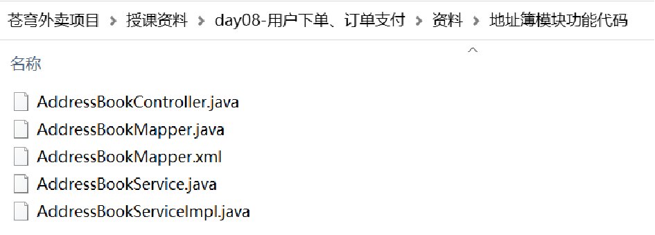 

进入到sky-server模块中

#### 1.2.1 Mapper层

**创建AddressBookMapper.java**

```java
package com.sky.mapper;

import com.sky.entity.AddressBook;
import org.apache.ibatis.annotations.*;
import java.util.List;

@Mapper
public interface AddressBookMapper {

    /**
     * 条件查询
     * @param addressBook
     * @return
     */
    List<AddressBook> list(AddressBook addressBook);

    /**
     * 新增
     * @param addressBook
     */
    @Insert("insert into address_book" +
            "        (user_id, consignee, phone, sex, province_code, province_name, city_code, city_name, district_code," +
            "         district_name, detail, label, is_default)" +
            "        values (#{userId}, #{consignee}, #{phone}, #{sex}, #{provinceCode}, #{provinceName}, #{cityCode}, #{cityName}," +
            "                #{districtCode}, #{districtName}, #{detail}, #{label}, #{isDefault})")
    void insert(AddressBook addressBook);

    /**
     * 根据id查询
     * @param id
     * @return
     */
    @Select("select * from address_book where id = #{id}")
    AddressBook getById(Long id);

    /**
     * 根据id修改
     * @param addressBook
     */
    void update(AddressBook addressBook);

    /**
     * 根据 用户id修改 是否默认地址
     * @param addressBook
     */
    @Update("update address_book set is_default = #{isDefault} where user_id = #{userId}")
    void updateIsDefaultByUserId(AddressBook addressBook);

    /**
     * 根据id删除地址
     * @param id
     */
    @Delete("delete from address_book where id = #{id}")
    void deleteById(Long id);

}
```

**创建AddressBookMapper.xml**

```xml
<?xml version="1.0" encoding="UTF-8" ?>
<!DOCTYPE mapper PUBLIC "-//mybatis.org//DTD Mapper 3.0//EN" "http://mybatis.org/dtd/mybatis-3-mapper.dtd" >
<mapper namespace="com.sky.mapper.AddressBookMapper">

    <select id="list" parameterType="AddressBook" resultType="AddressBook">
        select * from address_book
        <where>
            <if test="userId != null">
                and user_id = #{userId}
            </if>
            <if test="phone != null">
                and phone = #{phone}
            </if>
            <if test="isDefault != null">
                and is_default = #{isDefault}
            </if>
        </where>
    </select>

    <update id="update" parameterType="addressBook">
        update address_book
        <set>
            <if test="consignee != null">
                consignee = #{consignee},
            </if>
            <if test="sex != null">
                sex = #{sex},
            </if>
            <if test="phone != null">
                phone = #{phone},
            </if>
            <if test="detail != null">
                detail = #{detail},
            </if>
            <if test="label != null">
                label = #{label},
            </if>
            <if test="isDefault != null">
                is_default = #{isDefault},
            </if>
        </set>
        where id = #{id}
    </update>

</mapper>
```


#### 1.2.2 Service层

**创建AddressBookService.java**

```java
package com.sky.service;

import com.sky.entity.AddressBook;
import java.util.List;

public interface AddressBookService {

    List<AddressBook> list(AddressBook addressBook);

    void save(AddressBook addressBook);

    AddressBook getById(Long id);

    void update(AddressBook addressBook);

    void setDefault(AddressBook addressBook);

    void deleteById(Long id);

}
```

**创建AddressBookServiceImpl.java**

```java
package com.sky.service.impl;

import com.sky.context.BaseContext;
import com.sky.entity.AddressBook;
import com.sky.mapper.AddressBookMapper;
import com.sky.service.AddressBookService;
import lombok.extern.slf4j.Slf4j;
import org.springframework.beans.factory.annotation.Autowired;
import org.springframework.stereotype.Service;
import org.springframework.transaction.annotation.Transactional;
import java.util.List;

@Service
@Slf4j
public class AddressBookServiceImpl implements AddressBookService {
    @Autowired
    private AddressBookMapper addressBookMapper;

    /**
     * 条件查询
     *
     * @param addressBook
     * @return
     */
    public List<AddressBook> list(AddressBook addressBook) {
        return addressBookMapper.list(addressBook);
    }

    /**
     * 新增地址
     *
     * @param addressBook
     */
    public void save(AddressBook addressBook) {
        addressBook.setUserId(BaseContext.getCurrentId());
        addressBook.setIsDefault(0);
        addressBookMapper.insert(addressBook);
    }

    /**
     * 根据id查询
     *
     * @param id
     * @return
     */
    public AddressBook getById(Long id) {
        AddressBook addressBook = addressBookMapper.getById(id);
        return addressBook;
    }

    /**
     * 根据id修改地址
     *
     * @param addressBook
     */
    public void update(AddressBook addressBook) {
        addressBookMapper.update(addressBook);
    }

    /**
     * 设置默认地址
     *
     * @param addressBook
     */
    @Transactional
    public void setDefault(AddressBook addressBook) {
        //1、将当前用户的所有地址修改为非默认地址 update address_book set is_default = ? where user_id = ?
        addressBook.setIsDefault(0);
        addressBook.setUserId(BaseContext.getCurrentId());
        addressBookMapper.updateIsDefaultByUserId(addressBook);

        //2、将当前地址改为默认地址 update address_book set is_default = ? where id = ?
        addressBook.setIsDefault(1);
        addressBookMapper.update(addressBook);
    }

    /**
     * 根据id删除地址
     *
     * @param id
     */
    public void deleteById(Long id) {
        addressBookMapper.deleteById(id);
    }

}
```


#### 1.2.3 Controller层

```java
package com.sky.controller.user;

import com.sky.context.BaseContext;
import com.sky.entity.AddressBook;
import com.sky.result.Result;
import com.sky.service.AddressBookService;
import io.swagger.annotations.Api;
import io.swagger.annotations.ApiOperation;
import org.springframework.beans.factory.annotation.Autowired;
import org.springframework.web.bind.annotation.*;
import java.util.List;

@RestController
@RequestMapping("/user/addressBook")
@Api(tags = "C端地址簿接口")
public class AddressBookController {

    @Autowired
    private AddressBookService addressBookService;

    /**
     * 查询当前登录用户的所有地址信息
     *
     * @return
     */
    @GetMapping("/list")
    @ApiOperation("查询当前登录用户的所有地址信息")
    public Result<List<AddressBook>> list() {
        AddressBook addressBook = new AddressBook();
        addressBook.setUserId(BaseContext.getCurrentId());
        List<AddressBook> list = addressBookService.list(addressBook);
        return Result.success(list);
    }

    /**
     * 新增地址
     *
     * @param addressBook
     * @return
     */
    @PostMapping
    @ApiOperation("新增地址")
    public Result save(@RequestBody AddressBook addressBook) {
        addressBookService.save(addressBook);
        return Result.success();
    }

    @GetMapping("/{id}")
    @ApiOperation("根据id查询地址")
    public Result<AddressBook> getById(@PathVariable Long id) {
        AddressBook addressBook = addressBookService.getById(id);
        return Result.success(addressBook);
    }

    /**
     * 根据id修改地址
     *
     * @param addressBook
     * @return
     */
    @PutMapping
    @ApiOperation("根据id修改地址")
    public Result update(@RequestBody AddressBook addressBook) {
        addressBookService.update(addressBook);
        return Result.success();
    }

    /**
     * 设置默认地址
     *
     * @param addressBook
     * @return
     */
    @PutMapping("/default")
    @ApiOperation("设置默认地址")
    public Result setDefault(@RequestBody AddressBook addressBook) {
        addressBookService.setDefault(addressBook);
        return Result.success();
    }

    /**
     * 根据id删除地址
     *
     * @param id
     * @return
     */
    @DeleteMapping
    @ApiOperation("根据id删除地址")
    public Result deleteById(Long id) {
        addressBookService.deleteById(id);
        return Result.success();
    }

    /**
     * 查询默认地址
     */
    @GetMapping("default")
    @ApiOperation("查询默认地址")
    public Result<AddressBook> getDefault() {
        //SQL:select * from address_book where user_id = ? and is_default = 1
        AddressBook addressBook = new AddressBook();
        addressBook.setIsDefault(1);
        addressBook.setUserId(BaseContext.getCurrentId());
        List<AddressBook> list = addressBookService.list(addressBook);

        if (list != null && list.size() == 1) {
            return Result.success(list.get(0));
        }

        return Result.error("没有查询到默认地址");
    }

}
```


### 1.3 功能测试

可以通过如下方式进行测试：

- 查看控制台sql和数据库中的数据变化
- Swagger接口文档测试
- 前后端联调

我们直接使用**前后端联调**测试：

启动后台服务，编译小程序

登录进入首页-->进入个人中心-->进入地址管理

 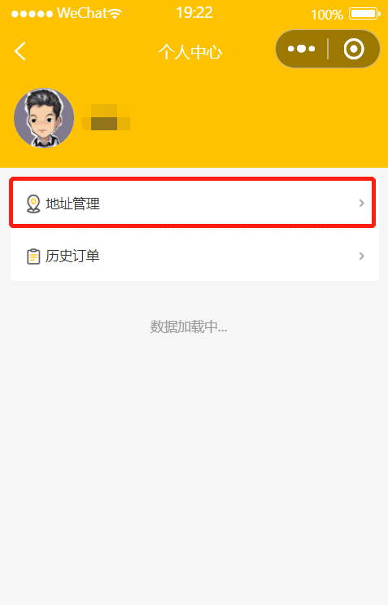  


**1). 新增收货地址**

**添加两条收货地址：**

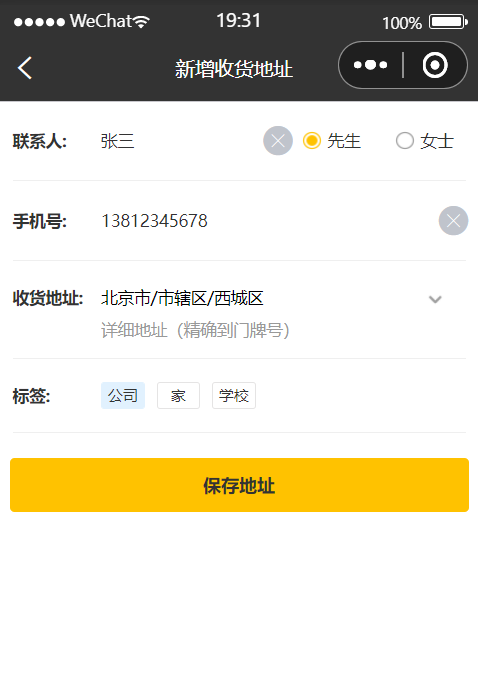 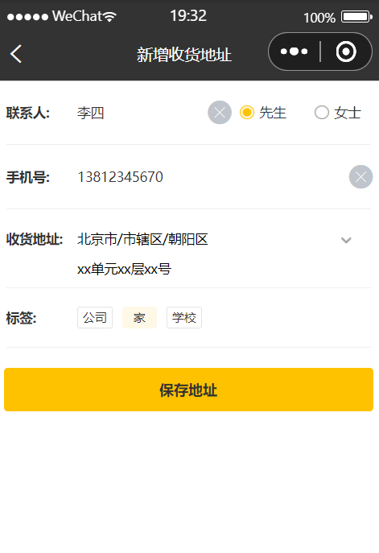 


**查看收货地址：**

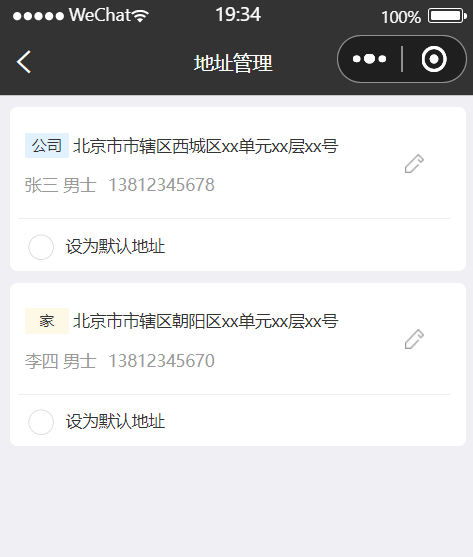 


**查看数据库：**

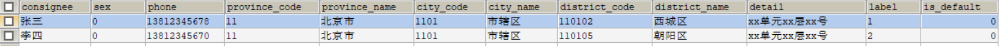 


**2). 设置默认收货地址**

**设置默认地址：**

 

**查看数据库：**

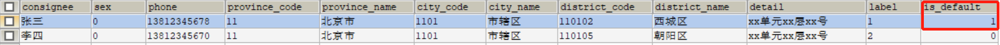 


**3). 删除收货地址**

**进行编辑：**

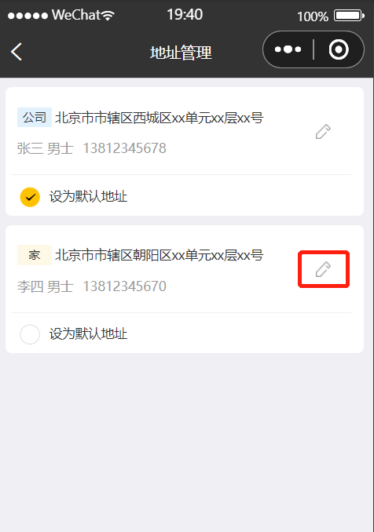 

**删除地址：**

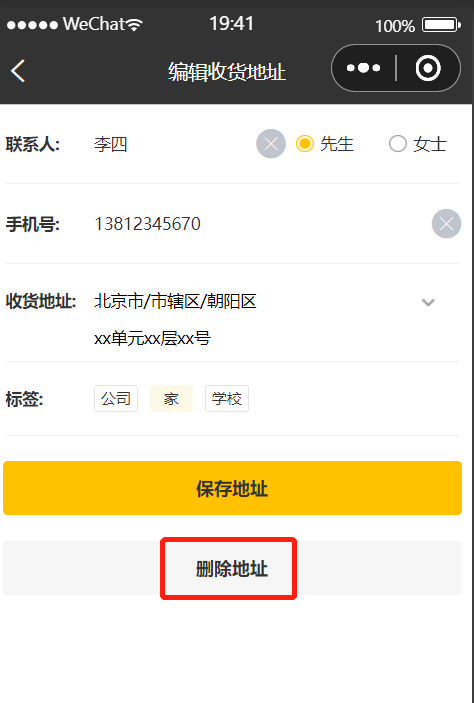 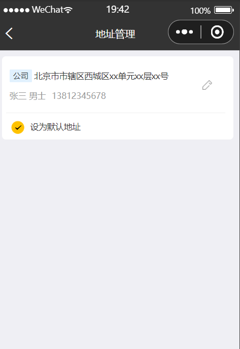

**查看数据库：**

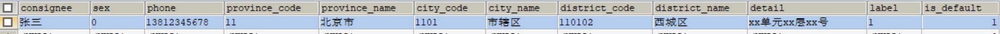 


### 1.4 代码提交

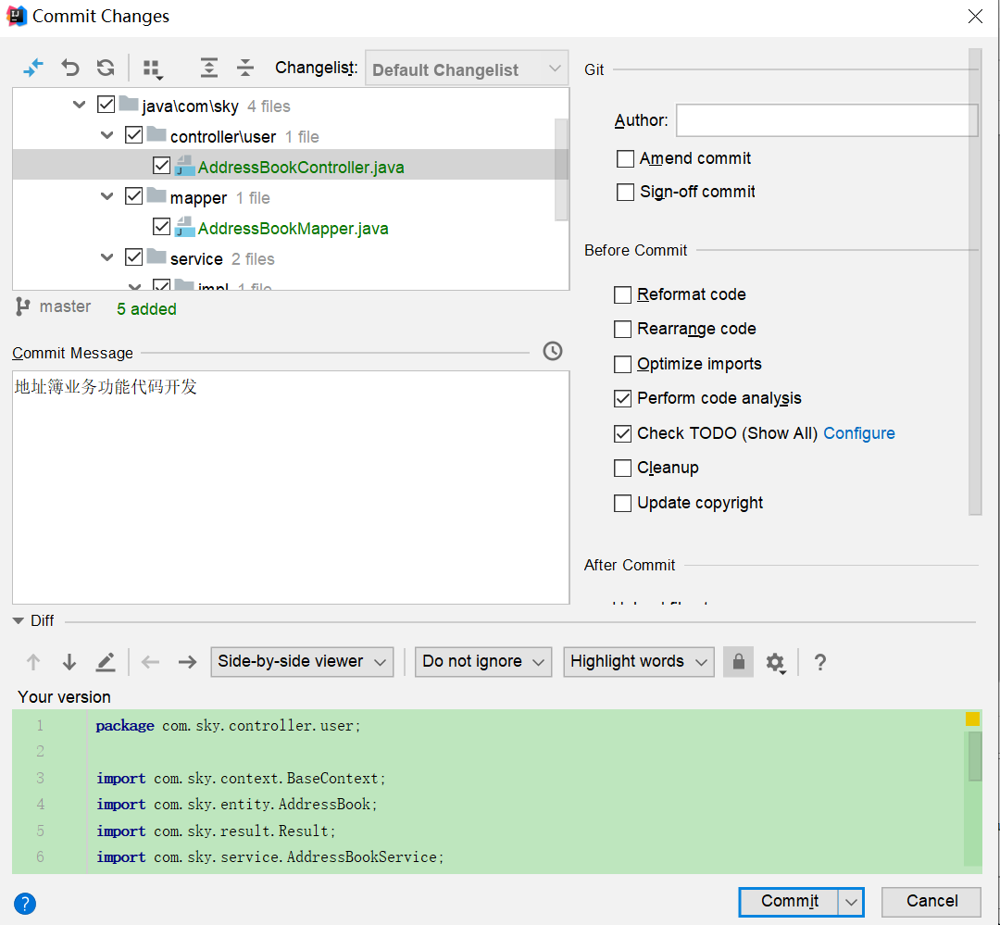 

后续步骤和其它功能代码提交一致，不再赘述。


## 2. 用户下单

### 2.1 需求分析和设计

#### 2.1.1 产品原型

**用户下单业务说明：**
在电商系统中，用户是通过下单的方式通知商家，用户已经购买了商品，需要商家进行备货和发货。
用户下单后会产生订单相关数据，订单数据需要能够体现如下信息：

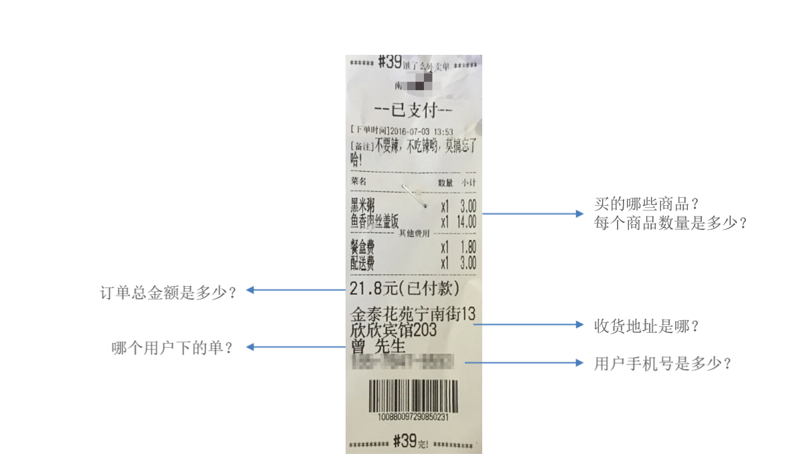 

用户将菜品或者套餐加入购物车后，可以点击购物车中的 "去结算" 按钮，页面跳转到订单确认页面，点击 "去支付" 按钮则完成下单操作。

**用户点餐业务流程(效果图)：**

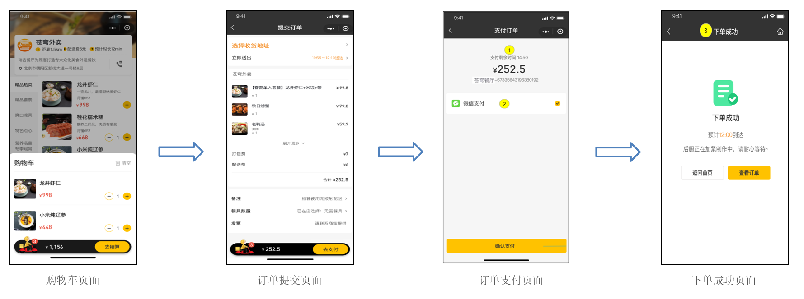 


#### 2.1.2 接口设计

**接口分析：**

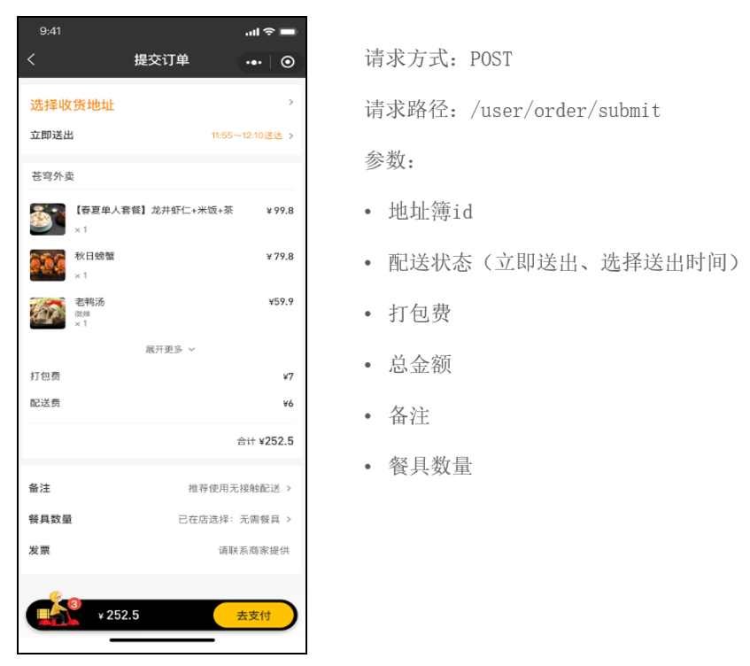 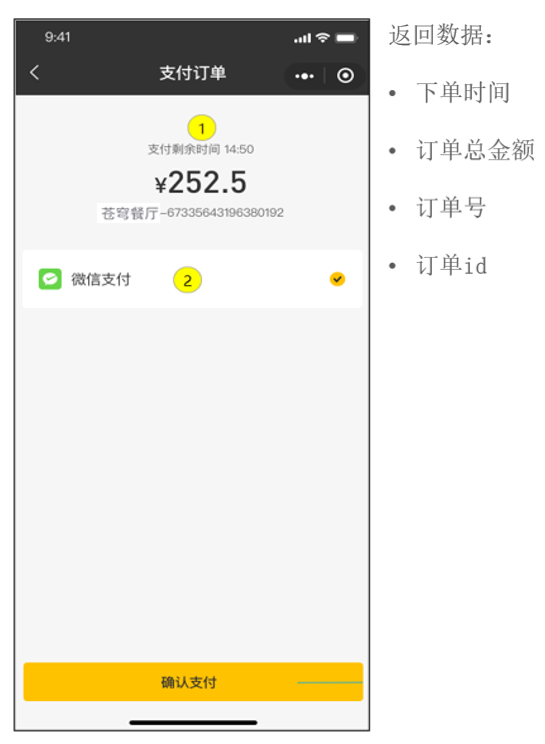 


**接口设计：**

 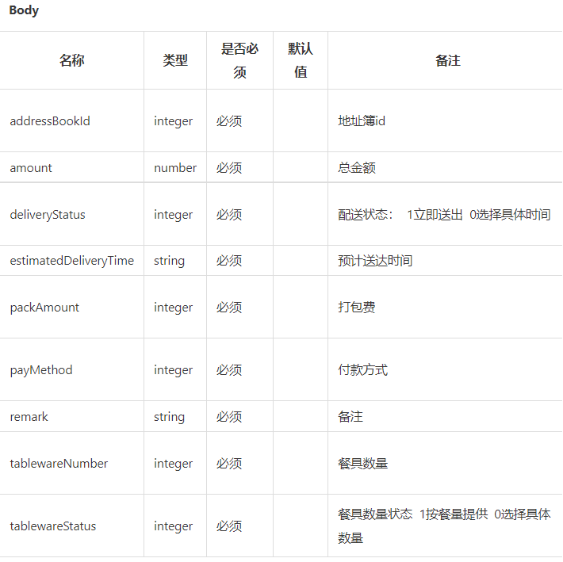 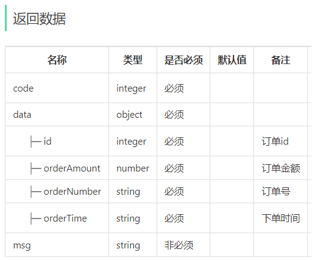 


#### 2.1.3 表设计

用户下单业务对应的数据表为orders表和order_detail表(一对多关系,一个订单关联多个订单明细)：

| 表名         | 含义       | 说明                                                         |
| ------------ | ---------- | ------------------------------------------------------------ |
| orders       | 订单表     | 主要存储订单的基本信息(如: 订单号、状态、金额、支付方式、下单用户、收件地址等) |
| order_detail | 订单明细表 | 主要存储订单详情信息(如: 该订单关联的套餐及菜品的信息)       |

具体的表结构如下: 

**1). orders订单表**

| **字段名**              | **数据类型**  | **说明**     | **备注**                                        |
| ----------------------- | ------------- | ------------ | ----------------------------------------------- |
| id                      | bigint        | 主键         | 自增                                            |
| number                  | varchar(50)   | 订单号       |                                                 |
| status                  | int           | 订单状态     | 1待付款 2待接单 3已接单 4派送中 5已完成 6已取消 |
| user_id                 | bigint        | 用户id       | 逻辑外键                                        |
| address_book_id         | bigint        | 地址id       | 逻辑外键                                        |
| order_time              | datetime      | 下单时间     |                                                 |
| checkout_time           | datetime      | 付款时间     |                                                 |
| pay_method              | int           | 支付方式     | 1微信支付 2支付宝支付                           |
| pay_status              | tinyint       | 支付状态     | 0未支付 1已支付 2退款                           |
| amount                  | decimal(10,2) | 订单金额     |                                                 |
| remark                  | varchar(100)  | 备注信息     |                                                 |
| phone                   | varchar(11)   | 手机号       | 冗余字段                                        |
| address                 | varchar(255)  | 详细地址信息 | 冗余字段                                        |
| consignee               | varchar(32)   | 收货人       | 冗余字段                                        |
| cancel_reason           | varchar(255)  | 订单取消原因 |                                                 |
| rejection_reason        | varchar(255)  | 拒单原因     |                                                 |
| cancel_time             | datetime      | 订单取消时间 |                                                 |
| estimated_delivery_time | datetime      | 预计送达时间 |                                                 |
| delivery_status         | tinyint       | 配送状态     | 1立即送出 0选择具体时间                         |
| delivery_time           | datetime      | 送达时间     |                                                 |
| pack_amount             | int           | 打包费       |                                                 |
| tableware_number        | int           | 餐具数量     |                                                 |
| tableware_status        | tinyint       | 餐具数量状态 | 1按餐量提供 0选择具体数量                       |


**2). order_detail订单明细表**

| **字段名**  | **数据类型**  | **说明**     | **备注** |
| ----------- | ------------- | ------------ | -------- |
| id          | bigint        | 主键         | 自增     |
| name        | varchar(32)   | 商品名称     | 冗余字段 |
| image       | varchar(255)  | 商品图片路径 | 冗余字段 |
| order_id    | bigint        | 订单id       | 逻辑外键 |
| dish_id     | bigint        | 菜品id       | 逻辑外键 |
| setmeal_id  | bigint        | 套餐id       | 逻辑外键 |
| dish_flavor | varchar(50)   | 菜品口味     |          |
| number      | int           | 商品数量     |          |
| amount      | decimal(10,2) | 商品单价     |          |

**说明：**用户提交订单时，需要往订单表orders中插入一条记录，并且需要往order_detail中插入一条或多条记录。


### 2.2 代码开发

#### 2.2.1 DTO设计

**根据用户下单接口的参数设计DTO：**

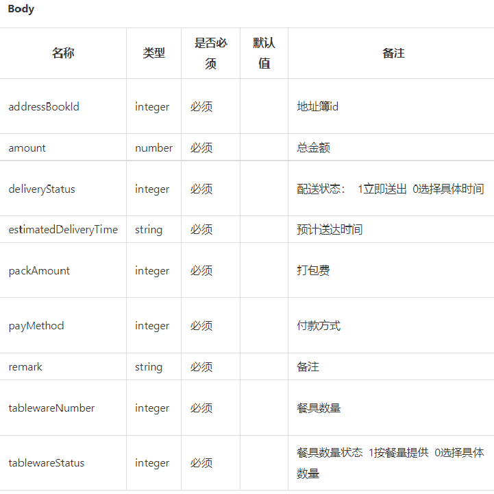 

在sky-pojo模块，OrdersSubmitDTO.java已定义

```java
package com.sky.dto;

import com.fasterxml.jackson.annotation.JsonFormat;
import lombok.Data;
import java.io.Serializable;
import java.math.BigDecimal;
import java.time.LocalDateTime;

@Data
public class OrdersSubmitDTO implements Serializable {
    //地址簿id
    private Long addressBookId;
    //付款方式
    private int payMethod;
    //备注
    private String remark;
    //预计送达时间
    @JsonFormat(shape = JsonFormat.Shape.STRING, pattern = "yyyy-MM-dd HH:mm:ss")
    private LocalDateTime estimatedDeliveryTime;
    //配送状态  1立即送出  0选择具体时间
    private Integer deliveryStatus;
    //餐具数量
    private Integer tablewareNumber;
    //餐具数量状态  1按餐量提供  0选择具体数量
    private Integer tablewareStatus;
    //打包费
    private Integer packAmount;
    //总金额
    private BigDecimal amount;
}
```


#### 2.2.2 VO设计

**根据用户下单接口的返回结果设计VO：**

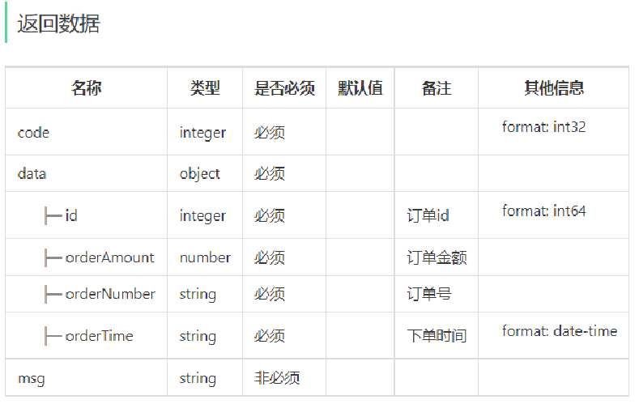 

在sky-pojo模块，OrderSubmitVO.java已定义

```java
package com.sky.vo;

import lombok.AllArgsConstructor;
import lombok.Builder;
import lombok.Data;
import lombok.NoArgsConstructor;
import java.io.Serializable;
import java.math.BigDecimal;
import java.time.LocalDateTime;

@Data
@Builder
@NoArgsConstructor
@AllArgsConstructor
public class OrderSubmitVO implements Serializable {
    //订单id
    private Long id;
    //订单号
    private String orderNumber;
    //订单金额
    private BigDecimal orderAmount;
    //下单时间
    private LocalDateTime orderTime;
}
```


#### 2.2.3 Controller层

**创建OrderController并提供用户下单方法：**

```java
package com.sky.controller.user;

import com.sky.dto.OrdersPaymentDTO;
import com.sky.dto.OrdersSubmitDTO;
import com.sky.result.PageResult;
import com.sky.result.Result;
import com.sky.service.OrderService;
import com.sky.vo.OrderPaymentVO;
import com.sky.vo.OrderSubmitVO;
import com.sky.vo.OrderVO;
import io.swagger.annotations.Api;
import io.swagger.annotations.ApiOperation;
import lombok.extern.slf4j.Slf4j;
import org.springframework.beans.factory.annotation.Autowired;
import org.springframework.web.bind.annotation.*;

/**
 * 订单
 */
@RestController("userOrderController")
@RequestMapping("/user/order")
@Slf4j
@Api(tags = "C端-订单接口")
public class OrderController {

    @Autowired
    private OrderService orderService;

    /**
     * 用户下单
     *
     * @param ordersSubmitDTO
     * @return
     */
    @PostMapping("/submit")
    @ApiOperation("用户下单")
    public Result<OrderSubmitVO> submit(@RequestBody OrdersSubmitDTO ordersSubmitDTO) {
        log.info("用户下单：{}", ordersSubmitDTO);
        OrderSubmitVO orderSubmitVO = orderService.submitOrder(ordersSubmitDTO);
        return Result.success(orderSubmitVO);
    } 

}
```


#### 2.2.4 Service层接口

**创建OrderService接口，并声明用户下单方法：**

```java
package com.sky.service;

import com.sky.dto.*;
import com.sky.vo.OrderSubmitVO;

public interface OrderService {

    /**
     * 用户下单
     * @param ordersSubmitDTO
     * @return
     */
    OrderSubmitVO submitOrder(OrdersSubmitDTO ordersSubmitDTO);
}
```


#### 2.2.5 Service层实现类

**创建OrderServiceImpl实现OrderService接口：**

```java
package com.sky.service.impl;

/**
 * 订单
 */
@Service
@Slf4j
public class OrderServiceImpl implements OrderService {
    @Autowired
    private OrderMapper orderMapper;
    @Autowired
    private OrderDetailMapper orderDetailMapper;
    @Autowired
    private ShoppingCartMapper shoppingCartMapper;
    @Autowired
    private AddressBookMapper addressBookMapper;


    /**
     * 用户下单
     *
     * @param ordersSubmitDTO
     * @return
     */
    @Transactional
    public OrderSubmitVO submitOrder(OrdersSubmitDTO ordersSubmitDTO) {
        //异常情况的处理（收货地址为空、超出配送范围、购物车为空）
        AddressBook addressBook = addressBookMapper.getById(ordersSubmitDTO.getAddressBookId());
        if (addressBook == null) {
            throw new AddressBookBusinessException(MessageConstant.ADDRESS_BOOK_IS_NULL);
        }

        Long userId = BaseContext.getCurrentId();
        ShoppingCart shoppingCart = new ShoppingCart();
        shoppingCart.setUserId(userId);

        //查询当前用户的购物车数据
        List<ShoppingCart> shoppingCartList = shoppingCartMapper.list(shoppingCart);
        if (shoppingCartList == null || shoppingCartList.size() == 0) {
            throw new ShoppingCartBusinessException(MessageConstant.SHOPPING_CART_IS_NULL);
        }

        //构造订单数据
        Orders order = new Orders();
        BeanUtils.copyProperties(ordersSubmitDTO,order);
        order.setPhone(addressBook.getPhone());
        order.setAddress(addressBook.getDetail());
        order.setConsignee(addressBook.getConsignee());
        order.setNumber(String.valueOf(System.currentTimeMillis()));
        order.setUserId(userId);
        order.setStatus(Orders.PENDING_PAYMENT);
        order.setPayStatus(Orders.UN_PAID);
        order.setOrderTime(LocalDateTime.now());

        //向订单表插入1条数据
        orderMapper.insert(order);

        //订单明细数据
        List<OrderDetail> orderDetailList = new ArrayList<>();
        for (ShoppingCart cart : shoppingCartList) {
            OrderDetail orderDetail = new OrderDetail();
            BeanUtils.copyProperties(cart, orderDetail);
            orderDetail.setOrderId(order.getId());
            orderDetailList.add(orderDetail);
        }

        //向明细表插入n条数据
        orderDetailMapper.insertBatch(orderDetailList);

        //清理购物车中的数据
        shoppingCartMapper.deleteByUserId(userId);

        //封装返回结果
        OrderSubmitVO orderSubmitVO = OrderSubmitVO.builder()
                .id(order.getId())
                .orderNumber(order.getNumber())
                .orderAmount(order.getAmount())
                .orderTime(order.getOrderTime())
                .build();

        return orderSubmitVO;
    }
    
}
```


#### 2.2.6 Mapper层

**创建OrderMapper接口和对应的xml映射文件：**

OrderMapper.java

```java
package com.sky.mapper;

@Mapper
public interface OrderMapper {
    /**
     * 插入订单数据
     * @param order
     */
    void insert(Orders order);
}

```

OrderMapper.xml

```xml
<?xml version="1.0" encoding="UTF-8" ?>
<!DOCTYPE mapper PUBLIC "-//mybatis.org//DTD Mapper 3.0//EN" "http://mybatis.org/dtd/mybatis-3-mapper.dtd" >
<mapper namespace="com.sky.mapper.OrderMapper">

    <insert id="insert" parameterType="Orders" useGeneratedKeys="true" keyProperty="id">
        insert into orders
        (number, status, user_id, address_book_id, order_time, checkout_time, pay_method, pay_status, amount, remark,
         phone, address, consignee, estimated_delivery_time, delivery_status, pack_amount, tableware_number,
         tableware_status)
        values (#{number}, #{status}, #{userId}, #{addressBookId}, #{orderTime}, #{checkoutTime}, #{payMethod},
                #{payStatus}, #{amount}, #{remark}, #{phone}, #{address}, #{consignee},
                #{estimatedDeliveryTime}, #{deliveryStatus}, #{packAmount}, #{tablewareNumber}, #{tablewareStatus})
    </insert>
</mapper>

```

**创建OrderDetailMapper接口和对应的xml映射文件：**

OrderDetailMapper.java

```java
package com.sky.mapper;

import com.sky.entity.OrderDetail;
import java.util.List;

@Mapper
public interface OrderDetailMapper {

    /**
     * 批量插入订单明细数据
     * @param orderDetails
     */
    void insertBatch(List<OrderDetail> orderDetails);

}
```

OrderDetailMapper.xml

```xml
<?xml version="1.0" encoding="UTF-8" ?>
<!DOCTYPE mapper PUBLIC "-//mybatis.org//DTD Mapper 3.0//EN" "http://mybatis.org/dtd/mybatis-3-mapper.dtd" >
<mapper namespace="com.sky.mapper.OrderDetailMapper">

    <insert id="insertBatch" parameterType="list">
        insert into order_detail
        (name, order_id, dish_id, setmeal_id, dish_flavor, number, amount, image)
        values
        <foreach collection="orderDetails" item="od" separator=",">
            (#{od.name},#{od.orderId},#{od.dishId},#{od.setmealId},#{od.dishFlavor},
             #{od.number},#{od.amount},#{od.image})
        </foreach>
    </insert>

</mapper>
```


### 2.3 功能测试

登录小程序，完成下单操作

下单操作时，同时会删除购物车中的数据

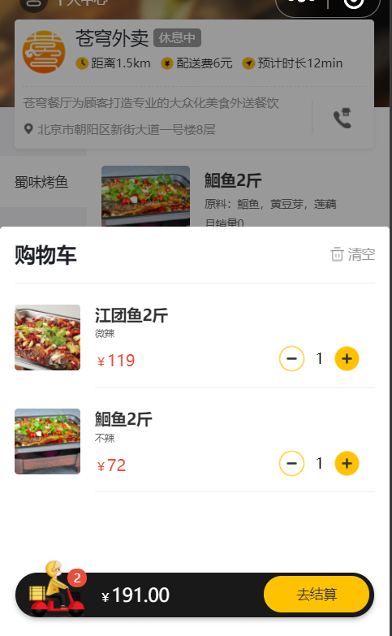 

**查看shopping_cart表：**

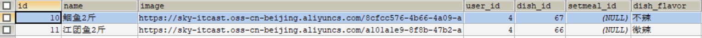 

**去结算-->去支付**

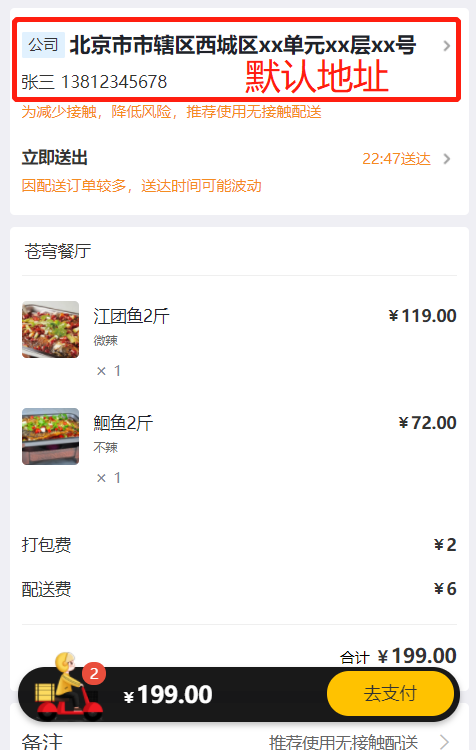 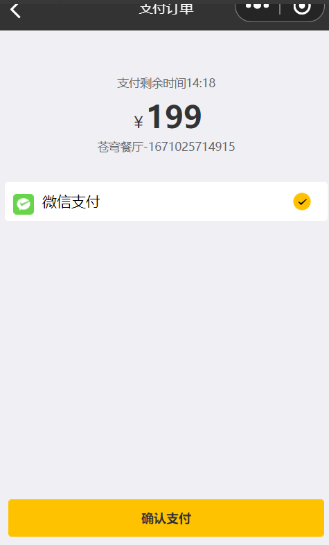 


**查看orders表：**

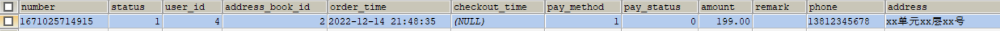

**查看order_detail表：**

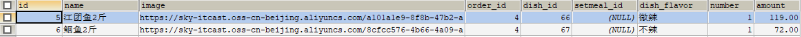 

**同时，购物车表中数据删除：**

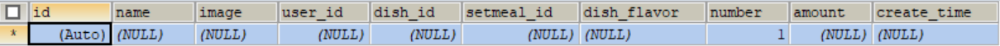 


### 2.4 代码提交

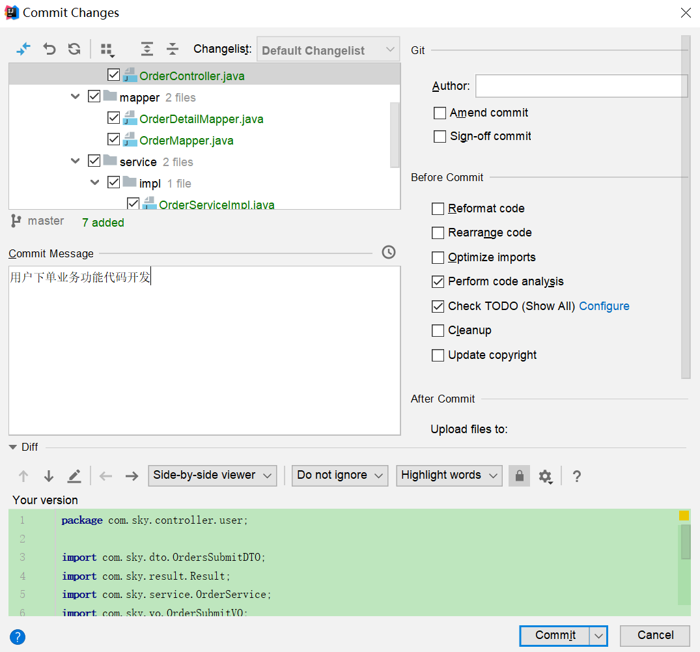 

后续步骤和其它功能代码提交一致，不再赘述。


## 3. 订单支付

### 3.1 微信支付介绍

前面的课程已经实现了用户下单，那接下来就是订单支付，就是完成付款功能。支付大家应该都不陌生了，在现实生活中经常购买商品并且使用支付功能来付款，在付款的时候可能使用比较多的就是微信支付和支付宝支付了。在苍穹外卖项目中，选择的就是**微信支付**这种支付方式。

要实现微信支付就需要注册微信支付的一个商户号，这个商户号是必须要有一家企业并且有正规的营业执照。只有具备了这些资质之后，才可以去注册商户号，才能开通支付权限。

个人不具备这种资质，所以我们在学习微信支付时，最重要的是了解微信支付的流程，并且能够阅读微信官方提供的接口文档，能够和第三方支付平台对接起来就可以了。

**微信支付产品：**

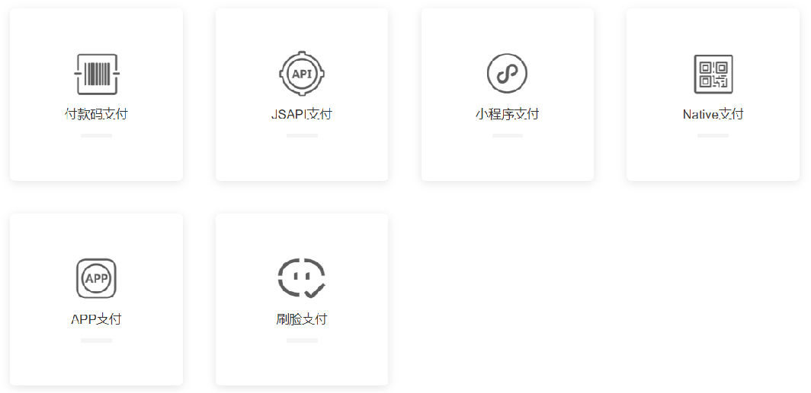 

本项目选择**小程序支付**

参考：https://pay.weixin.qq.com/static/product/product_index.shtml


**微信支付接入流程：**

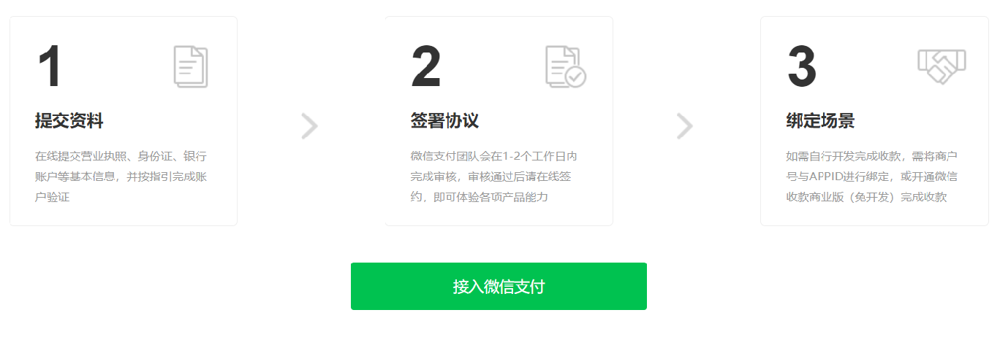 


**微信小程序支付时序图：**

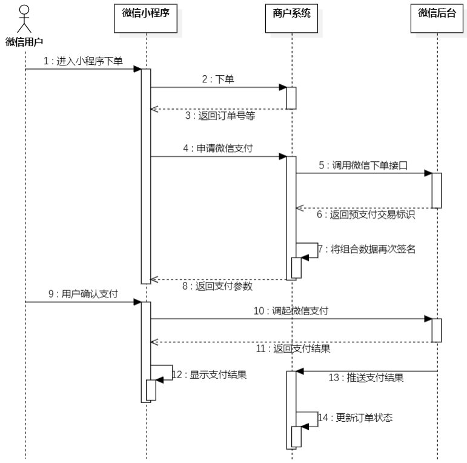 


**微信支付相关接口：**

**JSAPI下单：**商户系统调用该接口在微信支付服务后台生成预支付交易单(对应时序图的第5步)

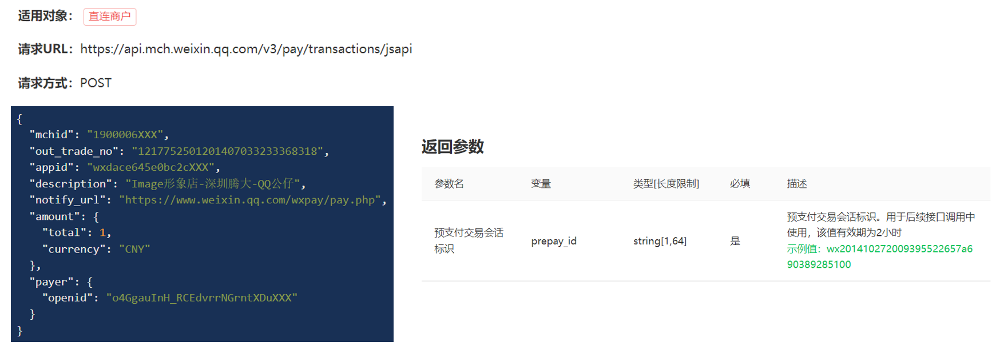


**微信小程序调起支付：**通过JSAPI下单接口获取到发起支付的必要参数prepay_id，然后使用微信支付提供的小程序方法调起小程序支付(对应时序图的第10步)

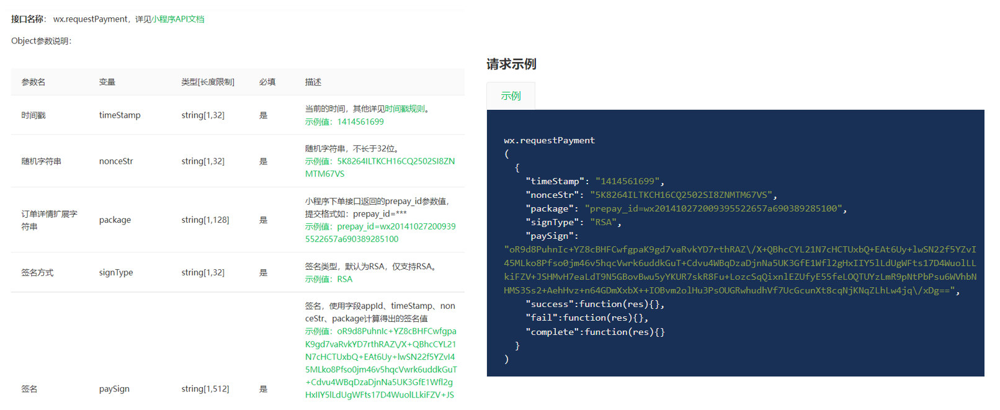 


### 3.2 微信支付准备工作

#### 3.2.1 如何保证数据安全？

完成微信支付有两个关键的步骤：

**第一个**就是需要在商户系统当中调用微信后台的一个下单接口，就是生成预支付交易单。

**第二个**就是支付成功之后微信后台会给推送消息。

这两个接口数据的安全性，要求其实是非常高的。

**解决：**微信提供的方式就是对数据进行加密、解密、签名多种方式。要完成数据加密解密，需要提前准备相应的一些文件，其实就是一些证书。

**获取微信支付平台证书、商户私钥文件：**

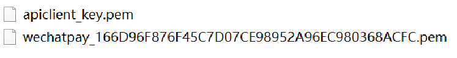 

在后绪程序开发过程中，就会使用到这两个文件，需要提前把这两个文件准备好。


#### 3.2.2 如何调用到商户系统？

微信后台会调用到商户系统给推送支付的结果，在这里我们就会遇到一个问题，就是微信后台怎么就能调用到我们这个商户系统呢？因为这个调用过程，其实本质上也是一个HTTP请求。

目前，商户系统它的ip地址就是当前自己电脑的ip地址，只是一个局域网内的ip地址，微信后台无法调用到。

**解决：**内网穿透。通过**cpolar软件**可以获得一个临时域名，而这个临时域名是一个公网ip，这样，微信后台就可以请求到商户系统了。

**cpolar软件的使用：**

**1). 下载与安装**

下载地址：https://dashboard.cpolar.com/get-started

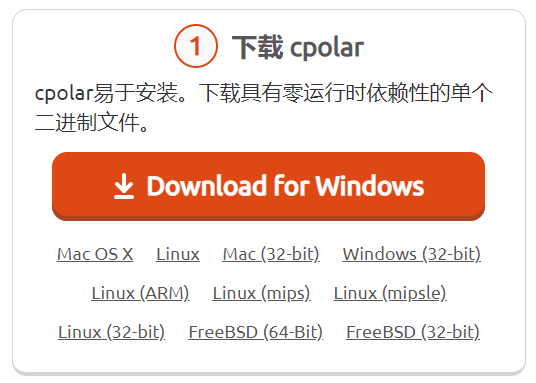 

在资料中已提供，可无需下载。

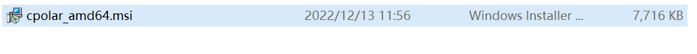 

安装过程中，一直下一步即可，不再演示。

**2). cpolar指定authtoken**

复制authtoken：

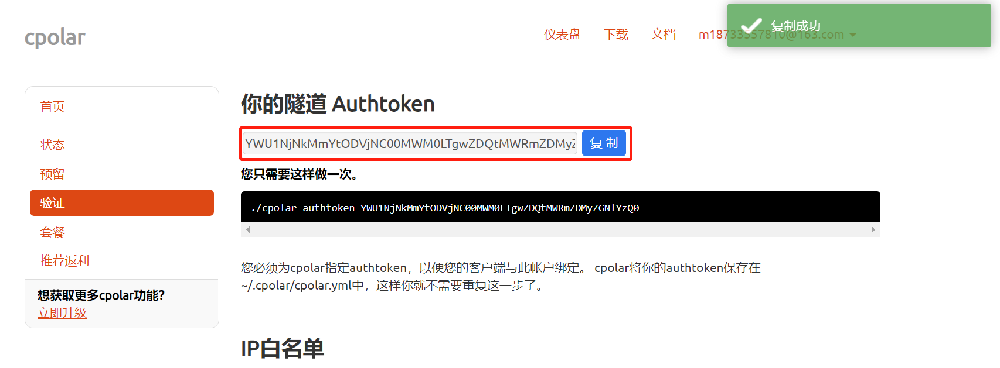 

执行命令：

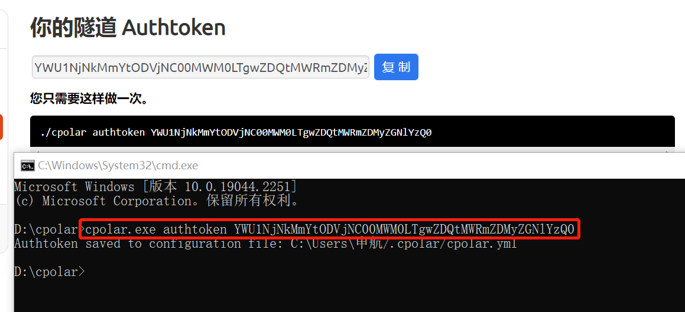 


**3). 获取临时域名**

执行命令：

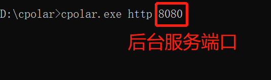 

获取域名：

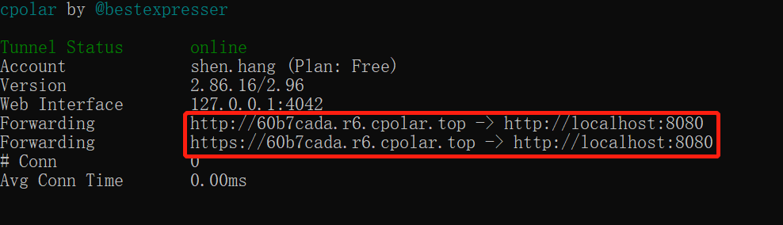 


**4). 验证临时域名有效性**

**访问接口文档**

使用localhost:8080访问

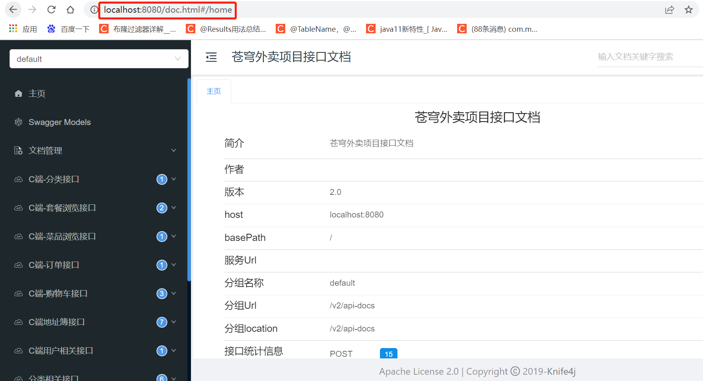 

使用临时域名访问

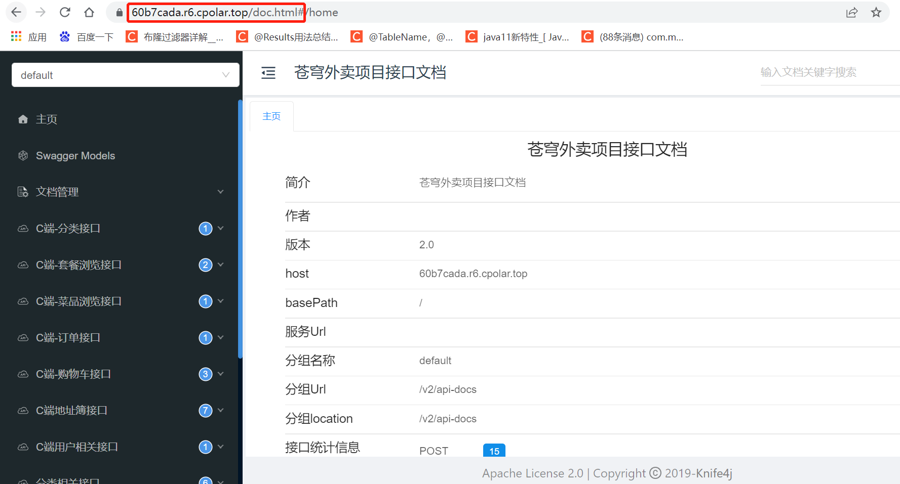 

证明临时域名生效。


### 3.3 代码导入

导入资料中的微信支付功能代码即可

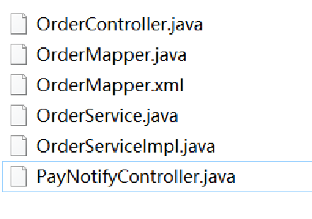 

#### 3.3.1 微信支付相关配置

application-dev.yml

```yaml
sky:
  wechat:
    appid: wxcd2e39f677fd30ba
    secret: 84fbfdf5ea288f0c432d829599083637
    mchid : 1561414331
    mchSerialNo: 4B3B3DC35414AD50B1B755BAF8DE9CC7CF407606
    privateKeyFilePath: D:\apiclient_key.pem
    apiV3Key: CZBK51236435wxpay435434323FFDuv3
    weChatPayCertFilePath: D:\wechatpay_166D96F876F45C7D07CE98952A96EC980368ACFC.pem
    notifyUrl: https://www.weixin.qq.com/wxpay/pay.php
    refundNotifyUrl: https://www.weixin.qq.com/wxpay/pay.php
```

application.yml

```yaml
sky:
  wechat:
    appid: ${sky.wechat.appid}
    secret: ${sky.wechat.secret}
    mchid : ${sky.wechat.mchid}
    mchSerialNo: ${sky.wechat.mchSerialNo}
    privateKeyFilePath: ${sky.wechat.privateKeyFilePath}
    apiV3Key: ${sky.wechat.apiV3Key}
    weChatPayCertFilePath: ${sky.wechat.weChatPayCertFilePath}
    notifyUrl: ${sky.wechat.notifyUrl}
    refundNotifyUrl: ${sky.wechat.refundNotifyUrl}

```

WeChatProperties.java：读取配置(已定义)

```java
package com.sky.properties;

import lombok.Data;
import org.springframework.beans.factory.annotation.Value;
import org.springframework.boot.context.properties.ConfigurationProperties;
import org.springframework.stereotype.Component;

@Component
@ConfigurationProperties(prefix = "sky.wechat")
@Data
public class WeChatProperties {

    private String appid; //小程序的appid
    private String secret; //小程序的秘钥
    private String mchid; //商户号
    private String mchSerialNo; //商户API证书的证书序列号
    private String privateKeyFilePath; //商户私钥文件
    private String apiV3Key; //证书解密的密钥
    private String weChatPayCertFilePath; //平台证书
    private String notifyUrl; //支付成功的回调地址
    private String refundNotifyUrl; //退款成功的回调地址
}
```


#### 3.3.2 Mapper层

**在OrderMapper.java中添加getByNumberAndUserId和update两个方法**

```java
	/**
     * 根据订单号和用户id查询订单
     * @param orderNumber
     * @param userId
     */
    @Select("select * from orders where number = #{orderNumber} and user_id= #{userId}")
    Orders getByNumberAndUserId(String orderNumber, Long userId);

    /**
     * 修改订单信息
     * @param orders
     */
    void update(Orders orders);
```

**在OrderMapper.xml中添加**

```xml
<update id="update" parameterType="com.sky.entity.Orders">
        update orders
        <set>
            <if test="cancelReason != null and cancelReason!='' ">
                cancel_reason=#{cancelReason},
            </if>
            <if test="rejectionReason != null and rejectionReason!='' ">
                rejection_reason=#{rejectionReason},
            </if>
            <if test="cancelTime != null">
                cancel_time=#{cancelTime},
            </if>
            <if test="payStatus != null">
                pay_status=#{payStatus},
            </if>
            <if test="payMethod != null">
                pay_method=#{payMethod},
            </if>
            <if test="checkoutTime != null">
                checkout_time=#{checkoutTime},
            </if>
            <if test="status != null">
                status = #{status},
            </if>
            <if test="deliveryTime != null">
                delivery_time = #{deliveryTime}
            </if>
        </set>
        where id = #{id}
</update>
```


#### 3.3.3 Service层

**在OrderService.java中添加payment和paySuccess两个方法定义**

```java
	/**
     * 订单支付
     * @param ordersPaymentDTO
     * @return
     */
    OrderPaymentVO payment(OrdersPaymentDTO ordersPaymentDTO) throws Exception;

    /**
     * 支付成功，修改订单状态
     * @param outTradeNo
     */
    void paySuccess(String outTradeNo);
```

**在OrderServiceImpl.java中实现payment和paySuccess两个方法**

```java
 	@Autowired
    private UserMapper userMapper;
	@Autowired
    private WeChatPayUtil weChatPayUtil;
    /**
     * 订单支付
     *
     * @param ordersPaymentDTO
     * @return
     */
    public OrderPaymentVO payment(OrdersPaymentDTO ordersPaymentDTO) throws Exception {
        // 当前登录用户id
        Long userId = BaseContext.getCurrentId();
        User user = userMapper.getById(userId);

        //调用微信支付接口，生成预支付交易单
        JSONObject jsonObject = weChatPayUtil.pay(
                ordersPaymentDTO.getOrderNumber(), //商户订单号
                new BigDecimal(0.01), //支付金额，单位 元
                "苍穹外卖订单", //商品描述
                user.getOpenid() //微信用户的openid
        );

        if (jsonObject.getString("code") != null && jsonObject.getString("code").equals("ORDERPAID")) {
            throw new OrderBusinessException("该订单已支付");
        }

        OrderPaymentVO vo = jsonObject.toJavaObject(OrderPaymentVO.class);
        vo.setPackageStr(jsonObject.getString("package"));

        return vo;
    }

    /**
     * 支付成功，修改订单状态
     *
     * @param outTradeNo
     */
    public void paySuccess(String outTradeNo) {
        // 当前登录用户id
        Long userId = BaseContext.getCurrentId();

        // 根据订单号查询当前用户的订单
        Orders ordersDB = orderMapper.getByNumberAndUserId(outTradeNo, userId);

        // 根据订单id更新订单的状态、支付方式、支付状态、结账时间
        Orders orders = Orders.builder()
                .id(ordersDB.getId())
                .status(Orders.TO_BE_CONFIRMED)
                .payStatus(Orders.PAID)
                .checkoutTime(LocalDateTime.now())
                .build();

        orderMapper.update(orders);
    }
```


#### 3.3.4 Controller层

**在OrderController.java中添加payment方法**

```java
 	/**
     * 订单支付
     *
     * @param ordersPaymentDTO
     * @return
     */
    @PutMapping("/payment")
    @ApiOperation("订单支付")
    public Result<OrderPaymentVO> payment(@RequestBody OrdersPaymentDTO ordersPaymentDTO) throws Exception {
        log.info("订单支付：{}", ordersPaymentDTO);
        OrderPaymentVO orderPaymentVO = orderService.payment(ordersPaymentDTO);
        log.info("生成预支付交易单：{}", orderPaymentVO);
        return Result.success(orderPaymentVO);
    }
```

PayNotifyController.java

```java
package com.sky.controller.notify;

import com.alibaba.druid.support.json.JSONUtils;
import com.alibaba.fastjson.JSON;
import com.alibaba.fastjson.JSONObject;
import com.sky.annotation.IgnoreToken;
import com.sky.properties.WeChatProperties;
import com.sky.service.OrderService;
import com.wechat.pay.contrib.apache.httpclient.util.AesUtil;
import lombok.extern.slf4j.Slf4j;
import org.apache.http.entity.ContentType;
import org.springframework.beans.factory.annotation.Autowired;
import org.springframework.web.bind.annotation.RequestMapping;
import org.springframework.web.bind.annotation.RestController;
import javax.servlet.http.HttpServletRequest;
import javax.servlet.http.HttpServletResponse;
import java.io.BufferedReader;
import java.nio.charset.StandardCharsets;
import java.util.HashMap;

/**
 * 支付回调相关接口
 */
@RestController
@RequestMapping("/notify")
@Slf4j
public class PayNotifyController {
    @Autowired
    private OrderService orderService;
    @Autowired
    private WeChatProperties weChatProperties;

    /**
     * 支付成功回调
     *
     * @param request
     */
    @RequestMapping("/paySuccess")
    public void paySuccessNotify(HttpServletRequest request, HttpServletResponse response) throws Exception {
        //读取数据
        String body = readData(request);
        log.info("支付成功回调：{}", body);

        //数据解密
        String plainText = decryptData(body);
        log.info("解密后的文本：{}", plainText);

        JSONObject jsonObject = JSON.parseObject(plainText);
        String outTradeNo = jsonObject.getString("out_trade_no");//商户平台订单号
        String transactionId = jsonObject.getString("transaction_id");//微信支付交易号

        log.info("商户平台订单号：{}", outTradeNo);
        log.info("微信支付交易号：{}", transactionId);

        //业务处理，修改订单状态、来单提醒
        orderService.paySuccess(outTradeNo);

        //给微信响应
        responseToWeixin(response);
    }

    /**
     * 读取数据
     *
     * @param request
     * @return
     * @throws Exception
     */
    private String readData(HttpServletRequest request) throws Exception {
        BufferedReader reader = request.getReader();
        StringBuilder result = new StringBuilder();
        String line = null;
        while ((line = reader.readLine()) != null) {
            if (result.length() > 0) {
                result.append("\n");
            }
            result.append(line);
        }
        return result.toString();
    }

    /**
     * 数据解密
     *
     * @param body
     * @return
     * @throws Exception
     */
    private String decryptData(String body) throws Exception {
        JSONObject resultObject = JSON.parseObject(body);
        JSONObject resource = resultObject.getJSONObject("resource");
        String ciphertext = resource.getString("ciphertext");
        String nonce = resource.getString("nonce");
        String associatedData = resource.getString("associated_data");

        AesUtil aesUtil = new AesUtil(weChatProperties.getApiV3Key().getBytes(StandardCharsets.UTF_8));
        //密文解密
        String plainText = aesUtil.decryptToString(associatedData.getBytes(StandardCharsets.UTF_8),
                nonce.getBytes(StandardCharsets.UTF_8),
                ciphertext);

        return plainText;
    }

    /**
     * 给微信响应
     * @param response
     */
    private void responseToWeixin(HttpServletResponse response) throws Exception{
        response.setStatus(200);
        HashMap<Object, Object> map = new HashMap<>();
        map.put("code", "SUCCESS");
        map.put("message", "SUCCESS");
        response.setHeader("Content-type", ContentType.APPLICATION_JSON.toString());
        response.getOutputStream().write(JSONUtils.toJSONString(map).getBytes(StandardCharsets.UTF_8));
        response.flushBuffer();
    }
}
```


### 3.4 功能测试

测试过程中，可通过断点方式查看后台每一步执行情况。

**下单：**

 

**去支付：**

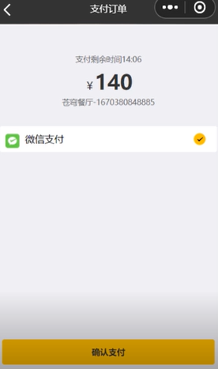 

**确认支付：**

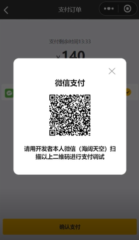 

进行扫码支付即可。


### 3.5 代码提交

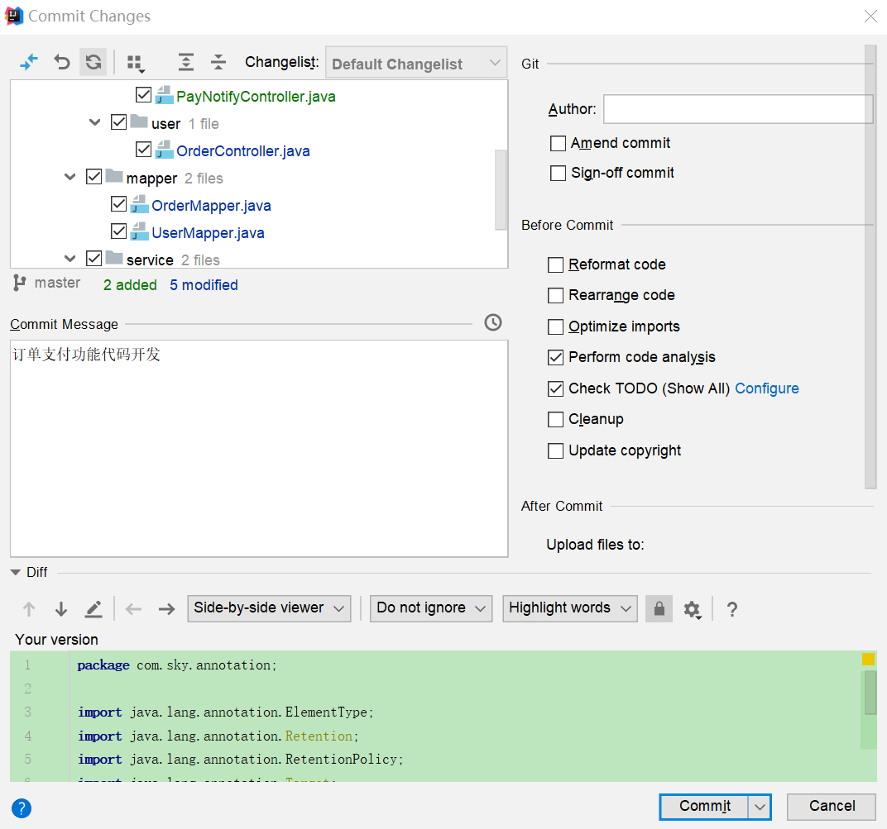 

 后续步骤和其它功能代码提交一致，不再赘述。


 

