# 苍穹外卖-day10

## 课程内容

- Spring Task
- 订单状态定时处理
- WebSocket
- 来单提醒
- 客户催单


功能实现：**订单状态定时处理**、**来单提醒**和**客户催单**

**订单状态定时处理：**

 


**来单提醒：**

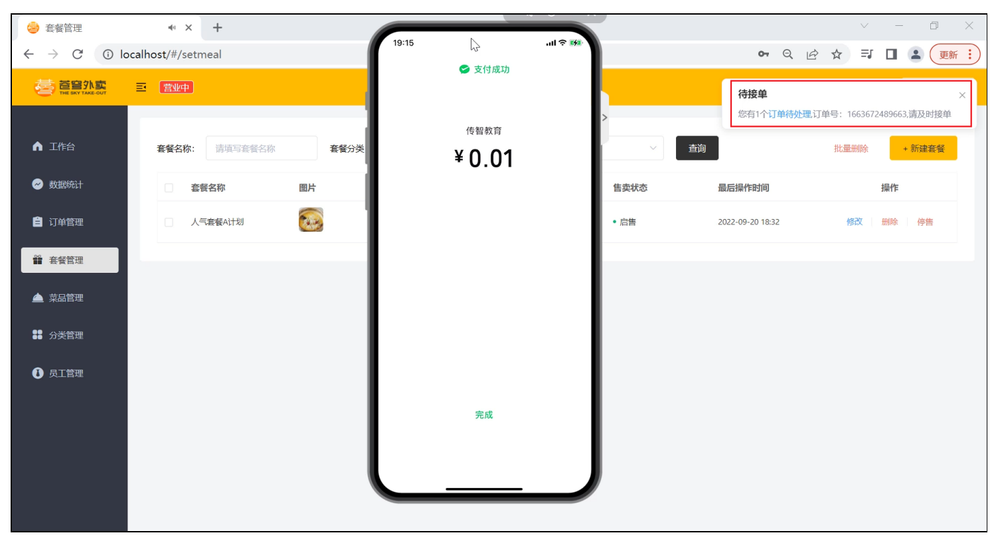 


**客户催单：**

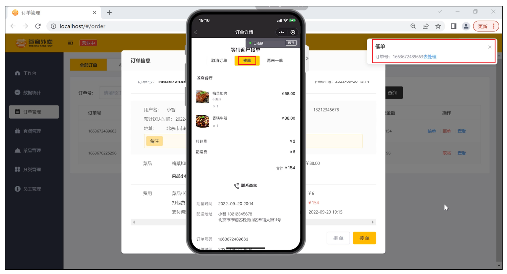 


## 1. Spring Task

### 1.1 介绍

**Spring Task** 是Spring框架提供的任务调度工具，可以按照约定的时间自动执行某个代码逻辑。

**定位：**定时任务框架

**作用：**定时自动执行某段Java代码


  为什么要在Java程序中使用Spring Task？

**应用场景：**

1). 信用卡每月还款提醒

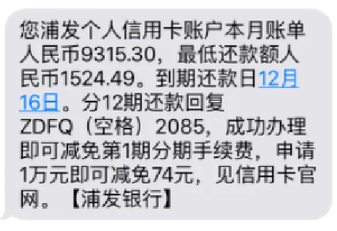 


2). 银行贷款每月还款提醒

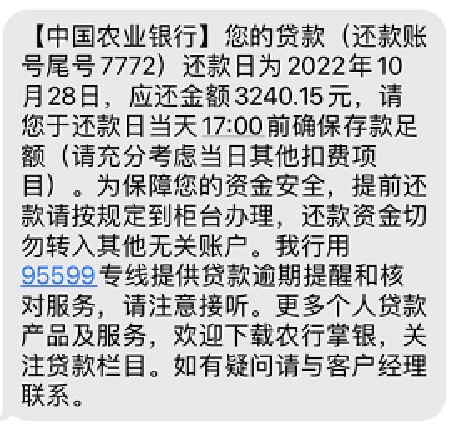 


3). 火车票售票系统处理未支付订单

 


4). 入职纪念日为用户发送通知

 


**强调：**只要是需要定时处理的场景都可以使用Spring Task


### 1.2 cron表达式

**cron表达式**其实就是一个字符串，通过cron表达式可以**定义任务触发的时间**

**构成规则：**分为6或7个域，由空格分隔开，每个域代表一个含义

每个域的含义分别为：秒、分钟、小时、日、月、周、年(可选)

**举例：**

2022年10月12日上午9点整 对应的cron表达式为：**0 0 9 12 10 ? 2022**

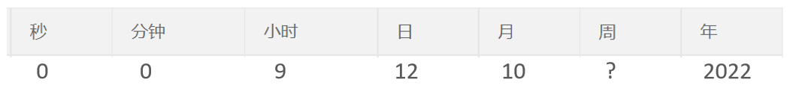 

**说明：**一般**日**和**周**的值不同时设置，其中一个设置，另一个用？表示。


**比如：**描述2月份的最后一天，最后一天具体是几号呢？可能是28号，也有可能是29号，所以就不能写具体数字。

为了描述这些信息，提供一些特殊的字符。这些具体的细节，我们就不用自己去手写，因为这个cron表达式，它其实有在线生成器。

cron表达式在线生成器：https://cron.qqe2.com/

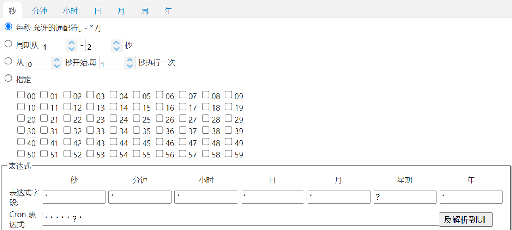 


可以直接在这个网站上面，只要根据自己的要求去生成corn表达式即可。所以一般就不用自己去编写这个表达式。

**通配符：**

\* 表示所有值； 

? 表示未说明的值，即不关心它为何值； 

\- 表示一个指定的范围； 

, 表示附加一个可能值； 

/ 符号前表示开始时间，符号后表示每次递增的值；

**cron表达式案例：**

*/5 * * * * ? 每隔5秒执行一次

0 */1 * * * ? 每隔1分钟执行一次

0 0 5-15 * * ? 每天5-15点整点触发

0 0/3 * * * ? 每三分钟触发一次

0 0-5 14 * * ? 在每天下午2点到下午2:05期间的每1分钟触发 

0 0/5 14 * * ? 在每天下午2点到下午2:55期间的每5分钟触发

0 0/5 14,18 * * ? 在每天下午2点到2:55期间和下午6点到6:55期间的每5分钟触发

0 0/30 9-17 * * ? 朝九晚五工作时间内每半小时

0 0 10,14,16 * * ? 每天上午10点，下午2点，4点 


### 1.3 入门案例

#### 1.3.1 Spring Task使用步骤

1). 导入maven坐标 spring-context（已存在）

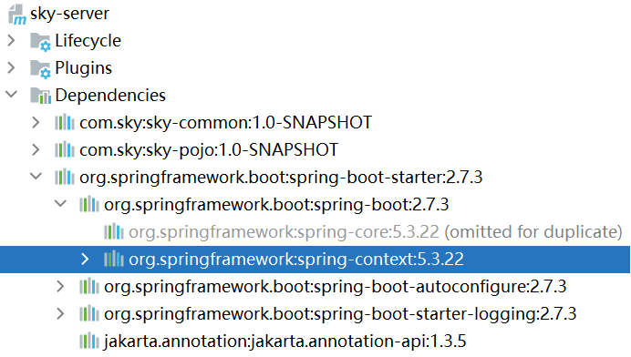 

2). 启动类添加注解 @EnableScheduling 开启任务调度

3). 自定义定时任务类


#### 1.3.2 代码开发

**编写定时任务类：**

进入sky-server模块中

```java
package com.sky.task;

import lombok.extern.slf4j.Slf4j;
import org.springframework.scheduling.annotation.Scheduled;
import org.springframework.stereotype.Component;

import java.util.Date;

/**
 * 自定义定时任务类
 */
@Component
@Slf4j
public class MyTask {

    /**
     * 定时任务 每隔5秒触发一次
     */
    @Scheduled(cron = "0/5 * * * * ?")
    public void executeTask(){
        log.info("定时任务开始执行：{}",new Date());
    }
}
```

**开启任务调度：**

启动类添加注解 @EnableScheduling

```java
package com.sky;

import lombok.extern.slf4j.Slf4j;
import org.springframework.boot.SpringApplication;
import org.springframework.boot.autoconfigure.SpringBootApplication;
import org.springframework.cache.annotation.EnableCaching;
import org.springframework.scheduling.annotation.EnableScheduling;
import org.springframework.transaction.annotation.EnableTransactionManagement;

@SpringBootApplication
@EnableTransactionManagement //开启注解方式的事务管理
@Slf4j
@EnableCaching
@EnableScheduling
public class SkyApplication {
    public static void main(String[] args) {
        SpringApplication.run(SkyApplication.class, args);
        log.info("server started");
    }
}
```


#### 1.3.3 功能测试

启动服务，查看日志

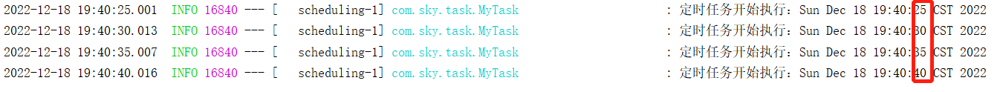 

每隔5秒执行一次。


## 2.订单状态定时处理

### 2.1 需求分析

用户下单后可能存在的情况：

- 下单后未支付，订单一直处于**“待支付”**状态
- 用户收货后管理端未点击完成按钮，订单一直处于**“派送中”**状态

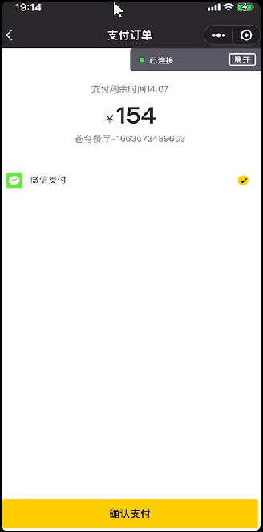                  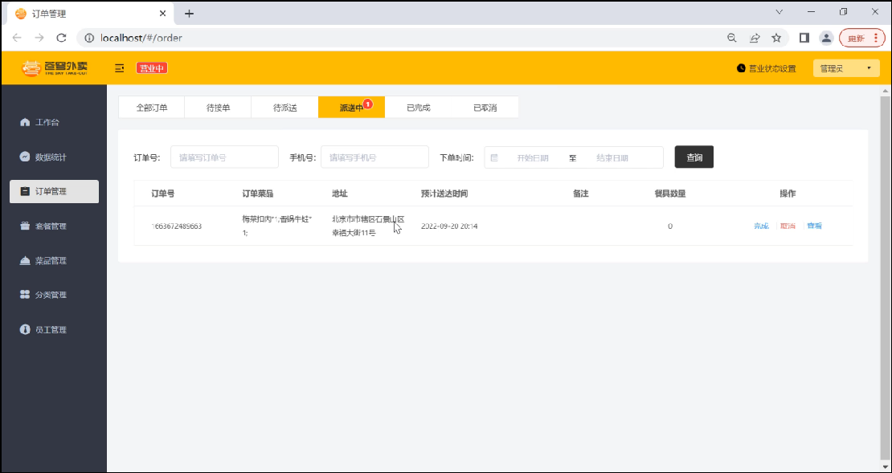

支付超时的订单如何处理？                                                       派送中的订单一直不点击完成如何处理？


对于上面两种情况需要通过**定时任务**来修改订单状态，具体逻辑为：

- 通过定时任务每分钟检查一次是否存在支付超时订单（下单后超过15分钟仍未支付则判定为支付超时订单），如果存在则修改订单状态为“已取消”
- 通过定时任务每天凌晨1点检查一次是否存在“派送中”的订单，如果存在则修改订单状态为“已完成”


### 2.2 代码开发

**1). 自定义定时任务类OrderTask（待完善）：**

```java
package com.sky.task;

/**
 * 自定义定时任务，实现订单状态定时处理
 */
@Component
@Slf4j
public class OrderTask {

    @Autowired
    private OrderMapper orderMapper;

    /**
     * 处理支付超时订单
     */
    @Scheduled(cron = "0 * * * * ?")
    public void processTimeoutOrder(){
        log.info("处理支付超时订单：{}", new Date());
    }

    /**
     * 处理“派送中”状态的订单
     */
    @Scheduled(cron = "0 0 1 * * ?")
    public void processDeliveryOrder(){
        log.info("处理派送中订单：{}", new Date());
    }

}
```


**2). 在OrderMapper接口中扩展方法:**

```java
	/**
     * 根据状态和下单时间查询订单
     * @param status
     * @param orderTime
     */
    @Select("select * from orders where status = #{status} and order_time < #{orderTime}")
    List<Orders> getByStatusAndOrdertimeLT(Integer status, LocalDateTime orderTime);
```


**3). 完善定时任务类的processTimeoutOrder方法：**

```java
	/**
     * 处理支付超时订单
     */
    @Scheduled(cron = "0 * * * * ?")
    public void processTimeoutOrder(){
        log.info("处理支付超时订单：{}", new Date());

        LocalDateTime time = LocalDateTime.now().plusMinutes(-15);

        // select * from orders where status = 1 and order_time < 当前时间-15分钟
        List<Orders> ordersList = orderMapper.getByStatusAndOrdertimeLT(Orders.PENDING_PAYMENT, time);
        if(ordersList != null && ordersList.size() > 0){
            ordersList.forEach(order -> {
                order.setStatus(Orders.CANCELLED);
                order.setCancelReason("支付超时，自动取消");
                order.setCancelTime(LocalDateTime.now());
                orderMapper.update(order);
            });
        }
    }
```


**4). 完善定时任务类的processDeliveryOrder方法：**

```java
	/**
     * 处理“派送中”状态的订单
     */
    @Scheduled(cron = "0 0 1 * * ?")
    public void processDeliveryOrder(){
        log.info("处理派送中订单：{}", new Date());
        // select * from orders where status = 4 and order_time < 当前时间-1小时
        LocalDateTime time = LocalDateTime.now().plusMinutes(-60);
        List<Orders> ordersList = orderMapper.getByStatusAndOrdertimeLT(Orders.DELIVERY_IN_PROGRESS, time);

        if(ordersList != null && ordersList.size() > 0){
            ordersList.forEach(order -> {
                order.setStatus(Orders.COMPLETED);
                orderMapper.update(order);
            });
        }
    }
```


### 2.3 功能测试

可以通过如下方式进行测试：

- 查看控制台sql
- 查看数据库中数据变化


**支付超时的订单测试：**

**1). 查看订单表**

有一条订单，状态为1。订单状态 1待付款 2待接单 3已接单 4派送中 5已完成 6已取消

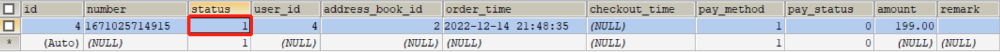 


**2). 开启定时任务**

启动服务，观察控制台日志。处理支付超时订单任务每隔1分钟执行一次。

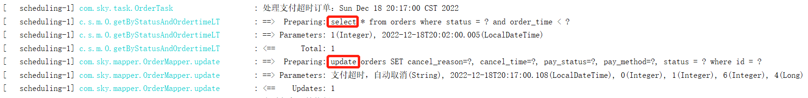 


**3). 再次查看订单表**

状态已更改为6，已取消。

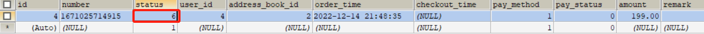 

证明定时任务已生效。

**处理“派送中”状态的订单任务**测试自已完成，测试步骤和上述一致。可适当修改cron表达式，改变任务执行频率，方便测试。


## 3. WebSocket

### 3.1 介绍

WebSocket 是基于 TCP 的一种新的**网络协议**。它实现了浏览器与服务器全双工通信——浏览器和服务器只需要完成一次握手，两者之间就可以创建**持久性**的连接， 并进行**双向**数据传输。

**HTTP协议和WebSocket协议对比：**

- HTTP是**短连接**
- WebSocket是**长连接**
- HTTP通信是**单向**的，基于请求响应模式
- WebSocket支持**双向**通信
- HTTP和WebSocket底层都是TCP连接

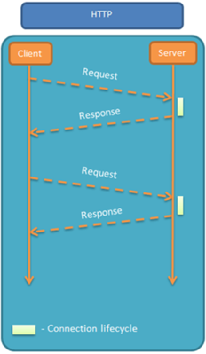           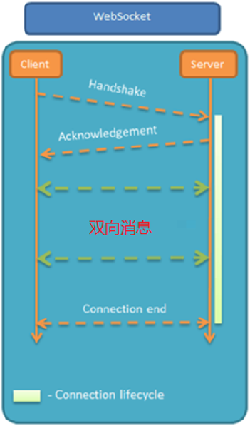 

**思考：**既然WebSocket支持双向通信，功能看似比HTTP强大，那么我们是不是可以基于WebSocket开发所有的业务功能？

**WebSocket缺点：**

服务器长期维护长连接需要一定的成本
各个浏览器支持程度不一
WebSocket 是长连接，受网络限制比较大，需要处理好重连

**结论：**WebSocket并不能完全取代HTTP，它只适合在特定的场景下使用


**WebSocket应用场景：**

1). 视频弹幕

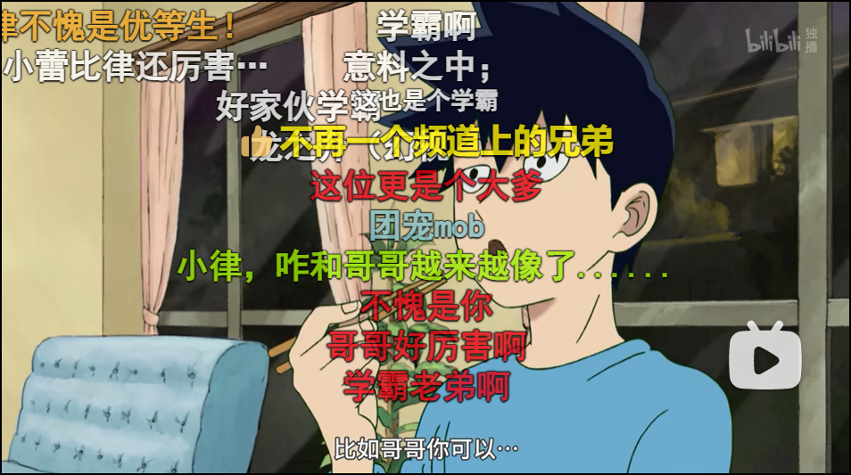v


2). 网页聊天

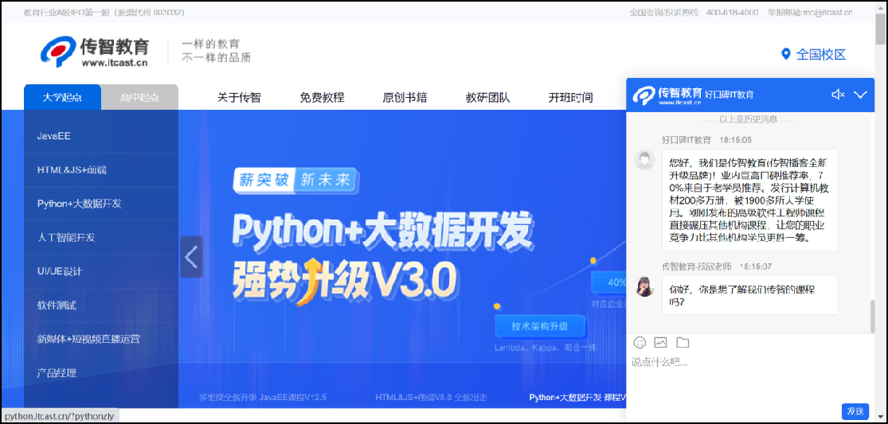 


3). 体育实况更新

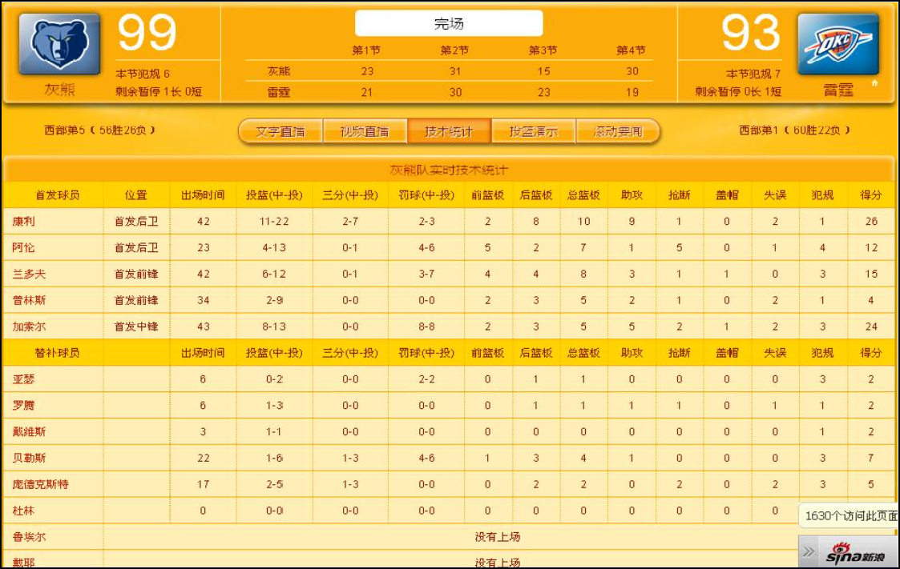 


4). 股票基金报价实时更新

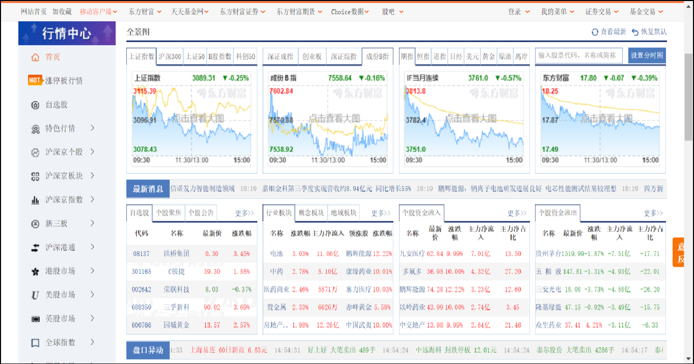 


### 3.2 入门案例

#### 3.2.1 案例分析

**需求：**实现浏览器与服务器全双工通信。浏览器既可以向服务器发送消息，服务器也可主动向浏览器推送消息。

**效果展示：**

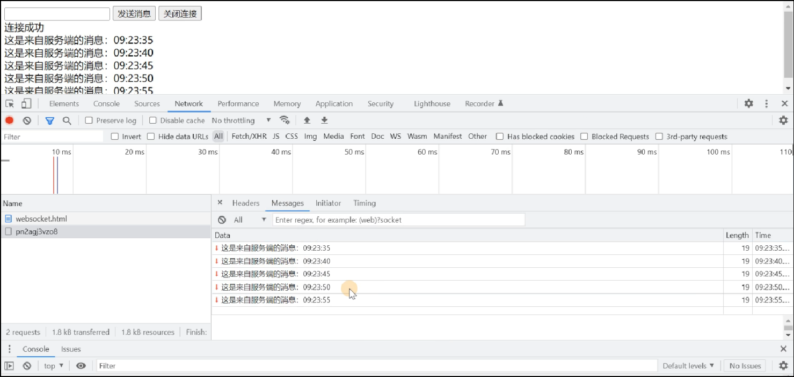 

**实现步骤：**

1). 直接使用websocket.html页面作为WebSocket客户端

2). 导入WebSocket的maven坐标

3). 导入WebSocket服务端组件WebSocketServer，用于和客户端通信

4). 导入配置类WebSocketConfiguration，注册WebSocket的服务端组件

5). 导入定时任务类WebSocketTask，定时向客户端推送数据


#### 3.2.2 代码开发

1). 定义websocket.html页面(资料中已提供)

```html
<!DOCTYPE HTML>
<html>
<head>
    <meta charset="UTF-8">
    <title>WebSocket Demo</title>
</head>
<body>
    <input id="text" type="text" />
    <button onclick="send()">发送消息</button>
    <button onclick="closeWebSocket()">关闭连接</button>
    <div id="message">
    </div>
</body>
<script type="text/javascript">
    var websocket = null;
    var clientId = Math.random().toString(36).substr(2);

    //判断当前浏览器是否支持WebSocket
    if('WebSocket' in window){
        //连接WebSocket节点
        websocket = new WebSocket("ws://localhost:8080/ws/"+clientId);
    }
    else{
        alert('Not support websocket')
    }

    //连接发生错误的回调方法
    websocket.onerror = function(){
        setMessageInnerHTML("error");
    };

    //连接成功建立的回调方法
    websocket.onopen = function(){
        setMessageInnerHTML("连接成功");
    }

    //接收到消息的回调方法
    websocket.onmessage = function(event){
        setMessageInnerHTML(event.data);
    }

    //连接关闭的回调方法
    websocket.onclose = function(){
        setMessageInnerHTML("close");
    }

    //监听窗口关闭事件，当窗口关闭时，主动去关闭websocket连接，防止连接还没断开就关闭窗口，server端会抛异常。
    window.onbeforeunload = function(){
        websocket.close();
    }

    //将消息显示在网页上
    function setMessageInnerHTML(innerHTML){
        document.getElementById('message').innerHTML += innerHTML + '<br/>';
    }

    //发送消息
    function send(){
        var message = document.getElementById('text').value;
        websocket.send(message);
    }
	
	//关闭连接
    function closeWebSocket() {
        websocket.close();
    }
</script>
</html>
```


2). 导入maven坐标

在sky-server模块pom.xml中已定义

```xml
<dependency>
	<groupId>org.springframework.boot</groupId>
	<artifactId>spring-boot-starter-websocket</artifactId>
</dependency>
```


3). 定义WebSocket服务端组件(资料中已提供)

直接导入到sky-server模块即可

```java
package com.sky.websocket;

import org.springframework.stereotype.Component;
import javax.websocket.OnClose;
import javax.websocket.OnMessage;
import javax.websocket.OnOpen;
import javax.websocket.Session;
import javax.websocket.server.PathParam;
import javax.websocket.server.ServerEndpoint;
import java.util.Collection;
import java.util.HashMap;
import java.util.Map;

/**
 * WebSocket服务
 */
@Component
@ServerEndpoint("/ws/{sid}")
public class WebSocketServer {

    //存放会话对象
    private static Map<String, Session> sessionMap = new HashMap();

    /**
     * 连接建立成功调用的方法
     */
    @OnOpen
    public void onOpen(Session session, @PathParam("sid") String sid) {
        System.out.println("客户端：" + sid + "建立连接");
        sessionMap.put(sid, session);
    }

    /**
     * 收到客户端消息后调用的方法
     *
     * @param message 客户端发送过来的消息
     */
    @OnMessage
    public void onMessage(String message, @PathParam("sid") String sid) {
        System.out.println("收到来自客户端：" + sid + "的信息:" + message);
    }

    /**
     * 连接关闭调用的方法
     *
     * @param sid
     */
    @OnClose
    public void onClose(@PathParam("sid") String sid) {
        System.out.println("连接断开:" + sid);
        sessionMap.remove(sid);
    }

    /**
     * 群发
     *
     * @param message
     */
    public void sendToAllClient(String message) {
        Collection<Session> sessions = sessionMap.values();
        for (Session session : sessions) {
            try {
                //服务器向客户端发送消息
                session.getBasicRemote().sendText(message);
            } catch (Exception e) {
                e.printStackTrace();
            }
        }
    }

}
```


4). 定义配置类，注册WebSocket的服务端组件(从资料中直接导入即可)

```java
package com.sky.config;

import org.springframework.context.annotation.Bean;
import org.springframework.context.annotation.Configuration;
import org.springframework.web.socket.server.standard.ServerEndpointExporter;

/**
 * WebSocket配置类，用于注册WebSocket的Bean
 */
@Configuration
public class WebSocketConfiguration {

    @Bean
    public ServerEndpointExporter serverEndpointExporter() {
        return new ServerEndpointExporter();
    }

}
```


5). 定义定时任务类，定时向客户端推送数据(从资料中直接导入即可)

```java
package com.sky.task;

import com.sky.websocket.WebSocketServer;
import org.springframework.beans.factory.annotation.Autowired;
import org.springframework.scheduling.annotation.Scheduled;
import org.springframework.stereotype.Component;
import java.time.LocalDateTime;
import java.time.format.DateTimeFormatter;

@Component
public class WebSocketTask {
    @Autowired
    private WebSocketServer webSocketServer;

    /**
     * 通过WebSocket每隔5秒向客户端发送消息
     */
    @Scheduled(cron = "0/5 * * * * ?")
    public void sendMessageToClient() {
        webSocketServer.sendToAllClient("这是来自服务端的消息：" + DateTimeFormatter.ofPattern("HH:mm:ss").format(LocalDateTime.now()));
    }
}
```


#### 3.2.3 功能测试

启动服务，打开websocket.html页面

**浏览器向服务器发送数据：**

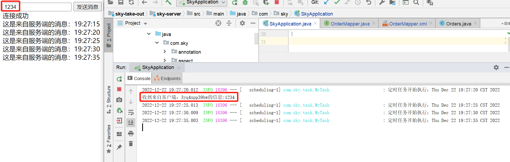 


**服务器向浏览器间隔5秒推送数据：**

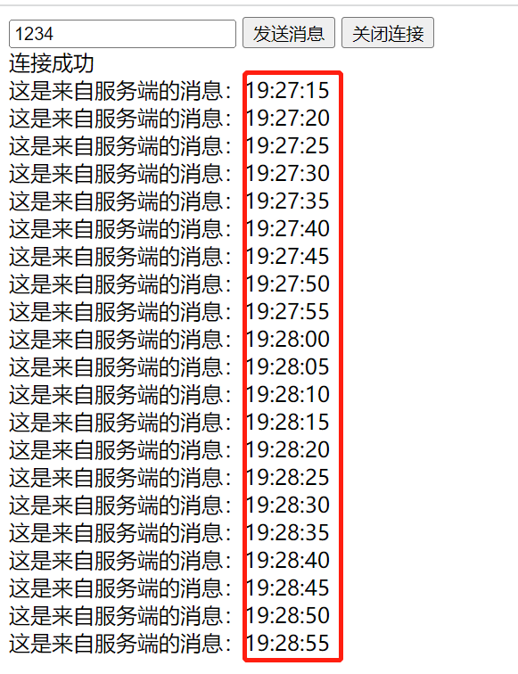 


## 4. 来单提醒

### 4.1 需求分析和设计

用户下单并且支付成功后，需要第一时间通知外卖商家。通知的形式有如下两种：

- 语音播报  
- 弹出提示框

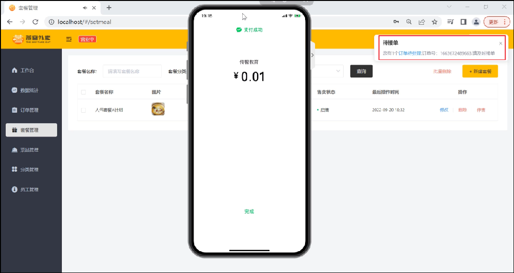 


**设计思路：**

- 通过WebSocket实现管理端页面和服务端保持长连接状态
- 当客户支付后，调用WebSocket的相关API实现服务端向客户端推送消息
- 客户端浏览器解析服务端推送的消息，判断是来单提醒还是客户催单，进行相应的消息提示和语音播报
- 约定服务端发送给客户端浏览器的数据格式为JSON，字段包括：type，orderId，content
  - type 为消息类型，1为来单提醒 2为客户催单
  - orderId 为订单id
  - content 为消息内容


### 4.2 代码开发

**在OrderServiceImpl中注入WebSocketServer对象，修改paySuccess方法，加入如下代码：**

```java
	@Autowired
    private WebSocketServer webSocketServer;
	/**
     * 支付成功，修改订单状态
     *
     * @param outTradeNo
     */
    public void paySuccess(String outTradeNo) {
        // 当前登录用户id
        Long userId = BaseContext.getCurrentId();

        // 根据订单号查询当前用户的订单
        Orders ordersDB = orderMapper.getByNumberAndUserId(outTradeNo, userId);

        // 根据订单id更新订单的状态、支付方式、支付状态、结账时间
        Orders orders = Orders.builder()
                .id(ordersDB.getId())
                .status(Orders.TO_BE_CONFIRMED)
                .payStatus(Orders.PAID)
                .checkoutTime(LocalDateTime.now())
                .build();

        orderMapper.update(orders);
		//////////////////////////////////////////////
        Map map = new HashMap();
        map.put("type", 1);//消息类型，1表示来单提醒
        map.put("orderId", orders.getId());
        map.put("content", "订单号：" + outTradeNo);

        //通过WebSocket实现来单提醒，向客户端浏览器推送消息
        webSocketServer.sendToAllClient(JSON.toJSONString(map));
        ///////////////////////////////////////////////////
    }
```


### 4.3 功能测试

可以通过如下方式进行测试：

- 查看浏览器调试工具数据交互过程
- 前后端联调

**1). 登录管理端后台**

登录成功后，浏览器与服务器建立长连接

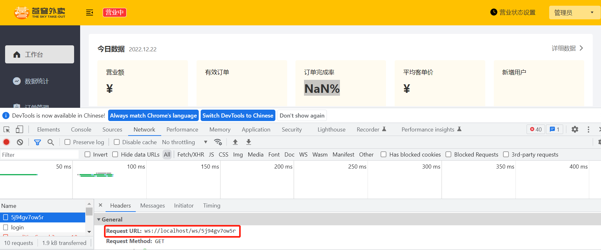 

查看控制台日志

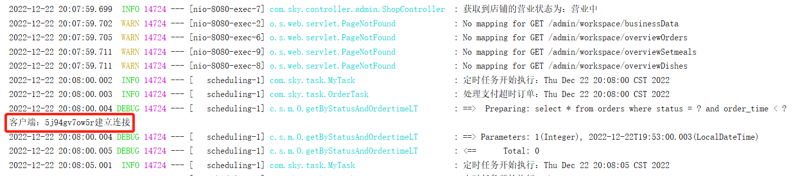 


**2). 小程序端下单支付**

修改回调地址，利用内网穿透获取域名

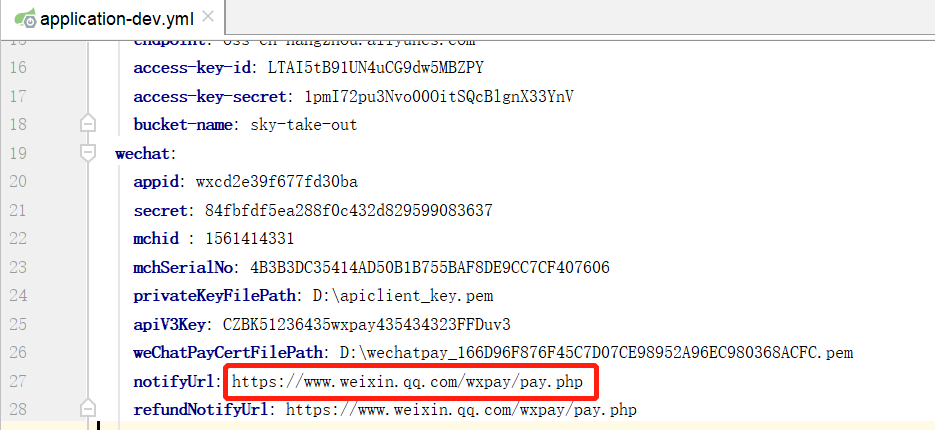 


下单支付

  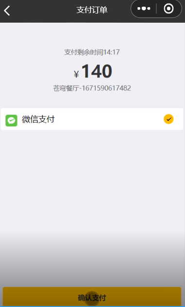 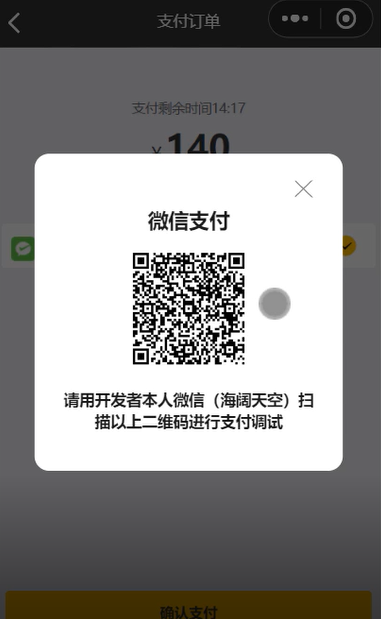


**3). 查看来单提醒**

支付成功后，后台收到来单提醒，并有语音播报

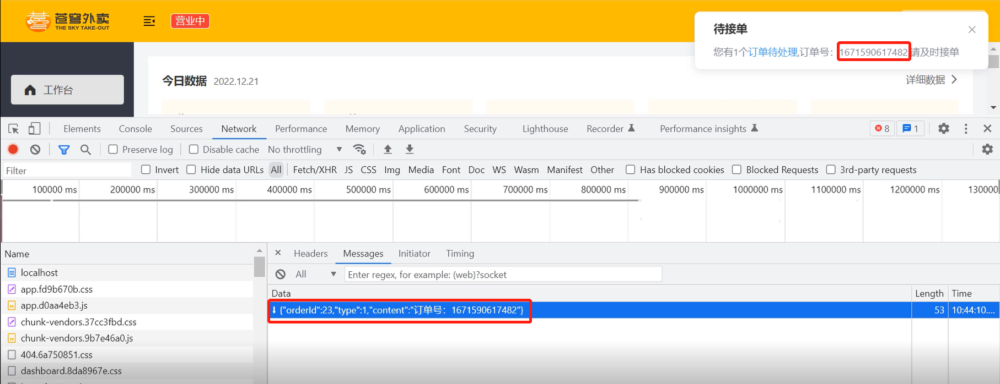 


### 4.4 代码提交

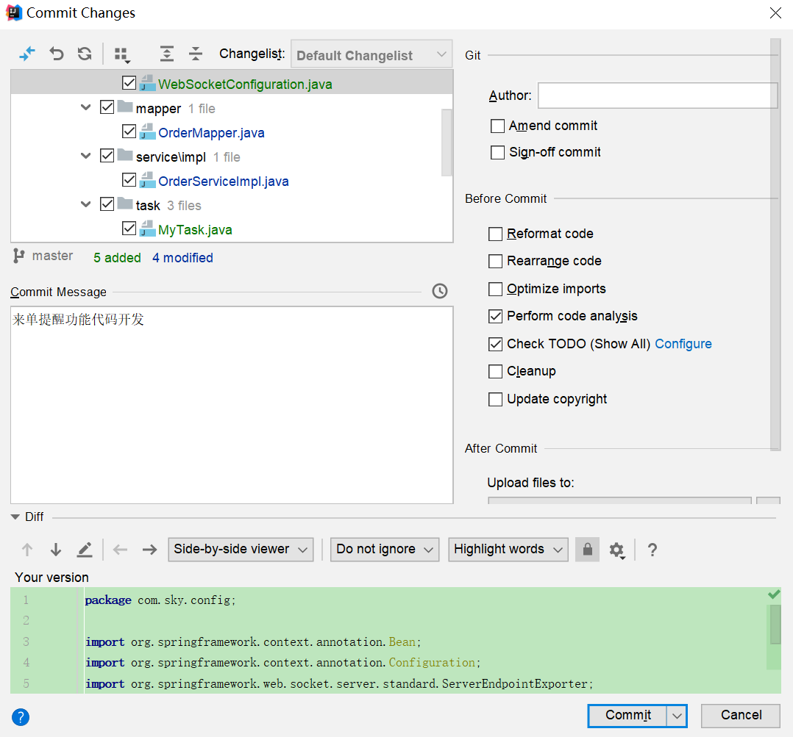 

后续步骤和其它功能代码提交一致，不再赘述。


## 5. 客户催单

### 5.1 需求分析和设计

用户在小程序中点击催单按钮后，需要第一时间通知外卖商家。通知的形式有如下两种：

- 语音播报 
- 弹出提示框

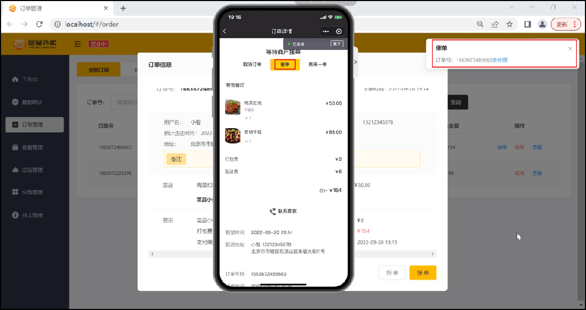 


**设计思路：**

- 通过WebSocket实现管理端页面和服务端保持长连接状态
- 当用户点击催单按钮后，调用WebSocket的相关API实现服务端向客户端推送消息
- 客户端浏览器解析服务端推送的消息，判断是来单提醒还是客户催单，进行相应的消息提示和语音播报
  约定服务端发送给客户端浏览器的数据格式为JSON，字段包括：type，orderId，content
  - type 为消息类型，1为来单提醒 2为客户催单
  - orderId 为订单id
  - content 为消息内容


当用户点击催单按钮时，向服务端发送请求。

**接口设计(催单)：**

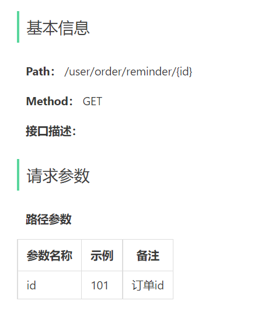 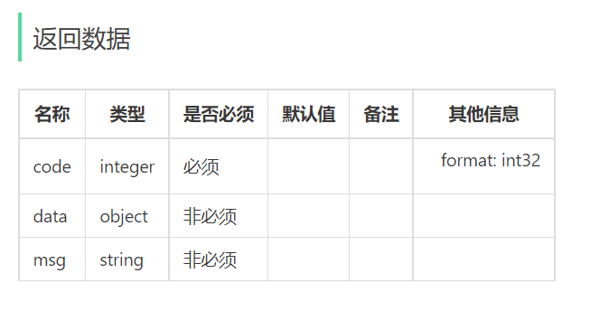


### 5.2 代码开发

#### 5.2.1 Controller层

**根据用户催单的接口定义，在user/OrderController中创建催单方法：**

```java
	/**
     * 用户催单
     *
     * @param id
     * @return
     */
    @GetMapping("/reminder/{id}")
    @ApiOperation("用户催单")
    public Result reminder(@PathVariable("id") Long id) {
        orderService.reminder(id);
        return Result.success();
    }
```


#### 5.2.2 Service层接口

**在OrderService接口中声明reminder方法：**

```java
	/**
     * 用户催单
     * @param id
     */
    void reminder(Long id);
```


#### 5.2.3 Service层实现类

**在OrderServiceImpl中实现reminder方法：**

```java
	/**
     * 用户催单
     *
     * @param id
     */
    public void reminder(Long id) {
        // 查询订单是否存在
        Orders orders = orderMapper.getById(id);
        if (orders == null) {
            throw new OrderBusinessException(MessageConstant.ORDER_NOT_FOUND);
        }

        //基于WebSocket实现催单
        Map map = new HashMap();
        map.put("type", 2);//2代表用户催单
        map.put("orderId", id);
        map.put("content", "订单号：" + orders.getNumber());
        webSocketServer.sendToAllClient(JSON.toJSONString(map));
    }
```


5.2.4 Mapper层

**在OrderMapper中添加getById：**

```java
	/**
     * 根据id查询订单
     * @param id
     */
    @Select("select * from orders where id=#{id}")
    Orders getById(Long id);
```


### 5.3 功能测试

可以通过如下方式进行测试：

- 查看浏览器调试工具数据交互过程
- 前后端联调

**1). 登录管理端后台**

登录成功后，浏览器与服务器建立长连接

 

查看控制台日志

 


**2). 用户进行催单**

用户可在订单列表或者订单详情，进行催单

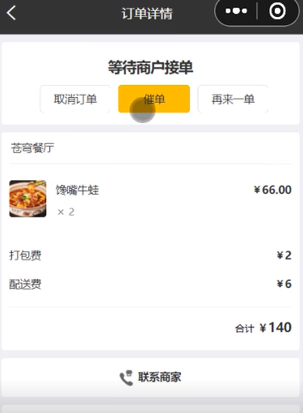 


**3). 查看催单提醒**

既有催单弹窗，同时语音播报

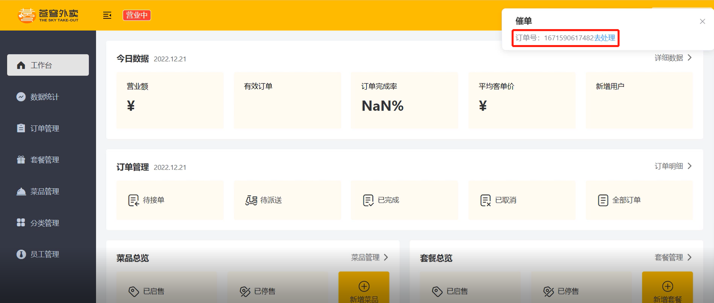 


### 5.4 代码提交

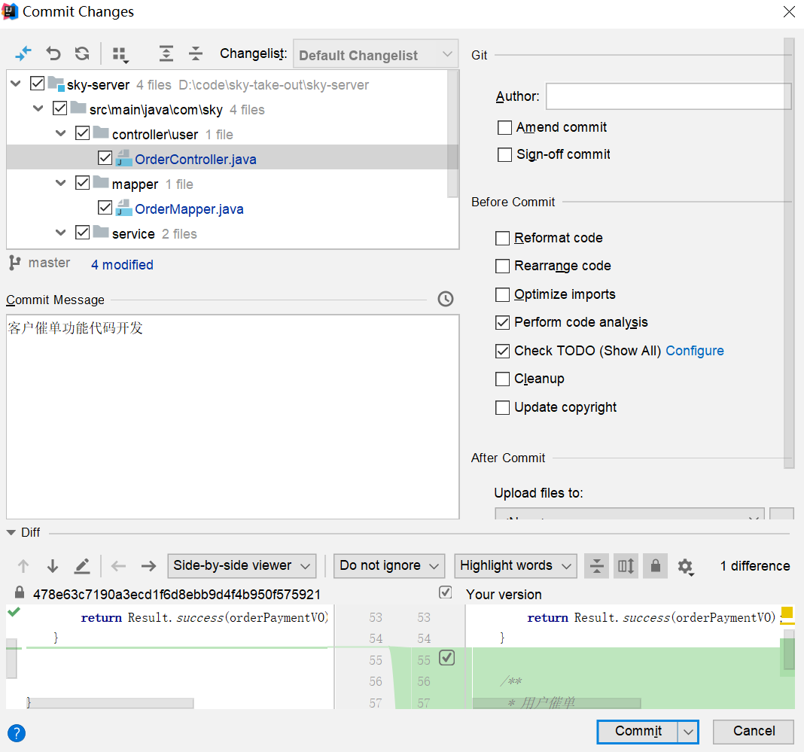 

后续步骤和其它功能代码提交一致，不再赘述。