# 苍穹外卖-day11

## 课程内容

- Apache ECharts
- 营业额统计
- 用户统计
- 订单统计
- 销量排名Top10


功能实现：**数据统计**

**数据统计效果图：**

 


## 1. Apache ECharts

### 1.1 介绍

Apache ECharts 是一款基于 Javascript 的数据可视化图表库，提供直观，生动，可交互，可个性化定制的数据可视化图表。
官网地址：https://echarts.apache.org/zh/index.html

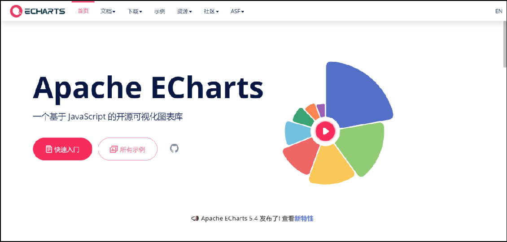 


**常见效果展示：**

1). 柱形图

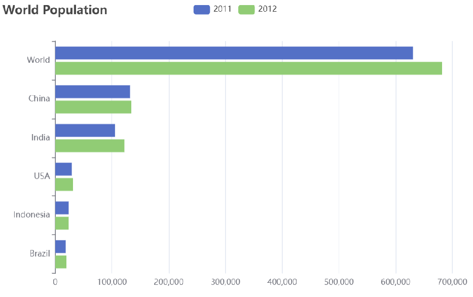 


2). 饼形图

 


3). 折线图

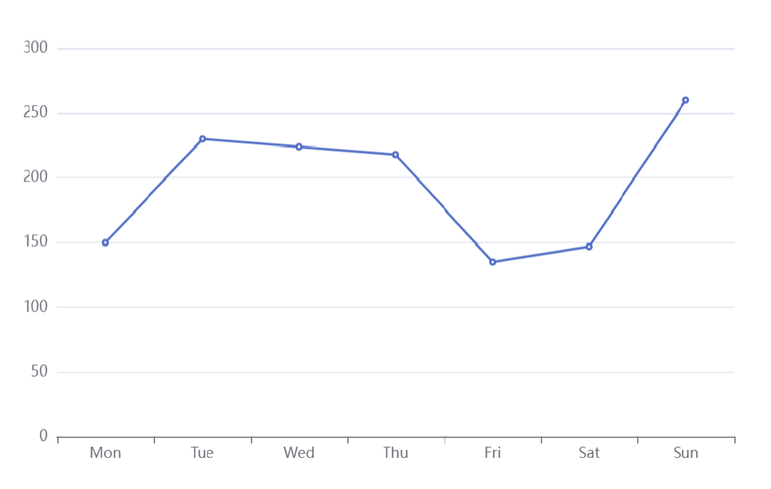 


**总结：**不管是哪种形式的图形，最本质的东西实际上是数据，它其实是对数据的一种可视化展示。


### 1.2 入门案例

Apache Echarts官方提供的快速入门：https://echarts.apache.org/handbook/zh/get-started/

**效果展示：**

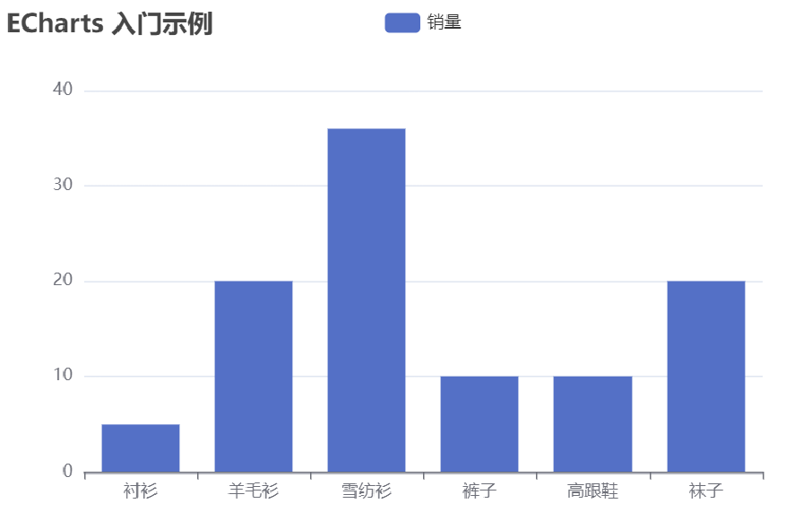 


**实现步骤：**

1). 引入echarts.js 文件(当天资料已提供)

2). 为 ECharts 准备一个设置宽高的 DOM

3). 初始化echarts实例

4). 指定图表的配置项和数据

5). 使用指定的配置项和数据显示图表


**代码开发：**

```html
<!DOCTYPE html>
<html>
  <head>
    <meta charset="utf-8" />
    <title>ECharts</title>
    <!-- 引入刚刚下载的 ECharts 文件 -->
    <script src="echarts.js"></script>
  </head>
  <body>
    <!-- 为 ECharts 准备一个定义了宽高的 DOM -->
    <div id="main" style="width: 600px;height:400px;"></div>
    <script type="text/javascript">
      // 基于准备好的dom，初始化echarts实例
      var myChart = echarts.init(document.getElementById('main'));

      // 指定图表的配置项和数据
      var option = {
        title: {
          text: 'ECharts 入门示例'
        },
        tooltip: {},
        legend: {
          data: ['销量']
        },
        xAxis: {
          data: ['衬衫', '羊毛衫', '雪纺衫', '裤子', '高跟鞋', '袜子']
        },
        yAxis: {},
        series: [
          {
            name: '销量',
            type: 'bar',
            data: [5, 20, 36, 10, 10, 20]
          }
        ]
      };

      // 使用刚指定的配置项和数据显示图表。
      myChart.setOption(option);
    </script>
  </body>
</html>
```


**测试：**(当天资料中已提供)

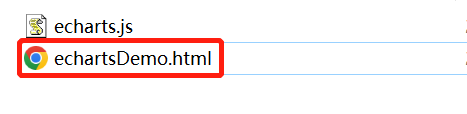 

使用浏览器方式打开即可。


**总结：**使用Echarts，重点在于研究当前图表所需的数据格式。通常是需要后端提供符合格式要求的动态数据，然后响应给前端来展示图表。


## 2. 营业额统计

### 2.1 需求分析和设计

#### 2.1.1 产品原型

营业额统计是基于折现图来展现，并且按照天来展示的。实际上，就是某一个时间范围之内的每一天的营业额。同时，不管光标放在哪个点上，那么它就会把具体的数值展示出来。并且还需要注意日期并不是固定写死的，是由上边时间选择器来决定。比如选择是近7天、或者是近30日，或者是本周，就会把相应这个时间段之内的每一天日期通过横坐标展示。

**原型图：**

 


**业务规则：**

- 营业额指订单状态为已完成的订单金额合计
- 基于可视化报表的折线图展示营业额数据，X轴为日期，Y轴为营业额
- 根据时间选择区间，展示每天的营业额数据


#### 2.1.2 接口设计

通过上述原型图，设计出对应的接口。


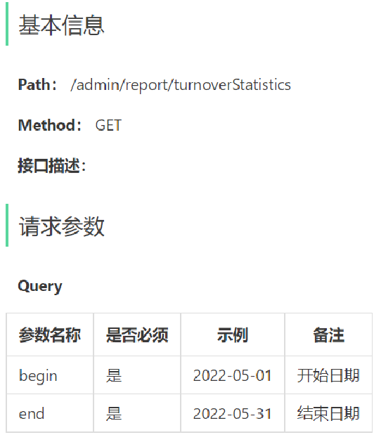 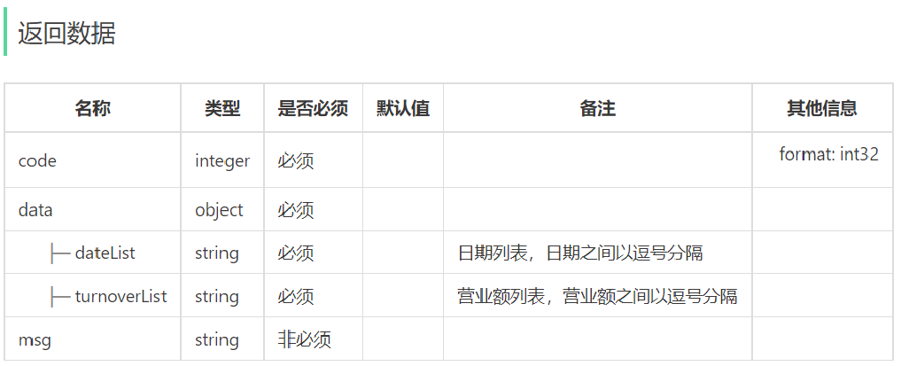 


**注意：**具体返回数据一般由前端来决定，前端展示图表，具体折现图对应数据是什么格式，是有固定的要求的。
所以说，后端需要去适应前端，它需要什么格式的数据，我们就给它返回什么格式的数据。


### 2.2 代码开发

#### 2.2.1 VO设计

**根据接口定义设计对应的VO：**

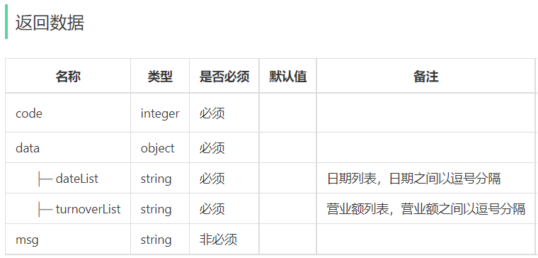 

在sky-pojo模块，TurnoverReportVO.java已定义

```java
package com.sky.vo;

import lombok.AllArgsConstructor;
import lombok.Builder;
import lombok.Data;
import lombok.NoArgsConstructor;

import java.io.Serializable;

@Data
@Builder
@NoArgsConstructor
@AllArgsConstructor
public class TurnoverReportVO implements Serializable {

    //日期，以逗号分隔，例如：2022-10-01,2022-10-02,2022-10-03
    private String dateList;

    //营业额，以逗号分隔，例如：406.0,1520.0,75.0
    private String turnoverList;

}
```


#### 2.2.2 Controller层

**根据接口定义创建ReportController：**

```java
package com.sky.controller.admin;

import com.sky.result.Result;
import com.sky.service.ReportService;
import com.sky.vo.TurnoverReportVO;
import io.swagger.annotations.Api;
import io.swagger.annotations.ApiOperation;
import lombok.extern.slf4j.Slf4j;
import org.springframework.beans.factory.annotation.Autowired;
import org.springframework.format.annotation.DateTimeFormat;
import org.springframework.web.bind.annotation.GetMapping;
import org.springframework.web.bind.annotation.RequestMapping;
import org.springframework.web.bind.annotation.RestController;
import java.time.LocalDate;

/**
 * 报表
 */
@RestController
@RequestMapping("/admin/report")
@Slf4j
@Api(tags = "统计报表相关接口")
public class ReportController {

    @Autowired
    private ReportService reportService;

    /**
     * 营业额数据统计
     *
     * @param begin
     * @param end
     * @return
     */
    @GetMapping("/turnoverStatistics")
    @ApiOperation("营业额数据统计")
    public Result<TurnoverReportVO> turnoverStatistics(
            @DateTimeFormat(pattern = "yyyy-MM-dd")
                    LocalDate begin,
            @DateTimeFormat(pattern = "yyyy-MM-dd")
                    LocalDate end) {
        return Result.success(reportService.getTurnover(begin, end));
    }

}
```


#### 2.2.3 Service层接口

**创建ReportService接口，声明getTurnover方法：**

```java
package com.sky.service;

import com.sky.vo.TurnoverReportVO;
import java.time.LocalDate;

public interface ReportService {

    /**
     * 根据时间区间统计营业额
     * @param beginTime
     * @param endTime
     * @return
     */
    TurnoverReportVO getTurnover(LocalDate beginTime, LocalDate endTime);
}
```


#### 2.2.4 Service层实现类

**创建ReportServiceImpl实现类，实现getTurnover方法:**

```java
package com.sky.service.impl;

import com.sky.entity.Orders;
import com.sky.mapper.OrderMapper;
import com.sky.service.ReportService;
import com.sky.vo.TurnoverReportVO;
import lombok.extern.slf4j.Slf4j;
import org.apache.commons.lang.StringUtils;
import org.springframework.beans.factory.annotation.Autowired;
import org.springframework.stereotype.Service;
import java.time.LocalDate;
import java.time.LocalDateTime;
import java.time.LocalTime;
import java.util.ArrayList;
import java.util.HashMap;
import java.util.List;
import java.util.Map;

@Service
@Slf4j
public class ReportServiceImpl implements ReportService {

    @Autowired
    private OrderMapper orderMapper;

    /**
     * 根据时间区间统计营业额
     * @param begin
     * @param end
     * @return
     */
    public TurnoverReportVO getTurnover(LocalDate begin, LocalDate end) {
        List<LocalDate> dateList = new ArrayList<>();
        dateList.add(begin);

        while (!begin.equals(end)){
            begin = begin.plusDays(1);//日期计算，获得指定日期后1天的日期
            dateList.add(begin);
        }
        
       List<Double> turnoverList = new ArrayList<>();
        for (LocalDate date : dateList) {
            LocalDateTime beginTime = LocalDateTime.of(date, LocalTime.MIN);
            LocalDateTime endTime = LocalDateTime.of(date, LocalTime.MAX);
            Map map = new HashMap();
        	map.put("status", Orders.COMPLETED);
        	map.put("begin",beginTime);
        	map.put("end", endTime);
            Double turnover = orderMapper.sumByMap(map); 
            turnover = turnover == null ? 0.0 : turnover;
            turnoverList.add(turnover);
        }

        //数据封装
        return TurnoverReportVO.builder()
                .dateList(StringUtils.join(dateList,","))
                .turnoverList(StringUtils.join(turnoverList,","))
                .build();
    }
}
```


#### 2.2.5 Mapper层

**在OrderMapper接口声明sumByMap方法：**

```java
	/**
     * 根据动态条件统计营业额
     * @param map
     */
    Double sumByMap(Map map);
```

**在OrderMapper.xml文件中编写动态SQL：**

```xml
<select id="sumByMap" resultType="java.lang.Double">
        select sum(amount) from orders
        <where>
            <if test="status != null">
                and status = #{status}
            </if>
            <if test="begin != null">
                and order_time &gt;= #{begin}
            </if>
            <if test="end != null">
                and order_time &lt;= #{end}
            </if>
        </where>
</select>
```


### 2.3 功能测试

可以通过如下方式进行测试：

- 接口文档测试
- 前后端联调测试

启动服务器，启动nginx，直接采用前后端联调测试。

进入数据统计模块

**1). 查看近7日营业额统计**

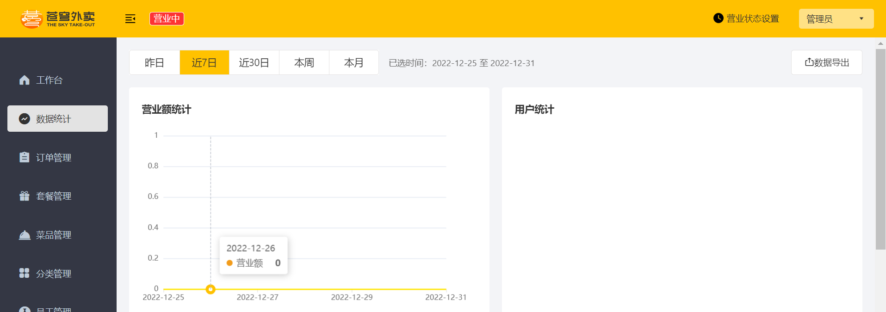 

进入开发者模式，查看返回数据

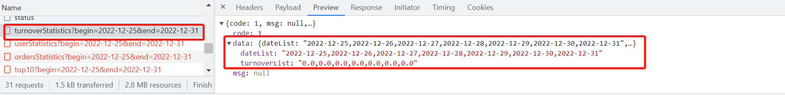 


**2). 查看近30日营业额统计**

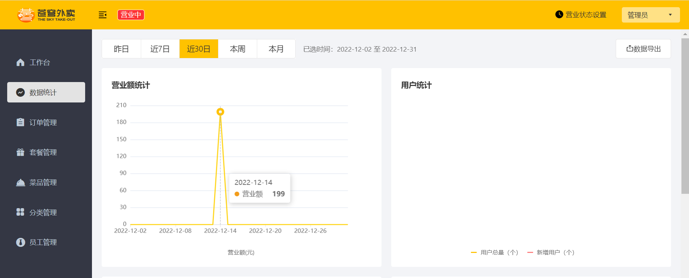 

进入开发者模式，查看返回数据

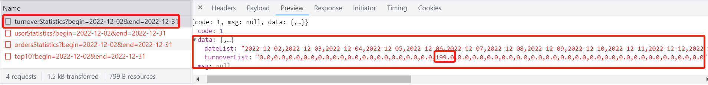 

也可通过断点方式启动，查看每步执行情况。


### 2.4 代码提交

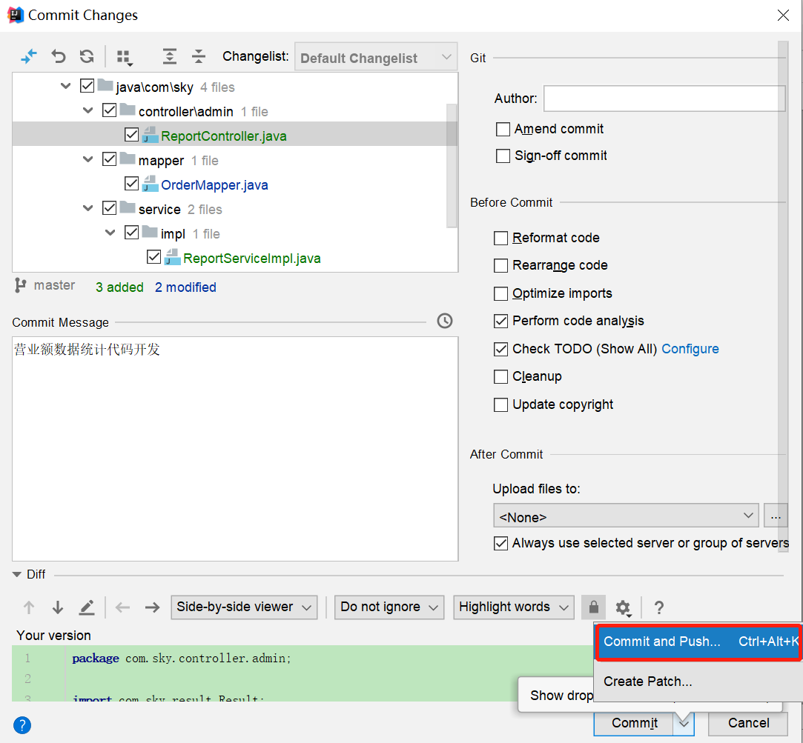 

后续步骤和其它功能代码提交一致，不再赘述。


## 3. 用户统计

### 3.1 需求分析和设计

#### 3.1.1 产品原型

所谓用户统计，实际上统计的是用户的数量。通过折线图来展示，上面这根蓝色线代表的是用户总量，下边这根绿色线代表的是新增用户数量，是具体到每一天。所以说用户统计主要统计**两个数据**，一个是**总的用户数量**，另外一个是**新增用户数量**。

**原型图：**

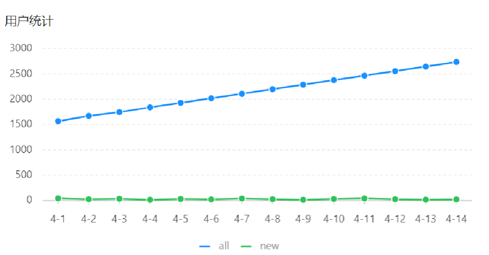 

**业务规则：**

- 基于可视化报表的折线图展示用户数据，X轴为日期，Y轴为用户数
- 根据时间选择区间，展示每天的用户总量和新增用户量数据


#### 3.1.2 接口设计

根据上述原型图设计接口。

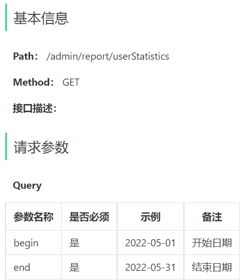 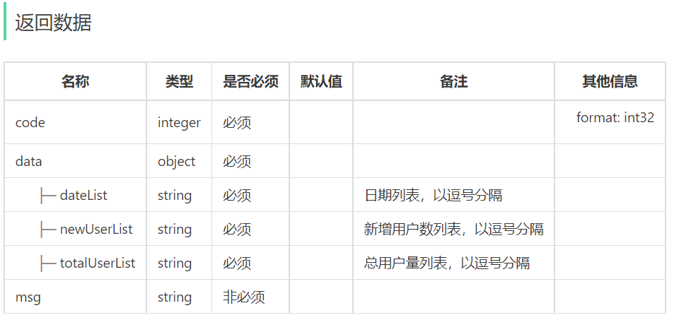 


### 3.2 代码开发

#### 3.2.1 VO设计

**根据用户统计接口的返回结果设计VO：**

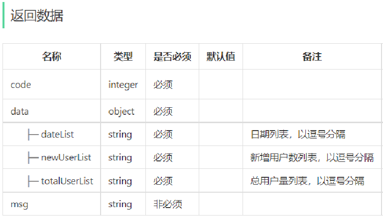 

在sky-pojo模块，UserReportVO.java已定义

```java
package com.sky.vo;

import lombok.AllArgsConstructor;
import lombok.Builder;
import lombok.Data;
import lombok.NoArgsConstructor;
import java.io.Serializable;

@Data
@Builder
@NoArgsConstructor
@AllArgsConstructor
public class UserReportVO implements Serializable {

    //日期，以逗号分隔，例如：2022-10-01,2022-10-02,2022-10-03
    private String dateList;

    //用户总量，以逗号分隔，例如：200,210,220
    private String totalUserList;

    //新增用户，以逗号分隔，例如：20,21,10
    private String newUserList;

}
```


#### 3.2.2 Controller层

**根据接口定义，在ReportController中创建userStatistics方法：**

```java
/**
     * 用户数据统计
     * @param begin
     * @param end
     * @return
     */
    @GetMapping("/userStatistics")
    @ApiOperation("用户数据统计")
    public Result<UserReportVO> userStatistics(
            @DateTimeFormat(pattern = "yyyy-MM-dd") LocalDate begin,
            @DateTimeFormat(pattern = "yyyy-MM-dd") LocalDate end){

        return Result.success(reportService.getUserStatistics(begin,end));            
}
```


#### 3.2.3 Service层接口

**在ReportService接口中声明getUserStatistics方法：**

```java
	/**
     * 根据时间区间统计用户数量
     * @param begin
     * @param end
     * @return
     */
    UserReportVO getUserStatistics(LocalDate begin, LocalDate end);
```


#### 3.2.4 Service层实现类

**在ReportServiceImpl实现类中实现getUserStatistics方法：**

```java
	@Override
    public UserReportVO getUserStatistics(LocalDate begin, LocalDate end) {
        List<LocalDate> dateList = new ArrayList<>();
        dateList.add(begin);

        while (!begin.equals(end)){
            begin = begin.plusDays(1);
            dateList.add(begin);
        }
        List<Integer> newUserList = new ArrayList<>(); //新增用户数
        List<Integer> totalUserList = new ArrayList<>(); //总用户数

        for (LocalDate date : dateList) {
            LocalDateTime beginTime = LocalDateTime.of(date, LocalTime.MIN);
            LocalDateTime endTime = LocalDateTime.of(date, LocalTime.MAX);
            //新增用户数量 select count(id) from user where create_time > ? and create_time < ?
            Integer newUser = getUserCount(beginTime, endTime);
            //总用户数量 select count(id) from user where  create_time < ?
            Integer totalUser = getUserCount(null, endTime);

            newUserList.add(newUser);
            totalUserList.add(totalUser);
        }

        return UserReportVO.builder()
                .dateList(StringUtils.join(dateList,","))
                .newUserList(StringUtils.join(newUserList,","))
                .totalUserList(StringUtils.join(totalUserList,","))
                .build();
    }
```

**在ReportServiceImpl实现类中创建私有方法getUserCount：**

```java
	/**
     * 根据时间区间统计用户数量
     * @param beginTime
     * @param endTime
     * @return
     */
    private Integer getUserCount(LocalDateTime beginTime, LocalDateTime endTime) {
        Map map = new HashMap();
        map.put("begin",beginTime);
        map.put("end", endTime);
        return userMapper.countByMap(map);
    }
```


#### 3.2.5 Mapper层

**在UserMapper接口中声明countByMap方法：**

```java
	/**
     * 根据动态条件统计用户数量
     * @param map
     * @return
     */
    Integer countByMap(Map map);
```

**在UserMapper.xml文件中编写动态SQL：**

```java
<select id="countByMap" resultType="java.lang.Integer">
        select count(id) from user
        <where>
            <if test="begin != null">
                and create_time &gt;= #{begin}
            </if>
            <if test="end != null">
                and create_time &lt;= #{end}
            </if>
        </where>
</select>
```


### 3.3 功能测试

可以通过如下方式进行测试：

- 接口文档测试
- 前后端联调测试

进入数据统计模块

**1). 查看近7日用户统计**

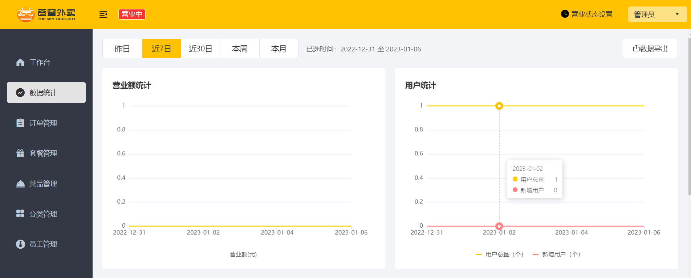 

进入开发者模式，查看返回数据

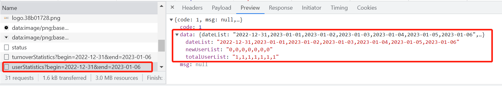 


**2). 查看近30日用户统计**

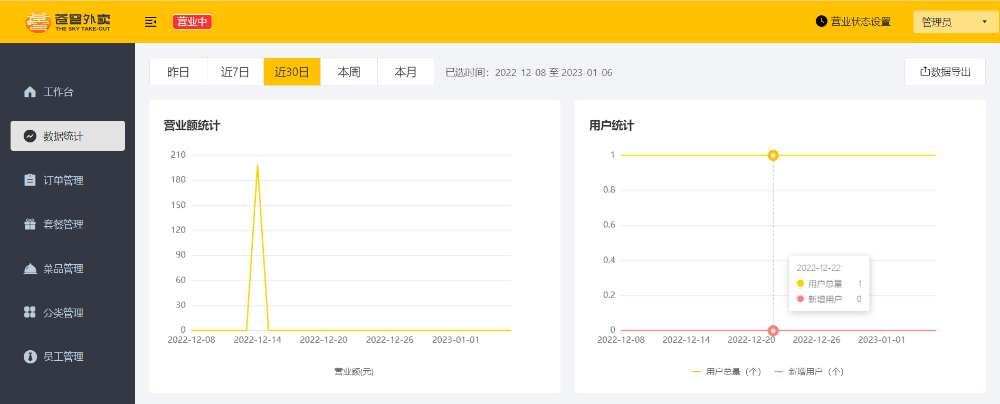 

进入开发者模式，查看返回数据

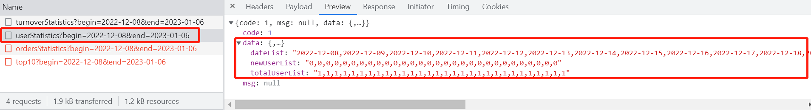 

也可通过断点方式启动，查看每步执行情况。


### 3.4 代码提交

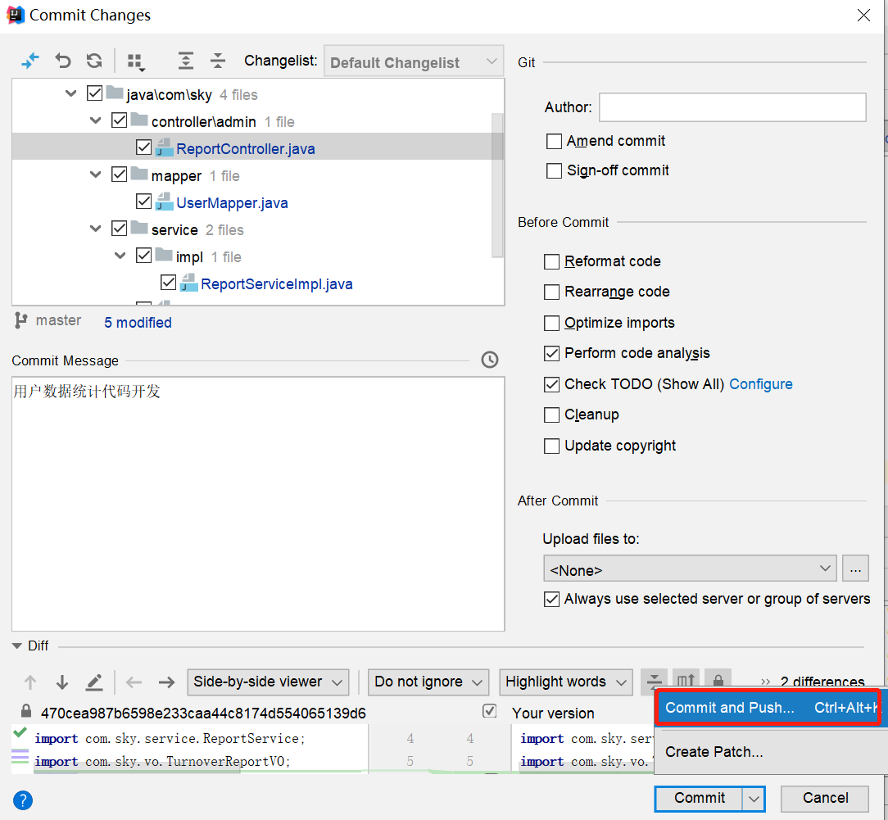 

后续步骤和其它功能代码提交一致，不再赘述。


## 4. 订单统计

### 4.1 需求分析和设计

#### 4.1.1 产品原型

订单统计通过一个折现图来展现，折线图上有两根线，这根蓝色的线代表的是订单总数，而下边这根绿色的线代表的是有效订单数，指的就是状态是已完成的订单就属于有效订单，分别反映的是每一天的数据。上面还有3个数字，分别是订单总数、有效订单、订单完成率，它指的是整个时间区间之内总的数据。

**原型图：**

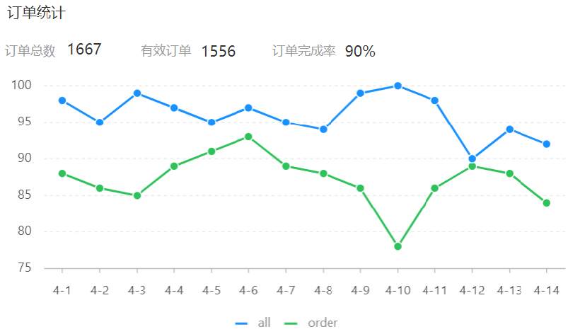 

**业务规则：**

- 有效订单指状态为 “已完成” 的订单
- 基于可视化报表的折线图展示订单数据，X轴为日期，Y轴为订单数量
- 根据时间选择区间，展示每天的订单总数和有效订单数
- 展示所选时间区间内的有效订单数、总订单数、订单完成率，订单完成率 = 有效订单数 / 总订单数 * 100%


#### 4.1.2 接口设计

根据上述原型图设计接口。

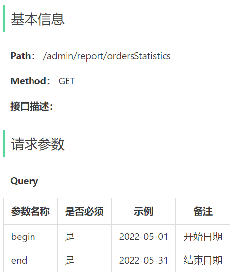 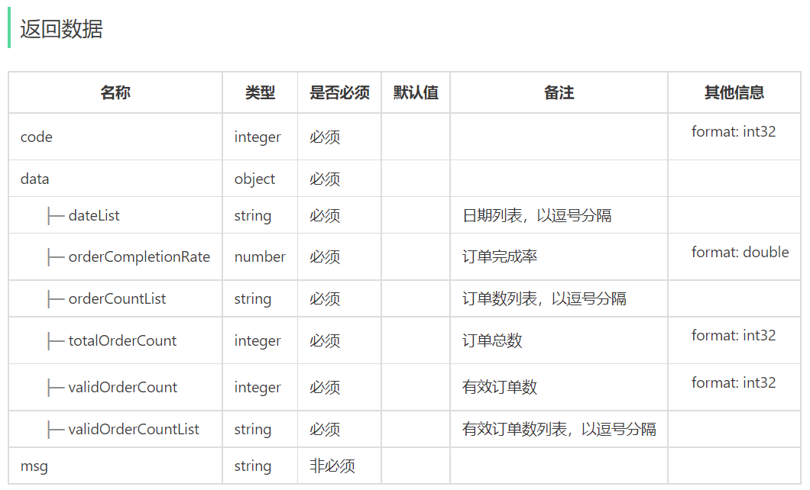 


### 4.2 代码开发

#### 4.2.1 VO设计

**根据订单统计接口的返回结果设计VO：**

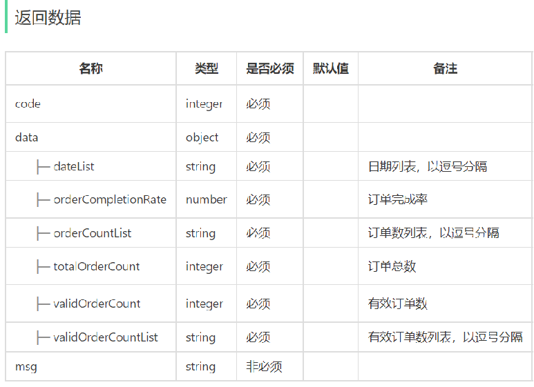 

在sky-pojo模块，OrderReportVO.java已定义

```java
package com.sky.vo;

import lombok.AllArgsConstructor;
import lombok.Builder;
import lombok.Data;
import lombok.NoArgsConstructor;
import java.io.Serializable;

@Data
@Builder
@NoArgsConstructor
@AllArgsConstructor
public class OrderReportVO implements Serializable {

    //日期，以逗号分隔，例如：2022-10-01,2022-10-02,2022-10-03
    private String dateList;

    //每日订单数，以逗号分隔，例如：260,210,215
    private String orderCountList;

    //每日有效订单数，以逗号分隔，例如：20,21,10
    private String validOrderCountList;

    //订单总数
    private Integer totalOrderCount;

    //有效订单数
    private Integer validOrderCount;

    //订单完成率
    private Double orderCompletionRate;

}
```


#### 4.2.2 Controller层

**在ReportController中根据订单统计接口创建orderStatistics方法：**

```java
/**
     * 订单数据统计
     * @param begin
     * @param end
     * @return
     */
    @GetMapping("/ordersStatistics")
    @ApiOperation("用户数据统计")
    public Result<OrderReportVO> orderStatistics(
            @DateTimeFormat(pattern = "yyyy-MM-dd")
                    LocalDate begin,
            @DateTimeFormat(pattern = "yyyy-MM-dd")
                    LocalDate end){

        return Result.success(reportService.getOrderStatistics(begin,end));
    }
```


#### 4.2.3 Service层接口

**在ReportService接口中声明getOrderStatistics方法：**

```java
/**
* 根据时间区间统计订单数量
* @param begin 
* @param end
* @return 
*/
OrderReportVO getOrderStatistics(LocalDate begin, LocalDate end);
```


#### 4.2.4 Service层实现类

**在ReportServiceImpl实现类中实现getOrderStatistics方法：**

```java
/**
* 根据时间区间统计订单数量
* @param begin 
* @param end
* @return 
*/
public OrderReportVO getOrderStatistics(LocalDate begin, LocalDate end){
	List<LocalDate> dateList = new ArrayList<>();
    dateList.add(begin);

    while (!begin.equals(end)){
          begin = begin.plusDays(1);
          dateList.add(begin);
     }
    //每天订单总数集合
     List<Integer> orderCountList = new ArrayList<>();
    //每天有效订单数集合
    List<Integer> validOrderCountList = new ArrayList<>();
    for (LocalDate date : dateList) {
         LocalDateTime beginTime = LocalDateTime.of(date, LocalTime.MIN);
         LocalDateTime endTime = LocalDateTime.of(date, LocalTime.MAX);
   //查询每天的总订单数 select count(id) from orders where order_time > ? and order_time < ?
         Integer orderCount = getOrderCount(beginTime, endTime, null);

  //查询每天的有效订单数 select count(id) from orders where order_time > ? and order_time < ? and status = ?
         Integer validOrderCount = getOrderCount(beginTime, endTime, Orders.COMPLETED);

         orderCountList.add(orderCount);
         validOrderCountList.add(validOrderCount);
        }

    //时间区间内的总订单数
    Integer totalOrderCount = orderCountList.stream().reduce(Integer::sum).get();
    //时间区间内的总有效订单数
    Integer validOrderCount = validOrderCountList.stream().reduce(Integer::sum).get();
    //订单完成率
    Double orderCompletionRate = 0.0;
    if(totalOrderCount != 0){
         orderCompletionRate = validOrderCount.doubleValue() / totalOrderCount;
     }
    return OrderReportVO.builder()
                .dateList(StringUtils.join(dateList, ","))
                .orderCountList(StringUtils.join(orderCountList, ","))
                .validOrderCountList(StringUtils.join(validOrderCountList, ","))
                .totalOrderCount(totalOrderCount)
                .validOrderCount(validOrderCount)
                .orderCompletionRate(orderCompletionRate)
                .build();
    
}
```

**在ReportServiceImpl实现类中提供私有方法getOrderCount：**

```java
/**
* 根据时间区间统计指定状态的订单数量
* @param beginTime
* @param endTime
* @param status
* @return
*/
private Integer getOrderCount(LocalDateTime beginTime, LocalDateTime endTime, Integer status) {
	Map map = new HashMap();
	map.put("status", status);
	map.put("begin",beginTime);
	map.put("end", endTime);
	return orderMapper.countByMap(map);
}
```


#### 4.2.5 Mapper层

**在OrderMapper接口中声明countByMap方法：**

```java
/**
*根据动态条件统计订单数量
* @param map
*/
Integer countByMap(Map map);
```

**在OrderMapper.xml文件中编写动态SQL：**

```java
<select id="countByMap" resultType="java.lang.Integer">
        select count(id) from orders
        <where>
            <if test="status != null">
                and status = #{status}
            </if>
            <if test="begin != null">
                and order_time &gt;= #{begin}
            </if>
            <if test="end != null">
                and order_time &lt;= #{end}
            </if>
        </where>
</select>
```


### 4.3 功能测试

可以通过如下方式进行测试：

- 接口文档测试
- 前后端联调

重启服务，直接采用前后端联调测试。

进入数据统计模块

**1). 查看近7日订单统计**

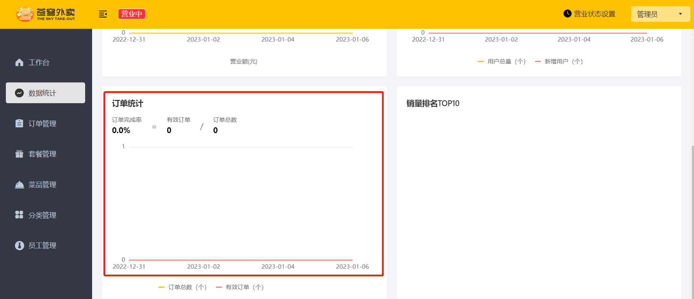 

进入开发者模式，查看返回数据

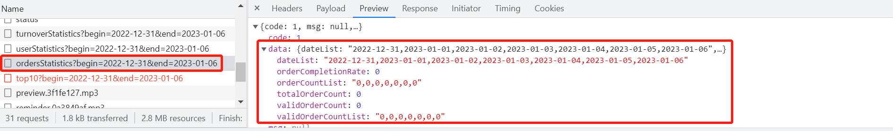 


**2). 查看近30日订单统计**

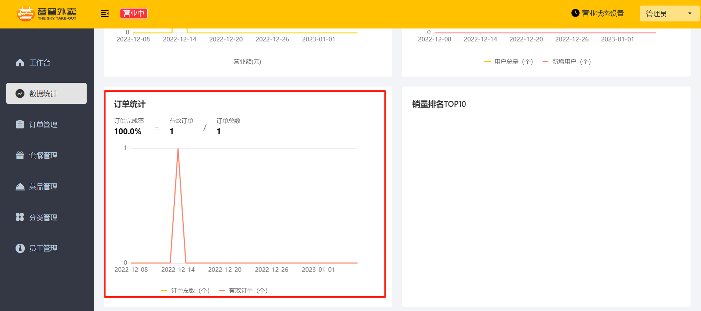 

进入开发者模式，查看返回数据

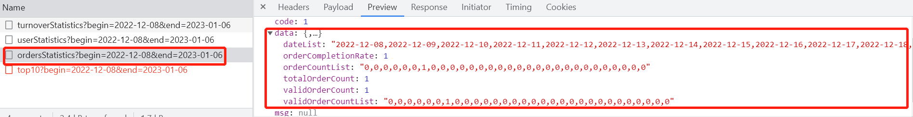 

也可通过断点方式启动，查看每步执行情况。


### 4.4 代码提交

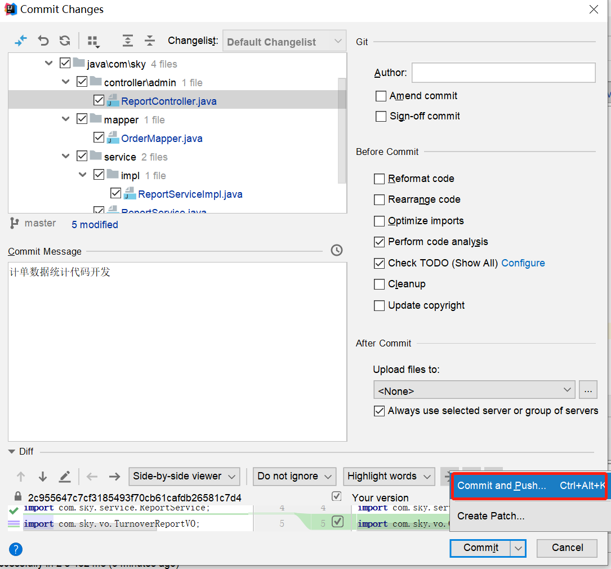 

后续步骤和其它功能代码提交一致，不再赘述。


## 5. 销量排名Top10

### 5.1 需求分析和设计

#### 5.1.1 产品原型

所谓销量排名，销量指的是商品销售的数量。项目当中的商品主要包含两类：一个是**套餐**，一个是**菜品**，所以销量排名其实指的就是菜品和套餐销售的数量排名。通过柱形图来展示销量排名，这些销量是按照降序来排列，并且只需要统计销量排名前十的商品。

**原型图：**

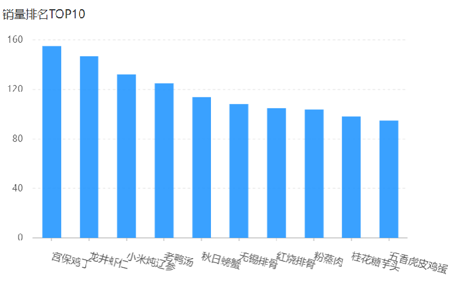 

**业务规则：**

- 根据时间选择区间，展示销量前10的商品（包括菜品和套餐）
- 基于可视化报表的柱状图降序展示商品销量
- 此处的销量为商品销售的份数


#### 5.1.2 接口设计

根据上述原型图设计接口。

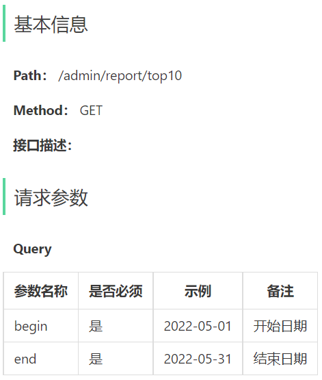  


### 5.2 代码开发

#### 5.2.1 VO设计

**根据销量排名接口的返回结果设计VO：**

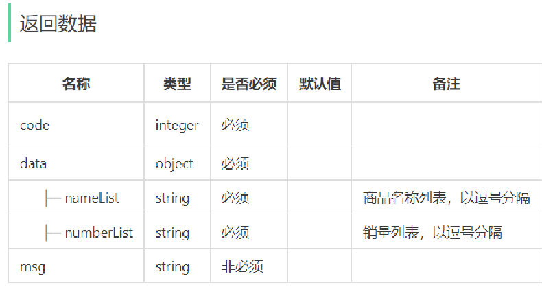 

在sky-pojo模块，SalesTop10ReportVO.java已定义

```java
package com.sky.vo;

import lombok.AllArgsConstructor;
import lombok.Builder;
import lombok.Data;
import lombok.NoArgsConstructor;
import java.io.Serializable;

@Data
@Builder
@NoArgsConstructor
@AllArgsConstructor
public class SalesTop10ReportVO implements Serializable {

    //商品名称列表，以逗号分隔，例如：鱼香肉丝,宫保鸡丁,水煮鱼
    private String nameList;

    //销量列表，以逗号分隔，例如：260,215,200
    private String numberList;

}
```


#### 5.2.2 Controller层

**在ReportController中根据销量排名接口创建top10方法：**

```java
/**
* 销量排名统计
* @param begin
* @param end
* @return
*/
@GetMapping("/top10")
@ApiOperation("销量排名统计")
public Result<SalesTop10ReportVO> top10(
    @DateTimeFormat(pattern = "yyyy-MM-dd") LocalDate begin,
    @DateTimeFormat(pattern = "yyyy-MM-dd") LocalDate end){
	return Result.success(reportService.getSalesTop10(begin,end));
}
```


#### 5.2.3 Service层接口

**在ReportService接口中声明getSalesTop10方法：**

```java
/**
* 查询指定时间区间内的销量排名top10 
* @param begin
* @param end
* @return
*/
SalesTop10ReportVO getSalesTop10(LocalDate begin, LocalDate end);
```


#### 5.2.4 Service层实现类

**在ReportServiceImpl实现类中实现getSalesTop10方法：**

```java
/**
     * 查询指定时间区间内的销量排名top10
     * @param begin
     * @param end
     * @return
     * */
    public SalesTop10ReportVO getSalesTop10(LocalDate begin, LocalDate end){
        LocalDateTime beginTime = LocalDateTime.of(begin, LocalTime.MIN);
        LocalDateTime endTime = LocalDateTime.of(end, LocalTime.MAX);
        List<GoodsSalesDTO> goodsSalesDTOList = orderMapper.getSalesTop10(beginTime, endTime);

        String nameList = StringUtils.join(goodsSalesDTOList.stream().map(GoodsSalesDTO::getName).collect(Collectors.toList()),",");
        String numberList = StringUtils.join(goodsSalesDTOList.stream().map(GoodsSalesDTO::getNumber).collect(Collectors.toList()),",");

        return SalesTop10ReportVO.builder()
                .nameList(nameList)
                .numberList(numberList)
                .build();
    }
```


#### 5.2.5 Mapper层

**在OrderMapper接口中声明getSalesTop10方法：**

```java
/**
* 查询商品销量排名
* @param begin
* @param end
*/
List<GoodsSalesDTO> getSalesTop10(LocalDateTime begin, LocalDateTime end);
```

**在OrderMapper.xml文件中编写动态SQL：**

```xml
<select id="getSalesTop10" resultType="com.sky.dto.GoodsSalesDTO">
        select od.name name,sum(od.number) number from order_detail od ,orders o
        where od.order_id = o.id
            and o.status = 5
            <if test="begin != null">
                and order_time &gt;= #{begin}
            </if>
            <if test="end != null">
                and order_time &lt;= #{end}
            </if>
        group by name
        order by number desc
        limit 0, 10
</select>
```


### 5.3 功能测试

可以通过如下方式进行测试：

- 接口文档测试
- 前后端联调

重启服务，直接采用前后端联调测试。

**查看近30日销量排名Top10统计**

若查询的某一段时间没有销量数据，则显示不出效果。

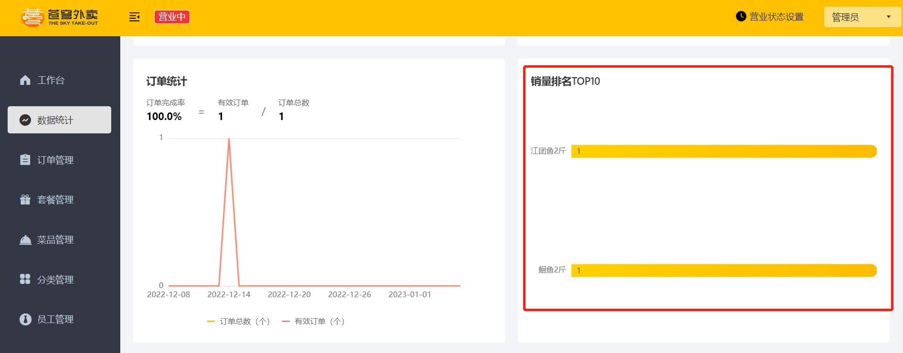 

进入开发者模式，查看返回数据

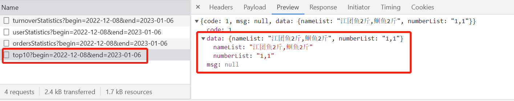 

也可通过断点方式启动，查看每步执行情况。


### 5.4 代码提交

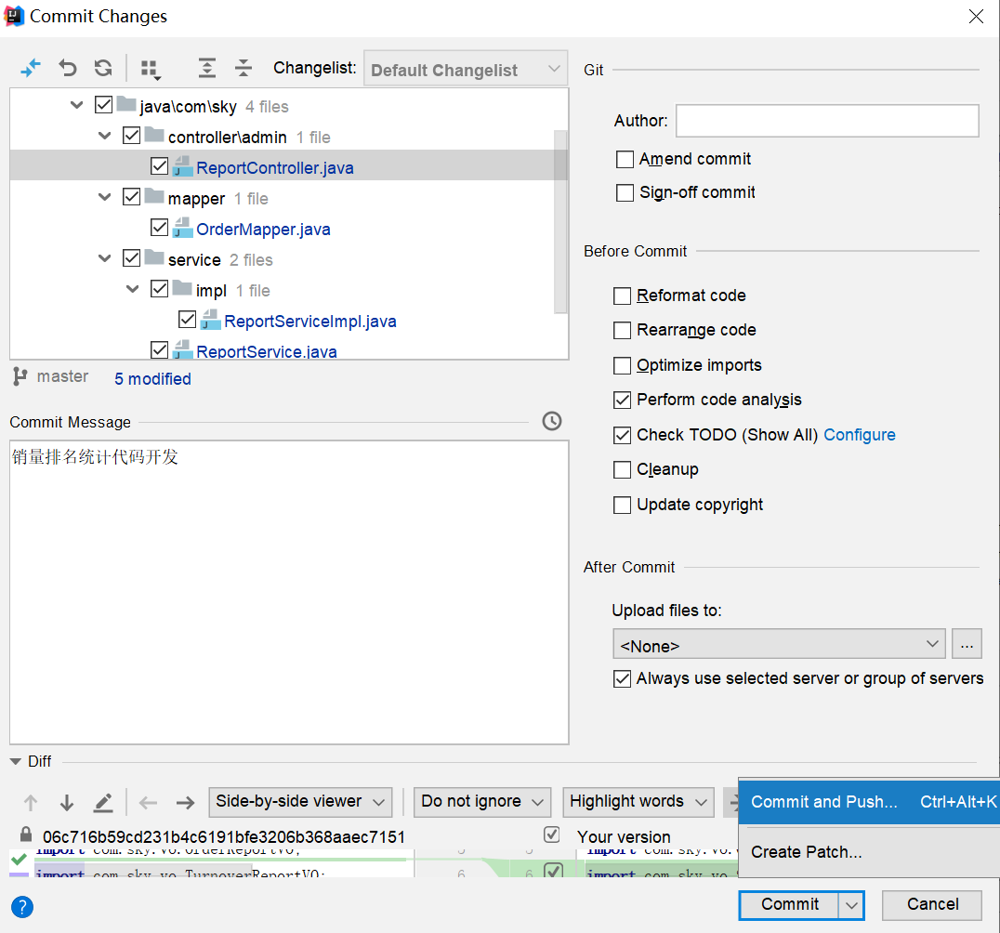 

后续步骤和其它功能代码提交一致，不再赘述。

