# 苍穹外卖-day12

## 课程内容

- 工作台
- Apache POI
- 导出运营数据Excel报表


功能实现：**工作台**、**数据导出**

**工作台效果图：**

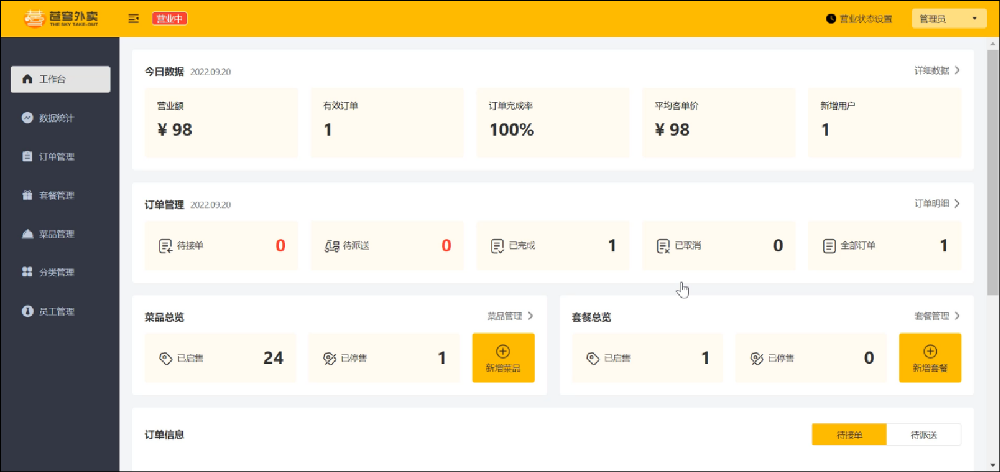  


**数据导出效果图：**

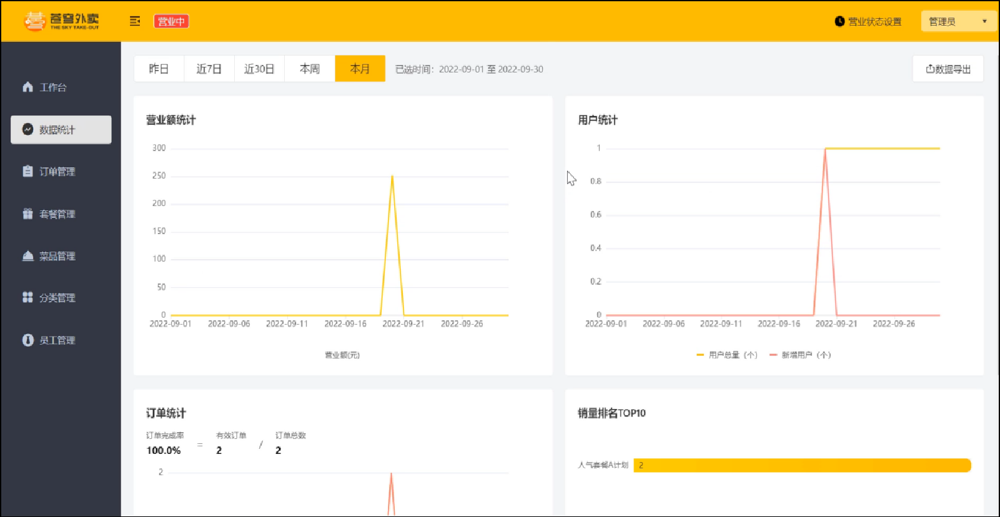   

在数据统计页面点击**数据导出**：生成Excel报表

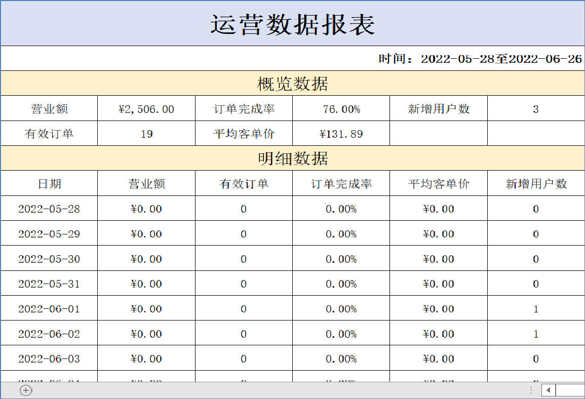    


## 1. 工作台

### 1.1 需求分析和设计

#### 1.1.1 产品原型

工作台是系统运营的数据看板，并提供快捷操作入口，可以有效提高商家的工作效率。

**工作台展示的数据：**

- 今日数据
- 订单管理
- 菜品总览
- 套餐总览
- 订单信息


**原型图：**

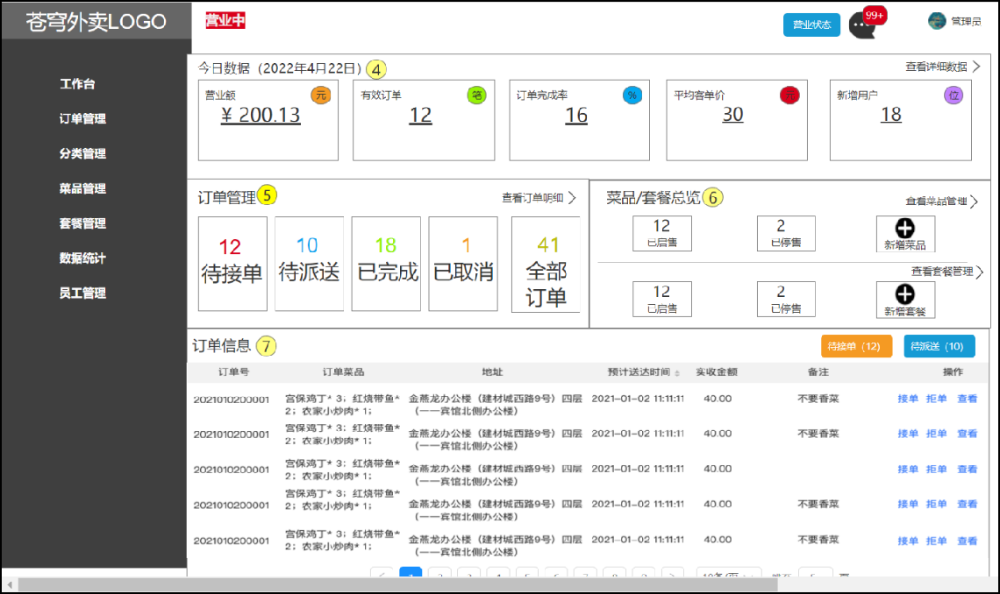 


**名词解释：**

- 营业额：已完成订单的总金额
- 有效订单：已完成订单的数量
- 订单完成率：有效订单数 / 总订单数 * 100%
- 平均客单价：营业额 / 有效订单数
- 新增用户：新增用户的数量


#### 1.1.2 接口设计

通过上述原型图分析，共包含6个接口。

**接口设计：**

- 今日数据接口
- 订单管理接口
- 菜品总览接口
- 套餐总览接口
- 订单搜索（已完成）
- 各个状态的订单数量统计（已完成）


**1). 今日数据的接口设计**

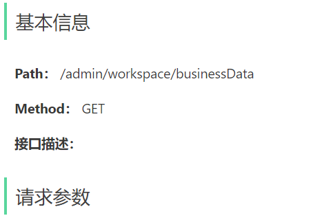 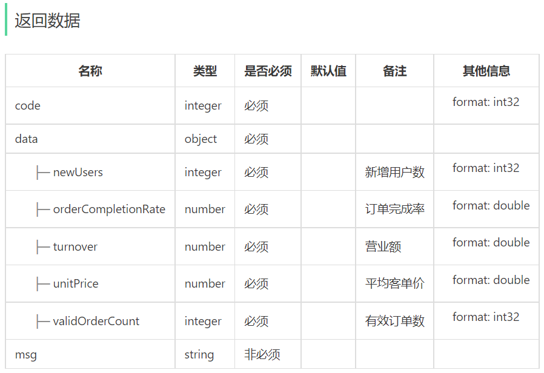

**2). 订单管理的接口设计**

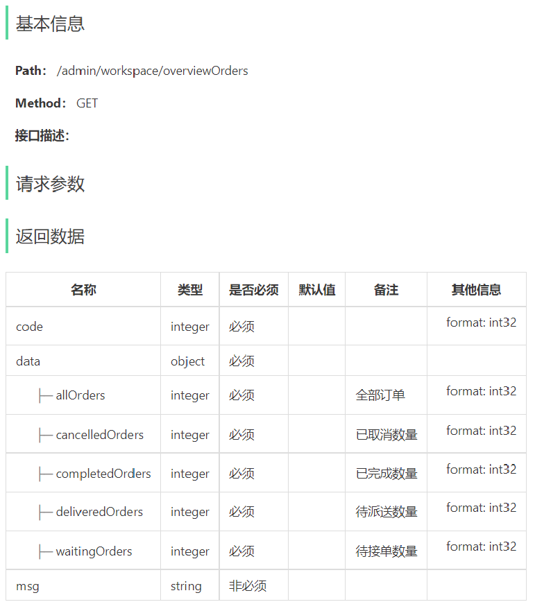 


**3). 菜品总览的接口设计**

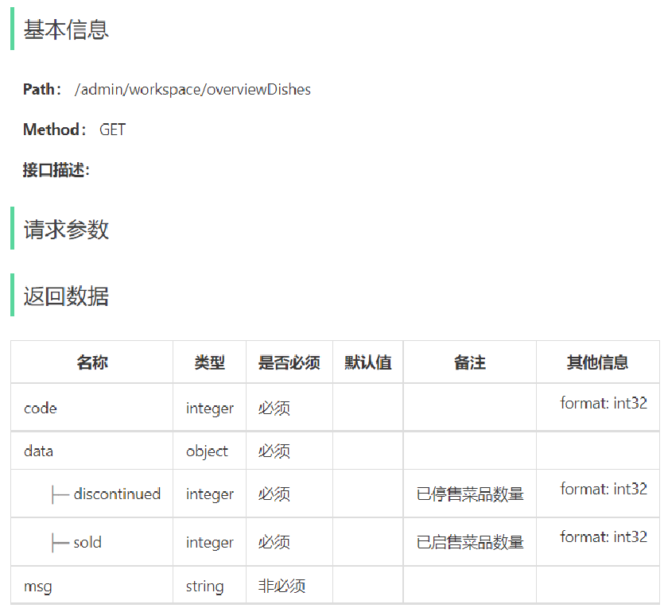 


**4). 套餐总览的接口设计**

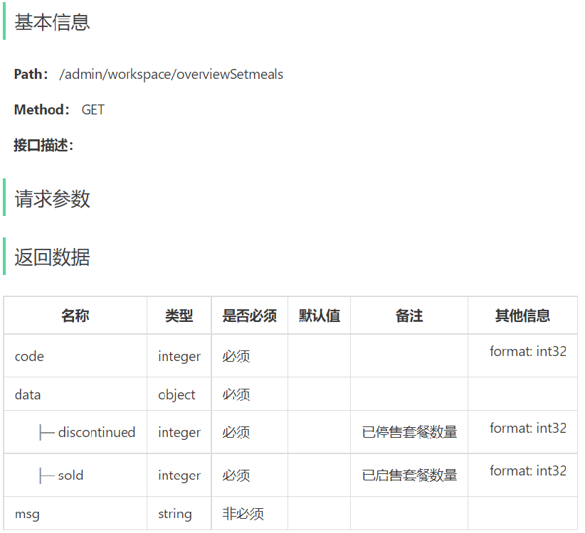 


### 1.2 代码导入

直接导入课程资料中的工作台模块功能代码即可：

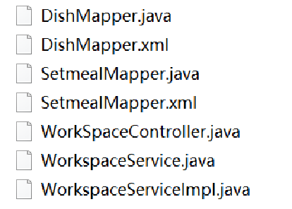 

#### 1.2.1 Controller层

**添加WorkSpaceController.java**

```java
package com.sky.controller.admin;

import com.sky.result.Result;
import com.sky.service.WorkspaceService;
import com.sky.vo.BusinessDataVO;
import com.sky.vo.DishOverViewVO;
import com.sky.vo.OrderOverViewVO;
import com.sky.vo.SetmealOverViewVO;
import io.swagger.annotations.Api;
import io.swagger.annotations.ApiOperation;
import lombok.extern.slf4j.Slf4j;
import org.springframework.beans.factory.annotation.Autowired;
import org.springframework.web.bind.annotation.GetMapping;
import org.springframework.web.bind.annotation.RequestMapping;
import org.springframework.web.bind.annotation.RestController;
import java.time.LocalDateTime;
import java.time.LocalTime;

/**
 * 工作台
 */
@RestController
@RequestMapping("/admin/workspace")
@Slf4j
@Api(tags = "工作台相关接口")
public class WorkSpaceController {

    @Autowired
    private WorkspaceService workspaceService;

    /**
     * 工作台今日数据查询
     * @return
     */
    @GetMapping("/businessData")
    @ApiOperation("工作台今日数据查询")
    public Result<BusinessDataVO> businessData(){
        //获得当天的开始时间
        LocalDateTime begin = LocalDateTime.now().with(LocalTime.MIN);
        //获得当天的结束时间
        LocalDateTime end = LocalDateTime.now().with(LocalTime.MAX);

        BusinessDataVO businessDataVO = workspaceService.getBusinessData(begin, end);
        return Result.success(businessDataVO);
    }

    /**
     * 查询订单管理数据
     * @return
     */
    @GetMapping("/overviewOrders")
    @ApiOperation("查询订单管理数据")
    public Result<OrderOverViewVO> orderOverView(){
        return Result.success(workspaceService.getOrderOverView());
    }

    /**
     * 查询菜品总览
     * @return
     */
    @GetMapping("/overviewDishes")
    @ApiOperation("查询菜品总览")
    public Result<DishOverViewVO> dishOverView(){
        return Result.success(workspaceService.getDishOverView());
    }

    /**
     * 查询套餐总览
     * @return
     */
    @GetMapping("/overviewSetmeals")
    @ApiOperation("查询套餐总览")
    public Result<SetmealOverViewVO> setmealOverView(){
        return Result.success(workspaceService.getSetmealOverView());
    }
}
```


#### 1.2.2 Service层接口

**添加WorkspaceService.java**

```java
package com.sky.service;

import com.sky.vo.BusinessDataVO;
import com.sky.vo.DishOverViewVO;
import com.sky.vo.OrderOverViewVO;
import com.sky.vo.SetmealOverViewVO;
import java.time.LocalDateTime;

public interface WorkspaceService {

    /**
     * 根据时间段统计营业数据
     * @param begin
     * @param end
     * @return
     */
    BusinessDataVO getBusinessData(LocalDateTime begin, LocalDateTime end);

    /**
     * 查询订单管理数据
     * @return
     */
    OrderOverViewVO getOrderOverView();

    /**
     * 查询菜品总览
     * @return
     */
    DishOverViewVO getDishOverView();

    /**
     * 查询套餐总览
     * @return
     */
    SetmealOverViewVO getSetmealOverView();

}
```


#### 1.2.3 Service层实现类

**添加WorkspaceServiceImpl.java**

```java
package com.sky.service.impl;

import com.sky.constant.StatusConstant;
import com.sky.entity.Orders;
import com.sky.mapper.DishMapper;
import com.sky.mapper.OrderMapper;
import com.sky.mapper.SetmealMapper;
import com.sky.mapper.UserMapper;
import com.sky.service.WorkspaceService;
import com.sky.vo.BusinessDataVO;
import com.sky.vo.DishOverViewVO;
import com.sky.vo.OrderOverViewVO;
import com.sky.vo.SetmealOverViewVO;
import lombok.extern.slf4j.Slf4j;
import org.springframework.beans.factory.annotation.Autowired;
import org.springframework.stereotype.Service;
import java.time.LocalDateTime;
import java.time.LocalTime;
import java.util.HashMap;
import java.util.Map;

@Service
@Slf4j
public class WorkspaceServiceImpl implements WorkspaceService {

    @Autowired
    private OrderMapper orderMapper;
    @Autowired
    private UserMapper userMapper;
    @Autowired
    private DishMapper dishMapper;
    @Autowired
    private SetmealMapper setmealMapper;

    /**
     * 根据时间段统计营业数据
     * @param begin
     * @param end
     * @return
     */
    public BusinessDataVO getBusinessData(LocalDateTime begin, LocalDateTime end) {
        /**
         * 营业额：当日已完成订单的总金额
         * 有效订单：当日已完成订单的数量
         * 订单完成率：有效订单数 / 总订单数
         * 平均客单价：营业额 / 有效订单数
         * 新增用户：当日新增用户的数量
         */

        Map map = new HashMap();
        map.put("begin",begin);
        map.put("end",end);

        //查询总订单数
        Integer totalOrderCount = orderMapper.countByMap(map);

        map.put("status", Orders.COMPLETED);
        //营业额
        Double turnover = orderMapper.sumByMap(map);
        turnover = turnover == null? 0.0 : turnover;

        //有效订单数
        Integer validOrderCount = orderMapper.countByMap(map);

        Double unitPrice = 0.0;

        Double orderCompletionRate = 0.0;
        if(totalOrderCount != 0 && validOrderCount != 0){
            //订单完成率
            orderCompletionRate = validOrderCount.doubleValue() / totalOrderCount;
            //平均客单价
            unitPrice = turnover / validOrderCount;
        }

        //新增用户数
        Integer newUsers = userMapper.countByMap(map);

        return BusinessDataVO.builder()
                .turnover(turnover)
                .validOrderCount(validOrderCount)
                .orderCompletionRate(orderCompletionRate)
                .unitPrice(unitPrice)
                .newUsers(newUsers)
                .build();
    }


    /**
     * 查询订单管理数据
     *
     * @return
     */
    public OrderOverViewVO getOrderOverView() {
        Map map = new HashMap();
        map.put("begin", LocalDateTime.now().with(LocalTime.MIN));
        map.put("status", Orders.TO_BE_CONFIRMED);

        //待接单
        Integer waitingOrders = orderMapper.countByMap(map);

        //待派送
        map.put("status", Orders.CONFIRMED);
        Integer deliveredOrders = orderMapper.countByMap(map);

        //已完成
        map.put("status", Orders.COMPLETED);
        Integer completedOrders = orderMapper.countByMap(map);

        //已取消
        map.put("status", Orders.CANCELLED);
        Integer cancelledOrders = orderMapper.countByMap(map);

        //全部订单
        map.put("status", null);
        Integer allOrders = orderMapper.countByMap(map);

        return OrderOverViewVO.builder()
                .waitingOrders(waitingOrders)
                .deliveredOrders(deliveredOrders)
                .completedOrders(completedOrders)
                .cancelledOrders(cancelledOrders)
                .allOrders(allOrders)
                .build();
    }

    /**
     * 查询菜品总览
     *
     * @return
     */
    public DishOverViewVO getDishOverView() {
        Map map = new HashMap();
        map.put("status", StatusConstant.ENABLE);
        Integer sold = dishMapper.countByMap(map);

        map.put("status", StatusConstant.DISABLE);
        Integer discontinued = dishMapper.countByMap(map);

        return DishOverViewVO.builder()
                .sold(sold)
                .discontinued(discontinued)
                .build();
    }

    /**
     * 查询套餐总览
     *
     * @return
     */
    public SetmealOverViewVO getSetmealOverView() {
        Map map = new HashMap();
        map.put("status", StatusConstant.ENABLE);
        Integer sold = setmealMapper.countByMap(map);

        map.put("status", StatusConstant.DISABLE);
        Integer discontinued = setmealMapper.countByMap(map);

        return SetmealOverViewVO.builder()
                .sold(sold)
                .discontinued(discontinued)
                .build();
    }
}
```


#### 1.2.4 Mapper层

**在SetmealMapper中添加countByMap方法定义**

```java
	/**
     * 根据条件统计套餐数量
     * @param map
     * @return
     */
    Integer countByMap(Map map);
```

**在SetmealMapper.xml中添加对应SQL实现**

```xml
<select id="countByMap" resultType="java.lang.Integer">
        select count(id) from setmeal
        <where>
            <if test="status != null">
                and status = #{status}
            </if>
            <if test="categoryId != null">
                and category_id = #{categoryId}
            </if>
        </where>
</select>
```


**在DishMapper中添加countByMap方法定义**

```java
	/**
     * 根据条件统计菜品数量
     * @param map
     * @return
     */
    Integer countByMap(Map map);
```

**在DishMapper.xml中添加对应SQL实现**

```xml
<select id="countByMap" resultType="java.lang.Integer">
        select count(id) from dish
        <where>
            <if test="status != null">
                and status = #{status}
            </if>
            <if test="categoryId != null">
                and category_id = #{categoryId}
            </if>
        </where>
</select>
```


### 1.3 功能测试

可以通过如下方式进行测试：

- 通过接口文档测试
- 前后端联调测试

接下来我们使用上述两种方式分别测试。

#### 1.3.1 接口文档测试

**启动服务**，访问http://localhost:8080/doc.html，进入工作台相关接口

**注意：**使用admin用户登录重新获取token，在全局参数设置中添加，防止token失效。

**1). 今日数据查询**

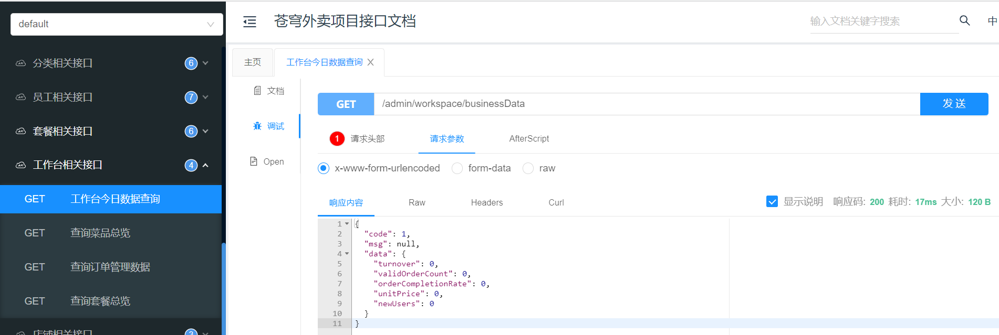 


**2). 菜品总览查询**

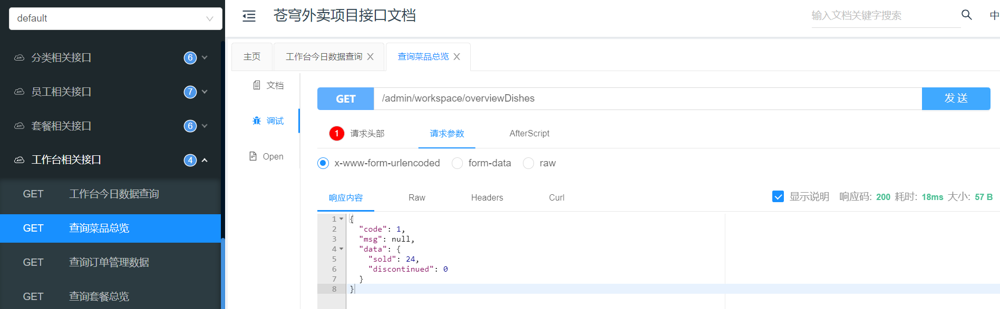 


**3). 订单管理数据查询**

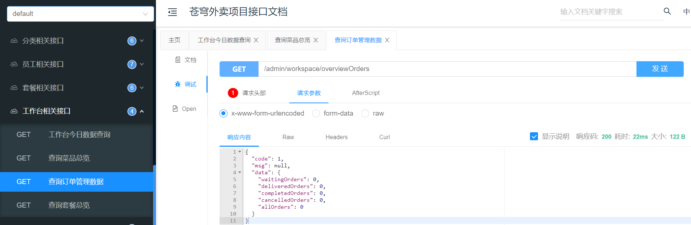 


**4). 套餐总览查询**

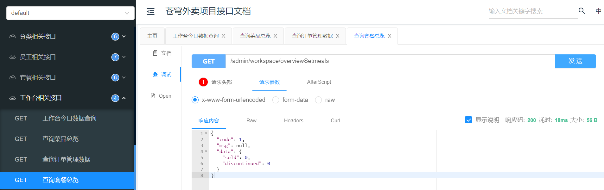 


#### 1.3.2 前后端联调测试

**启动nginx**,访问 http://localhost，进入工作台

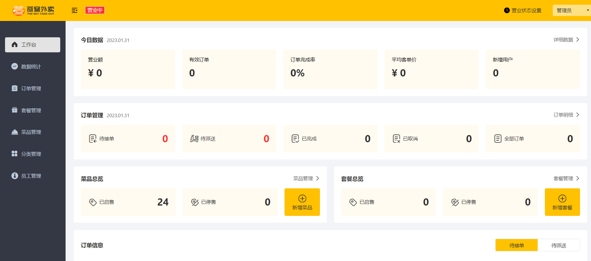 

进入开发者模式，分别查看今日数据、订单管理、菜品总览、套餐总览

**1). 今日数据查询**

 


**2). 订单管理数据查询**

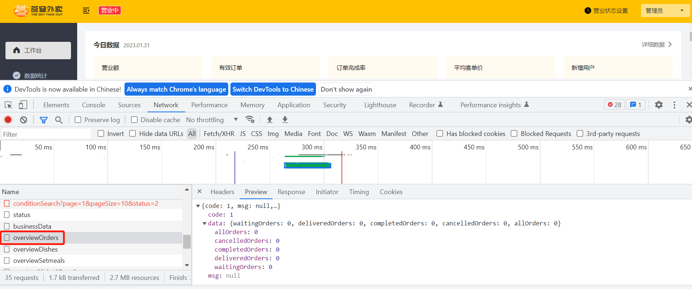 


**3). 菜品总览查询**

 


**4). 套餐总览查询**

 


### 1.4 代码提交

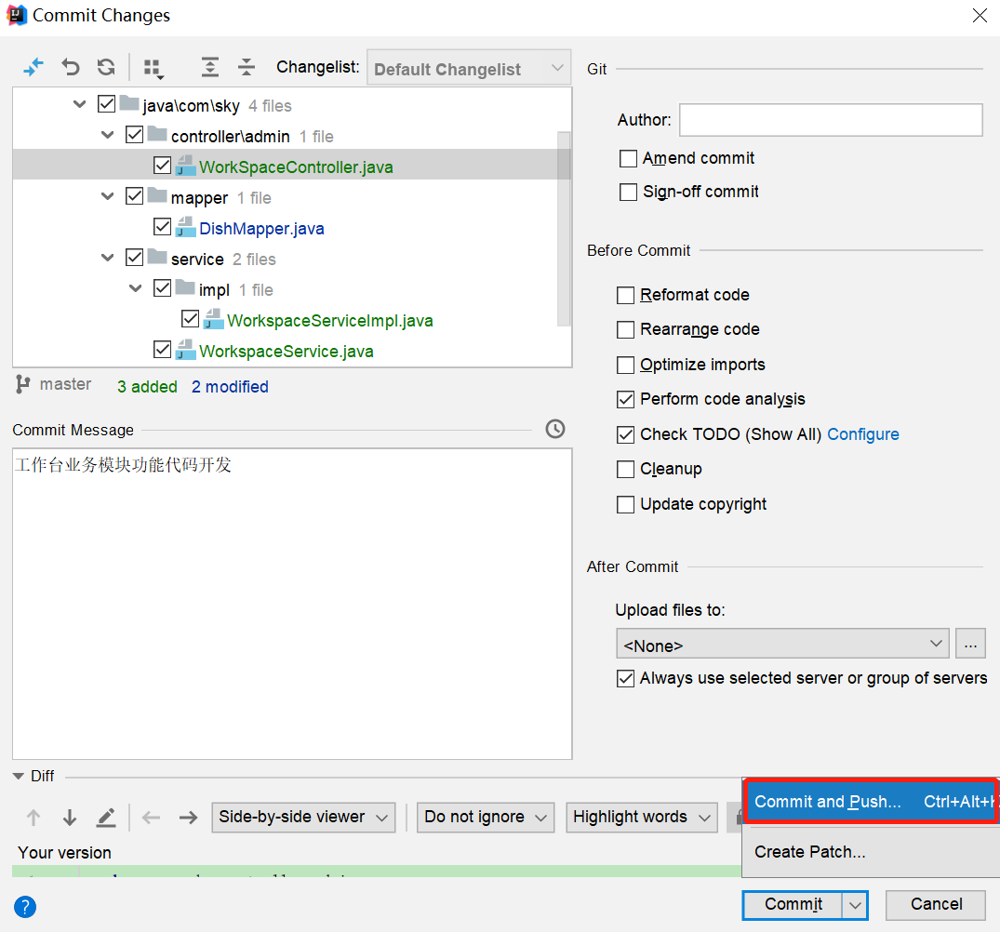 

后续步骤和其它功能代码提交一致，不再赘述。


## 2. Apache POI

### 2.1 介绍

Apache POI 是一个处理Miscrosoft Office各种文件格式的开源项目。简单来说就是，我们可以使用 POI 在 Java 程序中对Miscrosoft Office各种文件进行读写操作。
一般情况下，POI 都是用于操作 Excel 文件。

 

**Apache POI 的应用场景：**

- 银行网银系统导出交易明细

  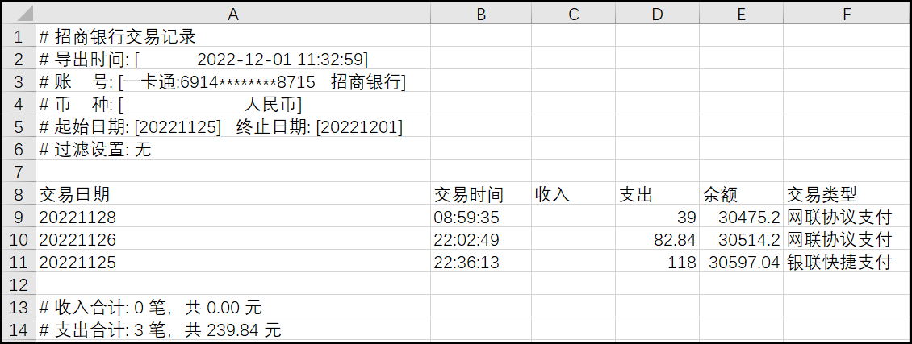 

- 各种业务系统导出Excel报表

  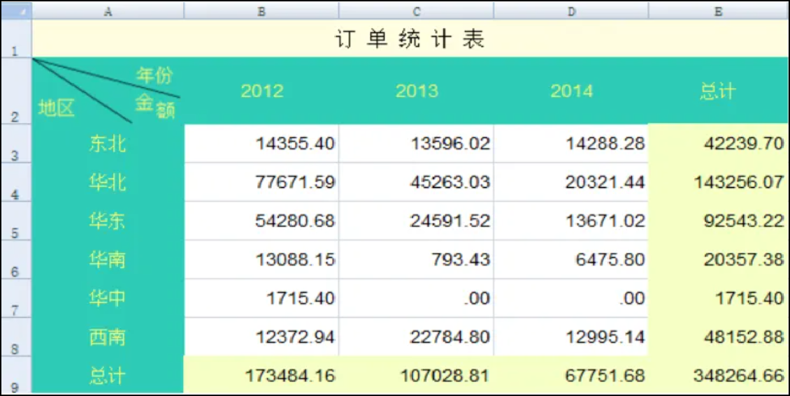 

- 批量导入业务数据

  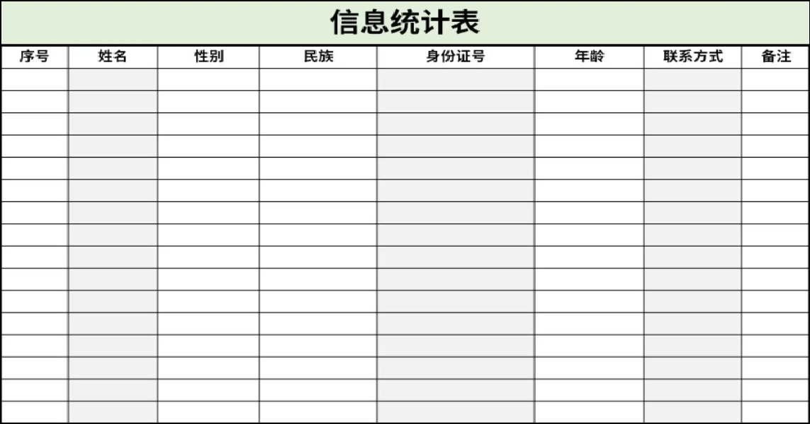 


### 2.2 入门案例

Apache POI既可以将数据写入Excel文件，也可以读取Excel文件中的数据，接下来分别进行实现。

**Apache POI的maven坐标：**(项目中已导入)

```xml
<dependency>
    <groupId>org.apache.poi</groupId>
    <artifactId>poi</artifactId>
    <version>3.16</version>
</dependency>
<dependency>
    <groupId>org.apache.poi</groupId>
    <artifactId>poi-ooxml</artifactId>
    <version>3.16</version>
</dependency>
```


#### 2.2.1 将数据写入Excel文件

**1). 代码开发**

```java
package com.sky.test;

import org.apache.poi.xssf.usermodel.XSSFCell;
import org.apache.poi.xssf.usermodel.XSSFRow;
import org.apache.poi.xssf.usermodel.XSSFSheet;
import org.apache.poi.xssf.usermodel.XSSFWorkbook;
import java.io.File;
import java.io.FileInputStream;
import java.io.FileOutputStream;

public class POITest {

    /**
     * 基于POI向Excel文件写入数据
     * @throws Exception
     */
    public static void write() throws Exception{
        //在内存中创建一个Excel文件对象
        XSSFWorkbook excel = new XSSFWorkbook();
        //创建Sheet页
        XSSFSheet sheet = excel.createSheet("itcast");

        //在Sheet页中创建行，0表示第1行
        XSSFRow row1 = sheet.createRow(0);
        //创建单元格并在单元格中设置值，单元格编号也是从0开始，1表示第2个单元格
        row1.createCell(1).setCellValue("姓名");
        row1.createCell(2).setCellValue("城市");

        XSSFRow row2 = sheet.createRow(1);
        row2.createCell(1).setCellValue("张三");
        row2.createCell(2).setCellValue("北京");

        XSSFRow row3 = sheet.createRow(2);
        row3.createCell(1).setCellValue("李四");
        row3.createCell(2).setCellValue("上海");

        FileOutputStream out = new FileOutputStream(new File("D:\\itcast.xlsx"));
        //通过输出流将内存中的Excel文件写入到磁盘上
        excel.write(out);

        //关闭资源
        out.flush();
        out.close();
        excel.close();
    }
    public static void main(String[] args) throws Exception {
        write();
    }
}
```

**2). 实现效果**

在D盘中生成itcast.xlsx文件，创建名称为itcast的Sheet页，同时将内容成功写入。

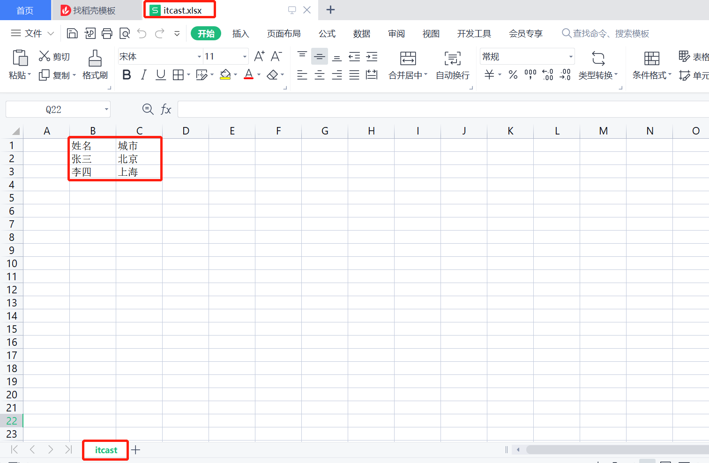 


#### 2.2.2 读取Excel文件中的数据

**1). 代码开发**

```java
package com.sky.test;

import org.apache.poi.xssf.usermodel.XSSFCell;
import org.apache.poi.xssf.usermodel.XSSFRow;
import org.apache.poi.xssf.usermodel.XSSFSheet;
import org.apache.poi.xssf.usermodel.XSSFWorkbook;
import java.io.File;
import java.io.FileInputStream;
import java.io.FileOutputStream;

public class POITest {
    /**
     * 基于POI读取Excel文件
     * @throws Exception
     */
    public static void read() throws Exception{
        FileInputStream in = new FileInputStream(new File("D:\\itcast.xlsx"));
        //通过输入流读取指定的Excel文件
        XSSFWorkbook excel = new XSSFWorkbook(in);
        //获取Excel文件的第1个Sheet页
        XSSFSheet sheet = excel.getSheetAt(0);

        //获取Sheet页中的最后一行的行号
        int lastRowNum = sheet.getLastRowNum();

        for (int i = 0; i <= lastRowNum; i++) {
            //获取Sheet页中的行
            XSSFRow titleRow = sheet.getRow(i);
            //获取行的第2个单元格
            XSSFCell cell1 = titleRow.getCell(1);
            //获取单元格中的文本内容
            String cellValue1 = cell1.getStringCellValue();
            //获取行的第3个单元格
            XSSFCell cell2 = titleRow.getCell(2);
            //获取单元格中的文本内容
            String cellValue2 = cell2.getStringCellValue();

            System.out.println(cellValue1 + " " +cellValue2);
        }

        //关闭资源
        in.close();
        excel.close();
    }

    public static void main(String[] args) throws Exception {
        read();
    }
}

```


**2). 实现效果**

将itcast.xlsx文件中的数据进行读取

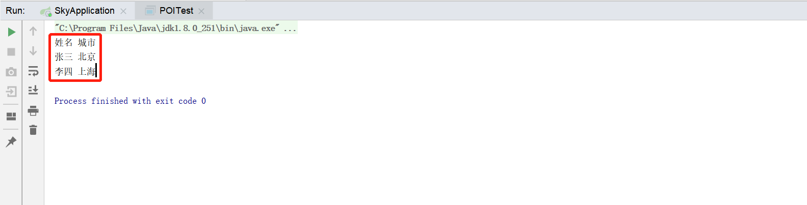 


## 3. 导出运营数据Excel报表

### 3.1 需求分析和设计

#### 3.1.1 产品原型

在数据统计页面，有一个数据导出的按钮，点击该按钮时，其实就会下载一个文件。这个文件实际上是一个Excel形式的文件，文件中主要包含最近30日运营相关的数据。表格的形式已经固定，主要由概览数据和明细数据两部分组成。真正导出这个报表之后，相对应的数字就会填充在表格中，就可以进行存档。

**原型图：**

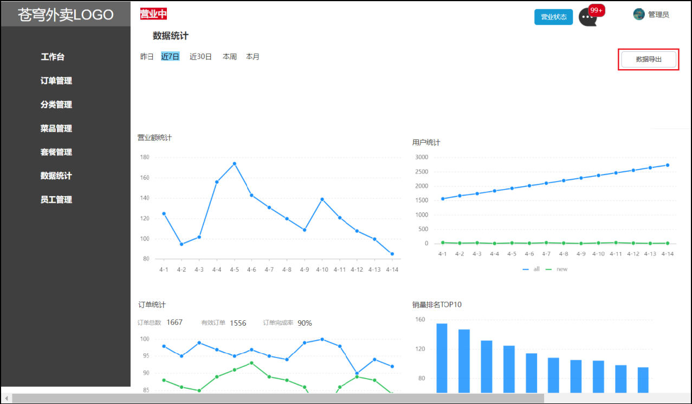 

导出的Excel报表格式：

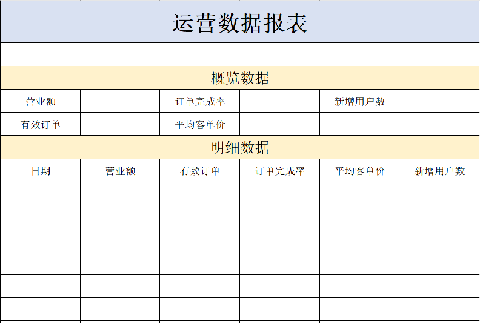  


**业务规则：**

- 导出Excel形式的报表文件
- 导出最近30天的运营数据


#### 3.1.2 接口设计

通过上述原型图设计对应的接口。

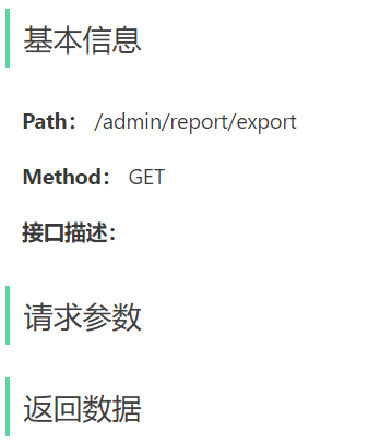 

**注意：**

- 当前接口没有传递参数，因为导出的是最近30天的运营数据，后端计算即可，所以不需要任何参数

- 当前接口没有返回数据，因为报表导出功能本质上是文件下载，服务端会通过输出流将Excel文件下载到客户端浏览器


### 3.2 代码开发

#### 3.2.1 实现步骤

1). 设计Excel模板文件

2). 查询近30天的运营数据

3). 将查询到的运营数据写入模板文件

4). 通过输出流将Excel文件下载到客户端浏览器

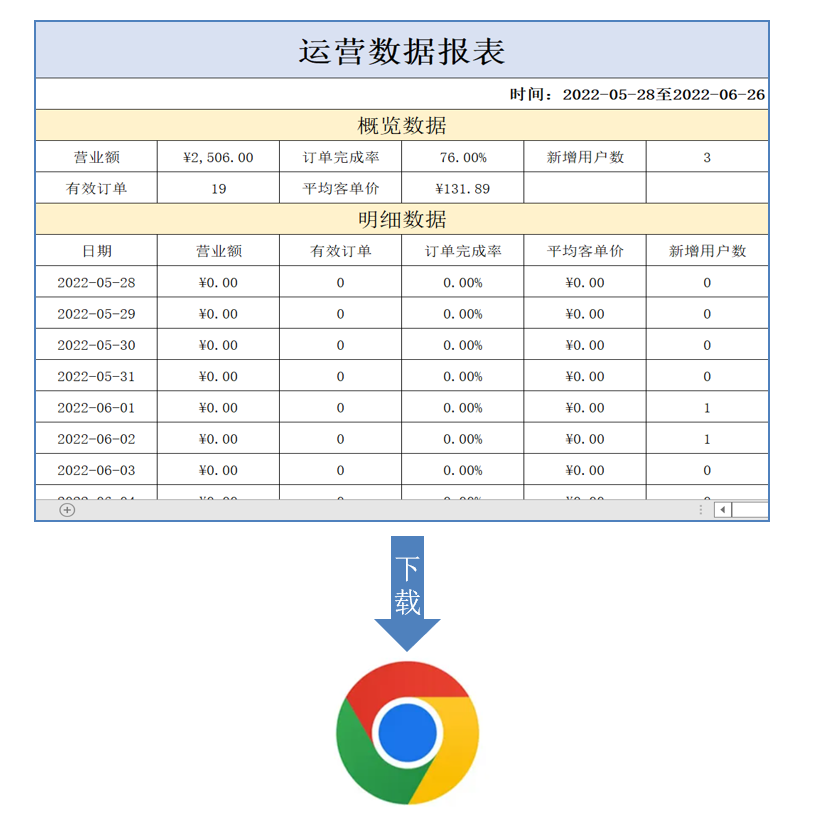 

#### 3.2.2 Controller层

**根据接口定义，在ReportController中创建export方法：**

```java
	/**
     * 导出运营数据报表
     * @param response
     */
    @GetMapping("/export")
    @ApiOperation("导出运营数据报表")
    public void export(HttpServletResponse response){
        reportService.exportBusinessData(response);
    }
```


#### 3.2.3 Service层接口

**在ReportService接口中声明导出运营数据报表的方法：**

```java
	/**
     * 导出近30天的运营数据报表
     * @param response
     **/
    void exportBusinessData(HttpServletResponse response);
```


#### 3.2.4 Service层实现类

**在ReportServiceImpl实现类中实现导出运营数据报表的方法:**

提前将资料中的**运营数据报表模板.xlsx**拷贝到项目的resources/template目录中

```java
    /**导出近30天的运营数据报表
     * @param response
     **/
    public void exportBusinessData(HttpServletResponse response) {
        LocalDate begin = LocalDate.now().minusDays(30);
        LocalDate end = LocalDate.now().minusDays(1);
        //查询概览运营数据，提供给Excel模板文件
        BusinessDataVO businessData = workspaceService.getBusinessData(LocalDateTime.of(begin,LocalTime.MIN), LocalDateTime.of(end, LocalTime.MAX));
        InputStream inputStream = this.getClass().getClassLoader().getResourceAsStream("template/运营数据报表模板.xlsx");
        try {
            //基于提供好的模板文件创建一个新的Excel表格对象
            XSSFWorkbook excel = new XSSFWorkbook(inputStream);
            //获得Excel文件中的一个Sheet页
            XSSFSheet sheet = excel.getSheet("Sheet1");

            sheet.getRow(1).getCell(1).setCellValue(begin + "至" + end);
            //获得第4行
            XSSFRow row = sheet.getRow(3);
            //获取单元格
            row.getCell(2).setCellValue(businessData.getTurnover());
            row.getCell(4).setCellValue(businessData.getOrderCompletionRate());
            row.getCell(6).setCellValue(businessData.getNewUsers());
            row = sheet.getRow(4);
            row.getCell(2).setCellValue(businessData.getValidOrderCount());
            row.getCell(4).setCellValue(businessData.getUnitPrice());
            for (int i = 0; i < 30; i++) {
                LocalDate date = begin.plusDays(i);
               //准备明细数据
                businessData = workspaceService.getBusinessData(LocalDateTime.of(date,LocalTime.MIN), LocalDateTime.of(date, LocalTime.MAX));
                row = sheet.getRow(7 + i);
                row.getCell(1).setCellValue(date.toString());
                row.getCell(2).setCellValue(businessData.getTurnover());
                row.getCell(3).setCellValue(businessData.getValidOrderCount());
                row.getCell(4).setCellValue(businessData.getOrderCompletionRate());
                row.getCell(5).setCellValue(businessData.getUnitPrice());
                row.getCell(6).setCellValue(businessData.getNewUsers());
            }
            //通过输出流将文件下载到客户端浏览器中
            ServletOutputStream out = response.getOutputStream();
            excel.write(out);
            //关闭资源
            out.flush();
            out.close();
            excel.close();

        }catch (IOException e){
            e.printStackTrace();
        }
    }
```


### 3.3 功能测试

直接使用前后端联调测试。

**进入数据统计**

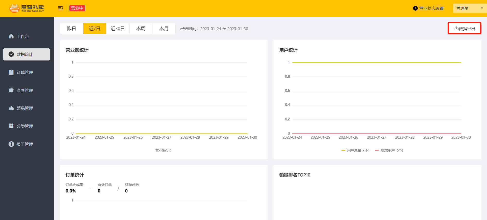 

**点击数据导出**：Excel报表下载成功

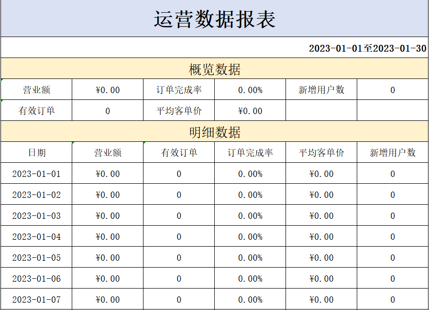 


### 3.4 代码提交

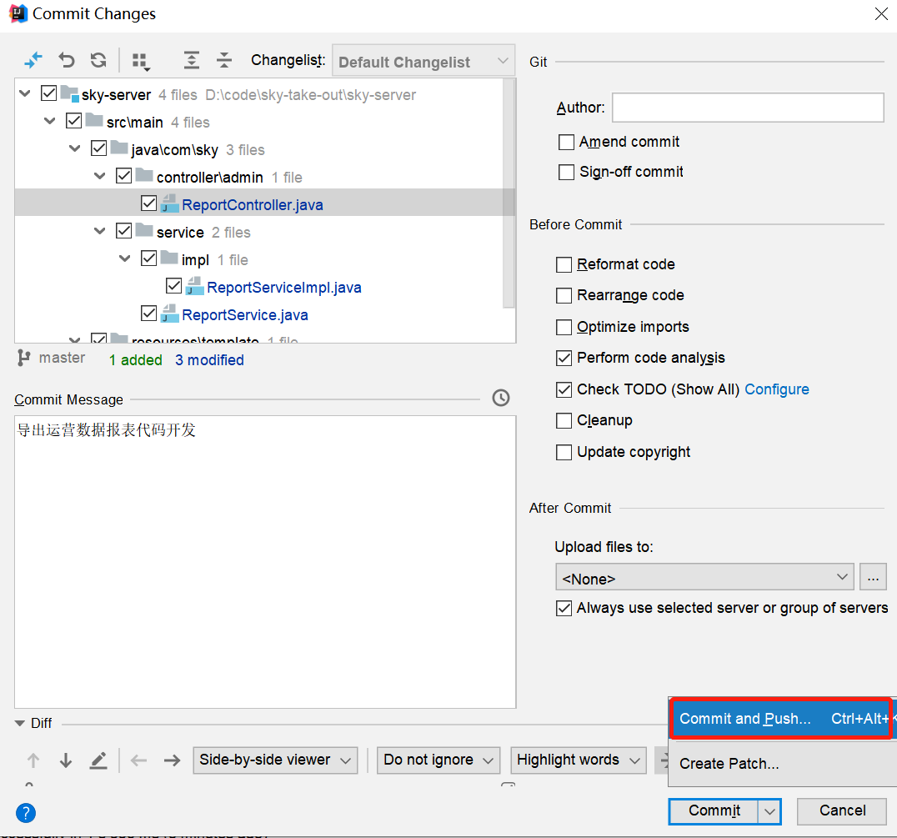 

后续步骤和其它功能代码提交一致，不再赘述。