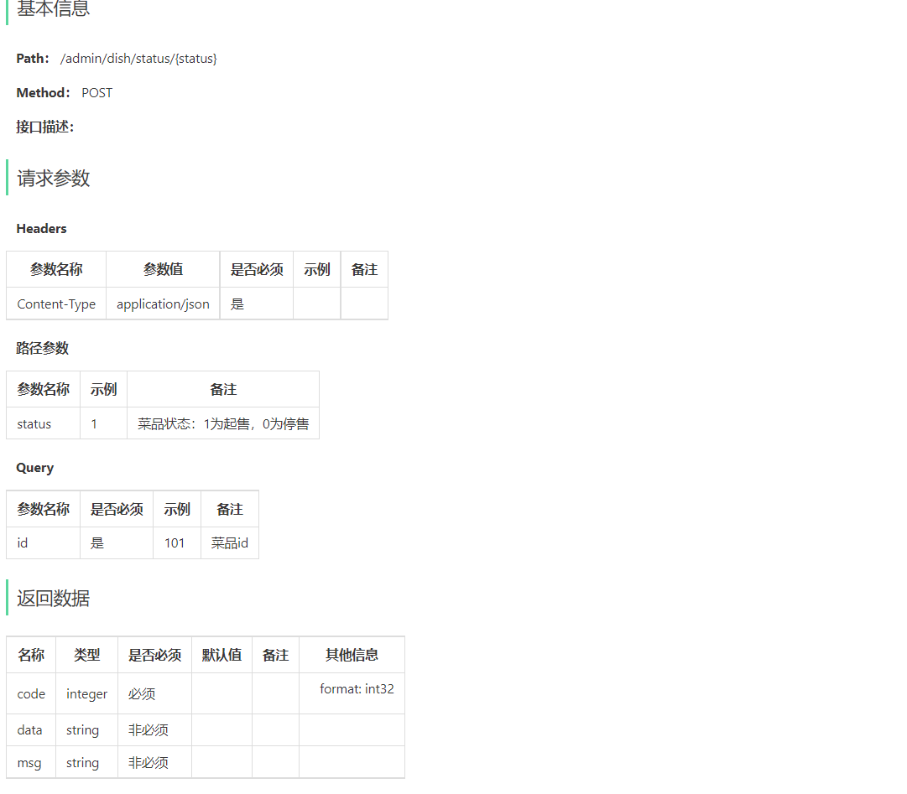
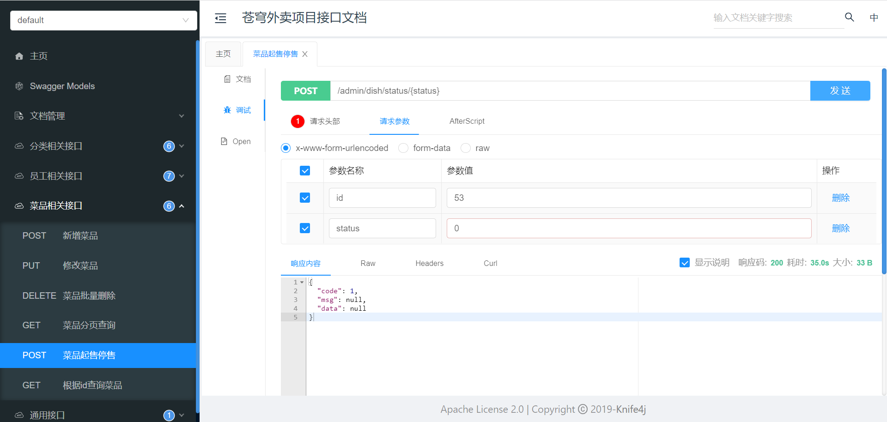
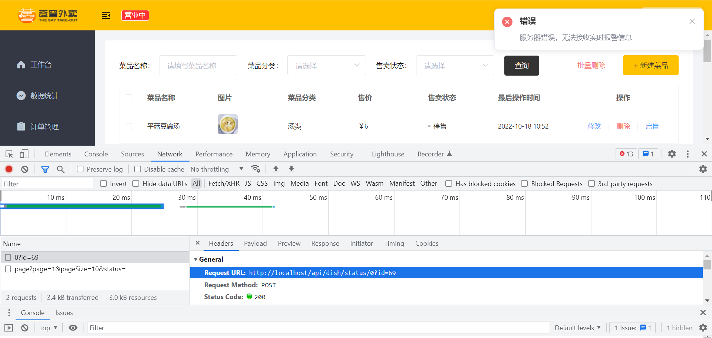

## 完成菜品管理模块中的**菜品起售停售**功能

### 1. 根据产品原型进行需求分析，分析出业务规则

菜品起售表示该菜品可以对外售卖，在用户端可以点餐，菜品停售表示此菜品下架，用户端无法点餐。

业务规则为：如果执行停售操作，则包含此菜品的套餐也需要停售。

### 2. 设计 菜品起售停售 功能的接口

### 3. 根据接口设计进行代码实现

#### 3.1  DishController

~~~java
/**
     * 菜品起售停售
     * @param status
     * @param id
     * @return
*/
@PostMapping("/status/{status}")
@ApiOperation("菜品起售停售")
public Result<String> startOrStop(@PathVariable Integer status, Long id){
    dishService.startOrStop(status,id);
    return Result.success();
}
~~~

#### 3.2 DishService

~~~java
/**
     * 菜品起售停售
     * @param status
     * @param id
*/
void startOrStop(Integer status, Long id);
~~~

#### 3.3 DishServiceImpl

~~~java
/**
     * 菜品起售停售
     *
     * @param status
     * @param id
*/
@Transactional
public void startOrStop(Integer status, Long id) {
    Dish dish = Dish.builder()
        .id(id)
        .status(status)
        .build();
    dishMapper.update(dish);

    if (status == StatusConstant.DISABLE) {
        // 如果是停售操作，还需要将包含当前菜品的套餐也停售
        List<Long> dishIds = new ArrayList<>();
        dishIds.add(id);
        // select setmeal_id from setmeal_dish where dish_id in (?,?,?)
        List<Long> setmealIds = setmealDishMapper.getSetmealIdsByDishIds(dishIds);
        if (setmealIds != null && setmealIds.size() > 0) {
            for (Long setmealId : setmealIds) {
                Setmeal setmeal = Setmeal.builder()
                    .id(setmealId)
                    .status(StatusConstant.DISABLE)
                    .build();
                setmealMapper.update(setmeal);
            }
        }
    }
}
~~~

#### 3.4 SetmealMapper

~~~java
/**
     * 根据id修改套餐
     *
     * @param setmeal
 */
@AutoFill(OperationType.UPDATE)
void update(Setmeal setmeal);
~~~

#### 3.5 SetmealMapper.xml

~~~xml
<?xml version="1.0" encoding="UTF-8" ?>
<!DOCTYPE mapper PUBLIC "-//mybatis.org//DTD Mapper 3.0//EN"
        "http://mybatis.org/dtd/mybatis-3-mapper.dtd" >
<mapper namespace="com.sky.mapper.SetmealMapper">

    <update id="update" parameterType="Setmeal">
        update setmeal
        <set>
            <if test="name != null">
                name = #{name},
            </if>
            <if test="categoryId != null">
                category_id = #{categoryId},
            </if>
            <if test="price != null">
                price = #{price},
            </if>
            <if test="status != null">
                status = #{status},
            </if>
            <if test="description != null">
                description = #{description},
            </if>
            <if test="image != null">
                image = #{image},
            </if>
            <if test="updateTime != null">
                update_time = #{updateTime},
            </if>
            <if test="updateUser != null">
                update_user = #{updateUser}
            </if>
        </set>
        where id = #{id}
    </update>

</mapper>
~~~

### 4. 分别通过swagger接口文档和前后端联调进行功能测试

