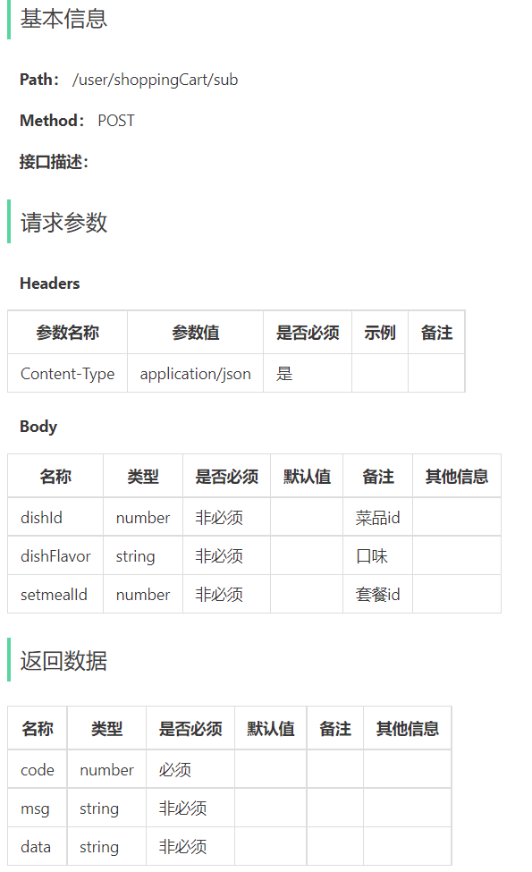
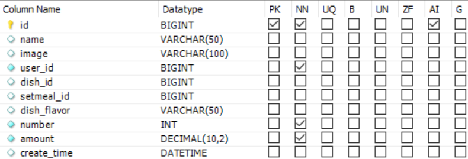

### 购物车其他功能代码

#### 1. 删除购物车中一个商品

##### 1.1 产品原型

##### 1.2 接口设计

##### 1.3 数据模型

shopping_cart表：

##### 1.4 代码开发

###### 1.4.1 ShoppingCartController

~~~java
/**
     * 删除购物车中一个商品
     * @param shoppingCartDTO
     * @return
*/
@PostMapping("/sub")
@ApiOperation("删除购物车中一个商品")
public Result sub(@RequestBody ShoppingCartDTO shoppingCartDTO){
    log.info("删除购物车中一个商品，商品：{}", shoppingCartDTO);
    shoppingCartService.subShoppingCart(shoppingCartDTO);
    return Result.success();
}
~~~

###### 1.4.2 ShoppingCartService

~~~java
/**
     * 删除购物车中一个商品
     * @param shoppingCartDTO
*/
void subShoppingCart(ShoppingCartDTO shoppingCartDTO);
~~~

###### 1.4.3 ShoppingCartServiceImpl

~~~java
/**
     * 删除购物车中一个商品
     * @param shoppingCartDTO
*/
public void subShoppingCart(ShoppingCartDTO shoppingCartDTO) {
    ShoppingCart shoppingCart = new ShoppingCart();
    BeanUtils.copyProperties(shoppingCartDTO,shoppingCart);
    //设置查询条件，查询当前登录用户的购物车数据
    shoppingCart.setUserId(BaseContext.getCurrentId());

    List<ShoppingCart> list = shoppingCartMapper.list(shoppingCart);

    if(list != null && list.size() > 0){
        shoppingCart = list.get(0);

        Integer number = shoppingCart.getNumber();
        if(number == 1){
            //当前商品在购物车中的份数为1，直接删除当前记录
            shoppingCartMapper.deleteById(shoppingCart.getId());
        }else {
            //当前商品在购物车中的份数不为1，修改份数即可
            shoppingCart.setNumber(shoppingCart.getNumber() - 1);
            shoppingCartMapper.updateNumberById(shoppingCart);
        }
    }
}
~~~

###### 1.4.4 ShoppingCartMapper

~~~java
/**
     * 根据id删除购物车数据
     * @param id
*/
@Delete("delete from shopping_cart where id = #{id}")
void deleteById(Long id);
~~~

